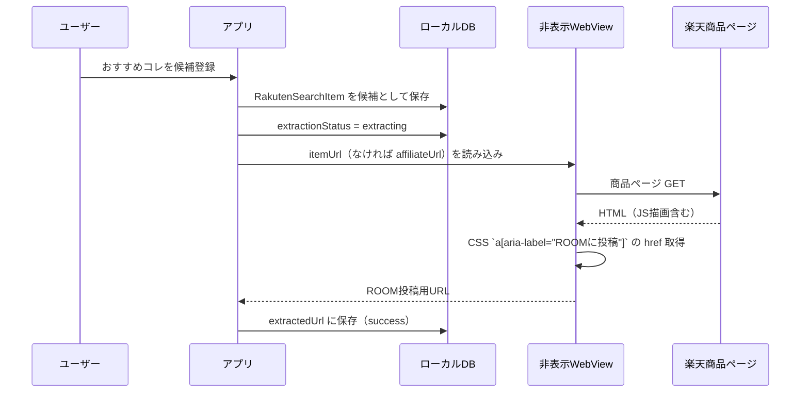

<!-- Generated by SpecStory, Markdown v2.1.0 -->

# 2026-06-27 12:53:10Z

<!-- Cursor IDE Session 020afa27-e9ee-4cbc-89a5-0150812232c5 (2026-06-27 12:53:10Z) -->

_**User**_

 質問です。

おすすめコレを候補に登録する際、裏で楽天ROOM投稿用のURLを取得しているかと思います。その処理の流れを教えて。まずはAPIを使って対象の商品情報を取得。その中の商品ページURLから商品ページに遷移して、ROOMへのリンクURLを取得するといった流れ？

---

_**Agent (default)**_

おすすめコレの候補登録時のROOM URL取得フローを、コードベースから追います。


_**Agent (default)**_

<tool-use data-tool-type="unknown" data-tool-name="semantic_search_full">
<details>
<summary>Tool use: **semantic_search_full**</summary>


Parameters:

```json
{
  "explanation": "",
  "includePattern": "c:/dev/app_project/room_manager2",
  "query": "How is Rakuten ROOM posting URL obtained when registering recommended item as candidate?",
  "topK": 10
}
```
Result:

```json
{
  "codeResults": [
    {
      "codeBlock": {
        "detailedLines": [
          {
            "lineNumber": 278,
            "text": "      if (added) {"
          },
          {
            "lineNumber": 279,
            "text": "        final now = DateTime.now();"
          },
          {
            "lineNumber": 280,
            "text": "        await _activityEventProvider.append("
          },
          {
            "lineNumber": 281,
            "text": "          RoomActivityEvent("
          },
          {
            "lineNumber": 282,
            "text": "            id: _newEventId(id, RoomActivityEventType.candidateAdded),"
          },
          {
            "lineNumber": 283,
            "text": "            productId: id,"
          },
          {
            "lineNumber": 284,
            "text": "            type: RoomActivityEventType.candidateAdded,"
          },
          {
            "lineNumber": 285,
            "text": "            createdAt: now,"
          },
          {
            "lineNumber": 286,
            "text": "          ),"
          },
          {
            "lineNumber": 287,
            "text": "        );"
          },
          {
            "lineNumber": 288,
            "text": "        await _repository.markExtractionExtracting(id);"
          },
          {
            "lineNumber": 289,
            "text": "        _reloadFromStorage();"
          },
          {
            "lineNumber": 290,
            "text": "        notifyListeners();"
          },
          {
            "lineNumber": 291,
            "text": "        final extractionPageUrl = item.itemUrl.trim().isNotEmpty"
          },
          {
            "lineNumber": 292,
            "text": "            ? item.itemUrl.trim()"
          },
          {
            "lineNumber": 293,
            "text": "            : item.browserLaunchUrl;"
          },
          {
            "lineNumber": 294,
            "text": "        unawaited(_runPostRegisterExtraction(id, extractionPageUrl));"
          },
          {
            "lineNumber": 295,
            "text": "      }"
          },
          {
            "lineNumber": 296,
            "text": "      return null;"
          },
          {
            "lineNumber": 297,
            "text": "    } on Exception catch (e) {"
          },
          {
            "lineNumber": 298,
            "text": "      if (kDebugMode) {"
          },
          {
            "lineNumber": 299,
            "text": "        debugPrint('[RakutenManagedProduct] registerCandidate failed: $e');"
          },
          {
            "lineNumber": 300,
            "text": "      }"
          },
          {
            "lineNumber": 301,
            "text": "      return '候補の登録に失敗しました。しばらく待ってからもう一度お試しください。';"
          },
          {
            "lineNumber": 302,
            "text": "    } catch (e) {"
          },
          {
            "lineNumber": 303,
            "text": "      if (kDebugMode) {"
          },
          {
            "lineNumber": 304,
            "text": "        debugPrint('[RakutenManagedProduct] registerCandidate failed: $e');"
          },
          {
            "lineNumber": 305,
            "text": "      }"
          },
          {
            "lineNumber": 306,
            "text": "      return '候補の登録に失敗しました。しばらく待ってからもう一度お試しください。';"
          },
          {
            "lineNumber": 307,
            "text": "    } finally {"
          },
          {
            "lineNumber": 308,
            "text": "      _registeringProductIds.remove(id);"
          },
          {
            "lineNumber": 309,
            "text": "      notifyListeners();"
          },
          {
            "lineNumber": 310,
            "text": "    }"
          },
          {
            "lineNumber": 311,
            "text": "  }"
          },
          {
            "lineNumber": 312
          },
          {
            "lineNumber": 313,
            "text": "  Future\u003cvoid\u003e _runPostRegisterExtraction("
          },
          {
            "lineNumber": 314,
            "text": "    String productId,"
          },
          {
            "lineNumber": 315,
            "text": "    String pageUrl,"
          },
          {
            "lineNumber": 316,
            "text": "  ) async {"
          },
          {
            "lineNumber": 317,
            "text": "    try {"
          },
          {
            "lineNumber": 318,
            "text": "      for (var i = 0; i \u003c 120; i++) {"
          },
          {
            "lineNumber": 319,
            "text": "        "
          }
        ],
        "range": {
          "endPosition": {
            "column": 8,
            "line": 318
          },
          "startPosition": {
            "line": 277
          }
        },
        "relativeWorkspacePath": ".\\room_manager2\\lib\\state\\rakuten_managed_product_provider.dart",
        "signatures": {}
      },
      "score": 0.5214837193489075
    },
    {
      "codeBlock": {
        "detailedLines": [
          {
            "lineNumber": 240,
            "text": "  /// コレ候補として登録。成功時は null、失敗時はエラーメッセージ。"
          },
          {
            "lineNumber": 241,
            "text": "  /// 既に候補・コレ済の場合は重複せず成功扱い（null）。URL抽出は新規登録時のみ非同期で開始。"
          },
          {
            "lineNumber": 242,
            "text": "  Future\u003cString?\u003e registerCandidate(RakutenSearchItem item) async {"
          },
          {
            "lineNumber": 243,
            "text": "    final id = item.productId.trim();"
          },
          {
            "lineNumber": 244,
            "text": "    if (id.isEmpty) {"
          },
          {
            "lineNumber": 245,
            "text": "      return '商品IDが空のため登録できません';"
          },
          {
            "lineNumber": 246,
            "text": "    }"
          },
          {
            "lineNumber": 247,
            "text": "    final roomTour = _roomTourSearchBlockUserMessage('registerCandidate');"
          },
          {
            "lineNumber": 248,
            "text": "    if (roomTour != null) {"
          },
          {
            "lineNumber": 249,
            "text": "      return roomTour;"
          },
          {
            "lineNumber": 250,
            "text": "    }"
          },
          {
            "lineNumber": 251,
            "text": "    final blocked = _bulkBlocksMutation('addCandidate');"
          },
          {
            "lineNumber": 252,
            "text": "    if (blocked != null) {"
          },
          {
            "lineNumber": 253,
            "text": "      return blocked;"
          },
          {
            "lineNumber": 254,
            "text": "    }"
          },
          {
            "lineNumber": 255,
            "text": "    if (_registeringProductIds.contains(id)) {"
          },
          {
            "lineNumber": 256,
            "text": "      return null;"
          },
          {
            "lineNumber": 257,
            "text": "    }"
          },
          {
            "lineNumber": 258,
            "text": "    _registeringProductIds.add(id);"
          },
          {
            "lineNumber": 259,
            "text": "    notifyListeners();"
          },
          {
            "lineNumber": 260,
            "text": "    try {"
          },
          {
            "lineNumber": 261,
            "text": "      final added = await _repository.registerCandidateFromSearchItem(item);"
          },
          {
            "lineNumber": 262,
            "text": "      _reloadFromStorage();"
          },
          {
            "lineNumber": 263,
            "text": "      _listUiStatus = RakutenManagedProductListUiStatus.ready;"
          },
          {
            "lineNumber": 264,
            "text": "      _listUiErrorMessage = null;"
          },
          {
            "lineNumber": 265,
            "text": "      if (kDebugMode) {"
          },
          {
            "lineNumber": 266,
            "text": "        final nCand = sortedItemsForStatus("
          },
          {
            "lineNumber": 267,
            "text": "          RakutenManagedProductStatus.candidate,"
          },
          {
            "lineNumber": 268,
            "text": "        ).length;"
          },
          {
            "lineNumber": 269,
            "text": "        final nDone = sortedItemsForStatus("
          },
          {
            "lineNumber": 270,
            "text": "          RakutenManagedProductStatus.done,"
          },
          {
            "lineNumber": 271,
            "text": "        ).length;"
          },
          {
            "lineNumber": 272,
            "text": "        roomAuditLog("
          },
          {
            "lineNumber": 273,
            "text": "          '[ROOMコレ診断] registerCandidate 反映 productId=$id persisted→memory '"
          },
          {
            "lineNumber": 274,
            "text": "          'total=${_items.length} candidate=$nCand done=$nDone '"
          },
          {
            "lineNumber": 275,
            "text": "          'added=$added status saved=candidate',"
          },
          {
            "lineNumber": 276,
            "text": "        );"
          },
          {
            "lineNumber": 277,
            "text": "      }"
          },
          {
            "lineNumber": 278,
            "text": "      if (added) {"
          },
          {
            "lineNumber": 279,
            "text": "        final now = DateTime.now();"
          }
        ],
        "range": {
          "endPosition": {
            "line": 279
          },
          "startPosition": {
            "line": 239
          }
        },
        "relativeWorkspacePath": ".\\room_manager2\\lib\\state\\rakuten_managed_product_provider.dart",
        "signatures": {}
      },
      "score": 0.4453631639480591
    },
    {
      "codeBlock": {
        "detailedLines": [
          {
            "lineNumber": 255,
            "text": "      await AppActionService.openUrl(context, url: url);"
          },
          {
            "lineNumber": 256,
            "text": "    }"
          },
          {
            "lineNumber": 257,
            "text": "  }"
          },
          {
            "lineNumber": 258
          },
          {
            "lineNumber": 259,
            "text": "  Future\u003cString?\u003e _registerFromApi("
          },
          {
            "lineNumber": 260,
            "text": "    BuildContext context,"
          },
          {
            "lineNumber": 261,
            "text": "    RakutenItemPageUrlParseSuccess parsed,"
          },
          {
            "lineNumber": 262,
            "text": "  ) async {"
          },
          {
            "lineNumber": 263,
            "text": "    final repo = context.read\u003cRakutenSearchRepository\u003e();"
          },
          {
            "lineNumber": 264,
            "text": "    final managed = context.read\u003cRakutenManagedProductProvider\u003e();"
          },
          {
            "lineNumber": 265,
            "text": "    final outcome = await repo.resolveProductForUrlSearch("
          },
          {
            "lineNumber": 266,
            "text": "      inputUrl: _urlController.text,"
          },
          {
            "lineNumber": 267,
            "text": "      shopCode: parsed.shopCode,"
          },
          {
            "lineNumber": 268,
            "text": "      pureItemCode: parsed.itemId,"
          },
          {
            "lineNumber": 269,
            "text": "      isApiStyleItemCode: parsed.isApiStyleItemCode,"
          },
          {
            "lineNumber": 270,
            "text": "      normalizedUrl: parsed.normalizedUrl,"
          },
          {
            "lineNumber": 271,
            "text": "    );"
          },
          {
            "lineNumber": 272,
            "text": "    if (outcome.item == null) {"
          },
          {
            "lineNumber": 273,
            "text": "      return outcome.userMessage ??"
          },
          {
            "lineNumber": 274,
            "text": "          '商品情報を取得できませんでした。itemCode を確認するか、しばらくしてからお試しください。';"
          },
          {
            "lineNumber": 275,
            "text": "    }"
          },
          {
            "lineNumber": 276,
            "text": "    return managed.registerCandidate(outcome.item!);"
          },
          {
            "lineNumber": 277,
            "text": "  }"
          },
          {
            "lineNumber": 278
          },
          {
            "lineNumber": 279,
            "text": "  void _closeSheetAndPopScreenAndOpenRoomCollect({"
          },
          {
            "lineNumber": 280,
            "text": "    required int initialTabIndex,"
          },
          {
            "lineNumber": 281,
            "text": "    String? focusCandidateProductId,"
          },
          {
            "lineNumber": 282,
            "text": "  }) {"
          },
          {
            "lineNumber": 283,
            "text": "    final shell = context.read\u003cAppShellController\u003e();"
          },
          {
            "lineNumber": 284,
            "text": "    final nav = Navigator.of(context);"
          },
          {
            "lineNumber": 285,
            "text": "    nav.pop();"
          },
          {
            "lineNumber": 286,
            "text": "    if (nav.canPop()) {"
          },
          {
            "lineNumber": 287,
            "text": "      nav.pop();"
          },
          {
            "lineNumber": 288,
            "text": "    }"
          },
          {
            "lineNumber": 289,
            "text": "    shell.openRoomCollect("
          },
          {
            "lineNumber": 290,
            "text": "      initialTabIndex: initialTabIndex,"
          },
          {
            "lineNumber": 291,
            "text": "      focusCandidateProductId: focusCandidateProductId,"
          },
          {
            "lineNumber": 292,
            "text": "    );"
          },
          {
            "lineNumber": 293,
            "text": "  }"
          },
          {
            "lineNumber": 294
          },
          {
            "lineNumber": 295,
            "text": "  Widget _stateChip(BuildContext context, RakutenUrlRegistryClassification k) {"
          },
          {
            "lineNumber": 296,
            "text": "    "
          }
        ],
        "range": {
          "endPosition": {
            "column": 4,
            "line": 295
          },
          "startPosition": {
            "line": 254
          }
        },
        "relativeWorkspacePath": ".\\room_manager2\\lib\\screens\\add_candidate_from_url_screen.dart",
        "signatures": {}
      },
      "score": 0.4449802041053772
    },
    {
      "codeBlock": {
        "detailedLines": [
          {
            "lineNumber": 352,
            "text": "    String productId,"
          },
          {
            "lineNumber": 353,
            "text": "  ) async {"
          },
          {
            "lineNumber": 354,
            "text": "    final id = productId.trim();"
          },
          {
            "lineNumber": 355,
            "text": "    if (id.isEmpty) return '商品IDが空です';"
          },
          {
            "lineNumber": 356,
            "text": "    final p = _repository.getByProductId(id);"
          },
          {
            "lineNumber": 357,
            "text": "    if (p == null) return '商品が見つかりません';"
          },
          {
            "lineNumber": 358,
            "text": "    final url = p.rakutenOpenUrl.trim();"
          },
          {
            "lineNumber": 359,
            "text": "    if (url.isEmpty) return '商品URLがありません';"
          },
          {
            "lineNumber": 360,
            "text": "    await AppActionService.openUrl(context, url: url);"
          },
          {
            "lineNumber": 361,
            "text": "    if (context.mounted) {"
          },
          {
            "lineNumber": 362,
            "text": "      try {"
          },
          {
            "lineNumber": 363,
            "text": "        await _activityEventProvider.append("
          },
          {
            "lineNumber": 364,
            "text": "          RoomActivityEvent("
          },
          {
            "lineNumber": 365,
            "text": "            id: _newEventId(id, RoomActivityEventType.openedRakuten),"
          },
          {
            "lineNumber": 366,
            "text": "            productId: id,"
          },
          {
            "lineNumber": 367,
            "text": "            type: RoomActivityEventType.openedRakuten,"
          },
          {
            "lineNumber": 368,
            "text": "            createdAt: DateTime.now(),"
          },
          {
            "lineNumber": 369,
            "text": "          ),"
          },
          {
            "lineNumber": 370,
            "text": "        );"
          },
          {
            "lineNumber": 371,
            "text": "      } catch (_) {}"
          },
          {
            "lineNumber": 372,
            "text": "    }"
          },
          {
            "lineNumber": 373,
            "text": "    return null;"
          },
          {
            "lineNumber": 374,
            "text": "  }"
          },
          {
            "lineNumber": 375
          },
          {
            "lineNumber": 376,
            "text": "  bool canCollectRoomUrl(String productId) {"
          },
          {
            "lineNumber": 377,
            "text": "    final p = _repository.getByProductId(productId.trim());"
          },
          {
            "lineNumber": 378,
            "text": "    if (p == null) return false;"
          },
          {
            "lineNumber": 379,
            "text": "    return p.extractionStatus == RakutenUrlExtractionStatus.success \u0026\u0026"
          },
          {
            "lineNumber": 380,
            "text": "        p.extractedUrl.trim().isNotEmpty;"
          },
          {
            "lineNumber": 381,
            "text": "  }"
          },
          {
            "lineNumber": 382
          },
          {
            "lineNumber": 383,
            "text": "  /// ROOM 商品ページ URL からコレ済行を登録・更新する（HTTP 解析ベース）。"
          },
          {
            "lineNumber": 384,
            "text": "  Future\u003cRoomCollectedRegisterViewResult\u003e registerCollectedFromRoomProductPage("
          },
          {
            "lineNumber": 385,
            "text": "    String rawRoomUrl,"
          },
          {
            "lineNumber": 386,
            "text": "  ) async {"
          },
          {
            "lineNumber": 387,
            "text": "    final roomTour = _roomTourSearchBlockUserMessage('urlAdd');"
          }
        ],
        "range": {
          "endPosition": {
            "line": 387
          },
          "startPosition": {
            "line": 351
          }
        },
        "relativeWorkspacePath": ".\\room_manager2\\lib\\state\\rakuten_managed_product_provider.dart",
        "signatures": {}
      },
      "score": 0.4075331687927246
    },
    {
      "codeBlock": {
        "detailedLines": [
          {
            "lineNumber": 191,
            "text": "result.roomUrl!.trim().isNotEmpty) ...["
          },
          {
            "lineNumber": 192,
            "text": "                    const SizedBox(height: 8),"
          },
          {
            "lineNumber": 193,
            "text": "                    SelectableText("
          },
          {
            "lineNumber": 194,
            "text": "                      'ROOM URL: ${result.roomUrl}',"
          },
          {
            "lineNumber": 195,
            "text": "                      style: Theme.of(ctx).textTheme.bodySmall,"
          },
          {
            "lineNumber": 196,
            "text": "                    ),"
          },
          {
            "lineNumber": 197,
            "text": "                  ],"
          },
          {
            "lineNumber": 198,
            "text": "                ],"
          },
          {
            "lineNumber": 199,
            "text": "              ),"
          },
          {
            "lineNumber": 200,
            "text": "            ),"
          },
          {
            "lineNumber": 201,
            "text": "          ),"
          },
          {
            "lineNumber": 202,
            "text": "        );"
          },
          {
            "lineNumber": 203,
            "text": "      },"
          },
          {
            "lineNumber": 204,
            "text": "    );"
          },
          {
            "lineNumber": 205,
            "text": "  }"
          },
          {
            "lineNumber": 206
          },
          {
            "lineNumber": 207,
            "text": "  Future\u003cvoid\u003e _judge() async {"
          },
          {
            "lineNumber": 208,
            "text": "    FocusScope.of(context).unfocus();"
          },
          {
            "lineNumber": 209,
            "text": "    setState(() {"
          },
          {
            "lineNumber": 210,
            "text": "      _judging = true;"
          },
          {
            "lineNumber": 211,
            "text": "      _parseOrJudgeError = null;"
          },
          {
            "lineNumber": 212,
            "text": "      _actionError = null;"
          },
          {
            "lineNumber": 213,
            "text": "      _parsed = null;"
          },
          {
            "lineNumber": 214,
            "text": "    });"
          },
          {
            "lineNumber": 215,
            "text": "    await Future\u003cvoid\u003e.delayed(Duration.zero);"
          },
          {
            "lineNumber": 216,
            "text": "    final raw = _urlController.text;"
          },
          {
            "lineNumber": 217,
            "text": "    final result = RakutenItemPageUrlItemCodeService.tryParseItemRakutenPageUrl("
          },
          {
            "lineNumber": 218,
            "text": "      raw,"
          },
          {
            "lineNumber": 219,
            "text": "    );"
          },
          {
            "lineNumber": 220,
            "text": "    if (!mounted) return;"
          },
          {
            "lineNumber": 221,
            "text": "    if (result is RakutenItemPageUrlParseFailure) {"
          },
          {
            "lineNumber": 222,
            "text": "      setState(() {"
          },
          {
            "lineNumber": 223,
            "text": "        _judging = false;"
          },
          {
            "lineNumber": 224,
            "text": "        _parseOrJudgeError = result.userMessage;"
          },
          {
            "lineNumber": 225,
            "text": "        _parsed = null;"
          },
          {
            "lineNumber": 226,
            "text": "      });"
          },
          {
            "lineNumber": 227,
            "text": "      return;"
          },
          {
            "lineNumber": 228,
            "text": "    }"
          },
          {
            "lineNumber": 229,
            "text": "    final success = result as RakutenItemPageUrlParseSuccess;"
          },
          {
            "lineNumber": 230,
            "text": "    setState(() {"
          },
          {
            "lineNumber": 231,
            "text": "      _judging = false;"
          },
          {
            "lineNumber": 232,
            "text": "      _parsed = success;"
          },
          {
            "lineNumber": 233,
            "text": "      _parseOrJudgeError = null;"
          },
          {
            "lineNumber": 234,
            "text": "    });"
          },
          {
            "lineNumber": 235,
            "text": "  }"
          },
          {
            "lineNumber": 236
          },
          {
            "lineNumber": 237,
            "text": "  Future\u003cvoid\u003e _openRakutenForParsed("
          },
          {
            "lineNumber": 238,
            "text": "    BuildContext context,"
          },
          {
            "lineNumber": 239,
            "text": "    RakutenItemPageUrlParseSuccess s,"
          },
          {
            "lineNumber": 240,
            "text": "  ) async {"
          },
          {
            "lineNumber": 241,
            "text": "    final managed = context.read\u003cRakutenManagedProductProvider\u003e();"
          },
          {
            "lineNumber": 242,
            "text": "    final found = RakutenItemPageUrlItemCodeService.findManagedProductForParsedUrl("
          },
          {
            "lineNumber": 243,
            "text": "      items: managed.items,"
          },
          {
            "lineNumber": 244,
            "text": "      parsed: s,"
          },
          {
            "lineNumber": 245,
            "text": "    );"
          },
          {
            "lineNumber": 246,
            "text": "    if (found != null) {"
          },
          {
            "lineNumber": 247,
            "text": "      final err = await managed.openRakutenItemPage(context, found.productId);"
          },
          {
            "lineNumber": 248,
            "text": "      if (!context.mounted) return;"
          },
          {
            "lineNumber": 249,
            "text": "      if (err != null) {"
          },
          {
            "lineNumber": 250,
            "text": "        setState(() =\u003e _actionError = err);"
          },
          {
            "lineNumber": 251,
            "text": "      }"
          },
          {
            "lineNumber": 252,
            "text": "    } else {"
          },
          {
            "lineNumber": 253,
            "text": "      final url ="
          },
          {
            "lineNumber": 254,
            "text": "          'https://item.rakuten.co.jp/${s.shopCode}/${s.itemId}/';"
          },
          {
            "lineNumber": 255,
            "text": "      await AppActionService.openUrl(context, url: url);"
          },
          {
            "lineNumber": 256,
            "text": "    }"
          },
          {
            "lineNumber": 257,
            "text": "  }"
          },
          {
            "lineNumber": 258
          },
          {
            "lineNumber": 259,
            "text": "  Future\u003cString?\u003e _registerFromApi("
          },
          {
            "lineNumber": 260,
            "text": "    BuildContext context,"
          }
        ],
        "range": {
          "endPosition": {
            "line": 260
          },
          "startPosition": {
            "column": 22,
            "line": 190
          }
        },
        "relativeWorkspacePath": ".\\room_manager2\\lib\\screens\\add_candidate_from_url_screen.dart",
        "signatures": {}
      },
      "score": 0.4070903956890106
    },
    {
      "codeBlock": {
        "detailedLines": [
          {
            "lineNumber": 342,
            "text": "    );"
          },
          {
            "lineNumber": 343
          },
          {
            "lineNumber": 344,
            "text": "    if (isDone || isCandidate) {"
          },
          {
            "lineNumber": 345,
            "text": "      return rakuten;"
          },
          {
            "lineNumber": 346,
            "text": "    }"
          },
          {
            "lineNumber": 347
          },
          {
            "lineNumber": 348,
            "text": "    final register = _buildRegisterAction(context, compact: compact, height: h);"
          },
          {
            "lineNumber": 349,
            "text": "    return Row("
          },
          {
            "lineNumber": 350,
            "text": "      crossAxisAlignment: CrossAxisAlignment.center,"
          },
          {
            "lineNumber": 351,
            "text": "      children: ["
          },
          {
            "lineNumber": 352,
            "text": "        Expanded(child: rakuten),"
          },
          {
            "lineNumber": 353,
            "text": "        SizedBox(width: compact ? 6 : _buttonGapB),"
          },
          {
            "lineNumber": 354,
            "text": "        Expanded(child: register),"
          },
          {
            "lineNumber": 355,
            "text": "      ],"
          },
          {
            "lineNumber": 356,
            "text": "    );"
          },
          {
            "lineNumber": 357,
            "text": "  }"
          },
          {
            "lineNumber": 358
          },
          {
            "lineNumber": 359,
            "text": "  Widget _buildRegisterAction("
          },
          {
            "lineNumber": 360,
            "text": "    BuildContext context, {"
          },
          {
            "lineNumber": 361,
            "text": "    bool compact = false,"
          },
          {
            "lineNumber": 362,
            "text": "    required double height,"
          },
          {
            "lineNumber": 363,
            "text": "  }) {"
          },
          {
            "lineNumber": 364,
            "text": "    return Tooltip("
          },
          {
            "lineNumber": 365,
            "text": "      message: 'ROOMコレの候補に追加します。あとから候補一覧で比較・整理できます。',"
          },
          {
            "lineNumber": 366,
            "text": "      child: RakutenSearchPrimaryButton("
          },
          {
            "lineNumber": 367,
            "text": "        label: '候補に追加',"
          },
          {
            "lineNumber": 368,
            "text": "        icon: Icon(Icons.add, size: compact ? 16.0 : 18.0),"
          },
          {
            "lineNumber": 369,
            "text": "        height: height,"
          },
          {
            "lineNumber": 370,
            "text": "        expand: true,"
          },
          {
            "lineNumber": 371,
            "text": "        isLoading: isRegistering,"
          },
          {
            "lineNumber": 372,
            "text": "        onPressed: isRegistering ? null : onRegisterCandidate,"
          },
          {
            "lineNumber": 373,
            "text": "      ),"
          },
          {
            "lineNumber": 374,
            "text": "    );"
          },
          {
            "lineNumber": 375,
            "text": "  }"
          },
          {
            "lineNumber": 376
          },
          {
            "lineNumber": 377,
            "text": "  Widget _buildSelectionCheckbox(BuildContext context) {"
          },
          {
            "lineNumber": 378,
            "text": "    return Checkbox("
          },
          {
            "lineNumber": 379,
            "text": "      value: isSelected,"
          },
          {
            "lineNumber": 380,
            "text": "      onChanged: !isSelectionEnabled ? null : (_) =\u003e onToggleSelected?.call(),"
          },
          {
            "lineNumber": 381,
            "text": "      activeColor: RakutenSearchScreenUi.primary,"
          },
          {
            "lineNumber": 382,
            "text": "      materialTapTargetSize: MaterialTapTargetSize.shrinkWrap,"
          },
          {
            "lineNumber": 383,
            "text": "      visualDensity: VisualDensity.compact,"
          },
          {
            "lineNumber": 384,
            "text": "    );"
          },
          {
            "lineNumber": 385,
            "text": "  }"
          },
          {
            "lineNumber": 386
          },
          {
            "lineNumber": 387,
            "text": "  Widget _heroImage(BuildContext context, {bool compact = false}) {"
          },
          {
            "lineNumber": 388,
            "text": "    Widget child;"
          },
          {
            "lineNumber": 389,
            "text": "    try {"
          },
          {
            "lineNumber": 390,
            "text": "      final url = item.imageUrl.trim();"
          },
          {
            "lineNumber": 391,
            "text": "      if (url.isNotEmpty) {"
          },
          {
            "lineNumber": 392,
            "text": "        child = Image.network("
          },
          {
            "lineNumber": 393,
            "text": "          url,"
          },
          {
            "lineNumber": 394,
            "text": "          fit: BoxFit.cover,"
          },
          {
            "lineNumber": 395,
            "text": "          errorBuilder: (_, __, ___) =\u003e"
          },
          {
            "lineNumber": 396,
            "text": "              Center(child: _thumbPlaceholder(compact: compact)),"
          },
          {
            "lineNumber": 397,
            "text": "        );"
          },
          {
            "lineNumber": 398,
            "text": "      } else {"
          },
          {
            "lineNumber": 399,
            "text": "        child = Center(child: _thumbPlaceholder(compact: compact));"
          },
          {
            "lineNumber": 400,
            "text": "      }"
          },
          {
            "lineNumber": 401,
            "text": "    } catch (_) {"
          },
          {
            "lineNumber": 402,
            "text": "      child = Center(child: _thumbPlaceholder(compact: compact));"
          },
          {
            "lineNumber": 403,
            "text": "    }"
          },
          {
            "lineNumber": 404,
            "text": "    return Material("
          },
          {
            "lineNumber": 405,
            "text": "      color: AppColors.surfaceVariant,"
          },
          {
            "lineNumber": 406,
            "text": "      child: InkWell("
          },
          {
            "lineNumber": 407,
            "text": "        onTap: () =\u003e _openRakuten(context, 'image'),"
          },
          {
            "lineNumber": 408,
            "text": "        child: child,"
          },
          {
            "lineNumber": 409,
            "text": "      ),"
          },
          {
            "lineNumber": 410,
            "text": "    );"
          },
          {
            "lineNumber": 411,
            "text": "  }"
          },
          {
            "lineNumber": 412
          },
          {
            "lineNumber": 413,
            "text": "  Widget _thumbPlaceholder({bool compact = false}) {"
          },
          {
            "lineNumber": 414,
            "text": "    "
          }
        ],
        "range": {
          "endPosition": {
            "column": 4,
            "line": 413
          },
          "startPosition": {
            "line": 341
          }
        },
        "relativeWorkspacePath": ".\\room_manager2\\lib\\widgets\\rakuten_search_result_card.dart",
        "signatures": {}
      },
      "score": 0.4066610336303711
    },
    {
      "codeBlock": {
        "detailedLines": [
          {
            "lineNumber": 314,
            "text": "String productId,"
          },
          {
            "lineNumber": 315,
            "text": "    String pageUrl,"
          },
          {
            "lineNumber": 316,
            "text": "  ) async {"
          },
          {
            "lineNumber": 317,
            "text": "    try {"
          },
          {
            "lineNumber": 318,
            "text": "      for (var i = 0; i \u003c 120; i++) {"
          },
          {
            "lineNumber": 319,
            "text": "        if (RoomUrlExtractionCoordinator.instance.isReady) break;"
          },
          {
            "lineNumber": 320,
            "text": "        await Future\u003cvoid\u003e.delayed(const Duration(milliseconds: 50));"
          },
          {
            "lineNumber": 321,
            "text": "      }"
          },
          {
            "lineNumber": 322,
            "text": "      if (!RoomUrlExtractionCoordinator.instance.isReady) {"
          },
          {
            "lineNumber": 323,
            "text": "        const msg = 'URL抽出エンジンが初期化されませんでした';"
          },
          {
            "lineNumber": 324,
            "text": "        debugPrint('[RoomUrlExtraction] 失敗 [登録フロー] productId=$productId: $msg');"
          },
          {
            "lineNumber": 325,
            "text": "        await _repository.completeExtractionFailed(productId, msg);"
          },
          {
            "lineNumber": 326,
            "text": "      } else {"
          },
          {
            "lineNumber": 327,
            "text": "        try {"
          },
          {
            "lineNumber": 328,
            "text": "          final url = await RoomUrlExtractionService.extractRoomTargetUrl("
          },
          {
            "lineNumber": 329,
            "text": "            pageUrl,"
          },
          {
            "lineNumber": 330,
            "text": "          );"
          },
          {
            "lineNumber": 331,
            "text": "          await _repository.completeExtractionSuccess(productId, url);"
          },
          {
            "lineNumber": 332,
            "text": "        } on Exception catch (e) {"
          },
          {
            "lineNumber": 333,
            "text": "          debugPrint('[RoomUrlExtraction] 失敗 [登録フロー] productId=$productId: $e');"
          },
          {
            "lineNumber": 334,
            "text": "          await _repository.completeExtractionFailed(productId, e.toString());"
          },
          {
            "lineNumber": 335,
            "text": "        } catch (e) {"
          },
          {
            "lineNumber": 336,
            "text": "          debugPrint('[RoomUrlExtraction] 失敗 [登録フロー] productId=$productId: $e');"
          },
          {
            "lineNumber": 337,
            "text": "          await _repository.completeExtractionFailed(productId, e.toString());"
          },
          {
            "lineNumber": 338,
            "text": "        }"
          },
          {
            "lineNumber": 339,
            "text": "      }"
          },
          {
            "lineNumber": 340,
            "text": "    } catch (e) {"
          },
          {
            "lineNumber": 341,
            "text": "      try {"
          },
          {
            "lineNumber": 342,
            "text": "        await _repository.completeExtractionFailed(productId, e.toString());"
          },
          {
            "lineNumber": 343,
            "text": "      } catch (_) {}"
          },
          {
            "lineNumber": 344,
            "text": "    }"
          },
          {
            "lineNumber": 345,
            "text": "    _reloadFromStorage();"
          },
          {
            "lineNumber": 346,
            "text": "    notifyListeners();"
          },
          {
            "lineNumber": 347,
            "text": "  }"
          },
          {
            "lineNumber": 348
          },
          {
            "lineNumber": 349,
            "text": "  /// 楽天の商品ページ URL を外部ブラウザで開く（[RakutenManagedProduct.rakutenOpenUrl]）。"
          },
          {
            "lineNumber": 350,
            "text": "  Future\u003cString?\u003e openRakutenItemPage("
          },
          {
            "lineNumber": 351,
            "text": "    BuildContext context,"
          },
          {
            "lineNumber": 352,
            "text": "    String productId,"
          },
          {
            "lineNumber": 353,
            "text": "  ) async {"
          },
          {
            "lineNumber": 354,
            "text": "    final id = productId.trim();"
          }
        ],
        "range": {
          "endPosition": {
            "line": 354
          },
          "startPosition": {
            "column": 4,
            "line": 313
          }
        },
        "relativeWorkspacePath": ".\\room_manager2\\lib\\state\\rakuten_managed_product_provider.dart",
        "signatures": {}
      },
      "score": 0.40576469898223877
    },
    {
      "codeBlock": {
        "detailedLines": [
          {
            "lineNumber": 36,
            "text": "String rawRoomUrl,"
          },
          {
            "lineNumber": 37,
            "text": "  ) async {"
          },
          {
            "lineNumber": 38,
            "text": "    final normalizedRoomKey ="
          },
          {
            "lineNumber": 39,
            "text": "        RoomRakutenUrlNormalize.normalizeRoomProductPageKey(rawRoomUrl);"
          },
          {
            "lineNumber": 40,
            "text": "    if (!RoomRakutenUrlNormalize.isLikelyRoomProductPageUrl(rawRoomUrl)) {"
          },
          {
            "lineNumber": 41,
            "text": "      return RoomCollectedRegisterViewResult("
          },
          {
            "lineNumber": 42,
            "text": "        kind: RoomCollectedRegisterUiKind.failed,"
          },
          {
            "lineNumber": 43,
            "text": "        message: messageFetchFailed,"
          },
          {
            "lineNumber": 44,
            "text": "      );"
          },
          {
            "lineNumber": 45,
            "text": "    }"
          },
          {
            "lineNumber": 46,
            "text": "    if (normalizedRoomKey.isEmpty) {"
          },
          {
            "lineNumber": 47,
            "text": "      return RoomCollectedRegisterViewResult("
          },
          {
            "lineNumber": 48,
            "text": "        kind: RoomCollectedRegisterUiKind.failed,"
          },
          {
            "lineNumber": 49,
            "text": "        message: messageFetchFailed,"
          },
          {
            "lineNumber": 50,
            "text": "      );"
          },
          {
            "lineNumber": 51,
            "text": "    }"
          },
          {
            "lineNumber": 52
          },
          {
            "lineNumber": 53,
            "text": "    final resolved = await _resolver.resolveRakutenItemUrlFromRoomPage("
          },
          {
            "lineNumber": 54,
            "text": "      rawRoomUrl,"
          },
          {
            "lineNumber": 55,
            "text": "    );"
          },
          {
            "lineNumber": 56
          },
          {
            "lineNumber": 57,
            "text": "    if (resolved is! RoomUrlResolveSuccess) {"
          },
          {
            "lineNumber": 58,
            "text": "      return RoomCollectedRegisterViewResult("
          },
          {
            "lineNumber": 59,
            "text": "        kind: RoomCollectedRegisterUiKind.failed,"
          },
          {
            "lineNumber": 60,
            "text": "        message: messageFetchFailed,"
          },
          {
            "lineNumber": 61,
            "text": "      );"
          },
          {
            "lineNumber": 62,
            "text": "    }"
          },
          {
            "lineNumber": 63
          },
          {
            "lineNumber": 64,
            "text": "    final parsed = resolved.rakutenItem;"
          },
          {
            "lineNumber": 65,
            "text": "    final verify = RakutenItemUrlParser.tryParse(parsed.rakutenUrl);"
          },
          {
            "lineNumber": 66,
            "text": "    if (verify == null) {"
          },
          {
            "lineNumber": 67,
            "text": "      return RoomCollectedRegisterViewResult("
          },
          {
            "lineNumber": 68,
            "text": "        kind: RoomCollectedRegisterUiKind.failed,"
          },
          {
            "lineNumber": 69,
            "text": "        message: messageFetchFailed,"
          },
          {
            "lineNumber": 70,
            "text": "      );"
          },
          {
            "lineNumber": 71,
            "text": "    }"
          },
          {
            "lineNumber": 72
          },
          {
            "lineNumber": 73,
            "text": "    RakutenSearchItem? apiEnriched;"
          },
          {
            "lineNumber": 74,
            "text": "    var rakutenApiPartialData = false;"
          },
          {
            "lineNumber": 75,
            "text": "    final searchRepo = _searchRepository;"
          },
          {
            "lineNumber": 76,
            "text": "    if (searchRepo != null \u0026\u0026"
          },
          {
            "lineNumber": 77,
            "text": "        verify.shopCode.trim().isNotEmpty \u0026\u0026"
          },
          {
            "lineNumber": 78,
            "text": "        verify.itemPathSegment.trim().isNotEmpty) {"
          },
          {
            "lineNumber": 79,
            "text": "      try {"
          },
          {
            "lineNumber": 80,
            "text": "        final env = await searchRepo.fetchFirstItemForRoomImportEnrichmentEnvelope("
          },
          {
            "lineNumber": 81,
            "text": "          shopCode: verify.shopCode,"
          },
          {
            "lineNumber": 82,
            "text": "          itemCode: verify.itemPathSegment,"
          },
          {
            "lineNumber": 83,
            "text": "        );"
          },
          {
            "lineNumber": 84,
            "text": "        apiEnriched = env.item;"
          },
          {
            "lineNumber": 85,
            "text": "        rakutenApiPartialData ="
          },
          {
            "lineNumber": 86,
            "text": "            env.item == null ||"
          },
          {
            "lineNumber": 87,
            "text": "            (env.httpStatus != null \u0026\u0026 env.httpStatus != 200);"
          },
          {
            "lineNumber": 88,
            "text": "      } catch (_) {"
          },
          {
            "lineNumber": 89,
            "text": "        apiEnriched = null;"
          },
          {
            "lineNumber": 90,
            "text": "        rakutenApiPartialData = true;"
          },
          {
            "lineNumber": 91,
            "text": "      }"
          },
          {
            "lineNumber": 92,
            "text": "    }"
          },
          {
            "lineNumber": 93
          },
          {
            "lineNumber": 94,
            "text": "    final persist = await _repository.persistRoomCollectedFromRoomPage("
          },
          {
            "lineNumber": 95,
            "text": "      roomUrlStoredCanonical: normalizedRoomKey,"
          }
        ],
        "range": {
          "endPosition": {
            "line": 95
          },
          "startPosition": {
            "column": 4,
            "line": 35
          }
        },
        "relativeWorkspacePath": ".\\room_manager2\\lib\\services\\room_collected_register_service.dart",
        "signatures": {}
      },
      "score": 0.3996541500091553
    },
    {
      "codeBlock": {
        "detailedLines": [
          {
            "lineNumber": 348,
            "text": "    );"
          },
          {
            "lineNumber": 349,
            "text": "    roomImportApiLog('rateLimitDetected=${res.statusCode == 429}');"
          },
          {
            "lineNumber": 350
          },
          {
            "lineNumber": 351,
            "text": "    final html = res.body;"
          },
          {
            "lineNumber": 352,
            "text": "    logListingHtmlInvestigation(html);"
          },
          {
            "lineNumber": 353,
            "text": "    onListingHtml?.call(html);"
          },
          {
            "lineNumber": 354,
            "text": "    final decoded = RoomUrlResolverStyleUnescape.unescapeBasicXmlEntities(html);"
          },
          {
            "lineNumber": 355,
            "text": "    final candidates = _collectFromHtml("
          },
          {
            "lineNumber": 356,
            "text": "      html: html,"
          },
          {
            "lineNumber": 357,
            "text": "      decodedHtml: decoded,"
          },
          {
            "lineNumber": 358,
            "text": "      baseUri: uri,"
          },
          {
            "lineNumber": 359,
            "text": "    );"
          },
          {
            "lineNumber": 360,
            "text": "    roomSyncLog('ROOM商品URL抽出開始（生候補・重複あり）');"
          },
          {
            "lineNumber": 361,
            "text": "    roomSyncLog('抽出候補数（フィルタ前 href/絶対URL 総数）: ${candidates.length}');"
          },
          {
            "lineNumber": 362
          },
          {
            "lineNumber": 363,
            "text": "    final seen = \u003cString\u003e{};"
          },
          {
            "lineNumber": 364,
            "text": "    final out = \u003cString\u003e[];"
          },
          {
            "lineNumber": 365
          },
          {
            "lineNumber": 366,
            "text": "    for (final raw in candidates) {"
          },
          {
            "lineNumber": 367,
            "text": "      final abs = raw.startsWith('http') ? raw : uri.resolve(raw).toString();"
          },
          {
            "lineNumber": 368,
            "text": "      if (!RoomRakutenUrlNormalize.isLikelyRoomProductPageUrl(abs)) continue;"
          },
          {
            "lineNumber": 369,
            "text": "      final u = Uri.tryParse(abs);"
          },
          {
            "lineNumber": 370,
            "text": "      if (u == null || !_isRoomHost(u.host)) continue;"
          },
          {
            "lineNumber": 371,
            "text": "      if (userSeg.isNotEmpty \u0026\u0026 !_belongsToRoomUser(u, userSeg)) continue;"
          },
          {
            "lineNumber": 372,
            "text": "      if (!_isLikelyRoomPostPath(u)) continue;"
          },
          {
            "lineNumber": 373,
            "text": "      final key = RoomRakutenUrlNormalize.normalizeRoomProductPageKey(abs);"
          },
          {
            "lineNumber": 374,
            "text": "      if (key.isEmpty || seen.contains(key)) continue;"
          },
          {
            "lineNumber": 375,
            "text": "      seen.add(key);"
          },
          {
            "lineNumber": 376,
            "text": "      out.add(key);"
          },
          {
            "lineNumber": 377,
            "text": "    }"
          },
          {
            "lineNumber": 378
          },
          {
            "lineNumber": 379,
            "text": "    roomSyncLog('ROOM商品URL抽出結果（ユーザー・投稿IDパス妥当性でフィルタ後）');"
          },
          {
            "lineNumber": 380,
            "text": "    roomSyncLog('抽出件数: ${out.length}');"
          },
          {
            "lineNumber": 381,
            "text": "    for (var i = 0; i \u003c out.length; i++) {"
          },
          {
            "lineNumber": 382,
            "text": "      roomSyncLog('ROOM商品URL[${i + 1}]: ${out[i]}');"
          },
          {
            "lineNumber": 383,
            "text": "    }"
          },
          {
            "lineNumber": 384
          },
          {
            "lineNumber": 385,
            "text": "    if (out.isEmpty) {"
          },
          {
            "lineNumber": 386,
            "text": "      roomSyncWarn('ROOM商品URLを1件も抽出できませんでした（href/絶対URL経路）');"
          }
        ],
        "range": {
          "endPosition": {
            "line": 386
          },
          "startPosition": {
            "line": 347
          }
        },
        "relativeWorkspacePath": ".\\room_manager2\\lib\\services\\room_user_posted_listing_fetcher.dart",
        "signatures": {}
      },
      "score": 0.3985550105571747
    },
    {
      "codeBlock": {
        "detailedLines": [
          {
            "lineNumber": 401,
            "text": "  ) {"
          },
          {
            "lineNumber": 402,
            "text": "    final seg = roomUserSegment.trim();"
          },
          {
            "lineNumber": 403,
            "text": "    if (html.isEmpty || seg.isEmpty) return;"
          },
          {
            "lineNumber": 404,
            "text": "    final re = RegExp("
          },
          {
            "lineNumber": 405,
            "text": "      r'https?://(?:www\\.)?room\\.rakuten\\.co\\.jp/' + RegExp.escape(seg) + r'/(\\d{8,})\\b',"
          },
          {
            "lineNumber": 406,
            "text": "      caseSensitive: false,"
          },
          {
            "lineNumber": 407,
            "text": "    );"
          },
          {
            "lineNumber": 408,
            "text": "    final seenPost = \u003cString\u003e{};"
          },
          {
            "lineNumber": 409,
            "text": "    for (final m in re.allMatches(html)) {"
          },
          {
            "lineNumber": 410,
            "text": "      final postId = m.group(1) ?? '';"
          },
          {
            "lineNumber": 411,
            "text": "      if (postId.isEmpty || !seenPost.add(postId)) continue;"
          },
          {
            "lineNumber": 412,
            "text": "      final fullUrl = 'https://room.rakuten.co.jp/$seg/$postId';"
          },
          {
            "lineNumber": 413,
            "text": "      final key = RoomRakutenUrlNormalize.normalizeRoomProductPageKey(fullUrl);"
          },
          {
            "lineNumber": 414,
            "text": "      if (key.isEmpty) continue;"
          },
          {
            "lineNumber": 415,
            "text": "      final start = m.start;"
          },
          {
            "lineNumber": 416,
            "text": "      const before = 6000;"
          },
          {
            "lineNumber": 417,
            "text": "      const after = 9000;"
          },
          {
            "lineNumber": 418,
            "text": "      final lo = start \u003e before ? start - before : 0;"
          },
          {
            "lineNumber": 419,
            "text": "      final end = start + after;"
          },
          {
            "lineNumber": 420,
            "text": "      final hi = end \u003e html.length ? html.length : end;"
          },
          {
            "lineNumber": 421,
            "text": "      final snippet = html.substring(lo, hi);"
          },
          {
            "lineNumber": 422,
            "text": "      var ok = tryParseRoomPageFromHtmlSnippet("
          },
          {
            "lineNumber": 423,
            "text": "        snippet,"
          },
          {
            "lineNumber": 424,
            "text": "        traceRoomSync: false,"
          },
          {
            "lineNumber": 425,
            "text": "        roomPageUrlForLog: fullUrl,"
          },
          {
            "lineNumber": 426,
            "text": "      );"
          },
          {
            "lineNumber": 427,
            "text": "      final hint = _extractListingHintPriceYenFromText(snippet);"
          },
          {
            "lineNumber": 428,
            "text": "      if (ok != null \u0026\u0026 hint != null) {"
          },
          {
            "lineNumber": 429,
            "text": "        ok = RoomUrlResolveSuccess("
          },
          {
            "lineNumber": 430,
            "text": "          rakutenItem: ok.rakutenItem,"
          },
          {
            "lineNumber": 431,
            "text": "          roomPageAffiliateUrl: ok.roomPageAffiliateUrl,"
          },
          {
            "lineNumber": 432,
            "text": "          roomPageTitle: ok.roomPageTitle,"
          },
          {
            "lineNumber": 433,
            "text": "          roomPageImageUrl: ok.roomPageImageUrl,"
          },
          {
            "lineNumber": 434,
            "text": "          roomLikeCount: ok.roomLikeCount,"
          },
          {
            "lineNumber": 435,
            "text": "          roomCommentCount: ok.roomCommentCount,"
          },
          {
            "lineNumber": 436,
            "text": "          listingHintPriceYen: hint,"
          },
          {
            "lineNumber": 437,
            "text": "          roomProductSlug: ok.roomProductSlug,"
          },
          {
            "lineNumber": 438,
            "text": "          roomRatRedirectUrl: ok.roomRatRedirectUrl,"
          },
          {
            "lineNumber": 439,
            "text": "          roomRedirectShopCode: ok.roomRedirectShopCode,"
          },
          {
            "lineNumber": 440,
            "text": "          roomRedirectItemCode: ok.roomRedirectItemCode,"
          },
          {
            "lineNumber": 441,
            "text": "          roomApiCompositeItemCode: ok.roomApiCompositeItemCode,"
          },
          {
            "lineNumber": 442,
            "text": "          roomEventGenreId: ok.roomEventGenreId,"
          },
          {
            "lineNumber": 443,
            "text": "        );"
          },
          {
            "lineNumber": 444,
            "text": "      }"
          },
          {
            "lineNumber": 445,
            "text": "      if (ok != null) {"
          },
          {
            "lineNumber": 446,
            "text": "        _mergeListingFastPathEntry(sink, key, ok);"
          },
          {
            "lineNumber": 447,
            "text": "      }"
          },
          {
            "lineNumber": 448,
            "text": "    }"
          },
          {
            "lineNumber": 449,
            "text": "  }"
          },
          {
            "lineNumber": 450
          },
          {
            "lineNumber": 451,
            "text": "  /// collects API の1行から高速パス用の解決候補を [sink] にマージする。"
          },
          {
            "lineNumber": 452,
            "text": "  static void mergeListingFastPathFromCollectsRow("
          },
          {
            "lineNumber": 453,
            "text": "    Map\u003cString, dynamic\u003e row,"
          },
          {
            "lineNumber": 454,
            "text": "    String roomUserSegment,"
          }
        ],
        "range": {
          "endPosition": {
            "line": 454
          },
          "startPosition": {
            "line": 400
          }
        },
        "relativeWorkspacePath": ".\\room_manager2\\lib\\services\\room_url_resolver.dart",
        "signatures": {}
      },
      "score": 0.3905470073223114
    },
    {
      "codeBlock": {
        "detailedLines": [
          {
            "lineNumber": 151,
            "text": "  }) {"
          },
          {
            "lineNumber": 152,
            "text": "    final decoded = _unescapeBasicXmlEntities(body);"
          },
          {
            "lineNumber": 153,
            "text": "    final aflUrlsOrdered = _collectAflUrlsUniqueOrdered(decoded, body);"
          },
          {
            "lineNumber": 154
          },
          {
            "lineNumber": 155,
            "text": "    if (traceRoomSync) {"
          },
          {
            "lineNumber": 156,
            "text": "      roomSyncLog('楽天で見るURL抽出開始（① item.rakuten 直接 → ② afl pc デコード）');"
          },
          {
            "lineNumber": 157,
            "text": "      final decList = RakutenItemUrlParser.findAllMatchesInText(decoded);"
          },
          {
            "lineNumber": 158,
            "text": "      final rawList = RakutenItemUrlParser.findAllMatchesInText(body);"
          },
          {
            "lineNumber": 159,
            "text": "      final merged = \u003cString\u003e[];"
          },
          {
            "lineNumber": 160,
            "text": "      final seenItem = \u003cString\u003e{};"
          },
          {
            "lineNumber": 161,
            "text": "      void addAll(List\u003cRakutenItemUrlParseResult\u003e list) {"
          },
          {
            "lineNumber": 162,
            "text": "        for (final r in list) {"
          },
          {
            "lineNumber": 163,
            "text": "          final u = r.rakutenUrl.trim();"
          },
          {
            "lineNumber": 164,
            "text": "          if (u.isEmpty || seenItem.contains(u)) continue;"
          },
          {
            "lineNumber": 165,
            "text": "          seenItem.add(u);"
          },
          {
            "lineNumber": 166,
            "text": "          merged.add(u);"
          },
          {
            "lineNumber": 167,
            "text": "        }"
          },
          {
            "lineNumber": 168,
            "text": "      }"
          },
          {
            "lineNumber": 169
          },
          {
            "lineNumber": 170,
            "text": "      addAll(decList);"
          },
          {
            "lineNumber": 171,
            "text": "      addAll(rawList);"
          },
          {
            "lineNumber": 172,
            "text": "      roomSyncLog('楽天URL候補数（item.rakuten ユニーク）: ${merged.length}');"
          },
          {
            "lineNumber": 173,
            "text": "      for (var i = 0; i \u003c merged.length; i++) {"
          },
          {
            "lineNumber": 174,
            "text": "        roomSyncLog('楽天URL候補[${i + 1}] (item): ${merged[i]}');"
          },
          {
            "lineNumber": 175,
            "text": "      }"
          },
          {
            "lineNumber": 176,
            "text": "      roomSyncLog('楽天アフィリエイトURL候補数: ${aflUrlsOrdered.length}');"
          },
          {
            "lineNumber": 177,
            "text": "      for (var i = 0; i \u003c aflUrlsOrdered.length; i++) {"
          },
          {
            "lineNumber": 178,
            "text": "        roomSyncLog('楽天URL候補[${i + 1}] (afl): ${aflUrlsOrdered[i]}');"
          },
          {
            "lineNumber": 179,
            "text": "      }"
          },
          {
            "lineNumber": 180,
            "text": "    }"
          },
          {
            "lineNumber": 181
          },
          {
            "lineNumber": 182,
            "text": "    String? roomPageAffiliateUrl;"
          },
          {
            "lineNumber": 183,
            "text": "    RakutenItemUrlParseResult? parsed = RakutenItemUrlParser.findFirstInText("
          },
          {
            "lineNumber": 184,
            "text": "      decoded,"
          },
          {
            "lineNumber": 185,
            "text": "    );"
          },
          {
            "lineNumber": 186,
            "text": "    parsed ??= RakutenItemUrlParser.findFirstInText(body);"
          },
          {
            "lineNumber": 187,
            "text": "    if (parsed == null) {"
          },
          {
            "lineNumber": 188,
            "text": "      final pair = _tryParseItemFromFirstAflPc(aflUrlsOrdered, traceRoomSync);"
          },
          {
            "lineNumber": 189,
            "text": "      if (pair != null) {"
          },
          {
            "lineNumber": 190,
            "text": "        parsed = pair.item;"
          },
          {
            "lineNumber": 191,
            "text": "        final raw = pair.aflSourceUrl.trim();"
          },
          {
            "lineNumber": 192,
            "text": "        roomPageAffiliateUrl = raw.isEmpty ? null : raw;"
          },
          {
            "lineNumber": 193,
            "text": "      }"
          },
          {
            "lineNumber": 194,
            "text": "    } else if (aflUrlsOrdered.isNotEmpty) {"
          },
          {
            "lineNumber": 195,
            "text": "      final raw = aflUrlsOrdered.first.trim();"
          },
          {
            "lineNumber": 196,
            "text": "      roomPageAffiliateUrl = raw.isEmpty ? null : raw;"
          },
          {
            "lineNumber": 197,
            "text": "    }"
          },
          {
            "lineNumber": 198
          },
          {
            "lineNumber": 199,
            "text": "    if (parsed == null) {"
          },
          {
            "lineNumber": 200,
            "text": "      if (traceRoomSync) {"
          },
          {
            "lineNumber": 201,
            "text": "        "
          }
        ],
        "range": {
          "endPosition": {
            "column": 8,
            "line": 200
          },
          "startPosition": {
            "line": 150
          }
        },
        "relativeWorkspacePath": ".\\room_manager2\\lib\\services\\room_url_resolver.dart",
        "signatures": {}
      },
      "score": 0.39028364419937134
    },
    {
      "codeBlock": {
        "detailedLines": [
          {
            "lineNumber": 1282,
            "text": "    final image = _pickRoomImportPersistImageUrl("
          },
          {
            "lineNumber": 1283,
            "text": "      productId: parsedItem.itemPathSegment.trim().isNotEmpty"
          },
          {
            "lineNumber": 1284,
            "text": "          ? parsedItem.itemPathSegment.trim()"
          },
          {
            "lineNumber": 1285,
            "text": "          : parsedItem.compositeProductId,"
          },
          {
            "lineNumber": 1286,
            "text": "      roomPageImageUrl: roomPageImageUrl,"
          },
          {
            "lineNumber": 1287,
            "text": "      collectsImageUrl: collectsImageUrl,"
          },
          {
            "lineNumber": 1288,
            "text": "      roomHtmlImageUrl: roomHtmlImageUrl,"
          },
          {
            "lineNumber": 1289,
            "text": "    );"
          },
          {
            "lineNumber": 1290,
            "text": "    final newId = parsedItem.itemPathSegment.trim().isNotEmpty"
          },
          {
            "lineNumber": 1291,
            "text": "        ? parsedItem.itemPathSegment.trim()"
          },
          {
            "lineNumber": 1292,
            "text": "        : parsedItem.compositeProductId;"
          },
          {
            "lineNumber": 1293,
            "text": "    final pcOnly = parsedItem.rakutenUrl.trim();"
          },
          {
            "lineNumber": 1294,
            "text": "    final hintRaw = listingHintPriceYen;"
          },
          {
            "lineNumber": 1295,
            "text": "    final int hintYen;"
          },
          {
            "lineNumber": 1296,
            "text": "    if (suppressListingHintPrice) {"
          },
          {
            "lineNumber": 1297,
            "text": "      hintYen = 0;"
          },
          {
            "lineNumber": 1298,
            "text": "    } else {"
          },
          {
            "lineNumber": 1299,
            "text": "      hintYen = (hintRaw != null \u0026\u0026 hintRaw \u003e 0) ? hintRaw : 0;"
          },
          {
            "lineNumber": 1300,
            "text": "    }"
          },
          {
            "lineNumber": 1301
          },
          {
            "lineNumber": 1302,
            "text": "    var row = RakutenManagedProduct("
          },
          {
            "lineNumber": 1303,
            "text": "      productId: newId,"
          },
          {
            "lineNumber": 1304,
            "text": "      itemName: title,"
          },
          {
            "lineNumber": 1305,
            "text": "      itemPrice: hintYen,"
          },
          {
            "lineNumber": 1306,
            "text": "      itemUrl: pcOnly,"
          },
          {
            "lineNumber": 1307,
            "text": "      rakutenUrl: pcOnly.isNotEmpty ? pcOnly : null,"
          },
          {
            "lineNumber": 1308,
            "text": "      affiliateUrl: _mergeAffiliateForRoomPersist("
          },
          {
            "lineNumber": 1309,
            "text": "        roomPageAffiliateUrl: roomPageAffiliateUrl,"
          },
          {
            "lineNumber": 1310,
            "text": "        api: null,"
          },
          {
            "lineNumber": 1311,
            "text": "        existingAffiliate: null,"
          },
          {
            "lineNumber": 1312,
            "text": "      ),"
          },
          {
            "lineNumber": 1313,
            "text": "      imageUrl: image,"
          },
          {
            "lineNumber": 1314,
            "text": "      shopName: '',"
          },
          {
            "lineNumber": 1315,
            "text": "      shopCode: parsedItem.shopCode,"
          },
          {
            "lineNumber": 1316,
            "text": "      shopUrl: '',"
          },
          {
            "lineNumber": 1317,
            "text": "      genreId: '',"
          },
          {
            "lineNumber": 1318,
            "text": "      genreName: '',"
          },
          {
            "lineNumber": 1319,
            "text": "      resolvedGenreName: '',"
          },
          {
            "lineNumber": 1320,
            "text": "      status: RakutenManagedProductStatus.done,"
          },
          {
            "lineNumber": 1321,
            "text": "      createdAt: now,"
          },
          {
            "lineNumber": 1322,
            "text": "      updatedAt: now,"
          },
          {
            "lineNumber": 1323,
            "text": "      addedAt: now,"
          },
          {
            "lineNumber": 1324,
            "text": "      extractedUrl: '',"
          },
          {
            "lineNumber": 1325,
            "text": "      extractionStatus: RakutenUrlExtractionStatus.notStarted,"
          },
          {
            "lineNumber": 1326,
            "text": "      extractionErrorMessage: '',"
          },
          {
            "lineNumber": 1327,
            "text": "      extractedAt: null,"
          },
          {
            "lineNumber": 1328,
            "text": "      roomUrl: roomUrlStoredCanonical,"
          },
          {
            "lineNumber": 1329,
            "text": "      doneAt: now,"
          },
          {
            "lineNumber": 1330,
            "text": "      feedbackLikedAt: null,"
          },
          {
            "lineNumber": 1331,
            "text": "      feedbackSoldAt: null,"
          },
          {
            "lineNumber": 1332,
            "text": "      feedbackWeakAt: null,"
          },
          {
            "lineNumber": 1333,
            "text": "      isRoomSynced: true,"
          },
          {
            "lineNumber": 1334,
            "text": "      roomSyncedAt: now,"
          },
          {
            "lineNumber": 1335,
            "text": "      coredActivitySource: RakutenCoredActivitySource.roomImport,"
          },
          {
            "lineNumber": 1336,
            "text": "      importedAt: now,"
          },
          {
            "lineNumber": 1337,
            "text": "    );"
          },
          {
            "lineNumber": 1338
          },
          {
            "lineNumber": 1339,
            "text": "    final slugPersist = roomProductSlugHint.trim().isNotEmpty"
          },
          {
            "lineNumber": 1340,
            "text": "        ? roomProductSlugHint.trim()"
          },
          {
            "lineNumber": 1341,
            "text": "        : newId;"
          },
          {
            "lineNumber": 1342,
            "text": "    row = row.copyWith("
          },
          {
            "lineNumber": 1343,
            "text": "      roomProductSlug: slugPersist,"
          }
        ],
        "range": {
          "endPosition": {
            "line": 1343
          },
          "startPosition": {
            "line": 1281
          }
        },
        "relativeWorkspacePath": ".\\room_manager2\\lib\\repository\\rakuten_managed_product_repository.dart",
        "signatures": {}
      },
      "score": 0.38127899169921875
    },
    {
      "codeBlock": {
        "detailedLines": [
          {
            "lineNumber": 100,
            "text": "  final _roomUrlFocus = FocusNode();"
          },
          {
            "lineNumber": 101,
            "text": "  bool _roomBusy = false;"
          },
          {
            "lineNumber": 102
          },
          {
            "lineNumber": 103,
            "text": "  bool _judging = false;"
          },
          {
            "lineNumber": 104,
            "text": "  bool _actionBusy = false;"
          },
          {
            "lineNumber": 105,
            "text": "  String? _parseOrJudgeError;"
          },
          {
            "lineNumber": 106,
            "text": "  String? _actionError;"
          },
          {
            "lineNumber": 107,
            "text": "  RakutenItemPageUrlParseSuccess? _parsed;"
          },
          {
            "lineNumber": 108
          },
          {
            "lineNumber": 109,
            "text": "  @override"
          },
          {
            "lineNumber": 110,
            "text": "  void dispose() {"
          },
          {
            "lineNumber": 111,
            "text": "    _roomUrlFocus.dispose();"
          },
          {
            "lineNumber": 112,
            "text": "    _roomUrlController.dispose();"
          },
          {
            "lineNumber": 113,
            "text": "    _urlFocus.dispose();"
          },
          {
            "lineNumber": 114,
            "text": "    _urlController.dispose();"
          },
          {
            "lineNumber": 115,
            "text": "    super.dispose();"
          },
          {
            "lineNumber": 116,
            "text": "  }"
          },
          {
            "lineNumber": 117
          },
          {
            "lineNumber": 118,
            "text": "  Future\u003cvoid\u003e _syncFromRoomPage(BuildContext outerContext) async {"
          },
          {
            "lineNumber": 119,
            "text": "    FocusScope.of(context).unfocus();"
          },
          {
            "lineNumber": 120,
            "text": "    setState(() =\u003e _roomBusy = true);"
          },
          {
            "lineNumber": 121,
            "text": "    final managed = context.read\u003cRakutenManagedProductProvider\u003e();"
          },
          {
            "lineNumber": 122,
            "text": "    final raw = _roomUrlController.text;"
          },
          {
            "lineNumber": 123,
            "text": "    final result = await managed.registerCollectedFromRoomProductPage(raw);"
          },
          {
            "lineNumber": 124,
            "text": "    if (!mounted) return;"
          },
          {
            "lineNumber": 125,
            "text": "    setState(() =\u003e _roomBusy = false);"
          },
          {
            "lineNumber": 126
          },
          {
            "lineNumber": 127,
            "text": "    if (result.isError) {"
          },
          {
            "lineNumber": 128,
            "text": "      if (!outerContext.mounted) return;"
          },
          {
            "lineNumber": 129,
            "text": "      await showDialog\u003cvoid\u003e("
          },
          {
            "lineNumber": 130,
            "text": "        context: outerContext,"
          },
          {
            "lineNumber": 131,
            "text": "        builder: (ctx) =\u003e AlertDialog("
          },
          {
            "lineNumber": 132,
            "text": "          title: const Text('取り込めませんでした'),"
          },
          {
            "lineNumber": 133,
            "text": "          content: Text(result.message),"
          },
          {
            "lineNumber": 134,
            "text": "          actions: ["
          },
          {
            "lineNumber": 135,
            "text": "            TextButton("
          },
          {
            "lineNumber": 136,
            "text": "              onPressed: () =\u003e Navigator.of(ctx).pop(),"
          },
          {
            "lineNumber": 137,
            "text": "              child: const Text('閉じる'),"
          },
          {
            "lineNumber": 138,
            "text": "            ),"
          },
          {
            "lineNumber": 139,
            "text": "          ],"
          },
          {
            "lineNumber": 140,
            "text": "        ),"
          },
          {
            "lineNumber": 141,
            "text": "      );"
          },
          {
            "lineNumber": 142,
            "text": "      return;"
          },
          {
            "lineNumber": 143,
            "text": "    }"
          },
          {
            "lineNumber": 144
          },
          {
            "lineNumber": 145,
            "text": "    final messenger = appRootScaffoldMessengerKey.currentState;"
          },
          {
            "lineNumber": 146,
            "text": "    messenger?.showSnackBar(SnackBar(content: Text(result.message)));"
          },
          {
            "lineNumber": 147
          },
          {
            "lineNumber": 148,
            "text": "    if (!outerContext.mounted) return;"
          },
          {
            "lineNumber": 149,
            "text": "    await showModalBottomSheet\u003cvoid\u003e("
          },
          {
            "lineNumber": 150,
            "text": "      "
          }
        ],
        "range": {
          "endPosition": {
            "column": 6,
            "line": 149
          },
          "startPosition": {
            "line": 99
          }
        },
        "relativeWorkspacePath": ".\\room_manager2\\lib\\screens\\add_candidate_from_url_screen.dart",
        "signatures": {}
      },
      "score": 0.37987661361694336
    },
    {
      "codeBlock": {
        "detailedLines": [
          {
            "lineNumber": 564,
            "text": "                  ] else ...["
          },
          {
            "lineNumber": 565,
            "text": "                    Text("
          },
          {
            "lineNumber": 566,
            "text": "                      'ROOM 商品ページ',"
          },
          {
            "lineNumber": 567,
            "text": "                      style: Theme.of(context).textTheme.titleSmall?.copyWith("
          },
          {
            "lineNumber": 568,
            "text": "                        fontWeight: FontWeight.w800,"
          },
          {
            "lineNumber": 569,
            "text": "                      ),"
          },
          {
            "lineNumber": 570,
            "text": "                    ),"
          },
          {
            "lineNumber": 571,
            "text": "                    const SizedBox(height: 4),"
          },
          {
            "lineNumber": 572,
            "text": "                    Text("
          },
          {
            "lineNumber": 573,
            "text": "                      'room.rakuten.co.jp の投稿済み商品ページを貼り付けると、'"
          },
          {
            "lineNumber": 574,
            "text": "                      '楽天商品URLを検出してコレ済として登録します（HTTP で HTML を取得します）。',"
          },
          {
            "lineNumber": 575,
            "text": "                      style: Theme.of(context).textTheme.bodySmall?.copyWith("
          },
          {
            "lineNumber": 576,
            "text": "                        color: AppColors.textSecondary,"
          },
          {
            "lineNumber": 577,
            "text": "                        height: 1.45,"
          },
          {
            "lineNumber": 578,
            "text": "                      ),"
          },
          {
            "lineNumber": 579,
            "text": "                    ),"
          },
          {
            "lineNumber": 580,
            "text": "                    const SizedBox(height: 14),"
          },
          {
            "lineNumber": 581,
            "text": "                    TextField("
          },
          {
            "lineNumber": 582,
            "text": "                      controller: _roomUrlController,"
          },
          {
            "lineNumber": 583,
            "text": "                      focusNode: _roomUrlFocus,"
          },
          {
            "lineNumber": 584,
            "text": "                      keyboardType: TextInputType.url,"
          },
          {
            "lineNumber": 585,
            "text": "                      textInputAction: TextInputAction.done,"
          },
          {
            "lineNumber": 586,
            "text": "                      autocorrect: false,"
          },
          {
            "lineNumber": 587,
            "text": "                      maxLines: 3,"
          },
          {
            "lineNumber": 588,
            "text": "                      minLines: 1,"
          },
          {
            "lineNumber": 589,
            "text": "                      decoration: const InputDecoration("
          },
          {
            "lineNumber": 590,
            "text": "                        labelText: 'ROOM の商品ページURL',"
          },
          {
            "lineNumber": 591,
            "text": "                        hintText: 'https://room.rakuten.co.jp/…',"
          },
          {
            "lineNumber": 592,
            "text": "                        border: OutlineInputBorder(),"
          },
          {
            "lineNumber": 593,
            "text": "                        alignLabelWithHint: true,"
          },
          {
            "lineNumber": 594,
            "text": "                      ),"
          },
          {
            "lineNumber": 595,
            "text": "                      onSubmitted: (_) {"
          },
          {
            "lineNumber": 596,
            "text": "                        if (!_roomBusy) {"
          },
          {
            "lineNumber": 597,
            "text": "                          _syncFromRoomPage(context);"
          },
          {
            "lineNumber": 598,
            "text": "                        }"
          },
          {
            "lineNumber": 599,
            "text": "                      },"
          },
          {
            "lineNumber": 600,
            "text": "                    ),"
          },
          {
            "lineNumber": 601,
            "text": "                    const SizedBox(height: 12),"
          },
          {
            "lineNumber": 602,
            "text": "                    AppPrimaryButton("
          },
          {
            "lineNumber": 603,
            "text": "                      label: 'ROOM投稿を取り込む',"
          },
          {
            "lineNumber": 604,
            "text": "                      isLoading: _roomBusy,"
          }
        ],
        "range": {
          "endPosition": {
            "line": 604
          },
          "startPosition": {
            "line": 563
          }
        },
        "relativeWorkspacePath": ".\\room_manager2\\lib\\screens\\add_candidate_from_url_screen.dart",
        "signatures": {}
      },
      "score": 0.37469419836997986
    },
    {
      "codeBlock": {
        "detailedLines": [
          {
            "lineNumber": 1,
            "text": "import 'package:flutter/foundation.dart';"
          },
          {
            "lineNumber": 2
          },
          {
            "lineNumber": 3,
            "text": "import '../repository/xpath_config_repository.dart';"
          },
          {
            "lineNumber": 4,
            "text": "import 'room_url_extraction_coordinator.dart';"
          },
          {
            "lineNumber": 5
          },
          {
            "lineNumber": 6,
            "text": "/// 設定ファイルの XPath を用いて商品ページから URL を抽出する（WebView 実行は Coordinator 経由）。"
          },
          {
            "lineNumber": 7,
            "text": "class RoomUrlExtractionService {"
          },
          {
            "lineNumber": 8,
            "text": "  RoomUrlExtractionService._();"
          },
          {
            "lineNumber": 9
          },
          {
            "lineNumber": 10,
            "text": "  static const String _defaultSelectorName = 'roomTargetUrl';"
          },
          {
            "lineNumber": 11,
            "text": "  static const String _logTag = '[RoomUrlExtraction]';"
          },
          {
            "lineNumber": 12
          },
          {
            "lineNumber": 13,
            "text": "  /// 楽天アフィリエイト中間ページ（&#96;hb.afl.rakuten.co.jp&#96; の &#96;pc&#96; / &#96;m&#96;）を商品URLへ展開。"
          },
          {
            "lineNumber": 14,
            "text": "  static String _resolveRakutenLandingUrl(String url) {"
          },
          {
            "lineNumber": 15,
            "text": "    final uri = Uri.tryParse(url);"
          },
          {
            "lineNumber": 16,
            "text": "    if (uri == null) return url;"
          },
          {
            "lineNumber": 17,
            "text": "    final host = uri.host.toLowerCase();"
          },
          {
            "lineNumber": 18,
            "text": "    if (!host.contains('hb.afl.rakuten.co.jp')) return url;"
          },
          {
            "lineNumber": 19,
            "text": "    final pc = uri.queryParameters['pc']?.trim();"
          },
          {
            "lineNumber": 20,
            "text": "    if (pc != null \u0026\u0026 pc.isNotEmpty) return pc;"
          },
          {
            "lineNumber": 21,
            "text": "    final m = uri.queryParameters['m']?.trim();"
          },
          {
            "lineNumber": 22,
            "text": "    if (m != null \u0026\u0026 m.isNotEmpty) return m;"
          },
          {
            "lineNumber": 23,
            "text": "    return url;"
          },
          {
            "lineNumber": 24,
            "text": "  }"
          },
          {
            "lineNumber": 25
          },
          {
            "lineNumber": 26,
            "text": "  /// [pageUrl] を読み込み、設定の XPath / CSS で最初の文字列結果を返す。"
          },
          {
            "lineNumber": 27,
            "text": "  static Future\u003cString\u003e extractRoomTargetUrl(String pageUrl) async {"
          },
          {
            "lineNumber": 28,
            "text": "    final trimmed = pageUrl.trim();"
          },
          {
            "lineNumber": 29,
            "text": "    final resolved = _resolveRakutenLandingUrl(trimmed);"
          },
          {
            "lineNumber": 30,
            "text": "    if (resolved != trimmed) {"
          },
          {
            "lineNumber": 31,
            "text": "      debugPrint('$_logTag URL正規化（アフィリエイト中間→商品ページ）: $resolved');"
          },
          {
            "lineNumber": 32,
            "text": "    }"
          },
          {
            "lineNumber": 33
          },
          {
            "lineNumber": 34,
            "text": "    final sel = await XPathConfigRepository.loadSelectorNamed("
          },
          {
            "lineNumber": 35,
            "text": "      "
          }
        ],
        "range": {
          "endPosition": {
            "column": 6,
            "line": 34
          },
          "startPosition": {}
        },
        "relativeWorkspacePath": ".\\room_manager2\\lib\\services\\room_url_extraction_service.dart",
        "signatures": {}
      },
      "score": 0.3705379068851471
    },
    {
      "codeBlock": {
        "detailedLines": [
          {
            "lineNumber": 382,
            "text": "roomSyncLog('ROOM商品URL[${i + 1}]: ${out[i]}');"
          },
          {
            "lineNumber": 383,
            "text": "    }"
          },
          {
            "lineNumber": 384
          },
          {
            "lineNumber": 385,
            "text": "    if (out.isEmpty) {"
          },
          {
            "lineNumber": 386,
            "text": "      roomSyncWarn('ROOM商品URLを1件も抽出できませんでした（href/絶対URL経路）');"
          },
          {
            "lineNumber": 387,
            "text": "      roomSyncWarn('使用した正規表現（絶対URL）: $listingAbsoluteUrlPatternSource');"
          },
          {
            "lineNumber": 388,
            "text": "      roomSyncWarn('使用した正規表現（href）: $listingHrefPatternSource');"
          },
          {
            "lineNumber": 389,
            "text": "      roomSyncWarn("
          },
          {
            "lineNumber": 390,
            "text": "        'HTML内に room.rakuten.co.jp を含むか: ${html.toLowerCase().contains('room.rakuten.co.jp')}',"
          },
          {
            "lineNumber": 391,
            "text": "      );"
          },
          {
            "lineNumber": 392,
            "text": "      roomSyncWarn("
          },
          {
            "lineNumber": 393,
            "text": "        'HTML内に 1700 形式の商品IDらしき文字列(13桁以上の連続数字)を含むか: ${_htmlHasLongDigitId(html)}',"
          },
          {
            "lineNumber": 394,
            "text": "      );"
          },
          {
            "lineNumber": 395
          },
          {
            "lineNumber": 396,
            "text": "      if (userSeg.isEmpty) {"
          },
          {
            "lineNumber": 397,
            "text": "        roomSyncWarn('ROOM ユーザーセグメントが空のため投稿IDフォールバックをスキップ');"
          },
          {
            "lineNumber": 398,
            "text": "      } else {"
          },
          {
            "lineNumber": 399,
            "text": "        roomSyncLog('href/絶対URLからの抽出が0件のため、投稿ID fallback抽出を開始');"
          },
          {
            "lineNumber": 400,
            "text": "        roomSyncLog('使用した正規表現（投稿ID）: $postIdFallbackPatternSource');"
          },
          {
            "lineNumber": 401,
            "text": "        final postIds = _extractPostIdCandidates(html, decoded);"
          },
          {
            "lineNumber": 402,
            "text": "        roomSyncLog('投稿ID候補数: ${postIds.length}');"
          },
          {
            "lineNumber": 403,
            "text": "        for (var i = 0; i \u003c postIds.length; i++) {"
          },
          {
            "lineNumber": 404,
            "text": "          roomSyncLog('投稿ID[${i + 1}]: ${postIds[i]}');"
          },
          {
            "lineNumber": 405,
            "text": "        }"
          },
          {
            "lineNumber": 406,
            "text": "        const fallbackRoomUrlMax = 10;"
          },
          {
            "lineNumber": 407,
            "text": "        var addedFromFallback = 0;"
          },
          {
            "lineNumber": 408,
            "text": "        for (final postId in postIds) {"
          },
          {
            "lineNumber": 409,
            "text": "          if (addedFromFallback \u003e= fallbackRoomUrlMax) break;"
          },
          {
            "lineNumber": 410,
            "text": "          final built = 'https://room.rakuten.co.jp/$userSeg/$postId';"
          },
          {
            "lineNumber": 411,
            "text": "          final key = RoomRakutenUrlNormalize.normalizeRoomProductPageKey("
          },
          {
            "lineNumber": 412,
            "text": "            built,"
          },
          {
            "lineNumber": 413,
            "text": "          );"
          },
          {
            "lineNumber": 414,
            "text": "          if (key.isEmpty || seen.contains(key)) continue;"
          },
          {
            "lineNumber": 415,
            "text": "          seen.add(key);"
          },
          {
            "lineNumber": 416,
            "text": "          out.add(key);"
          },
          {
            "lineNumber": 417,
            "text": "          addedFromFallback++;"
          },
          {
            "lineNumber": 418,
            "text": "          roomSyncLog('fallback生成ROOM URL[$addedFromFallback]: $key');"
          },
          {
            "lineNumber": 419,
            "text": "        }"
          },
          {
            "lineNumber": 420,
            "text": "        roomSyncLog('fallback後ROOM商品URL件数: ${out.length}');"
          },
          {
            "lineNumber": 421,
            "text": "      }"
          },
          {
            "lineNumber": 422,
            "text": "    }"
          },
          {
            "lineNumber": 423
          },
          {
            "lineNumber": 424,
            "text": "    return out;"
          },
          {
            "lineNumber": 425,
            "text": "  }"
          },
          {
            "lineNumber": 426
          },
          {
            "lineNumber": 427,
            "text": "  Future\u003chttp.Response?\u003e _getRoomListingPage(Uri uri) async {"
          },
          {
            "lineNumber": 428,
            "text": "    "
          }
        ],
        "range": {
          "endPosition": {
            "column": 4,
            "line": 427
          },
          "startPosition": {
            "column": 6,
            "line": 381
          }
        },
        "relativeWorkspacePath": ".\\room_manager2\\lib\\services\\room_user_posted_listing_fetcher.dart",
        "signatures": {}
      },
      "score": 0.37014496326446533
    },
    {
      "codeBlock": {
        "detailedLines": [
          {
            "lineNumber": 199,
            "text": "    if (parsed == null) {"
          },
          {
            "lineNumber": 200,
            "text": "      if (traceRoomSync) {"
          },
          {
            "lineNumber": 201,
            "text": "        roomSyncWarn('楽天URLを取得できませんでした（item 直接・afl pc いずれも不一致）');"
          },
          {
            "lineNumber": 202,
            "text": "        final sample = decoded.isNotEmpty ? decoded : body;"
          },
          {
            "lineNumber": 203,
            "text": "        final lower = sample.toLowerCase();"
          },
          {
            "lineNumber": 204,
            "text": "        roomSyncWarn("
          },
          {
            "lineNumber": 205,
            "text": "          'HTML内に item.rakuten.co.jp を含むか: ${lower.contains('item.rakuten.co.jp')}',"
          },
          {
            "lineNumber": 206,
            "text": "        );"
          },
          {
            "lineNumber": 207,
            "text": "        roomSyncWarn("
          },
          {
            "lineNumber": 208,
            "text": "          'HTML内に hb.afl.rakuten.co.jp を含むか: ${lower.contains('hb.afl.rakuten.co.jp')}',"
          },
          {
            "lineNumber": 209,
            "text": "        );"
          },
          {
            "lineNumber": 210,
            "text": "        roomSyncWarn('HTML内に 「楽天市場で見る」を含むか: ${sample.contains('楽天市場で見る')}');"
          },
          {
            "lineNumber": 211,
            "text": "        roomSyncWarn('HTML内に 「楽天で見る」を含むか: ${sample.contains('楽天で見る')}');"
          },
          {
            "lineNumber": 212,
            "text": "      }"
          },
          {
            "lineNumber": 213,
            "text": "      return const RoomUrlResolveFailure("
          },
          {
            "lineNumber": 214,
            "text": "        RoomUrlResolveFailureKind.rakutenLinkNotFound,"
          },
          {
            "lineNumber": 215,
            "text": "      );"
          },
          {
            "lineNumber": 216,
            "text": "    }"
          },
          {
            "lineNumber": 217
          },
          {
            "lineNumber": 218,
            "text": "    if (traceRoomSync) {"
          },
          {
            "lineNumber": 219,
            "text": "      roomSyncLog('採用楽天URL: ${parsed.rakutenUrl}');"
          },
          {
            "lineNumber": 220,
            "text": "    }"
          },
          {
            "lineNumber": 221
          },
          {
            "lineNumber": 222,
            "text": "    final logU = roomPageUrlForLog.trim();"
          },
          {
            "lineNumber": 223,
            "text": "    final rat = RoomRatRedirectParse.mergeBestFromHtml("
          },
          {
            "lineNumber": 224,
            "text": "      decoded.isNotEmpty ? decoded : body,"
          },
          {
            "lineNumber": 225,
            "text": "      body,"
          },
          {
            "lineNumber": 226,
            "text": "      roomPageUrl: logU.isNotEmpty ? logU : '(unknown-room-page)',"
          },
          {
            "lineNumber": 227,
            "text": "    );"
          },
          {
            "lineNumber": 228,
            "text": "    var roomProductSlug = parsed.itemPathSegment.trim();"
          },
          {
            "lineNumber": 229,
            "text": "    var roomRatRedirectUrl = '';"
          },
          {
            "lineNumber": 230,
            "text": "    var roomRedirectShopCode = '';"
          },
          {
            "lineNumber": 231,
            "text": "    var roomRedirectItemCode = '';"
          },
          {
            "lineNumber": 232,
            "text": "    var roomApiCompositeItemCode = '';"
          },
          {
            "lineNumber": 233,
            "text": "    var roomEventGenreId = '';"
          },
          {
            "lineNumber": 234,
            "text": "    if (rat != null) {"
          },
          {
            "lineNumber": 235,
            "text": "      if (rat.roomProductSlug.trim().isNotEmpty) {"
          },
          {
            "lineNumber": 236,
            "text": "        roomProductSlug = rat.roomProductSlug.trim();"
          },
          {
            "lineNumber": 237,
            "text": "      }"
          },
          {
            "lineNumber": 238,
            "text": "      roomRatRedirectUrl = rat.roomRedirectUrl;"
          },
          {
            "lineNumber": 239,
            "text": "      roomRedirectShopCode = rat.shopurl;"
          },
          {
            "lineNumber": 240,
            "text": "      roomRedirectItemCode = rat.apiItemCode;"
          },
          {
            "lineNumber": 241,
            "text": "      roomApiCompositeItemCode = rat.apiCompositeItemCode;"
          },
          {
            "lineNumber": 242,
            "text": "      roomEventGenreId = rat.genreId;"
          },
          {
            "lineNumber": 243,
            "text": "    }"
          },
          {
            "lineNumber": 244
          },
          {
            "lineNumber": 245,
            "text": "    final meta = _readOpenGraphTitleAndImage("
          },
          {
            "lineNumber": 246,
            "text": "      decoded.isNotEmpty ? decoded : body,"
          },
          {
            "lineNumber": 247,
            "text": "    );"
          },
          {
            "lineNumber": 248,
            "text": "    final reaction = RoomRoomPageReactionParse.tryParse(body);"
          },
          {
            "lineNumber": 249,
            "text": "    final priceHint = _extractListingHintPriceYenFromText("
          },
          {
            "lineNumber": 250,
            "text": "      decoded.isNotEmpty ? decoded : body,"
          },
          {
            "lineNumber": 251,
            "text": "    );"
          }
        ],
        "range": {
          "endPosition": {
            "line": 251
          },
          "startPosition": {
            "line": 198
          }
        },
        "relativeWorkspacePath": ".\\room_manager2\\lib\\services\\room_url_resolver.dart",
        "signatures": {}
      },
      "score": 0.3699696958065033
    },
    {
      "codeBlock": {
        "detailedLines": [
          {
            "lineNumber": 1,
            "text": "import 'dart:async';"
          },
          {
            "lineNumber": 2,
            "text": "import 'dart:convert';"
          },
          {
            "lineNumber": 3
          },
          {
            "lineNumber": 4,
            "text": "import 'package:http/http.dart' as http;"
          },
          {
            "lineNumber": 5
          },
          {
            "lineNumber": 6,
            "text": "import '../utils/room_rakuten_url_normalize.dart';"
          },
          {
            "lineNumber": 7,
            "text": "import '../utils/room_sync_log.dart';"
          },
          {
            "lineNumber": 8
          },
          {
            "lineNumber": 9,
            "text": "/// ユーザーの ROOM プロフィールURL起点で、投稿済み ROOM **商品ページ** URL を HTML から収集する。"
          },
          {
            "lineNumber": 10,
            "text": "///"
          },
          {
            "lineNumber": 11,
            "text": "/// - HTTP のみ（WebView なし）。ROOM 側のマークアップ変更に弱い拡張点として正規表現・パス判定を局所化。"
          },
          {
            "lineNumber": 12,
            "text": "/// - スクロール相当の追加件数は [fetchCollectsApiPage]（公開 collects JSON API）で取得。"
          },
          {
            "lineNumber": 13,
            "text": "class RoomUserPostedListingFetcher {"
          },
          {
            "lineNumber": 14,
            "text": "  RoomUserPostedListingFetcher({"
          },
          {
            "lineNumber": 15,
            "text": "    http.Client? httpClient,"
          },
          {
            "lineNumber": 16,
            "text": "    Duration timeout = const Duration(seconds: 22),"
          },
          {
            "lineNumber": 17,
            "text": "  }) : _client = httpClient ?? http.Client(),"
          },
          {
            "lineNumber": 18,
            "text": "       _timeout = timeout;"
          },
          {
            "lineNumber": 19
          },
          {
            "lineNumber": 20,
            "text": "  final http.Client _client;"
          },
          {
            "lineNumber": 21,
            "text": "  final Duration _timeout;"
          },
          {
            "lineNumber": 22
          },
          {
            "lineNumber": 23,
            "text": "  /// ログ用: 絶対URL抽出に使う正規表現（[RegExp.pattern] と同一文字列）。"
          },
          {
            "lineNumber": 24,
            "text": "  static const String listingAbsoluteUrlPatternSource ="
          },
          {
            "lineNumber": 25,
            "text": "      r'https?://(?:www\\.)?room\\.rakuten\\.co\\.jp/[^\\s\"\u003c\u003e]+';"
          },
          {
            "lineNumber": 26
          },
          {
            "lineNumber": 27,
            "text": "  /// ログ用: href 抽出に使う正規表現。"
          },
          {
            "lineNumber": 28,
            "text": "  static const String listingHrefPatternSource ="
          },
          {
            "lineNumber": 29,
            "text": "      r'''href\\s*=\\s*[\"']([^\"']+)[\"']''';"
          },
          {
            "lineNumber": 30
          },
          {
            "lineNumber": 31,
            "text": "  /// ログ用: 投稿IDフォールバック（1700始まり13桁以上想定）。"
          },
          {
            "lineNumber": 32,
            "text": "  static const String postIdFallbackPatternSource = r'\\b(1700\\d{9,})\\b';"
          },
          {
            "lineNumber": 33
          },
          {
            "lineNumber": 34,
            "text": "  static final RegExp _postIdFallbackPattern = RegExp("
          },
          {
            "lineNumber": 35,
            "text": "    postIdFallbackPatternSource,"
          },
          {
            "lineNumber": 36,
            "text": "  );"
          },
          {
            "lineNumber": 37
          },
          {
            "lineNumber": 38,
            "text": "  /// ROOM 一覧 HTML（主に &#96;/items&#96;）内の調査ログ（埋め込み JSON / キーワード出現回数）。"
          },
          {
            "lineNumber": 39,
            "text": "  static void logListingHtmlInvestigation(String html) {"
          },
          {
            "lineNumber": 40,
            "text": "    final h = html;"
          },
          {
            "lineNumber": 41,
            "text": "    int count(String needle) {"
          },
          {
            "lineNumber": 42,
            "text": "      if (needle.isEmpty) return 0;"
          },
          {
            "lineNumber": 43,
            "text": "      var c = 0;"
          },
          {
            "lineNumber": 44,
            "text": "      final sub = needle;"
          },
          {
            "lineNumber": 45,
            "text": "      for (var i = h.indexOf(sub); i \u003e= 0; i = h.indexOf(sub, i + sub.length)) {"
          },
          {
            "lineNumber": 46,
            "text": "        c++;"
          },
          {
            "lineNumber": 47,
            "text": "      }"
          },
          {
            "lineNumber": 48,
            "text": "      return c;"
          },
          {
            "lineNumber": 49,
            "text": "    }"
          },
          {
            "lineNumber": 50
          },
          {
            "lineNumber": 51,
            "text": "    roomSyncLog("
          },
          {
            "lineNumber": 52,
            "text": "      "
          }
        ],
        "range": {
          "endPosition": {
            "column": 6,
            "line": 51
          },
          "startPosition": {}
        },
        "relativeWorkspacePath": ".\\room_manager2\\lib\\services\\room_user_posted_listing_fetcher.dart",
        "signatures": {}
      },
      "score": 0.3692401647567749
    },
    {
      "codeBlock": {
        "detailedLines": [
          {
            "lineNumber": 798,
            "text": "            gap(),"
          },
          {
            "lineNumber": 799,
            "text": "            AppPrimaryButton("
          },
          {
            "lineNumber": 800,
            "text": "              label: 'コレ済みにする',"
          },
          {
            "lineNumber": 801,
            "text": "              isLoading: actionBusy,"
          },
          {
            "lineNumber": 802,
            "text": "              onPressed: actionBusy"
          },
          {
            "lineNumber": 803,
            "text": "                  ? null"
          },
          {
            "lineNumber": 804,
            "text": "                  : () =\u003e guard(() async {"
          },
          {
            "lineNumber": 805,
            "text": "                      final shell = context.read\u003cAppShellController\u003e();"
          },
          {
            "lineNumber": 806,
            "text": "                      final nav = Navigator.of(context);"
          },
          {
            "lineNumber": 807,
            "text": "                      var err = await onRegisterFromApi();"
          },
          {
            "lineNumber": 808,
            "text": "                      if (!context.mounted) return;"
          },
          {
            "lineNumber": 809,
            "text": "                      if (err != null) {"
          },
          {
            "lineNumber": 810,
            "text": "                        onActionError(err);"
          },
          {
            "lineNumber": 811,
            "text": "                        return;"
          },
          {
            "lineNumber": 812,
            "text": "                      }"
          },
          {
            "lineNumber": 813,
            "text": "                      final managed = context.read\u003cRakutenManagedProductProvider\u003e();"
          },
          {
            "lineNumber": 814,
            "text": "                      final registered ="
          },
          {
            "lineNumber": 815,
            "text": "                          RakutenItemPageUrlItemCodeService.findManagedProductForParsedUrl("
          },
          {
            "lineNumber": 816,
            "text": "                            items: managed.items,"
          },
          {
            "lineNumber": 817,
            "text": "                            parsed: parsed,"
          },
          {
            "lineNumber": 818,
            "text": "                          );"
          },
          {
            "lineNumber": 819,
            "text": "                      final collectId ="
          },
          {
            "lineNumber": 820,
            "text": "                          registered?.productId.trim() ?? parsed.itemCode;"
          },
          {
            "lineNumber": 821,
            "text": "                      final ok = await managed.collectRoomAndLaunch("
          },
          {
            "lineNumber": 822,
            "text": "                        context,"
          },
          {
            "lineNumber": 823,
            "text": "                        collectId,"
          },
          {
            "lineNumber": 824,
            "text": "                        notifyInsteadOfDialogs: onActionError,"
          },
          {
            "lineNumber": 825,
            "text": "                      );"
          },
          {
            "lineNumber": 826,
            "text": "                      if (!context.mounted) return;"
          },
          {
            "lineNumber": 827,
            "text": "                      if (ok) {"
          },
          {
            "lineNumber": 828,
            "text": "                        nav.pop();"
          },
          {
            "lineNumber": 829,
            "text": "                        if (nav.canPop()) {"
          },
          {
            "lineNumber": 830,
            "text": "                          nav.pop();"
          },
          {
            "lineNumber": 831,
            "text": "                        }"
          },
          {
            "lineNumber": 832,
            "text": "                        shell.openRoomCollect(initialTabIndex: 1);"
          },
          {
            "lineNumber": 833,
            "text": "                      }"
          },
          {
            "lineNumber": 834,
            "text": "                    }),"
          },
          {
            "lineNumber": 835,
            "text": "              icon: const Icon(Icons.check_circle_outline_rounded),"
          },
          {
            "lineNumber": 836,
            "text": "            ),"
          },
          {
            "lineNumber": 837,
            "text": "            gap(),"
          },
          {
            "lineNumber": 838,
            "text": "            AppSecondaryButton("
          },
          {
            "lineNumber": 839,
            "text": "              label: '楽天で見る',"
          },
          {
            "lineNumber": 840,
            "text": "              expand: true,"
          }
        ],
        "range": {
          "endPosition": {
            "line": 840
          },
          "startPosition": {
            "line": 797
          }
        },
        "relativeWorkspacePath": ".\\room_manager2\\lib\\screens\\add_candidate_from_url_screen.dart",
        "signatures": {}
      },
      "score": 0.369137167930603
    },
    {
      "codeBlock": {
        "detailedLines": [
          {
            "lineNumber": 56,
            "text": "  /// 互換: [eventShopUrl]。"
          },
          {
            "lineNumber": 57,
            "text": "  String get shopurl =\u003e eventShopUrl;"
          },
          {
            "lineNumber": 58
          },
          {
            "lineNumber": 59,
            "text": "  bool get hasApiComposite =\u003e"
          },
          {
            "lineNumber": 60,
            "text": "      apiCompositeItemCode.trim().isNotEmpty \u0026\u0026"
          },
          {
            "lineNumber": 61,
            "text": "      rakutenIchibaUrlLooksLikeApiItemCode(apiCompositeItemCode.trim());"
          },
          {
            "lineNumber": 62,
            "text": "}"
          },
          {
            "lineNumber": 63
          },
          {
            "lineNumber": 64,
            "text": "/// ROOM HTML 内の &#96;rat&#96; / &#96;relay&#96; / &#96;rat-redirect&#96; URL を解析する。"
          },
          {
            "lineNumber": 65,
            "text": "abstract final class RoomRatRedirectParse {"
          },
          {
            "lineNumber": 66,
            "text": "  static final RegExp _ratUrlPattern = RegExp("
          },
          {
            "lineNumber": 67,
            "text": "    r'https?://[^\\s\"\u003c\u003e]*room\\.rakuten\\.co\\.jp[^\\s\"\u003c\u003e]*'"
          },
          {
            "lineNumber": 68,
            "text": "    r'(?:/rat-redirect[^\\s\"\u003c\u003e]*|/rat/[^\\s\"\u003c\u003e]*|relay/click\\.html[^\\s\"\u003c\u003e]*)',"
          },
          {
            "lineNumber": 69,
            "text": "    caseSensitive: false,"
          },
          {
            "lineNumber": 70,
            "text": "  );"
          },
          {
            "lineNumber": 71
          },
          {
            "lineNumber": 72,
            "text": "  /// HTML から最初の有効な rat 系リンクを拾い、解析する（失敗時 null）。"
          },
          {
            "lineNumber": 73,
            "text": "  static RoomRatRedirectArtifacts? mergeBestFromHtml("
          },
          {
            "lineNumber": 74,
            "text": "    String decodedHtml,"
          },
          {
            "lineNumber": 75,
            "text": "    String rawHtml, {"
          },
          {
            "lineNumber": 76,
            "text": "    required String roomPageUrl,"
          },
          {
            "lineNumber": 77,
            "text": "  }) {"
          },
          {
            "lineNumber": 78,
            "text": "    final seen = \u003cString\u003e{};"
          },
          {
            "lineNumber": 79,
            "text": "    RoomRatRedirectArtifacts? best;"
          },
          {
            "lineNumber": 80,
            "text": "    void consider(String url) {"
          },
          {
            "lineNumber": 81,
            "text": "      final u = url.trim();"
          },
          {
            "lineNumber": 82,
            "text": "      if (u.isEmpty || !seen.add(u)) return;"
          },
          {
            "lineNumber": 83,
            "text": "      final parsed = tryParseRedirectUrl(u, roomPageUrl: roomPageUrl);"
          },
          {
            "lineNumber": 84,
            "text": "      if (parsed == null) return;"
          },
          {
            "lineNumber": 85,
            "text": "      if (parsed.hasApiComposite) {"
          },
          {
            "lineNumber": 86,
            "text": "        if (best == null || !best!.hasApiComposite) best = parsed;"
          },
          {
            "lineNumber": 87,
            "text": "      } else {"
          },
          {
            "lineNumber": 88,
            "text": "        best ??= parsed;"
          },
          {
            "lineNumber": 89,
            "text": "      }"
          },
          {
            "lineNumber": 90,
            "text": "    }"
          },
          {
            "lineNumber": 91
          },
          {
            "lineNumber": 92,
            "text": "    for (final m in _ratUrlPattern.allMatches(decodedHtml)) {"
          },
          {
            "lineNumber": 93,
            "text": "      consider(m.group(0) ?? '');"
          },
          {
            "lineNumber": 94,
            "text": "    }"
          },
          {
            "lineNumber": 95,
            "text": "    for (final m in _ratUrlPattern.allMatches(rawHtml)) {"
          },
          {
            "lineNumber": 96,
            "text": "      consider(m.group(0) ?? '');"
          },
          {
            "lineNumber": 97,
            "text": "    }"
          },
          {
            "lineNumber": 98,
            "text": "    if (best != null) {"
          },
          {
            "lineNumber": 99,
            "text": "      final b = best!;"
          },
          {
            "lineNumber": 100,
            "text": "      roomRedirectParseLog("
          },
          {
            "lineNumber": 101,
            "text": "        'roomUrl=$roomPageUrl eventShopUrl=${b.eventShopUrl} eventItemIdRaw=${b.eventItemIdRaw} '"
          },
          {
            "lineNumber": 102,
            "text": "        'apiItemCode=${b.apiItemCode} apiCompositeItemCode=${b.apiCompositeItemCode} '"
          },
          {
            "lineNumber": 103,
            "text": "        'genreId=${b.genreId} rakutenItemUrl=${b.rakutenItemUrl} '"
          },
          {
            "lineNumber": 104,
            "text": "        'urlShopCode=${b.urlShopCode} urlProductCode=${b.urlProductCode}',"
          },
          {
            "lineNumber": 105,
            "text": "      );"
          },
          {
            "lineNumber": 106,
            "text": "    }"
          },
          {
            "lineNumber": 107,
            "text": "    return best;"
          },
          {
            "lineNumber": 108,
            "text": "  }"
          },
          {
            "lineNumber": 109
          },
          {
            "lineNumber": 110,
            "text": "  /// 単一の rat / relay / rat-redirect URL を解析する。"
          },
          {
            "lineNumber": 111,
            "text": "  static RoomRatRedirectArtifacts? tryParseRedirectUrl("
          },
          {
            "lineNumber": 112,
            "text": "    String rawRedirect, {"
          },
          {
            "lineNumber": 113,
            "text": "    required String roomPageUrl,"
          }
        ],
        "range": {
          "endPosition": {
            "line": 113
          },
          "startPosition": {
            "line": 55
          }
        },
        "relativeWorkspacePath": ".\\room_manager2\\lib\\utils\\room_rat_redirect_parse.dart",
        "signatures": {}
      },
      "score": 0.36339160799980164
    },
    {
      "codeBlock": {
        "detailedLines": [
          {
            "lineNumber": 105,
            "text": "RoomImportApiCandidateMatch roomImportEvaluateApiCandidateMatch({"
          },
          {
            "lineNumber": 106,
            "text": "  required RakutenSearchItem item,"
          },
          {
            "lineNumber": 107,
            "text": "  Map\u003cString, dynamic\u003e? rawItemMap,"
          },
          {
            "lineNumber": 108,
            "text": "  required String roomShopCode,"
          },
          {
            "lineNumber": 109,
            "text": "  required String roomUrlProductCode,"
          },
          {
            "lineNumber": 110,
            "text": "  int? roomPrice,"
          },
          {
            "lineNumber": 111,
            "text": "}) {"
          },
          {
            "lineNumber": 112,
            "text": "  final shop = roomShopCode.trim();"
          },
          {
            "lineNumber": 113,
            "text": "  final slug = roomUrlProductCode.trim();"
          },
          {
            "lineNumber": 114,
            "text": "  final candidateShop = item.shopCode.trim();"
          },
          {
            "lineNumber": 115,
            "text": "  final shopMatched = shop.isNotEmpty \u0026\u0026 candidateShop == shop;"
          },
          {
            "lineNumber": 116
          },
          {
            "lineNumber": 117,
            "text": "  final rp = roomPrice;"
          },
          {
            "lineNumber": 118,
            "text": "  final priceMatched = rp != null \u0026\u0026"
          },
          {
            "lineNumber": 119,
            "text": "      rp \u003e 0 \u0026\u0026"
          },
          {
            "lineNumber": 120,
            "text": "      item.itemPrice \u003e 0 \u0026\u0026"
          },
          {
            "lineNumber": 121,
            "text": "      item.itemPrice == rp;"
          },
          {
            "lineNumber": 122
          },
          {
            "lineNumber": 123,
            "text": "  var urlSlugMatched = false;"
          },
          {
            "lineNumber": 124,
            "text": "  if (shopMatched \u0026\u0026 slug.isNotEmpty) {"
          },
          {
            "lineNumber": 125,
            "text": "    if (roomImportUrlContainsShopAndSlug("
          },
          {
            "lineNumber": 126,
            "text": "      url: item.itemUrl,"
          },
          {
            "lineNumber": 127,
            "text": "      roomShopCode: shop,"
          },
          {
            "lineNumber": 128,
            "text": "      roomUrlProductCode: slug,"
          },
          {
            "lineNumber": 129,
            "text": "    )) {"
          },
          {
            "lineNumber": 130,
            "text": "      urlSlugMatched = true;"
          },
          {
            "lineNumber": 131,
            "text": "    }"
          },
          {
            "lineNumber": 132,
            "text": "    final pc = _decodeAffiliatePcUrl(item.affiliateUrl);"
          },
          {
            "lineNumber": 133,
            "text": "    if (!urlSlugMatched \u0026\u0026"
          },
          {
            "lineNumber": 134,
            "text": "        roomImportUrlContainsShopAndSlug("
          },
          {
            "lineNumber": 135,
            "text": "          url: pc,"
          },
          {
            "lineNumber": 136,
            "text": "          roomShopCode: shop,"
          },
          {
            "lineNumber": 137,
            "text": "          roomUrlProductCode: slug,"
          },
          {
            "lineNumber": 138,
            "text": "        )) {"
          },
          {
            "lineNumber": 139,
            "text": "      urlSlugMatched = true;"
          },
          {
            "lineNumber": 140,
            "text": "    }"
          },
          {
            "lineNumber": 141,
            "text": "    final m = rawItemMap;"
          },
          {
            "lineNumber": 142,
            "text": "    if (!urlSlugMatched \u0026\u0026 m != null) {"
          },
          {
            "lineNumber": 143,
            "text": "      for (final k in const ["
          },
          {
            "lineNumber": 144,
            "text": "        'itemUrl',"
          },
          {
            "lineNumber": 145,
            "text": "        'affiliateUrl',"
          },
          {
            "lineNumber": 146,
            "text": "        'affiliateUrlMobile',"
          },
          {
            "lineNumber": 147,
            "text": "        'mobileUrl',"
          },
          {
            "lineNumber": 148,
            "text": "        'affiliateURL',"
          },
          {
            "lineNumber": 149,
            "text": "      ]) {"
          },
          {
            "lineNumber": 150,
            "text": "        final raw = m[k]?.toString();"
          },
          {
            "lineNumber": 151,
            "text": "        if (roomImportUrlContainsShopAndSlug("
          },
          {
            "lineNumber": 152,
            "text": "          url: raw,"
          },
          {
            "lineNumber": 153,
            "text": "          roomShopCode: shop,"
          },
          {
            "lineNumber": 154,
            "text": "          roomUrlProductCode: slug,"
          },
          {
            "lineNumber": 155,
            "text": "        )) {"
          },
          {
            "lineNumber": 156,
            "text": "          urlSlugMatched = true;"
          },
          {
            "lineNumber": 157,
            "text": "          break;"
          },
          {
            "lineNumber": 158,
            "text": "        }"
          },
          {
            "lineNumber": 159,
            "text": "        final pcRaw = _decodeAffiliatePcUrl(raw);"
          },
          {
            "lineNumber": 160,
            "text": "        if (roomImportUrlContainsShopAndSlug("
          },
          {
            "lineNumber": 161,
            "text": "          url: pcRaw,"
          },
          {
            "lineNumber": 162,
            "text": "          roomShopCode: shop,"
          },
          {
            "lineNumber": 163,
            "text": "          roomUrlProductCode: slug,"
          },
          {
            "lineNumber": 164,
            "text": "        )) {"
          },
          {
            "lineNumber": 165,
            "text": "          urlSlugMatched = true;"
          },
          {
            "lineNumber": 166,
            "text": "          break;"
          },
          {
            "lineNumber": 167,
            "text": "        }"
          },
          {
            "lineNumber": 168,
            "text": "      }"
          },
          {
            "lineNumber": 169,
            "text": "    }"
          },
          {
            "lineNumber": 170,
            "text": "    if (!urlSlugMatched) {"
          },
          {
            "lineNumber": 171,
            "text": "      final sl = slug.toLowerCase();"
          }
        ],
        "range": {
          "endPosition": {
            "line": 171
          },
          "startPosition": {
            "line": 104
          }
        },
        "relativeWorkspacePath": ".\\room_manager2\\lib\\utils\\room_import_product_url_match.dart",
        "signatures": {}
      },
      "score": 0.3607635498046875
    },
    {
      "codeBlock": {
        "detailedLines": [
          {
            "lineNumber": 111,
            "text": "  static RoomRatRedirectArtifacts? tryParseRedirectUrl("
          },
          {
            "lineNumber": 112,
            "text": "    String rawRedirect, {"
          },
          {
            "lineNumber": 113,
            "text": "    required String roomPageUrl,"
          },
          {
            "lineNumber": 114,
            "text": "  }) {"
          },
          {
            "lineNumber": 115,
            "text": "    final trimmed = rawRedirect.trim();"
          },
          {
            "lineNumber": 116,
            "text": "    if (trimmed.isEmpty) return null;"
          },
          {
            "lineNumber": 117,
            "text": "    final uri = Uri.tryParse(trimmed);"
          },
          {
            "lineNumber": 118,
            "text": "    if (uri == null) return null;"
          },
          {
            "lineNumber": 119
          },
          {
            "lineNumber": 120,
            "text": "    final eventEnc = uri.queryParameters['event'] ?? uri.queryParameters['Event'];"
          },
          {
            "lineNumber": 121,
            "text": "    final destEnc = uri.queryParameters['dest'] ?? uri.queryParameters['Dest'];"
          },
          {
            "lineNumber": 122,
            "text": "    if (eventEnc == null || eventEnc.trim().isEmpty) {"
          },
          {
            "lineNumber": 123,
            "text": "      return null;"
          },
          {
            "lineNumber": 124,
            "text": "    }"
          },
          {
            "lineNumber": 125
          },
          {
            "lineNumber": 126,
            "text": "    String eventShopUrl = '';"
          },
          {
            "lineNumber": 127,
            "text": "    String eventItemIdRaw = '';"
          },
          {
            "lineNumber": 128,
            "text": "    String apiItemCode = '';"
          },
          {
            "lineNumber": 129,
            "text": "    String genreId = '';"
          },
          {
            "lineNumber": 130,
            "text": "    try {"
          },
          {
            "lineNumber": 131,
            "text": "      final eventJson ="
          },
          {
            "lineNumber": 132,
            "text": "          jsonDecode(Uri.decodeFull(eventEnc.trim())) as Map\u003cString, dynamic\u003e?;"
          },
          {
            "lineNumber": 133,
            "text": "      if (eventJson == null) return null;"
          },
          {
            "lineNumber": 134,
            "text": "      eventShopUrl = _readStringKey("
          },
          {
            "lineNumber": 135,
            "text": "        eventJson,"
          },
          {
            "lineNumber": 136,
            "text": "        const ['shopurl', 'shopUrl', 'shop_id', 'shopId'],"
          },
          {
            "lineNumber": 137,
            "text": "      );"
          },
          {
            "lineNumber": 138,
            "text": "      eventItemIdRaw = _readItemIdRaw(eventJson['itemid'] ?? eventJson['itemId']);"
          },
          {
            "lineNumber": 139,
            "text": "      apiItemCode = _apiItemCodeFromEventItemId(eventItemIdRaw);"
          },
          {
            "lineNumber": 140,
            "text": "      genreId = _readGenreId(eventJson);"
          },
          {
            "lineNumber": 141,
            "text": "    } catch (_) {"
          },
          {
            "lineNumber": 142,
            "text": "      return null;"
          },
          {
            "lineNumber": 143,
            "text": "    }"
          },
          {
            "lineNumber": 144
          },
          {
            "lineNumber": 145,
            "text": "    final peeled = _peelDestToItemRakuten(destEnc);"
          },
          {
            "lineNumber": 146,
            "text": "    if (peeled == null) {"
          },
          {
            "lineNumber": 147,
            "text": "      roomRatRedirectExtractLog("
          },
          {
            "lineNumber": 148,
            "text": "        'rawUrl=${_trimLogUrl(trimmed)} decodedDest= decodedPcUrl= '"
          },
          {
            "lineNumber": 149,
            "text": "        'shopCode= urlProductCode= rakutenItemUrl= '"
          },
          {
            "lineNumber": 150,
            "text": "        'eventShopUrl=$eventShopUrl eventItemIdRaw=$eventItemIdRaw '"
          },
          {
            "lineNumber": 151,
            "text": "        'apiItemCode=$apiItemCode apiCompositeItemCode= genreId=$genreId '"
          },
          {
            "lineNumber": 152,
            "text": "        'reason=destPeelFailed',"
          },
          {
            "lineNumber": 153,
            "text": "      );"
          },
          {
            "lineNumber": 154,
            "text": "      return null;"
          },
          {
            "lineNumber": 155,
            "text": "    }"
          },
          {
            "lineNumber": 156
          },
          {
            "lineNumber": 157,
            "text": "    final urlShopCode = peeled.urlShopCode;"
          },
          {
            "lineNumber": 158,
            "text": "    final urlProductCode = peeled.urlProductCode;"
          },
          {
            "lineNumber": 159,
            "text": "    var rakutenItemUrl = peeled.itemRakutenUrl.trim();"
          },
          {
            "lineNumber": 160,
            "text": "    if (rakutenItemUrl.isNotEmpty) {"
          },
          {
            "lineNumber": 161,
            "text": "      rakutenItemUrl = _normalizeHttpsItemRakutenUrl(rakutenItemUrl);"
          },
          {
            "lineNumber": 162,
            "text": "    }"
          },
          {
            "lineNumber": 163
          },
          {
            "lineNumber": 164,
            "text": "    var composite = '';"
          },
          {
            "lineNumber": 165,
            "text": "    if (eventShopUrl.isNotEmpty \u0026\u0026 apiItemCode.isNotEmpty) {"
          },
          {
            "lineNumber": 166,
            "text": "      composite = '${eventShopUrl.trim()}:${apiItemCode.trim()}';"
          },
          {
            "lineNumber": 167,
            "text": "    }"
          }
        ],
        "range": {
          "endPosition": {
            "line": 168
          },
          "startPosition": {
            "line": 110
          }
        },
        "relativeWorkspacePath": ".\\room_manager2\\lib\\utils\\room_rat_redirect_parse.dart",
        "signatures": {}
      },
      "score": 0.35919690132141113
    },
    {
      "codeBlock": {
        "detailedLines": [
          {
            "lineNumber": 1,
            "text": "import '../services/rakuten_item_url_parser.dart';"
          },
          {
            "lineNumber": 2,
            "text": "import 'catalog_product_keys.dart';"
          },
          {
            "lineNumber": 3
          },
          {
            "lineNumber": 4,
            "text": "/// ROOM 商品ページURLの照合用キー（ホスト小文字・末尾スラッシュ除去・クエリ除去）。"
          },
          {
            "lineNumber": 5,
            "text": "abstract final class RoomRakutenUrlNormalize {"
          },
          {
            "lineNumber": 6,
            "text": "  const RoomRakutenUrlNormalize._();"
          },
          {
            "lineNumber": 7
          },
          {
            "lineNumber": 8,
            "text": "  static String normalizeRoomProductPageKey(String raw) {"
          },
          {
            "lineNumber": 9,
            "text": "    final t = raw.trim();"
          },
          {
            "lineNumber": 10,
            "text": "    if (t.isEmpty) return '';"
          },
          {
            "lineNumber": 11,
            "text": "    final u = Uri.tryParse(t);"
          },
          {
            "lineNumber": 12,
            "text": "    if (u == null || !u.hasAuthority) return '';"
          },
          {
            "lineNumber": 13,
            "text": "    var path = u.path;"
          },
          {
            "lineNumber": 14,
            "text": "    if (path.endsWith('/') \u0026\u0026 path.length \u003e 1) {"
          },
          {
            "lineNumber": 15,
            "text": "      path = path.substring(0, path.length - 1);"
          },
          {
            "lineNumber": 16,
            "text": "    }"
          },
          {
            "lineNumber": 17,
            "text": "    return '${u.scheme}://${u.host.toLowerCase()}$path';"
          },
          {
            "lineNumber": 18,
            "text": "  }"
          },
          {
            "lineNumber": 19
          },
          {
            "lineNumber": 20,
            "text": "  static bool isLikelyRoomProductPageUrl(String raw) {"
          },
          {
            "lineNumber": 21,
            "text": "    final u = Uri.tryParse(raw.trim());"
          },
          {
            "lineNumber": 22,
            "text": "    if (u == null || !u.hasScheme) return false;"
          },
          {
            "lineNumber": 23,
            "text": "    final h = u.host.toLowerCase();"
          },
          {
            "lineNumber": 24,
            "text": "    return h == 'room.rakuten.co.jp' || h.endsWith('.room.rakuten.co.jp');"
          },
          {
            "lineNumber": 25,
            "text": "  }"
          },
          {
            "lineNumber": 26
          },
          {
            "lineNumber": 27,
            "text": "  /// 楽天商品ページの安定URL（末尾スラッシュ付き）。"
          },
          {
            "lineNumber": 28,
            "text": "  static String canonicalItemRakutenUrl({"
          },
          {
            "lineNumber": 29,
            "text": "    required String shopCode,"
          },
          {
            "lineNumber": 30,
            "text": "    required String itemPathSegment,"
          },
          {
            "lineNumber": 31,
            "text": "  }) {"
          },
          {
            "lineNumber": 32,
            "text": "    final s = shopCode.trim();"
          },
          {
            "lineNumber": 33,
            "text": "    final i = itemPathSegment.trim();"
          },
          {
            "lineNumber": 34,
            "text": "    return 'https://item.rakuten.co.jp/$s/$i/';"
          },
          {
            "lineNumber": 35,
            "text": "  }"
          },
          {
            "lineNumber": 36
          },
          {
            "lineNumber": 37,
            "text": "  /// &#96;hb.afl.rakuten.co.jp&#96; 等の &#96;pc=&#96; クエリから item.rakuten URL を取り出す。"
          },
          {
            "lineNumber": 38,
            "text": "  static String? decodeAffiliatePcTargetUrl(String raw) {"
          },
          {
            "lineNumber": 39,
            "text": "    final t = raw.trim();"
          },
          {
            "lineNumber": 40,
            "text": "    if (t.isEmpty) return null;"
          },
          {
            "lineNumber": 41,
            "text": "    final u = Uri.tryParse(t);"
          },
          {
            "lineNumber": 42,
            "text": "    if (u == null || !u.hasAuthority) return null;"
          },
          {
            "lineNumber": 43,
            "text": "    if (!CatalogProductKeys.isAffiliateRedirectUrl(t)) return null;"
          },
          {
            "lineNumber": 44,
            "text": "    final pc = u.queryParameters['pc'] ?? u.queryParameters['PC'];"
          },
          {
            "lineNumber": 45,
            "text": "    if (pc == null || pc.trim().isEmpty) return null;"
          },
          {
            "lineNumber": 46,
            "text": "    try {"
          },
          {
            "lineNumber": 47,
            "text": "      return _fullyUrlDecodeChain(pc.trim());"
          },
          {
            "lineNumber": 48,
            "text": "    } catch (_) {"
          },
          {
            "lineNumber": 49,
            "text": "      return null;"
          },
          {
            "lineNumber": 50,
            "text": "    }"
          },
          {
            "lineNumber": 51,
            "text": "  }"
          },
          {
            "lineNumber": 52
          },
          {
            "lineNumber": 53,
            "text": "  /// 入力 URL を &#96;item.rakuten.co.jp/{shop}/{item}/&#96; 形式へ正規化する（affiliate 対応）。"
          }
        ],
        "range": {
          "endPosition": {
            "line": 53
          },
          "startPosition": {}
        },
        "relativeWorkspacePath": ".\\room_manager2\\lib\\utils\\room_rakuten_url_normalize.dart",
        "signatures": {}
      },
      "score": 0.35864540934562683
    },
    {
      "codeBlock": {
        "detailedLines": [
          {
            "lineNumber": 185,
            "text": "  /// &#96;shopCode&#96;+&#96;itemCode&#96; 方式を試さない期限（400 記録後）。"
          },
          {
            "lineNumber": 186,
            "text": "  final DateTime? roomImportEnrichShopItemBlockedUntil;"
          },
          {
            "lineNumber": 187
          },
          {
            "lineNumber": 188,
            "text": "  /// ショップ絞りタイトルキーワード検索を試さない期限（noItems 後）。"
          },
          {
            "lineNumber": 189,
            "text": "  final DateTime? roomImportEnrichTitleKeywordBlockedUntil;"
          },
          {
            "lineNumber": 190
          },
          {
            "lineNumber": 191,
            "text": "  /// productId キーワード検索を試さない期限（noItems 後・最終手段）。"
          },
          {
            "lineNumber": 192,
            "text": "  final DateTime? roomImportEnrichProductIdKeywordBlockedUntil;"
          },
          {
            "lineNumber": 193
          },
          {
            "lineNumber": 194,
            "text": "  /// &#96;item.rakuten.co.jp/{shop}/{roomProductSlug}/&#96; の2段目（楽天API itemCode としては使わないことが多い）。"
          },
          {
            "lineNumber": 195,
            "text": "  final String roomProductSlug;"
          },
          {
            "lineNumber": 196
          },
          {
            "lineNumber": 197,
            "text": "  /// ROOM &#96;rat&#96; / &#96;relay&#96; 系リダイレクトの元 URL（解析に使った代表リンク）。"
          },
          {
            "lineNumber": 198,
            "text": "  final String roomRatRedirectUrl;"
          },
          {
            "lineNumber": 199
          },
          {
            "lineNumber": 200,
            "text": "  /// rat-redirect &#96;event.shopurl&#96;（楽天API向けショップコード候補）。"
          },
          {
            "lineNumber": 201,
            "text": "  final String roomRedirectShopCode;"
          },
          {
            "lineNumber": 202
          },
          {
            "lineNumber": 203,
            "text": "  /// rat-redirect &#96;event.itemid&#96; 由来の純粋商品コード（例 &#96;10002596&#96;）。"
          },
          {
            "lineNumber": 204,
            "text": "  final String roomRedirectItemCode;"
          },
          {
            "lineNumber": 205
          },
          {
            "lineNumber": 206,
            "text": "  /// &#96;shopurl:apiItemCode&#96; 形式。Item Search の direct itemCode にそのまま使えるときのみ非空。"
          },
          {
            "lineNumber": 207,
            "text": "  final String roomApiCompositeItemCode;"
          },
          {
            "lineNumber": 208
          },
          {
            "lineNumber": 209,
            "text": "  /// 初回補完で ROOM 詳細ページから rat-redirect を引きに行ったか（1商品1回まで）。"
          },
          {
            "lineNumber": 210,
            "text": "  final bool roomEnrichDetailRedirectAttempted;"
          },
          {
            "lineNumber": 211
          },
          {
            "lineNumber": 212,
            "text": "  /// アプリの「投稿として」カウントするコレ済か。"
          },
          {
            "lineNumber": 213,
            "text": "  bool get countsTowardPostedCollectMetrics {"
          },
          {
            "lineNumber": 214,
            "text": "    if (!RakutenManagedProduct.isMemberForStatusTab("
          },
          {
            "lineNumber": 215,
            "text": "      this,"
          },
          {
            "lineNumber": 216,
            "text": "      RakutenManagedProductStatus.done,"
          },
          {
            "lineNumber": 217,
            "text": "    )) {"
          },
          {
            "lineNumber": 218,
            "text": "      return false;"
          },
          {
            "lineNumber": 219,
            "text": "    }"
          },
          {
            "lineNumber": 220,
            "text": "    return coredActivitySource == RakutenCoredActivitySource.appPost;"
          },
          {
            "lineNumber": 221,
            "text": "  }"
          },
          {
            "lineNumber": 222
          },
          {
            "lineNumber": 223,
            "text": "  /// 「楽天で見る」で開くURL（[affiliateUrl] → [itemUrl] → [rakutenUrl]）。"
          },
          {
            "lineNumber": 224,
            "text": "  String get rakutenOpenUrl =\u003e ProductUrlResolver.resolveRakutenOpenUrl(this);"
          },
          {
            "lineNumber": 225
          },
          {
            "lineNumber": 226,
            "text": "  /// ブラウザで開くURL（[rakutenOpenUrl] と同一の優先順位）。"
          },
          {
            "lineNumber": 227,
            "text": "  String get browserLaunchUrl =\u003e rakutenOpenUrl;"
          },
          {
            "lineNumber": 228
          },
          {
            "lineNumber": 229,
            "text": "  /// 一覧ジャンル行の「永続化名」向け（解決済み [resolvedGenreName] を優先）。"
          },
          {
            "lineNumber": 230,
            "text": "  String? get persistedGenreDisplayName {"
          },
          {
            "lineNumber": 231,
            "text": "    "
          }
        ],
        "range": {
          "endPosition": {
            "column": 4,
            "line": 230
          },
          "startPosition": {
            "line": 184
          }
        },
        "relativeWorkspacePath": ".\\room_manager2\\lib\\models\\rakuten_managed_product.dart",
        "signatures": {}
      },
      "score": 0.35801076889038086
    },
    {
      "codeBlock": {
        "detailedLines": [
          {
            "lineNumber": 1,
            "text": "// ROOM 取り込みメタ補完で、ROOM 側 shopCode / urlProductCode と楽天API候補を突き合わせる。"
          },
          {
            "lineNumber": 2,
            "text": "// 画像URL（mediumImageUrls / imageUrl）は商品ページパスとして信頼しない。"
          },
          {
            "lineNumber": 3,
            "text": "// itemUrl / affiliateUrl 系および API 生マップのモバイル系アフィリエイトのみ見る。"
          },
          {
            "lineNumber": 4
          },
          {
            "lineNumber": 5,
            "text": "import '../models/rakuten_search_item.dart';"
          },
          {
            "lineNumber": 6,
            "text": "import 'room_import_learned_api_code.dart';"
          },
          {
            "lineNumber": 7
          },
          {
            "lineNumber": 8,
            "text": "/// &#96;soukaidrink:4901085161999&#96; → &#96;4901085161999&#96; のように、URLパス照合に使うセグメント。"
          },
          {
            "lineNumber": 9,
            "text": "String roomImportUrlPathMatchSegment(String storedProductId) {"
          },
          {
            "lineNumber": 10,
            "text": "  final t = storedProductId.trim();"
          },
          {
            "lineNumber": 11,
            "text": "  if (t.isEmpty) return '';"
          },
          {
            "lineNumber": 12,
            "text": "  if (t.contains(':')) {"
          },
          {
            "lineNumber": 13,
            "text": "    final r = t.substring(t.lastIndexOf(':') + 1).trim();"
          },
          {
            "lineNumber": 14,
            "text": "    return r.isNotEmpty ? r : t;"
          },
          {
            "lineNumber": 15,
            "text": "  }"
          },
          {
            "lineNumber": 16,
            "text": "  return t;"
          },
          {
            "lineNumber": 17,
            "text": "}"
          },
          {
            "lineNumber": 18
          },
          {
            "lineNumber": 19,
            "text": "/// API 候補と ROOM 保存商品の同一性評価結果（ログ・採用判定用）。"
          },
          {
            "lineNumber": 20,
            "text": "class RoomImportApiCandidateMatch {"
          },
          {
            "lineNumber": 21,
            "text": "  const RoomImportApiCandidateMatch({"
          },
          {
            "lineNumber": 22,
            "text": "    required this.shopMatched,"
          },
          {
            "lineNumber": 23,
            "text": "    required this.priceMatched,"
          },
          {
            "lineNumber": 24,
            "text": "    required this.urlSlugMatched,"
          },
          {
            "lineNumber": 25,
            "text": "    required this.mobileItemLearned,"
          },
          {
            "lineNumber": 26,
            "text": "    required this.matched,"
          },
          {
            "lineNumber": 27,
            "text": "    required this.reason,"
          },
          {
            "lineNumber": 28,
            "text": "    this.decodedPcUrl = '',"
          },
          {
            "lineNumber": 29,
            "text": "    this.decodedMobileUrl = '',"
          },
          {
            "lineNumber": 30,
            "text": "  });"
          },
          {
            "lineNumber": 31
          },
          {
            "lineNumber": 32,
            "text": "  final bool shopMatched;"
          },
          {
            "lineNumber": 33,
            "text": "  final bool priceMatched;"
          },
          {
            "lineNumber": 34,
            "text": "  final bool urlSlugMatched;"
          },
          {
            "lineNumber": 35,
            "text": "  final bool mobileItemLearned;"
          },
          {
            "lineNumber": 36,
            "text": "  final bool matched;"
          },
          {
            "lineNumber": 37,
            "text": "  final String reason;"
          },
          {
            "lineNumber": 38,
            "text": "  final String decodedPcUrl;"
          },
          {
            "lineNumber": 39,
            "text": "  final String decodedMobileUrl;"
          },
          {
            "lineNumber": 40,
            "text": "}"
          },
          {
            "lineNumber": 41
          },
          {
            "lineNumber": 42,
            "text": "bool _urlContainsSegment(String? url, String segmentLower) {"
          },
          {
            "lineNumber": 43,
            "text": "  final u = (url ?? '').trim().toLowerCase();"
          },
          {
            "lineNumber": 44,
            "text": "  if (u.isEmpty) return false;"
          },
          {
            "lineNumber": 45,
            "text": "  return u.contains(segmentLower);"
          },
          {
            "lineNumber": 46,
            "text": "}"
          },
          {
            "lineNumber": 47
          },
          {
            "lineNumber": 48,
            "text": "bool roomImportUrlContainsShopAndSlug({"
          },
          {
            "lineNumber": 49,
            "text": "  required String? url,"
          },
          {
            "lineNumber": 50,
            "text": "  required String roomShopCode,"
          },
          {
            "lineNumber": 51,
            "text": "  required String roomUrlProductCode,"
          },
          {
            "lineNumber": 52,
            "text": "}) {"
          },
          {
            "lineNumber": 53,
            "text": "  final shop = roomShopCode.trim().toLowerCase();"
          }
        ],
        "range": {
          "endPosition": {
            "line": 53
          },
          "startPosition": {}
        },
        "relativeWorkspacePath": ".\\room_manager2\\lib\\utils\\room_import_product_url_match.dart",
        "signatures": {}
      },
      "score": 0.35561656951904297
    }
  ]
}
```
Status: **completed**


</details>
</tool-use>

<tool-use data-tool-type="unknown" data-tool-name="semantic_search_full"><details>
<summary>Tool use: **semantic_search_full**</summary>

</details></tool-use>

_**Agent (default)**_

<tool-use data-tool-type="unknown" data-tool-name="semantic_search_full">
<details>
<summary>Tool use: **semantic_search_full**</summary>


Parameters:

```json
{
  "explanation": "",
  "includePattern": "c:/dev/app_project/stepbyte-api-server",
  "query": "Rakuten ROOM link URL fetch from product page",
  "topK": 10
}
```
Result:

```json
{
  "codeResults": [
    {
      "codeBlock": {
        "detailedLines": [
          {
            "lineNumber": 352,
            "text": "    String productId,"
          },
          {
            "lineNumber": 353,
            "text": "  ) async {"
          },
          {
            "lineNumber": 354,
            "text": "    final id = productId.trim();"
          },
          {
            "lineNumber": 355,
            "text": "    if (id.isEmpty) return '商品IDが空です';"
          },
          {
            "lineNumber": 356,
            "text": "    final p = _repository.getByProductId(id);"
          },
          {
            "lineNumber": 357,
            "text": "    if (p == null) return '商品が見つかりません';"
          },
          {
            "lineNumber": 358,
            "text": "    final url = p.rakutenOpenUrl.trim();"
          },
          {
            "lineNumber": 359,
            "text": "    if (url.isEmpty) return '商品URLがありません';"
          },
          {
            "lineNumber": 360,
            "text": "    await AppActionService.openUrl(context, url: url);"
          },
          {
            "lineNumber": 361,
            "text": "    if (context.mounted) {"
          },
          {
            "lineNumber": 362,
            "text": "      try {"
          },
          {
            "lineNumber": 363,
            "text": "        await _activityEventProvider.append("
          },
          {
            "lineNumber": 364,
            "text": "          RoomActivityEvent("
          },
          {
            "lineNumber": 365,
            "text": "            id: _newEventId(id, RoomActivityEventType.openedRakuten),"
          },
          {
            "lineNumber": 366,
            "text": "            productId: id,"
          },
          {
            "lineNumber": 367,
            "text": "            type: RoomActivityEventType.openedRakuten,"
          },
          {
            "lineNumber": 368,
            "text": "            createdAt: DateTime.now(),"
          },
          {
            "lineNumber": 369,
            "text": "          ),"
          },
          {
            "lineNumber": 370,
            "text": "        );"
          },
          {
            "lineNumber": 371,
            "text": "      } catch (_) {}"
          },
          {
            "lineNumber": 372,
            "text": "    }"
          },
          {
            "lineNumber": 373,
            "text": "    return null;"
          },
          {
            "lineNumber": 374,
            "text": "  }"
          },
          {
            "lineNumber": 375
          },
          {
            "lineNumber": 376,
            "text": "  bool canCollectRoomUrl(String productId) {"
          },
          {
            "lineNumber": 377,
            "text": "    final p = _repository.getByProductId(productId.trim());"
          },
          {
            "lineNumber": 378,
            "text": "    if (p == null) return false;"
          },
          {
            "lineNumber": 379,
            "text": "    return p.extractionStatus == RakutenUrlExtractionStatus.success \u0026\u0026"
          },
          {
            "lineNumber": 380,
            "text": "        p.extractedUrl.trim().isNotEmpty;"
          },
          {
            "lineNumber": 381,
            "text": "  }"
          },
          {
            "lineNumber": 382
          },
          {
            "lineNumber": 383,
            "text": "  /// ROOM 商品ページ URL からコレ済行を登録・更新する（HTTP 解析ベース）。"
          },
          {
            "lineNumber": 384,
            "text": "  Future\u003cRoomCollectedRegisterViewResult\u003e registerCollectedFromRoomProductPage("
          },
          {
            "lineNumber": 385,
            "text": "    String rawRoomUrl,"
          },
          {
            "lineNumber": 386,
            "text": "  ) async {"
          },
          {
            "lineNumber": 387,
            "text": "    final roomTour = _roomTourSearchBlockUserMessage('urlAdd');"
          }
        ],
        "range": {
          "endPosition": {
            "line": 387
          },
          "startPosition": {
            "line": 351
          }
        },
        "relativeWorkspacePath": ".\\room_manager2\\lib\\state\\rakuten_managed_product_provider.dart",
        "signatures": {}
      },
      "score": 0.4973461925983429
    },
    {
      "codeBlock": {
        "detailedLines": [
          {
            "lineNumber": 199,
            "text": "    if (parsed == null) {"
          },
          {
            "lineNumber": 200,
            "text": "      if (traceRoomSync) {"
          },
          {
            "lineNumber": 201,
            "text": "        roomSyncWarn('楽天URLを取得できませんでした（item 直接・afl pc いずれも不一致）');"
          },
          {
            "lineNumber": 202,
            "text": "        final sample = decoded.isNotEmpty ? decoded : body;"
          },
          {
            "lineNumber": 203,
            "text": "        final lower = sample.toLowerCase();"
          },
          {
            "lineNumber": 204,
            "text": "        roomSyncWarn("
          },
          {
            "lineNumber": 205,
            "text": "          'HTML内に item.rakuten.co.jp を含むか: ${lower.contains('item.rakuten.co.jp')}',"
          },
          {
            "lineNumber": 206,
            "text": "        );"
          },
          {
            "lineNumber": 207,
            "text": "        roomSyncWarn("
          },
          {
            "lineNumber": 208,
            "text": "          'HTML内に hb.afl.rakuten.co.jp を含むか: ${lower.contains('hb.afl.rakuten.co.jp')}',"
          },
          {
            "lineNumber": 209,
            "text": "        );"
          },
          {
            "lineNumber": 210,
            "text": "        roomSyncWarn('HTML内に 「楽天市場で見る」を含むか: ${sample.contains('楽天市場で見る')}');"
          },
          {
            "lineNumber": 211,
            "text": "        roomSyncWarn('HTML内に 「楽天で見る」を含むか: ${sample.contains('楽天で見る')}');"
          },
          {
            "lineNumber": 212,
            "text": "      }"
          },
          {
            "lineNumber": 213,
            "text": "      return const RoomUrlResolveFailure("
          },
          {
            "lineNumber": 214,
            "text": "        RoomUrlResolveFailureKind.rakutenLinkNotFound,"
          },
          {
            "lineNumber": 215,
            "text": "      );"
          },
          {
            "lineNumber": 216,
            "text": "    }"
          },
          {
            "lineNumber": 217
          },
          {
            "lineNumber": 218,
            "text": "    if (traceRoomSync) {"
          },
          {
            "lineNumber": 219,
            "text": "      roomSyncLog('採用楽天URL: ${parsed.rakutenUrl}');"
          },
          {
            "lineNumber": 220,
            "text": "    }"
          },
          {
            "lineNumber": 221
          },
          {
            "lineNumber": 222,
            "text": "    final logU = roomPageUrlForLog.trim();"
          },
          {
            "lineNumber": 223,
            "text": "    final rat = RoomRatRedirectParse.mergeBestFromHtml("
          },
          {
            "lineNumber": 224,
            "text": "      decoded.isNotEmpty ? decoded : body,"
          },
          {
            "lineNumber": 225,
            "text": "      body,"
          },
          {
            "lineNumber": 226,
            "text": "      roomPageUrl: logU.isNotEmpty ? logU : '(unknown-room-page)',"
          },
          {
            "lineNumber": 227,
            "text": "    );"
          },
          {
            "lineNumber": 228,
            "text": "    var roomProductSlug = parsed.itemPathSegment.trim();"
          },
          {
            "lineNumber": 229,
            "text": "    var roomRatRedirectUrl = '';"
          },
          {
            "lineNumber": 230,
            "text": "    var roomRedirectShopCode = '';"
          },
          {
            "lineNumber": 231,
            "text": "    var roomRedirectItemCode = '';"
          },
          {
            "lineNumber": 232,
            "text": "    var roomApiCompositeItemCode = '';"
          },
          {
            "lineNumber": 233,
            "text": "    var roomEventGenreId = '';"
          },
          {
            "lineNumber": 234,
            "text": "    if (rat != null) {"
          },
          {
            "lineNumber": 235,
            "text": "      if (rat.roomProductSlug.trim().isNotEmpty) {"
          },
          {
            "lineNumber": 236,
            "text": "        roomProductSlug = rat.roomProductSlug.trim();"
          },
          {
            "lineNumber": 237,
            "text": "      }"
          },
          {
            "lineNumber": 238,
            "text": "      roomRatRedirectUrl = rat.roomRedirectUrl;"
          },
          {
            "lineNumber": 239,
            "text": "      roomRedirectShopCode = rat.shopurl;"
          },
          {
            "lineNumber": 240,
            "text": "      roomRedirectItemCode = rat.apiItemCode;"
          },
          {
            "lineNumber": 241,
            "text": "      roomApiCompositeItemCode = rat.apiCompositeItemCode;"
          },
          {
            "lineNumber": 242,
            "text": "      roomEventGenreId = rat.genreId;"
          },
          {
            "lineNumber": 243,
            "text": "    }"
          },
          {
            "lineNumber": 244
          },
          {
            "lineNumber": 245,
            "text": "    final meta = _readOpenGraphTitleAndImage("
          },
          {
            "lineNumber": 246,
            "text": "      decoded.isNotEmpty ? decoded : body,"
          },
          {
            "lineNumber": 247,
            "text": "    );"
          },
          {
            "lineNumber": 248,
            "text": "    final reaction = RoomRoomPageReactionParse.tryParse(body);"
          },
          {
            "lineNumber": 249,
            "text": "    final priceHint = _extractListingHintPriceYenFromText("
          },
          {
            "lineNumber": 250,
            "text": "      decoded.isNotEmpty ? decoded : body,"
          },
          {
            "lineNumber": 251,
            "text": "    );"
          }
        ],
        "range": {
          "endPosition": {
            "line": 251
          },
          "startPosition": {
            "line": 198
          }
        },
        "relativeWorkspacePath": ".\\room_manager2\\lib\\services\\room_url_resolver.dart",
        "signatures": {}
      },
      "score": 0.48666274547576904
    },
    {
      "codeBlock": {
        "detailedLines": [
          {
            "lineNumber": 1,
            "text": "import 'package:flutter/foundation.dart';"
          },
          {
            "lineNumber": 2
          },
          {
            "lineNumber": 3,
            "text": "import '../repository/xpath_config_repository.dart';"
          },
          {
            "lineNumber": 4,
            "text": "import 'room_url_extraction_coordinator.dart';"
          },
          {
            "lineNumber": 5
          },
          {
            "lineNumber": 6,
            "text": "/// 設定ファイルの XPath を用いて商品ページから URL を抽出する（WebView 実行は Coordinator 経由）。"
          },
          {
            "lineNumber": 7,
            "text": "class RoomUrlExtractionService {"
          },
          {
            "lineNumber": 8,
            "text": "  RoomUrlExtractionService._();"
          },
          {
            "lineNumber": 9
          },
          {
            "lineNumber": 10,
            "text": "  static const String _defaultSelectorName = 'roomTargetUrl';"
          },
          {
            "lineNumber": 11,
            "text": "  static const String _logTag = '[RoomUrlExtraction]';"
          },
          {
            "lineNumber": 12
          },
          {
            "lineNumber": 13,
            "text": "  /// 楽天アフィリエイト中間ページ（&#96;hb.afl.rakuten.co.jp&#96; の &#96;pc&#96; / &#96;m&#96;）を商品URLへ展開。"
          },
          {
            "lineNumber": 14,
            "text": "  static String _resolveRakutenLandingUrl(String url) {"
          },
          {
            "lineNumber": 15,
            "text": "    final uri = Uri.tryParse(url);"
          },
          {
            "lineNumber": 16,
            "text": "    if (uri == null) return url;"
          },
          {
            "lineNumber": 17,
            "text": "    final host = uri.host.toLowerCase();"
          },
          {
            "lineNumber": 18,
            "text": "    if (!host.contains('hb.afl.rakuten.co.jp')) return url;"
          },
          {
            "lineNumber": 19,
            "text": "    final pc = uri.queryParameters['pc']?.trim();"
          },
          {
            "lineNumber": 20,
            "text": "    if (pc != null \u0026\u0026 pc.isNotEmpty) return pc;"
          },
          {
            "lineNumber": 21,
            "text": "    final m = uri.queryParameters['m']?.trim();"
          },
          {
            "lineNumber": 22,
            "text": "    if (m != null \u0026\u0026 m.isNotEmpty) return m;"
          },
          {
            "lineNumber": 23,
            "text": "    return url;"
          },
          {
            "lineNumber": 24,
            "text": "  }"
          },
          {
            "lineNumber": 25
          },
          {
            "lineNumber": 26,
            "text": "  /// [pageUrl] を読み込み、設定の XPath / CSS で最初の文字列結果を返す。"
          },
          {
            "lineNumber": 27,
            "text": "  static Future\u003cString\u003e extractRoomTargetUrl(String pageUrl) async {"
          },
          {
            "lineNumber": 28,
            "text": "    final trimmed = pageUrl.trim();"
          },
          {
            "lineNumber": 29,
            "text": "    final resolved = _resolveRakutenLandingUrl(trimmed);"
          },
          {
            "lineNumber": 30,
            "text": "    if (resolved != trimmed) {"
          },
          {
            "lineNumber": 31,
            "text": "      debugPrint('$_logTag URL正規化（アフィリエイト中間→商品ページ）: $resolved');"
          },
          {
            "lineNumber": 32,
            "text": "    }"
          },
          {
            "lineNumber": 33
          },
          {
            "lineNumber": 34,
            "text": "    final sel = await XPathConfigRepository.loadSelectorNamed("
          },
          {
            "lineNumber": 35,
            "text": "      "
          }
        ],
        "range": {
          "endPosition": {
            "column": 6,
            "line": 34
          },
          "startPosition": {}
        },
        "relativeWorkspacePath": ".\\room_manager2\\lib\\services\\room_url_extraction_service.dart",
        "signatures": {}
      },
      "score": 0.47901248931884766
    },
    {
      "codeBlock": {
        "detailedLines": [
          {
            "lineNumber": 1,
            "text": "import '../services/rakuten_item_url_parser.dart';"
          },
          {
            "lineNumber": 2,
            "text": "import 'catalog_product_keys.dart';"
          },
          {
            "lineNumber": 3
          },
          {
            "lineNumber": 4,
            "text": "/// ROOM 商品ページURLの照合用キー（ホスト小文字・末尾スラッシュ除去・クエリ除去）。"
          },
          {
            "lineNumber": 5,
            "text": "abstract final class RoomRakutenUrlNormalize {"
          },
          {
            "lineNumber": 6,
            "text": "  const RoomRakutenUrlNormalize._();"
          },
          {
            "lineNumber": 7
          },
          {
            "lineNumber": 8,
            "text": "  static String normalizeRoomProductPageKey(String raw) {"
          },
          {
            "lineNumber": 9,
            "text": "    final t = raw.trim();"
          },
          {
            "lineNumber": 10,
            "text": "    if (t.isEmpty) return '';"
          },
          {
            "lineNumber": 11,
            "text": "    final u = Uri.tryParse(t);"
          },
          {
            "lineNumber": 12,
            "text": "    if (u == null || !u.hasAuthority) return '';"
          },
          {
            "lineNumber": 13,
            "text": "    var path = u.path;"
          },
          {
            "lineNumber": 14,
            "text": "    if (path.endsWith('/') \u0026\u0026 path.length \u003e 1) {"
          },
          {
            "lineNumber": 15,
            "text": "      path = path.substring(0, path.length - 1);"
          },
          {
            "lineNumber": 16,
            "text": "    }"
          },
          {
            "lineNumber": 17,
            "text": "    return '${u.scheme}://${u.host.toLowerCase()}$path';"
          },
          {
            "lineNumber": 18,
            "text": "  }"
          },
          {
            "lineNumber": 19
          },
          {
            "lineNumber": 20,
            "text": "  static bool isLikelyRoomProductPageUrl(String raw) {"
          },
          {
            "lineNumber": 21,
            "text": "    final u = Uri.tryParse(raw.trim());"
          },
          {
            "lineNumber": 22,
            "text": "    if (u == null || !u.hasScheme) return false;"
          },
          {
            "lineNumber": 23,
            "text": "    final h = u.host.toLowerCase();"
          },
          {
            "lineNumber": 24,
            "text": "    return h == 'room.rakuten.co.jp' || h.endsWith('.room.rakuten.co.jp');"
          },
          {
            "lineNumber": 25,
            "text": "  }"
          },
          {
            "lineNumber": 26
          },
          {
            "lineNumber": 27,
            "text": "  /// 楽天商品ページの安定URL（末尾スラッシュ付き）。"
          },
          {
            "lineNumber": 28,
            "text": "  static String canonicalItemRakutenUrl({"
          },
          {
            "lineNumber": 29,
            "text": "    required String shopCode,"
          },
          {
            "lineNumber": 30,
            "text": "    required String itemPathSegment,"
          },
          {
            "lineNumber": 31,
            "text": "  }) {"
          },
          {
            "lineNumber": 32,
            "text": "    final s = shopCode.trim();"
          },
          {
            "lineNumber": 33,
            "text": "    final i = itemPathSegment.trim();"
          },
          {
            "lineNumber": 34,
            "text": "    return 'https://item.rakuten.co.jp/$s/$i/';"
          },
          {
            "lineNumber": 35,
            "text": "  }"
          },
          {
            "lineNumber": 36
          },
          {
            "lineNumber": 37,
            "text": "  /// &#96;hb.afl.rakuten.co.jp&#96; 等の &#96;pc=&#96; クエリから item.rakuten URL を取り出す。"
          },
          {
            "lineNumber": 38,
            "text": "  static String? decodeAffiliatePcTargetUrl(String raw) {"
          },
          {
            "lineNumber": 39,
            "text": "    final t = raw.trim();"
          },
          {
            "lineNumber": 40,
            "text": "    if (t.isEmpty) return null;"
          },
          {
            "lineNumber": 41,
            "text": "    final u = Uri.tryParse(t);"
          },
          {
            "lineNumber": 42,
            "text": "    if (u == null || !u.hasAuthority) return null;"
          },
          {
            "lineNumber": 43,
            "text": "    if (!CatalogProductKeys.isAffiliateRedirectUrl(t)) return null;"
          },
          {
            "lineNumber": 44,
            "text": "    final pc = u.queryParameters['pc'] ?? u.queryParameters['PC'];"
          },
          {
            "lineNumber": 45,
            "text": "    if (pc == null || pc.trim().isEmpty) return null;"
          },
          {
            "lineNumber": 46,
            "text": "    try {"
          },
          {
            "lineNumber": 47,
            "text": "      return _fullyUrlDecodeChain(pc.trim());"
          },
          {
            "lineNumber": 48,
            "text": "    } catch (_) {"
          },
          {
            "lineNumber": 49,
            "text": "      return null;"
          },
          {
            "lineNumber": 50,
            "text": "    }"
          },
          {
            "lineNumber": 51,
            "text": "  }"
          },
          {
            "lineNumber": 52
          },
          {
            "lineNumber": 53,
            "text": "  /// 入力 URL を &#96;item.rakuten.co.jp/{shop}/{item}/&#96; 形式へ正規化する（affiliate 対応）。"
          }
        ],
        "range": {
          "endPosition": {
            "line": 53
          },
          "startPosition": {}
        },
        "relativeWorkspacePath": ".\\room_manager2\\lib\\utils\\room_rakuten_url_normalize.dart",
        "signatures": {}
      },
      "score": 0.4741024076938629
    },
    {
      "codeBlock": {
        "detailedLines": [
          {
            "lineNumber": 788,
            "text": "      roomReactionUpdatedAt: roomReactionUpdatedAt,"
          },
          {
            "lineNumber": 789,
            "text": "      roomImportMetadataEnriching: roomImportMetadataEnriching,"
          },
          {
            "lineNumber": 790,
            "text": "      reviewAverage: reviewAverage,"
          },
          {
            "lineNumber": 791,
            "text": "      reviewCount: reviewCount,"
          },
          {
            "lineNumber": 792,
            "text": "      roomImportEnrichLastAttemptAt: roomImportEnrichLastAttemptAt,"
          },
          {
            "lineNumber": 793,
            "text": "      roomImportEnrichFailureReason: roomImportEnrichFailureReason,"
          },
          {
            "lineNumber": 794,
            "text": "      roomImportEnrichFailureCount: roomImportEnrichFailureCount,"
          },
          {
            "lineNumber": 795,
            "text": "      roomImportEnrichLastMethod: roomImportEnrichLastMethod,"
          },
          {
            "lineNumber": 796,
            "text": "      roomImportEnrichBackoffUntil: roomImportEnrichBackoffUntil,"
          },
          {
            "lineNumber": 797,
            "text": "      roomImportEnrichShopItemBlockedUntil: roomImportEnrichShopItemBlockedUntil,"
          },
          {
            "lineNumber": 798,
            "text": "      roomImportEnrichTitleKeywordBlockedUntil:"
          },
          {
            "lineNumber": 799,
            "text": "          roomImportEnrichTitleKeywordBlockedUntil,"
          },
          {
            "lineNumber": 800,
            "text": "      roomImportEnrichProductIdKeywordBlockedUntil:"
          },
          {
            "lineNumber": 801,
            "text": "          roomImportEnrichProductIdKeywordBlockedUntil,"
          },
          {
            "lineNumber": 802,
            "text": "      roomProductSlug: (json['roomProductSlug'] ?? '').toString(),"
          },
          {
            "lineNumber": 803,
            "text": "      roomRatRedirectUrl: (json['roomRatRedirectUrl'] ?? '').toString(),"
          },
          {
            "lineNumber": 804,
            "text": "      roomRedirectShopCode: (json['roomRedirectShopCode'] ?? '').toString(),"
          },
          {
            "lineNumber": 805,
            "text": "      roomRedirectItemCode: (json['roomRedirectItemCode'] ?? '').toString(),"
          },
          {
            "lineNumber": 806,
            "text": "      roomApiCompositeItemCode: (json['roomApiCompositeItemCode'] ?? '').toString(),"
          },
          {
            "lineNumber": 807,
            "text": "      roomEnrichDetailRedirectAttempted:"
          },
          {
            "lineNumber": 808,
            "text": "          json['roomEnrichDetailRedirectAttempted'] == true,"
          },
          {
            "lineNumber": 809,
            "text": "    );"
          },
          {
            "lineNumber": 810,
            "text": "  }"
          },
          {
            "lineNumber": 811,
            "text": "}"
          },
          {
            "lineNumber": 812
          },
          {
            "lineNumber": 813,
            "text": "/// 「楽天で見る」のURL優先解決（[RakutenManagedProduct] 向け）。"
          },
          {
            "lineNumber": 814,
            "text": "abstract final class ProductUrlResolver {"
          },
          {
            "lineNumber": 815,
            "text": "  static String resolveRakutenOpenUrl(RakutenManagedProduct product) {"
          },
          {
            "lineNumber": 816,
            "text": "    final a = product.affiliateUrl?.trim() ?? '';"
          },
          {
            "lineNumber": 817,
            "text": "    if (a.isNotEmpty) return a;"
          },
          {
            "lineNumber": 818,
            "text": "    final i = product.itemUrl.trim();"
          },
          {
            "lineNumber": 819,
            "text": "    if (i.isNotEmpty) return i;"
          },
          {
            "lineNumber": 820,
            "text": "    final r = product.rakutenUrl?.trim() ?? '';"
          },
          {
            "lineNumber": 821,
            "text": "    if (r.isNotEmpty) return r;"
          },
          {
            "lineNumber": 822,
            "text": "    return '';"
          },
          {
            "lineNumber": 823,
            "text": "  }"
          },
          {
            "lineNumber": 824,
            "text": "}"
          }
        ],
        "range": {
          "endPosition": {
            "line": 824
          },
          "startPosition": {
            "line": 787
          }
        },
        "relativeWorkspacePath": ".\\room_manager2\\lib\\models\\rakuten_managed_product.dart",
        "signatures": {}
      },
      "score": 0.46667563915252686
    },
    {
      "codeBlock": {
        "detailedLines": [
          {
            "lineNumber": 1,
            "text": "import 'dart:async';"
          },
          {
            "lineNumber": 2
          },
          {
            "lineNumber": 3,
            "text": "import 'package:flutter/foundation.dart';"
          },
          {
            "lineNumber": 4,
            "text": "import 'package:http/http.dart' as http;"
          },
          {
            "lineNumber": 5
          },
          {
            "lineNumber": 6,
            "text": "import '../utils/rakuten_ichiba_url_parse.dart';"
          },
          {
            "lineNumber": 7,
            "text": "import '../utils/room_rakuten_url_normalize.dart';"
          },
          {
            "lineNumber": 8,
            "text": "import '../utils/room_rat_redirect_parse.dart';"
          },
          {
            "lineNumber": 9,
            "text": "import '../utils/room_import_product_image.dart';"
          },
          {
            "lineNumber": 10,
            "text": "import '../utils/room_sync_log.dart';"
          },
          {
            "lineNumber": 11,
            "text": "import 'rakuten_item_url_parser.dart';"
          },
          {
            "lineNumber": 12,
            "text": "import 'room_room_page_reaction_parse.dart';"
          },
          {
            "lineNumber": 13
          },
          {
            "lineNumber": 14,
            "text": "/// ROOM 商品ページから楽天市場の商品URLを推定する。"
          },
          {
            "lineNumber": 15,
            "text": "///"
          },
          {
            "lineNumber": 16,
            "text": "/// **Step 1（本実装）**: HTTP で HTML を取得し [RakutenItemUrlParser] で &#96;item.rakuten.co.jp&#96; を検索。"
          },
          {
            "lineNumber": 17,
            "text": "///"
          },
          {
            "lineNumber": 18,
            "text": "/// **Step 2**: &#96;hb.afl.rakuten.co.jp&#96; リンクの &#96;pc&#96; クエリ（URLエンコードされた item URL）をデコードして採用。"
          },
          {
            "lineNumber": 19,
            "text": "///"
          },
          {
            "lineNumber": 20,
            "text": "/// **WebView フォールバック**: ROOM 側が JS 必須でリンクが HTML に現れない場合、"
          },
          {
            "lineNumber": 21,
            "text": "/// 既存の [RoomUrlExtractionCoordinator] 経由でページを描画し DOM から href を拾う"
          },
          {
            "lineNumber": 22,
            "text": "/// 拡張が可能（本クラスは [resolveRakutenItemUrlFromRoomPage] の戻りで失敗理由を区別できる）。"
          },
          {
            "lineNumber": 23,
            "text": "class RoomUrlResolver {"
          },
          {
            "lineNumber": 24,
            "text": "  RoomUrlResolver({"
          },
          {
            "lineNumber": 25,
            "text": "    http.Client? httpClient,"
          }
        ],
        "range": {
          "endPosition": {
            "line": 25
          },
          "startPosition": {}
        },
        "relativeWorkspacePath": ".\\room_manager2\\lib\\services\\room_url_resolver.dart",
        "signatures": {}
      },
      "score": 0.4665409326553345
    },
    {
      "codeBlock": {
        "detailedLines": [
          {
            "lineNumber": 23,
            "text": "class RoomUrlResolver {"
          },
          {
            "lineNumber": 24,
            "text": "  RoomUrlResolver({"
          },
          {
            "lineNumber": 25,
            "text": "    http.Client? httpClient,"
          },
          {
            "lineNumber": 26,
            "text": "    Duration timeout = const Duration(seconds: 18),"
          },
          {
            "lineNumber": 27,
            "text": "  }) : _client = httpClient ?? http.Client(),"
          },
          {
            "lineNumber": 28,
            "text": "       _timeout = timeout;"
          },
          {
            "lineNumber": 29
          },
          {
            "lineNumber": 30,
            "text": "  final http.Client _client;"
          },
          {
            "lineNumber": 31,
            "text": "  final Duration _timeout;"
          },
          {
            "lineNumber": 32
          },
          {
            "lineNumber": 33,
            "text": "  static final RegExp _aflUrlPattern = RegExp("
          },
          {
            "lineNumber": 34,
            "text": "    r'https?://hb\\.afl\\.rakuten\\.co\\.jp/[^\\s\"\u003c\u003e]+',"
          },
          {
            "lineNumber": 35,
            "text": "    caseSensitive: false,"
          },
          {
            "lineNumber": 36,
            "text": "  );"
          },
          {
            "lineNumber": 37
          },
          {
            "lineNumber": 38,
            "text": "  /// HTTP のみ。将来的に &#96;useWebViewFallback: true&#96; で Coordinator に委譲可能な拡張点。"
          },
          {
            "lineNumber": 39,
            "text": "  ///"
          },
          {
            "lineNumber": 40,
            "text": "  /// [traceRoomSync] が true のとき、[ROOM_SYNC] プレフィックス付きで詳細ログを出す（kDebugMode のみ）。"
          },
          {
            "lineNumber": 41,
            "text": "  Future\u003cRoomUrlResolveOutcome\u003e resolveRakutenItemUrlFromRoomPage("
          },
          {
            "lineNumber": 42,
            "text": "    String roomPageUrl, {"
          },
          {
            "lineNumber": 43,
            "text": "    bool useWebViewFallback = false,"
          },
          {
            "lineNumber": 44,
            "text": "    bool traceRoomSync = false,"
          },
          {
            "lineNumber": 45,
            "text": "  }) async {"
          },
          {
            "lineNumber": 46,
            "text": "    final trimmed = roomPageUrl.trim();"
          },
          {
            "lineNumber": 47,
            "text": "    if (trimmed.isEmpty) {"
          },
          {
            "lineNumber": 48,
            "text": "      if (traceRoomSync) {"
          },
          {
            "lineNumber": 49,
            "text": "        roomSyncWarn('ROOM商品ページURLが空（invalidInput）');"
          },
          {
            "lineNumber": 50,
            "text": "      }"
          },
          {
            "lineNumber": 51,
            "text": "      return const RoomUrlResolveFailure("
          },
          {
            "lineNumber": 52,
            "text": "        RoomUrlResolveFailureKind.invalidInput,"
          },
          {
            "lineNumber": 53,
            "text": "      );"
          },
          {
            "lineNumber": 54,
            "text": "    }"
          },
          {
            "lineNumber": 55,
            "text": "    if (!RoomRakutenUrlNormalize.isLikelyRoomProductPageUrl(trimmed)) {"
          },
          {
            "lineNumber": 56,
            "text": "      if (traceRoomSync) {"
          },
          {
            "lineNumber": 57,
            "text": "        roomSyncWarn('ROOM商品ページURLとして不正（notRoomUrl）: $trimmed');"
          },
          {
            "lineNumber": 58,
            "text": "      }"
          },
          {
            "lineNumber": 59,
            "text": "      return const RoomUrlResolveFailure(RoomUrlResolveFailureKind.notRoomUrl);"
          },
          {
            "lineNumber": 60,
            "text": "    }"
          },
          {
            "lineNumber": 61,
            "text": "    if (useWebViewFallback) {"
          },
          {
            "lineNumber": 62,
            "text": "      if (kDebugMode) {"
          },
          {
            "lineNumber": 63,
            "text": "        debugPrint("
          },
          {
            "lineNumber": 64,
            "text": "          '[RoomUrlResolver] WebView フォールバックは未実装です（ATS/非同期WebView制約のため HTTP を使用）。',"
          },
          {
            "lineNumber": 65,
            "text": "        );"
          },
          {
            "lineNumber": 66,
            "text": "      }"
          },
          {
            "lineNumber": 67,
            "text": "    }"
          },
          {
            "lineNumber": 68
          },
          {
            "lineNumber": 69,
            "text": "    late http.Response res;"
          },
          {
            "lineNumber": 70,
            "text": "    final pageFetchSw = Stopwatch()..start();"
          },
          {
            "lineNumber": 71,
            "text": "    try {"
          },
          {
            "lineNumber": 72,
            "text": "      if (traceRoomSync) {"
          },
          {
            "lineNumber": 73,
            "text": "        "
          }
        ],
        "range": {
          "endPosition": {
            "column": 8,
            "line": 72
          },
          "startPosition": {
            "line": 22
          }
        },
        "relativeWorkspacePath": ".\\room_manager2\\lib\\services\\room_url_resolver.dart",
        "signatures": {}
      },
      "score": 0.45901453495025635
    },
    {
      "codeBlock": {
        "detailedLines": [
          {
            "lineNumber": 99,
            "text": "          );"
          },
          {
            "lineNumber": 100,
            "text": "        }"
          },
          {
            "lineNumber": 101
          },
          {
            "lineNumber": 102,
            "text": "        return Wrap("
          },
          {
            "lineNumber": 103,
            "text": "          spacing: gap,"
          },
          {
            "lineNumber": 104,
            "text": "          runSpacing: gap,"
          },
          {
            "lineNumber": 105,
            "text": "          children: ["
          },
          {
            "lineNumber": 106,
            "text": "            SizedBox("
          },
          {
            "lineNumber": 107,
            "text": "              width: itemWidth,"
          },
          {
            "lineNumber": 108,
            "text": "              child: AppOutlineButton("
          },
          {
            "lineNumber": 109,
            "text": "                label: '楽天で見る',"
          },
          {
            "lineNumber": 110,
            "text": "                icon: const Icon(Icons.open_in_new, size: 16),"
          },
          {
            "lineNumber": 111,
            "text": "                height: height,"
          },
          {
            "lineNumber": 112,
            "text": "                expand: true,"
          },
          {
            "lineNumber": 113,
            "text": "                onPressed: rakutenUrl.isEmpty"
          },
          {
            "lineNumber": 114,
            "text": "                    ? null"
          },
          {
            "lineNumber": 115,
            "text": "                    : () =\u003e _openRakuten(context),"
          },
          {
            "lineNumber": 116,
            "text": "              ),"
          },
          {
            "lineNumber": 117,
            "text": "            ),"
          },
          {
            "lineNumber": 118,
            "text": "            SizedBox("
          },
          {
            "lineNumber": 119,
            "text": "              width: itemWidth,"
          },
          {
            "lineNumber": 120,
            "text": "              child: AppOutlineButton("
          },
          {
            "lineNumber": 121,
            "text": "                label: 'ROOMで見る',"
          },
          {
            "lineNumber": 122,
            "text": "                icon: const Icon(Icons.open_in_new, size: 16),"
          },
          {
            "lineNumber": 123,
            "text": "                height: height,"
          },
          {
            "lineNumber": 124,
            "text": "                expand: true,"
          },
          {
            "lineNumber": 125,
            "text": "                onPressed: roomUrl.isEmpty"
          },
          {
            "lineNumber": 126,
            "text": "                    ? null"
          },
          {
            "lineNumber": 127,
            "text": "                    : () =\u003e unawaited("
          },
          {
            "lineNumber": 128,
            "text": "                          AppActionService.openUrl(context, url: roomUrl),"
          },
          {
            "lineNumber": 129,
            "text": "                        ),"
          },
          {
            "lineNumber": 130,
            "text": "              ),"
          },
          {
            "lineNumber": 131,
            "text": "            ),"
          },
          {
            "lineNumber": 132,
            "text": "          ],"
          },
          {
            "lineNumber": 133,
            "text": "        );"
          },
          {
            "lineNumber": 134,
            "text": "      },"
          },
          {
            "lineNumber": 135,
            "text": "    );"
          },
          {
            "lineNumber": 136,
            "text": "  }"
          },
          {
            "lineNumber": 137
          },
          {
            "lineNumber": 138,
            "text": "  Future\u003cvoid\u003e _openRakuten(BuildContext context) async {"
          },
          {
            "lineNumber": 139,
            "text": "    if (kDebugMode) {"
          },
          {
            "lineNumber": 140,
            "text": "      debugPrint("
          },
          {
            "lineNumber": 141,
            "text": "        '[PRODUCT_CARD_AFFILIATE_TAP_TARGET] screen=$screen '"
          },
          {
            "lineNumber": 142,
            "text": "        'productId=${product.productId.trim()} target=rakutenButton',"
          },
          {
            "lineNumber": 143,
            "text": "      );"
          },
          {
            "lineNumber": 144,
            "text": "    }"
          },
          {
            "lineNumber": 145,
            "text": "    final err = await context"
          },
          {
            "lineNumber": 146,
            "text": "        .read\u003cRakutenManagedProductProvider\u003e()"
          },
          {
            "lineNumber": 147,
            "text": "        .openRakutenItemPage(context, product.productId);"
          },
          {
            "lineNumber": 148,
            "text": "    if (!context.mounted) return;"
          },
          {
            "lineNumber": 149,
            "text": "    if (err != null) {"
          },
          {
            "lineNumber": 150,
            "text": "      ScaffoldMessenger.of(context).showSnackBar("
          },
          {
            "lineNumber": 151,
            "text": "        SnackBar(content: Text(err)),"
          },
          {
            "lineNumber": 152,
            "text": "      );"
          },
          {
            "lineNumber": 153,
            "text": "    }"
          },
          {
            "lineNumber": 154,
            "text": "  }"
          },
          {
            "lineNumber": 155,
            "text": "}"
          }
        ],
        "range": {
          "endPosition": {
            "line": 155
          },
          "startPosition": {
            "line": 98
          }
        },
        "relativeWorkspacePath": ".\\room_manager2\\lib\\widgets\\product_open_action_buttons.dart",
        "signatures": {}
      },
      "score": 0.4544079899787903
    },
    {
      "codeBlock": {
        "detailedLines": [
          {
            "lineNumber": 745,
            "text": "  }"
          },
          {
            "lineNumber": 746
          },
          {
            "lineNumber": 747,
            "text": "  Widget _doneActions(BuildContext context) {"
          },
          {
            "lineNumber": 748,
            "text": "    final provider = context.read\u003cRakutenManagedProductProvider\u003e();"
          },
          {
            "lineNumber": 749,
            "text": "    final roomPage = product.roomUrl.trim();"
          },
          {
            "lineNumber": 750,
            "text": "    final hasRoomPage = roomPage.isNotEmpty;"
          },
          {
            "lineNumber": 751,
            "text": "    final postUrl = product.extractedUrl.trim();"
          },
          {
            "lineNumber": 752,
            "text": "    final canOpenRoomPost ="
          },
          {
            "lineNumber": 753,
            "text": "        product.extractionStatus == RakutenUrlExtractionStatus.success \u0026\u0026"
          },
          {
            "lineNumber": 754,
            "text": "        postUrl.isNotEmpty;"
          },
          {
            "lineNumber": 755
          },
          {
            "lineNumber": 756,
            "text": "    Future\u003cvoid\u003e openRoomPostFlow() async {"
          },
          {
            "lineNumber": 757,
            "text": "      if (canOpenRoomPost) {"
          },
          {
            "lineNumber": 758,
            "text": "        await AppActionService.openUrl(context, url: postUrl);"
          },
          {
            "lineNumber": 759,
            "text": "        return;"
          },
          {
            "lineNumber": 760,
            "text": "      }"
          },
          {
            "lineNumber": 761,
            "text": "      final profileRoom = context"
          },
          {
            "lineNumber": 762,
            "text": "          .read\u003cUserProfileProvider\u003e()"
          },
          {
            "lineNumber": 763,
            "text": "          .profile"
          },
          {
            "lineNumber": 764,
            "text": "          .roomUrl"
          },
          {
            "lineNumber": 765,
            "text": "          .trim();"
          },
          {
            "lineNumber": 766,
            "text": "      if (profileRoom.isNotEmpty) {"
          },
          {
            "lineNumber": 767,
            "text": "        await AppActionService.openUrl(context, url: profileRoom);"
          },
          {
            "lineNumber": 768,
            "text": "      } else if (context.mounted) {"
          },
          {
            "lineNumber": 769,
            "text": "        ScaffoldMessenger.of(context).showSnackBar("
          },
          {
            "lineNumber": 770,
            "text": "          const SnackBar(content: Text('マイページでROOMのプロフィールURLを登録してください')),"
          },
          {
            "lineNumber": 771,
            "text": "        );"
          },
          {
            "lineNumber": 772,
            "text": "      }"
          },
          {
            "lineNumber": 773,
            "text": "    }"
          },
          {
            "lineNumber": 774
          },
          {
            "lineNumber": 775,
            "text": "    return LayoutBuilder("
          },
          {
            "lineNumber": 776,
            "text": "      builder: (context, constraints) {"
          },
          {
            "lineNumber": 777,
            "text": "        const gap = 6.0;"
          }
        ],
        "range": {
          "endPosition": {
            "line": 778
          },
          "startPosition": {
            "line": 744
          }
        },
        "relativeWorkspacePath": ".\\room_manager2\\lib\\widgets\\rakuten_managed_product_card.dart",
        "signatures": {}
      },
      "score": 0.4520021080970764
    },
    {
      "codeBlock": {
        "detailedLines": [
          {
            "lineNumber": 111,
            "text": "  static RoomRatRedirectArtifacts? tryParseRedirectUrl("
          },
          {
            "lineNumber": 112,
            "text": "    String rawRedirect, {"
          },
          {
            "lineNumber": 113,
            "text": "    required String roomPageUrl,"
          },
          {
            "lineNumber": 114,
            "text": "  }) {"
          },
          {
            "lineNumber": 115,
            "text": "    final trimmed = rawRedirect.trim();"
          },
          {
            "lineNumber": 116,
            "text": "    if (trimmed.isEmpty) return null;"
          },
          {
            "lineNumber": 117,
            "text": "    final uri = Uri.tryParse(trimmed);"
          },
          {
            "lineNumber": 118,
            "text": "    if (uri == null) return null;"
          },
          {
            "lineNumber": 119
          },
          {
            "lineNumber": 120,
            "text": "    final eventEnc = uri.queryParameters['event'] ?? uri.queryParameters['Event'];"
          },
          {
            "lineNumber": 121,
            "text": "    final destEnc = uri.queryParameters['dest'] ?? uri.queryParameters['Dest'];"
          },
          {
            "lineNumber": 122,
            "text": "    if (eventEnc == null || eventEnc.trim().isEmpty) {"
          },
          {
            "lineNumber": 123,
            "text": "      return null;"
          },
          {
            "lineNumber": 124,
            "text": "    }"
          },
          {
            "lineNumber": 125
          },
          {
            "lineNumber": 126,
            "text": "    String eventShopUrl = '';"
          },
          {
            "lineNumber": 127,
            "text": "    String eventItemIdRaw = '';"
          },
          {
            "lineNumber": 128,
            "text": "    String apiItemCode = '';"
          },
          {
            "lineNumber": 129,
            "text": "    String genreId = '';"
          },
          {
            "lineNumber": 130,
            "text": "    try {"
          },
          {
            "lineNumber": 131,
            "text": "      final eventJson ="
          },
          {
            "lineNumber": 132,
            "text": "          jsonDecode(Uri.decodeFull(eventEnc.trim())) as Map\u003cString, dynamic\u003e?;"
          },
          {
            "lineNumber": 133,
            "text": "      if (eventJson == null) return null;"
          },
          {
            "lineNumber": 134,
            "text": "      eventShopUrl = _readStringKey("
          },
          {
            "lineNumber": 135,
            "text": "        eventJson,"
          },
          {
            "lineNumber": 136,
            "text": "        const ['shopurl', 'shopUrl', 'shop_id', 'shopId'],"
          },
          {
            "lineNumber": 137,
            "text": "      );"
          },
          {
            "lineNumber": 138,
            "text": "      eventItemIdRaw = _readItemIdRaw(eventJson['itemid'] ?? eventJson['itemId']);"
          },
          {
            "lineNumber": 139,
            "text": "      apiItemCode = _apiItemCodeFromEventItemId(eventItemIdRaw);"
          },
          {
            "lineNumber": 140,
            "text": "      genreId = _readGenreId(eventJson);"
          },
          {
            "lineNumber": 141,
            "text": "    } catch (_) {"
          },
          {
            "lineNumber": 142,
            "text": "      return null;"
          },
          {
            "lineNumber": 143,
            "text": "    }"
          },
          {
            "lineNumber": 144
          },
          {
            "lineNumber": 145,
            "text": "    final peeled = _peelDestToItemRakuten(destEnc);"
          },
          {
            "lineNumber": 146,
            "text": "    if (peeled == null) {"
          },
          {
            "lineNumber": 147,
            "text": "      roomRatRedirectExtractLog("
          },
          {
            "lineNumber": 148,
            "text": "        'rawUrl=${_trimLogUrl(trimmed)} decodedDest= decodedPcUrl= '"
          },
          {
            "lineNumber": 149,
            "text": "        'shopCode= urlProductCode= rakutenItemUrl= '"
          },
          {
            "lineNumber": 150,
            "text": "        'eventShopUrl=$eventShopUrl eventItemIdRaw=$eventItemIdRaw '"
          },
          {
            "lineNumber": 151,
            "text": "        'apiItemCode=$apiItemCode apiCompositeItemCode= genreId=$genreId '"
          },
          {
            "lineNumber": 152,
            "text": "        'reason=destPeelFailed',"
          },
          {
            "lineNumber": 153,
            "text": "      );"
          },
          {
            "lineNumber": 154,
            "text": "      return null;"
          },
          {
            "lineNumber": 155,
            "text": "    }"
          },
          {
            "lineNumber": 156
          },
          {
            "lineNumber": 157,
            "text": "    final urlShopCode = peeled.urlShopCode;"
          },
          {
            "lineNumber": 158,
            "text": "    final urlProductCode = peeled.urlProductCode;"
          },
          {
            "lineNumber": 159,
            "text": "    var rakutenItemUrl = peeled.itemRakutenUrl.trim();"
          },
          {
            "lineNumber": 160,
            "text": "    if (rakutenItemUrl.isNotEmpty) {"
          },
          {
            "lineNumber": 161,
            "text": "      rakutenItemUrl = _normalizeHttpsItemRakutenUrl(rakutenItemUrl);"
          },
          {
            "lineNumber": 162,
            "text": "    }"
          },
          {
            "lineNumber": 163
          },
          {
            "lineNumber": 164,
            "text": "    var composite = '';"
          },
          {
            "lineNumber": 165,
            "text": "    if (eventShopUrl.isNotEmpty \u0026\u0026 apiItemCode.isNotEmpty) {"
          },
          {
            "lineNumber": 166,
            "text": "      composite = '${eventShopUrl.trim()}:${apiItemCode.trim()}';"
          },
          {
            "lineNumber": 167,
            "text": "    }"
          }
        ],
        "range": {
          "endPosition": {
            "line": 168
          },
          "startPosition": {
            "line": 110
          }
        },
        "relativeWorkspacePath": ".\\room_manager2\\lib\\utils\\room_rat_redirect_parse.dart",
        "signatures": {}
      },
      "score": 0.4518178701400757
    },
    {
      "codeBlock": {
        "detailedLines": [
          {
            "lineNumber": 56,
            "text": "  /// 互換: [eventShopUrl]。"
          },
          {
            "lineNumber": 57,
            "text": "  String get shopurl =\u003e eventShopUrl;"
          },
          {
            "lineNumber": 58
          },
          {
            "lineNumber": 59,
            "text": "  bool get hasApiComposite =\u003e"
          },
          {
            "lineNumber": 60,
            "text": "      apiCompositeItemCode.trim().isNotEmpty \u0026\u0026"
          },
          {
            "lineNumber": 61,
            "text": "      rakutenIchibaUrlLooksLikeApiItemCode(apiCompositeItemCode.trim());"
          },
          {
            "lineNumber": 62,
            "text": "}"
          },
          {
            "lineNumber": 63
          },
          {
            "lineNumber": 64,
            "text": "/// ROOM HTML 内の &#96;rat&#96; / &#96;relay&#96; / &#96;rat-redirect&#96; URL を解析する。"
          },
          {
            "lineNumber": 65,
            "text": "abstract final class RoomRatRedirectParse {"
          },
          {
            "lineNumber": 66,
            "text": "  static final RegExp _ratUrlPattern = RegExp("
          },
          {
            "lineNumber": 67,
            "text": "    r'https?://[^\\s\"\u003c\u003e]*room\\.rakuten\\.co\\.jp[^\\s\"\u003c\u003e]*'"
          },
          {
            "lineNumber": 68,
            "text": "    r'(?:/rat-redirect[^\\s\"\u003c\u003e]*|/rat/[^\\s\"\u003c\u003e]*|relay/click\\.html[^\\s\"\u003c\u003e]*)',"
          },
          {
            "lineNumber": 69,
            "text": "    caseSensitive: false,"
          },
          {
            "lineNumber": 70,
            "text": "  );"
          },
          {
            "lineNumber": 71
          },
          {
            "lineNumber": 72,
            "text": "  /// HTML から最初の有効な rat 系リンクを拾い、解析する（失敗時 null）。"
          },
          {
            "lineNumber": 73,
            "text": "  static RoomRatRedirectArtifacts? mergeBestFromHtml("
          },
          {
            "lineNumber": 74,
            "text": "    String decodedHtml,"
          },
          {
            "lineNumber": 75,
            "text": "    String rawHtml, {"
          },
          {
            "lineNumber": 76,
            "text": "    required String roomPageUrl,"
          },
          {
            "lineNumber": 77,
            "text": "  }) {"
          },
          {
            "lineNumber": 78,
            "text": "    final seen = \u003cString\u003e{};"
          },
          {
            "lineNumber": 79,
            "text": "    RoomRatRedirectArtifacts? best;"
          },
          {
            "lineNumber": 80,
            "text": "    void consider(String url) {"
          },
          {
            "lineNumber": 81,
            "text": "      final u = url.trim();"
          },
          {
            "lineNumber": 82,
            "text": "      if (u.isEmpty || !seen.add(u)) return;"
          },
          {
            "lineNumber": 83,
            "text": "      final parsed = tryParseRedirectUrl(u, roomPageUrl: roomPageUrl);"
          },
          {
            "lineNumber": 84,
            "text": "      if (parsed == null) return;"
          },
          {
            "lineNumber": 85,
            "text": "      if (parsed.hasApiComposite) {"
          },
          {
            "lineNumber": 86,
            "text": "        if (best == null || !best!.hasApiComposite) best = parsed;"
          },
          {
            "lineNumber": 87,
            "text": "      } else {"
          },
          {
            "lineNumber": 88,
            "text": "        best ??= parsed;"
          },
          {
            "lineNumber": 89,
            "text": "      }"
          },
          {
            "lineNumber": 90,
            "text": "    }"
          },
          {
            "lineNumber": 91
          },
          {
            "lineNumber": 92,
            "text": "    for (final m in _ratUrlPattern.allMatches(decodedHtml)) {"
          },
          {
            "lineNumber": 93,
            "text": "      consider(m.group(0) ?? '');"
          },
          {
            "lineNumber": 94,
            "text": "    }"
          },
          {
            "lineNumber": 95,
            "text": "    for (final m in _ratUrlPattern.allMatches(rawHtml)) {"
          },
          {
            "lineNumber": 96,
            "text": "      consider(m.group(0) ?? '');"
          },
          {
            "lineNumber": 97,
            "text": "    }"
          },
          {
            "lineNumber": 98,
            "text": "    if (best != null) {"
          },
          {
            "lineNumber": 99,
            "text": "      final b = best!;"
          },
          {
            "lineNumber": 100,
            "text": "      roomRedirectParseLog("
          },
          {
            "lineNumber": 101,
            "text": "        'roomUrl=$roomPageUrl eventShopUrl=${b.eventShopUrl} eventItemIdRaw=${b.eventItemIdRaw} '"
          },
          {
            "lineNumber": 102,
            "text": "        'apiItemCode=${b.apiItemCode} apiCompositeItemCode=${b.apiCompositeItemCode} '"
          },
          {
            "lineNumber": 103,
            "text": "        'genreId=${b.genreId} rakutenItemUrl=${b.rakutenItemUrl} '"
          },
          {
            "lineNumber": 104,
            "text": "        'urlShopCode=${b.urlShopCode} urlProductCode=${b.urlProductCode}',"
          },
          {
            "lineNumber": 105,
            "text": "      );"
          },
          {
            "lineNumber": 106,
            "text": "    }"
          },
          {
            "lineNumber": 107,
            "text": "    return best;"
          },
          {
            "lineNumber": 108,
            "text": "  }"
          },
          {
            "lineNumber": 109
          },
          {
            "lineNumber": 110,
            "text": "  /// 単一の rat / relay / rat-redirect URL を解析する。"
          },
          {
            "lineNumber": 111,
            "text": "  static RoomRatRedirectArtifacts? tryParseRedirectUrl("
          },
          {
            "lineNumber": 112,
            "text": "    String rawRedirect, {"
          },
          {
            "lineNumber": 113,
            "text": "    required String roomPageUrl,"
          }
        ],
        "range": {
          "endPosition": {
            "line": 113
          },
          "startPosition": {
            "line": 55
          }
        },
        "relativeWorkspacePath": ".\\room_manager2\\lib\\utils\\room_rat_redirect_parse.dart",
        "signatures": {}
      },
      "score": 0.45054519176483154
    },
    {
      "codeBlock": {
        "detailedLines": [
          {
            "lineNumber": 314,
            "text": "String productId,"
          },
          {
            "lineNumber": 315,
            "text": "    String pageUrl,"
          },
          {
            "lineNumber": 316,
            "text": "  ) async {"
          },
          {
            "lineNumber": 317,
            "text": "    try {"
          },
          {
            "lineNumber": 318,
            "text": "      for (var i = 0; i \u003c 120; i++) {"
          },
          {
            "lineNumber": 319,
            "text": "        if (RoomUrlExtractionCoordinator.instance.isReady) break;"
          },
          {
            "lineNumber": 320,
            "text": "        await Future\u003cvoid\u003e.delayed(const Duration(milliseconds: 50));"
          },
          {
            "lineNumber": 321,
            "text": "      }"
          },
          {
            "lineNumber": 322,
            "text": "      if (!RoomUrlExtractionCoordinator.instance.isReady) {"
          },
          {
            "lineNumber": 323,
            "text": "        const msg = 'URL抽出エンジンが初期化されませんでした';"
          },
          {
            "lineNumber": 324,
            "text": "        debugPrint('[RoomUrlExtraction] 失敗 [登録フロー] productId=$productId: $msg');"
          },
          {
            "lineNumber": 325,
            "text": "        await _repository.completeExtractionFailed(productId, msg);"
          },
          {
            "lineNumber": 326,
            "text": "      } else {"
          },
          {
            "lineNumber": 327,
            "text": "        try {"
          },
          {
            "lineNumber": 328,
            "text": "          final url = await RoomUrlExtractionService.extractRoomTargetUrl("
          },
          {
            "lineNumber": 329,
            "text": "            pageUrl,"
          },
          {
            "lineNumber": 330,
            "text": "          );"
          },
          {
            "lineNumber": 331,
            "text": "          await _repository.completeExtractionSuccess(productId, url);"
          },
          {
            "lineNumber": 332,
            "text": "        } on Exception catch (e) {"
          },
          {
            "lineNumber": 333,
            "text": "          debugPrint('[RoomUrlExtraction] 失敗 [登録フロー] productId=$productId: $e');"
          },
          {
            "lineNumber": 334,
            "text": "          await _repository.completeExtractionFailed(productId, e.toString());"
          },
          {
            "lineNumber": 335,
            "text": "        } catch (e) {"
          },
          {
            "lineNumber": 336,
            "text": "          debugPrint('[RoomUrlExtraction] 失敗 [登録フロー] productId=$productId: $e');"
          },
          {
            "lineNumber": 337,
            "text": "          await _repository.completeExtractionFailed(productId, e.toString());"
          },
          {
            "lineNumber": 338,
            "text": "        }"
          },
          {
            "lineNumber": 339,
            "text": "      }"
          },
          {
            "lineNumber": 340,
            "text": "    } catch (e) {"
          },
          {
            "lineNumber": 341,
            "text": "      try {"
          },
          {
            "lineNumber": 342,
            "text": "        await _repository.completeExtractionFailed(productId, e.toString());"
          },
          {
            "lineNumber": 343,
            "text": "      } catch (_) {}"
          },
          {
            "lineNumber": 344,
            "text": "    }"
          },
          {
            "lineNumber": 345,
            "text": "    _reloadFromStorage();"
          },
          {
            "lineNumber": 346,
            "text": "    notifyListeners();"
          },
          {
            "lineNumber": 347,
            "text": "  }"
          },
          {
            "lineNumber": 348
          },
          {
            "lineNumber": 349,
            "text": "  /// 楽天の商品ページ URL を外部ブラウザで開く（[RakutenManagedProduct.rakutenOpenUrl]）。"
          },
          {
            "lineNumber": 350,
            "text": "  Future\u003cString?\u003e openRakutenItemPage("
          },
          {
            "lineNumber": 351,
            "text": "    BuildContext context,"
          },
          {
            "lineNumber": 352,
            "text": "    String productId,"
          },
          {
            "lineNumber": 353,
            "text": "  ) async {"
          },
          {
            "lineNumber": 354,
            "text": "    final id = productId.trim();"
          }
        ],
        "range": {
          "endPosition": {
            "line": 354
          },
          "startPosition": {
            "column": 4,
            "line": 313
          }
        },
        "relativeWorkspacePath": ".\\room_manager2\\lib\\state\\rakuten_managed_product_provider.dart",
        "signatures": {}
      },
      "score": 0.45042884349823
    },
    {
      "codeBlock": {
        "detailedLines": [
          {
            "lineNumber": 348,
            "text": "    );"
          },
          {
            "lineNumber": 349,
            "text": "    roomImportApiLog('rateLimitDetected=${res.statusCode == 429}');"
          },
          {
            "lineNumber": 350
          },
          {
            "lineNumber": 351,
            "text": "    final html = res.body;"
          },
          {
            "lineNumber": 352,
            "text": "    logListingHtmlInvestigation(html);"
          },
          {
            "lineNumber": 353,
            "text": "    onListingHtml?.call(html);"
          },
          {
            "lineNumber": 354,
            "text": "    final decoded = RoomUrlResolverStyleUnescape.unescapeBasicXmlEntities(html);"
          },
          {
            "lineNumber": 355,
            "text": "    final candidates = _collectFromHtml("
          },
          {
            "lineNumber": 356,
            "text": "      html: html,"
          },
          {
            "lineNumber": 357,
            "text": "      decodedHtml: decoded,"
          },
          {
            "lineNumber": 358,
            "text": "      baseUri: uri,"
          },
          {
            "lineNumber": 359,
            "text": "    );"
          },
          {
            "lineNumber": 360,
            "text": "    roomSyncLog('ROOM商品URL抽出開始（生候補・重複あり）');"
          },
          {
            "lineNumber": 361,
            "text": "    roomSyncLog('抽出候補数（フィルタ前 href/絶対URL 総数）: ${candidates.length}');"
          },
          {
            "lineNumber": 362
          },
          {
            "lineNumber": 363,
            "text": "    final seen = \u003cString\u003e{};"
          },
          {
            "lineNumber": 364,
            "text": "    final out = \u003cString\u003e[];"
          },
          {
            "lineNumber": 365
          },
          {
            "lineNumber": 366,
            "text": "    for (final raw in candidates) {"
          },
          {
            "lineNumber": 367,
            "text": "      final abs = raw.startsWith('http') ? raw : uri.resolve(raw).toString();"
          },
          {
            "lineNumber": 368,
            "text": "      if (!RoomRakutenUrlNormalize.isLikelyRoomProductPageUrl(abs)) continue;"
          },
          {
            "lineNumber": 369,
            "text": "      final u = Uri.tryParse(abs);"
          },
          {
            "lineNumber": 370,
            "text": "      if (u == null || !_isRoomHost(u.host)) continue;"
          },
          {
            "lineNumber": 371,
            "text": "      if (userSeg.isNotEmpty \u0026\u0026 !_belongsToRoomUser(u, userSeg)) continue;"
          },
          {
            "lineNumber": 372,
            "text": "      if (!_isLikelyRoomPostPath(u)) continue;"
          },
          {
            "lineNumber": 373,
            "text": "      final key = RoomRakutenUrlNormalize.normalizeRoomProductPageKey(abs);"
          },
          {
            "lineNumber": 374,
            "text": "      if (key.isEmpty || seen.contains(key)) continue;"
          },
          {
            "lineNumber": 375,
            "text": "      seen.add(key);"
          },
          {
            "lineNumber": 376,
            "text": "      out.add(key);"
          },
          {
            "lineNumber": 377,
            "text": "    }"
          },
          {
            "lineNumber": 378
          },
          {
            "lineNumber": 379,
            "text": "    roomSyncLog('ROOM商品URL抽出結果（ユーザー・投稿IDパス妥当性でフィルタ後）');"
          },
          {
            "lineNumber": 380,
            "text": "    roomSyncLog('抽出件数: ${out.length}');"
          },
          {
            "lineNumber": 381,
            "text": "    for (var i = 0; i \u003c out.length; i++) {"
          },
          {
            "lineNumber": 382,
            "text": "      roomSyncLog('ROOM商品URL[${i + 1}]: ${out[i]}');"
          },
          {
            "lineNumber": 383,
            "text": "    }"
          },
          {
            "lineNumber": 384
          },
          {
            "lineNumber": 385,
            "text": "    if (out.isEmpty) {"
          },
          {
            "lineNumber": 386,
            "text": "      roomSyncWarn('ROOM商品URLを1件も抽出できませんでした（href/絶対URL経路）');"
          }
        ],
        "range": {
          "endPosition": {
            "line": 386
          },
          "startPosition": {
            "line": 347
          }
        },
        "relativeWorkspacePath": ".\\room_manager2\\lib\\services\\room_user_posted_listing_fetcher.dart",
        "signatures": {}
      },
      "score": 0.4490458071231842
    },
    {
      "codeBlock": {
        "detailedLines": [
          {
            "lineNumber": 401,
            "text": "  ) {"
          },
          {
            "lineNumber": 402,
            "text": "    final seg = roomUserSegment.trim();"
          },
          {
            "lineNumber": 403,
            "text": "    if (html.isEmpty || seg.isEmpty) return;"
          },
          {
            "lineNumber": 404,
            "text": "    final re = RegExp("
          },
          {
            "lineNumber": 405,
            "text": "      r'https?://(?:www\\.)?room\\.rakuten\\.co\\.jp/' + RegExp.escape(seg) + r'/(\\d{8,})\\b',"
          },
          {
            "lineNumber": 406,
            "text": "      caseSensitive: false,"
          },
          {
            "lineNumber": 407,
            "text": "    );"
          },
          {
            "lineNumber": 408,
            "text": "    final seenPost = \u003cString\u003e{};"
          },
          {
            "lineNumber": 409,
            "text": "    for (final m in re.allMatches(html)) {"
          },
          {
            "lineNumber": 410,
            "text": "      final postId = m.group(1) ?? '';"
          },
          {
            "lineNumber": 411,
            "text": "      if (postId.isEmpty || !seenPost.add(postId)) continue;"
          },
          {
            "lineNumber": 412,
            "text": "      final fullUrl = 'https://room.rakuten.co.jp/$seg/$postId';"
          },
          {
            "lineNumber": 413,
            "text": "      final key = RoomRakutenUrlNormalize.normalizeRoomProductPageKey(fullUrl);"
          },
          {
            "lineNumber": 414,
            "text": "      if (key.isEmpty) continue;"
          },
          {
            "lineNumber": 415,
            "text": "      final start = m.start;"
          },
          {
            "lineNumber": 416,
            "text": "      const before = 6000;"
          },
          {
            "lineNumber": 417,
            "text": "      const after = 9000;"
          },
          {
            "lineNumber": 418,
            "text": "      final lo = start \u003e before ? start - before : 0;"
          },
          {
            "lineNumber": 419,
            "text": "      final end = start + after;"
          },
          {
            "lineNumber": 420,
            "text": "      final hi = end \u003e html.length ? html.length : end;"
          },
          {
            "lineNumber": 421,
            "text": "      final snippet = html.substring(lo, hi);"
          },
          {
            "lineNumber": 422,
            "text": "      var ok = tryParseRoomPageFromHtmlSnippet("
          },
          {
            "lineNumber": 423,
            "text": "        snippet,"
          },
          {
            "lineNumber": 424,
            "text": "        traceRoomSync: false,"
          },
          {
            "lineNumber": 425,
            "text": "        roomPageUrlForLog: fullUrl,"
          },
          {
            "lineNumber": 426,
            "text": "      );"
          },
          {
            "lineNumber": 427,
            "text": "      final hint = _extractListingHintPriceYenFromText(snippet);"
          },
          {
            "lineNumber": 428,
            "text": "      if (ok != null \u0026\u0026 hint != null) {"
          },
          {
            "lineNumber": 429,
            "text": "        ok = RoomUrlResolveSuccess("
          },
          {
            "lineNumber": 430,
            "text": "          rakutenItem: ok.rakutenItem,"
          },
          {
            "lineNumber": 431,
            "text": "          roomPageAffiliateUrl: ok.roomPageAffiliateUrl,"
          },
          {
            "lineNumber": 432,
            "text": "          roomPageTitle: ok.roomPageTitle,"
          },
          {
            "lineNumber": 433,
            "text": "          roomPageImageUrl: ok.roomPageImageUrl,"
          },
          {
            "lineNumber": 434,
            "text": "          roomLikeCount: ok.roomLikeCount,"
          },
          {
            "lineNumber": 435,
            "text": "          roomCommentCount: ok.roomCommentCount,"
          },
          {
            "lineNumber": 436,
            "text": "          listingHintPriceYen: hint,"
          },
          {
            "lineNumber": 437,
            "text": "          roomProductSlug: ok.roomProductSlug,"
          },
          {
            "lineNumber": 438,
            "text": "          roomRatRedirectUrl: ok.roomRatRedirectUrl,"
          },
          {
            "lineNumber": 439,
            "text": "          roomRedirectShopCode: ok.roomRedirectShopCode,"
          },
          {
            "lineNumber": 440,
            "text": "          roomRedirectItemCode: ok.roomRedirectItemCode,"
          },
          {
            "lineNumber": 441,
            "text": "          roomApiCompositeItemCode: ok.roomApiCompositeItemCode,"
          },
          {
            "lineNumber": 442,
            "text": "          roomEventGenreId: ok.roomEventGenreId,"
          },
          {
            "lineNumber": 443,
            "text": "        );"
          },
          {
            "lineNumber": 444,
            "text": "      }"
          },
          {
            "lineNumber": 445,
            "text": "      if (ok != null) {"
          },
          {
            "lineNumber": 446,
            "text": "        _mergeListingFastPathEntry(sink, key, ok);"
          },
          {
            "lineNumber": 447,
            "text": "      }"
          },
          {
            "lineNumber": 448,
            "text": "    }"
          },
          {
            "lineNumber": 449,
            "text": "  }"
          },
          {
            "lineNumber": 450
          },
          {
            "lineNumber": 451,
            "text": "  /// collects API の1行から高速パス用の解決候補を [sink] にマージする。"
          },
          {
            "lineNumber": 452,
            "text": "  static void mergeListingFastPathFromCollectsRow("
          },
          {
            "lineNumber": 453,
            "text": "    Map\u003cString, dynamic\u003e row,"
          },
          {
            "lineNumber": 454,
            "text": "    String roomUserSegment,"
          }
        ],
        "range": {
          "endPosition": {
            "line": 454
          },
          "startPosition": {
            "line": 400
          }
        },
        "relativeWorkspacePath": ".\\room_manager2\\lib\\services\\room_url_resolver.dart",
        "signatures": {}
      },
      "score": 0.44841456413269043
    },
    {
      "codeBlock": {
        "detailedLines": [
          {
            "lineNumber": 36,
            "text": "String rawRoomUrl,"
          },
          {
            "lineNumber": 37,
            "text": "  ) async {"
          },
          {
            "lineNumber": 38,
            "text": "    final normalizedRoomKey ="
          },
          {
            "lineNumber": 39,
            "text": "        RoomRakutenUrlNormalize.normalizeRoomProductPageKey(rawRoomUrl);"
          },
          {
            "lineNumber": 40,
            "text": "    if (!RoomRakutenUrlNormalize.isLikelyRoomProductPageUrl(rawRoomUrl)) {"
          },
          {
            "lineNumber": 41,
            "text": "      return RoomCollectedRegisterViewResult("
          },
          {
            "lineNumber": 42,
            "text": "        kind: RoomCollectedRegisterUiKind.failed,"
          },
          {
            "lineNumber": 43,
            "text": "        message: messageFetchFailed,"
          },
          {
            "lineNumber": 44,
            "text": "      );"
          },
          {
            "lineNumber": 45,
            "text": "    }"
          },
          {
            "lineNumber": 46,
            "text": "    if (normalizedRoomKey.isEmpty) {"
          },
          {
            "lineNumber": 47,
            "text": "      return RoomCollectedRegisterViewResult("
          },
          {
            "lineNumber": 48,
            "text": "        kind: RoomCollectedRegisterUiKind.failed,"
          },
          {
            "lineNumber": 49,
            "text": "        message: messageFetchFailed,"
          },
          {
            "lineNumber": 50,
            "text": "      );"
          },
          {
            "lineNumber": 51,
            "text": "    }"
          },
          {
            "lineNumber": 52
          },
          {
            "lineNumber": 53,
            "text": "    final resolved = await _resolver.resolveRakutenItemUrlFromRoomPage("
          },
          {
            "lineNumber": 54,
            "text": "      rawRoomUrl,"
          },
          {
            "lineNumber": 55,
            "text": "    );"
          },
          {
            "lineNumber": 56
          },
          {
            "lineNumber": 57,
            "text": "    if (resolved is! RoomUrlResolveSuccess) {"
          },
          {
            "lineNumber": 58,
            "text": "      return RoomCollectedRegisterViewResult("
          },
          {
            "lineNumber": 59,
            "text": "        kind: RoomCollectedRegisterUiKind.failed,"
          },
          {
            "lineNumber": 60,
            "text": "        message: messageFetchFailed,"
          },
          {
            "lineNumber": 61,
            "text": "      );"
          },
          {
            "lineNumber": 62,
            "text": "    }"
          },
          {
            "lineNumber": 63
          },
          {
            "lineNumber": 64,
            "text": "    final parsed = resolved.rakutenItem;"
          },
          {
            "lineNumber": 65,
            "text": "    final verify = RakutenItemUrlParser.tryParse(parsed.rakutenUrl);"
          },
          {
            "lineNumber": 66,
            "text": "    if (verify == null) {"
          },
          {
            "lineNumber": 67,
            "text": "      return RoomCollectedRegisterViewResult("
          },
          {
            "lineNumber": 68,
            "text": "        kind: RoomCollectedRegisterUiKind.failed,"
          },
          {
            "lineNumber": 69,
            "text": "        message: messageFetchFailed,"
          },
          {
            "lineNumber": 70,
            "text": "      );"
          },
          {
            "lineNumber": 71,
            "text": "    }"
          },
          {
            "lineNumber": 72
          },
          {
            "lineNumber": 73,
            "text": "    RakutenSearchItem? apiEnriched;"
          },
          {
            "lineNumber": 74,
            "text": "    var rakutenApiPartialData = false;"
          },
          {
            "lineNumber": 75,
            "text": "    final searchRepo = _searchRepository;"
          },
          {
            "lineNumber": 76,
            "text": "    if (searchRepo != null \u0026\u0026"
          },
          {
            "lineNumber": 77,
            "text": "        verify.shopCode.trim().isNotEmpty \u0026\u0026"
          },
          {
            "lineNumber": 78,
            "text": "        verify.itemPathSegment.trim().isNotEmpty) {"
          },
          {
            "lineNumber": 79,
            "text": "      try {"
          },
          {
            "lineNumber": 80,
            "text": "        final env = await searchRepo.fetchFirstItemForRoomImportEnrichmentEnvelope("
          },
          {
            "lineNumber": 81,
            "text": "          shopCode: verify.shopCode,"
          },
          {
            "lineNumber": 82,
            "text": "          itemCode: verify.itemPathSegment,"
          },
          {
            "lineNumber": 83,
            "text": "        );"
          },
          {
            "lineNumber": 84,
            "text": "        apiEnriched = env.item;"
          },
          {
            "lineNumber": 85,
            "text": "        rakutenApiPartialData ="
          },
          {
            "lineNumber": 86,
            "text": "            env.item == null ||"
          },
          {
            "lineNumber": 87,
            "text": "            (env.httpStatus != null \u0026\u0026 env.httpStatus != 200);"
          },
          {
            "lineNumber": 88,
            "text": "      } catch (_) {"
          },
          {
            "lineNumber": 89,
            "text": "        apiEnriched = null;"
          },
          {
            "lineNumber": 90,
            "text": "        rakutenApiPartialData = true;"
          },
          {
            "lineNumber": 91,
            "text": "      }"
          },
          {
            "lineNumber": 92,
            "text": "    }"
          },
          {
            "lineNumber": 93
          },
          {
            "lineNumber": 94,
            "text": "    final persist = await _repository.persistRoomCollectedFromRoomPage("
          },
          {
            "lineNumber": 95,
            "text": "      roomUrlStoredCanonical: normalizedRoomKey,"
          }
        ],
        "range": {
          "endPosition": {
            "line": 95
          },
          "startPosition": {
            "column": 4,
            "line": 35
          }
        },
        "relativeWorkspacePath": ".\\room_manager2\\lib\\services\\room_collected_register_service.dart",
        "signatures": {}
      },
      "score": 0.44753968715667725
    },
    {
      "codeBlock": {
        "detailedLines": [
          {
            "lineNumber": 185,
            "text": "  /// &#96;shopCode&#96;+&#96;itemCode&#96; 方式を試さない期限（400 記録後）。"
          },
          {
            "lineNumber": 186,
            "text": "  final DateTime? roomImportEnrichShopItemBlockedUntil;"
          },
          {
            "lineNumber": 187
          },
          {
            "lineNumber": 188,
            "text": "  /// ショップ絞りタイトルキーワード検索を試さない期限（noItems 後）。"
          },
          {
            "lineNumber": 189,
            "text": "  final DateTime? roomImportEnrichTitleKeywordBlockedUntil;"
          },
          {
            "lineNumber": 190
          },
          {
            "lineNumber": 191,
            "text": "  /// productId キーワード検索を試さない期限（noItems 後・最終手段）。"
          },
          {
            "lineNumber": 192,
            "text": "  final DateTime? roomImportEnrichProductIdKeywordBlockedUntil;"
          },
          {
            "lineNumber": 193
          },
          {
            "lineNumber": 194,
            "text": "  /// &#96;item.rakuten.co.jp/{shop}/{roomProductSlug}/&#96; の2段目（楽天API itemCode としては使わないことが多い）。"
          },
          {
            "lineNumber": 195,
            "text": "  final String roomProductSlug;"
          },
          {
            "lineNumber": 196
          },
          {
            "lineNumber": 197,
            "text": "  /// ROOM &#96;rat&#96; / &#96;relay&#96; 系リダイレクトの元 URL（解析に使った代表リンク）。"
          },
          {
            "lineNumber": 198,
            "text": "  final String roomRatRedirectUrl;"
          },
          {
            "lineNumber": 199
          },
          {
            "lineNumber": 200,
            "text": "  /// rat-redirect &#96;event.shopurl&#96;（楽天API向けショップコード候補）。"
          },
          {
            "lineNumber": 201,
            "text": "  final String roomRedirectShopCode;"
          },
          {
            "lineNumber": 202
          },
          {
            "lineNumber": 203,
            "text": "  /// rat-redirect &#96;event.itemid&#96; 由来の純粋商品コード（例 &#96;10002596&#96;）。"
          },
          {
            "lineNumber": 204,
            "text": "  final String roomRedirectItemCode;"
          },
          {
            "lineNumber": 205
          },
          {
            "lineNumber": 206,
            "text": "  /// &#96;shopurl:apiItemCode&#96; 形式。Item Search の direct itemCode にそのまま使えるときのみ非空。"
          },
          {
            "lineNumber": 207,
            "text": "  final String roomApiCompositeItemCode;"
          },
          {
            "lineNumber": 208
          },
          {
            "lineNumber": 209,
            "text": "  /// 初回補完で ROOM 詳細ページから rat-redirect を引きに行ったか（1商品1回まで）。"
          },
          {
            "lineNumber": 210,
            "text": "  final bool roomEnrichDetailRedirectAttempted;"
          },
          {
            "lineNumber": 211
          },
          {
            "lineNumber": 212,
            "text": "  /// アプリの「投稿として」カウントするコレ済か。"
          },
          {
            "lineNumber": 213,
            "text": "  bool get countsTowardPostedCollectMetrics {"
          },
          {
            "lineNumber": 214,
            "text": "    if (!RakutenManagedProduct.isMemberForStatusTab("
          },
          {
            "lineNumber": 215,
            "text": "      this,"
          },
          {
            "lineNumber": 216,
            "text": "      RakutenManagedProductStatus.done,"
          },
          {
            "lineNumber": 217,
            "text": "    )) {"
          },
          {
            "lineNumber": 218,
            "text": "      return false;"
          },
          {
            "lineNumber": 219,
            "text": "    }"
          },
          {
            "lineNumber": 220,
            "text": "    return coredActivitySource == RakutenCoredActivitySource.appPost;"
          },
          {
            "lineNumber": 221,
            "text": "  }"
          },
          {
            "lineNumber": 222
          },
          {
            "lineNumber": 223,
            "text": "  /// 「楽天で見る」で開くURL（[affiliateUrl] → [itemUrl] → [rakutenUrl]）。"
          },
          {
            "lineNumber": 224,
            "text": "  String get rakutenOpenUrl =\u003e ProductUrlResolver.resolveRakutenOpenUrl(this);"
          },
          {
            "lineNumber": 225
          },
          {
            "lineNumber": 226,
            "text": "  /// ブラウザで開くURL（[rakutenOpenUrl] と同一の優先順位）。"
          },
          {
            "lineNumber": 227,
            "text": "  String get browserLaunchUrl =\u003e rakutenOpenUrl;"
          },
          {
            "lineNumber": 228
          },
          {
            "lineNumber": 229,
            "text": "  /// 一覧ジャンル行の「永続化名」向け（解決済み [resolvedGenreName] を優先）。"
          },
          {
            "lineNumber": 230,
            "text": "  String? get persistedGenreDisplayName {"
          },
          {
            "lineNumber": 231,
            "text": "    "
          }
        ],
        "range": {
          "endPosition": {
            "column": 4,
            "line": 230
          },
          "startPosition": {
            "line": 184
          }
        },
        "relativeWorkspacePath": ".\\room_manager2\\lib\\models\\rakuten_managed_product.dart",
        "signatures": {}
      },
      "score": 0.4424186944961548
    },
    {
      "codeBlock": {
        "detailedLines": [
          {
            "lineNumber": 191,
            "text": "result.roomUrl!.trim().isNotEmpty) ...["
          },
          {
            "lineNumber": 192,
            "text": "                    const SizedBox(height: 8),"
          },
          {
            "lineNumber": 193,
            "text": "                    SelectableText("
          },
          {
            "lineNumber": 194,
            "text": "                      'ROOM URL: ${result.roomUrl}',"
          },
          {
            "lineNumber": 195,
            "text": "                      style: Theme.of(ctx).textTheme.bodySmall,"
          },
          {
            "lineNumber": 196,
            "text": "                    ),"
          },
          {
            "lineNumber": 197,
            "text": "                  ],"
          },
          {
            "lineNumber": 198,
            "text": "                ],"
          },
          {
            "lineNumber": 199,
            "text": "              ),"
          },
          {
            "lineNumber": 200,
            "text": "            ),"
          },
          {
            "lineNumber": 201,
            "text": "          ),"
          },
          {
            "lineNumber": 202,
            "text": "        );"
          },
          {
            "lineNumber": 203,
            "text": "      },"
          },
          {
            "lineNumber": 204,
            "text": "    );"
          },
          {
            "lineNumber": 205,
            "text": "  }"
          },
          {
            "lineNumber": 206
          },
          {
            "lineNumber": 207,
            "text": "  Future\u003cvoid\u003e _judge() async {"
          },
          {
            "lineNumber": 208,
            "text": "    FocusScope.of(context).unfocus();"
          },
          {
            "lineNumber": 209,
            "text": "    setState(() {"
          },
          {
            "lineNumber": 210,
            "text": "      _judging = true;"
          },
          {
            "lineNumber": 211,
            "text": "      _parseOrJudgeError = null;"
          },
          {
            "lineNumber": 212,
            "text": "      _actionError = null;"
          },
          {
            "lineNumber": 213,
            "text": "      _parsed = null;"
          },
          {
            "lineNumber": 214,
            "text": "    });"
          },
          {
            "lineNumber": 215,
            "text": "    await Future\u003cvoid\u003e.delayed(Duration.zero);"
          },
          {
            "lineNumber": 216,
            "text": "    final raw = _urlController.text;"
          },
          {
            "lineNumber": 217,
            "text": "    final result = RakutenItemPageUrlItemCodeService.tryParseItemRakutenPageUrl("
          },
          {
            "lineNumber": 218,
            "text": "      raw,"
          },
          {
            "lineNumber": 219,
            "text": "    );"
          },
          {
            "lineNumber": 220,
            "text": "    if (!mounted) return;"
          },
          {
            "lineNumber": 221,
            "text": "    if (result is RakutenItemPageUrlParseFailure) {"
          },
          {
            "lineNumber": 222,
            "text": "      setState(() {"
          },
          {
            "lineNumber": 223,
            "text": "        _judging = false;"
          },
          {
            "lineNumber": 224,
            "text": "        _parseOrJudgeError = result.userMessage;"
          },
          {
            "lineNumber": 225,
            "text": "        _parsed = null;"
          },
          {
            "lineNumber": 226,
            "text": "      });"
          },
          {
            "lineNumber": 227,
            "text": "      return;"
          },
          {
            "lineNumber": 228,
            "text": "    }"
          },
          {
            "lineNumber": 229,
            "text": "    final success = result as RakutenItemPageUrlParseSuccess;"
          },
          {
            "lineNumber": 230,
            "text": "    setState(() {"
          },
          {
            "lineNumber": 231,
            "text": "      _judging = false;"
          },
          {
            "lineNumber": 232,
            "text": "      _parsed = success;"
          },
          {
            "lineNumber": 233,
            "text": "      _parseOrJudgeError = null;"
          },
          {
            "lineNumber": 234,
            "text": "    });"
          },
          {
            "lineNumber": 235,
            "text": "  }"
          },
          {
            "lineNumber": 236
          },
          {
            "lineNumber": 237,
            "text": "  Future\u003cvoid\u003e _openRakutenForParsed("
          },
          {
            "lineNumber": 238,
            "text": "    BuildContext context,"
          },
          {
            "lineNumber": 239,
            "text": "    RakutenItemPageUrlParseSuccess s,"
          },
          {
            "lineNumber": 240,
            "text": "  ) async {"
          },
          {
            "lineNumber": 241,
            "text": "    final managed = context.read\u003cRakutenManagedProductProvider\u003e();"
          },
          {
            "lineNumber": 242,
            "text": "    final found = RakutenItemPageUrlItemCodeService.findManagedProductForParsedUrl("
          },
          {
            "lineNumber": 243,
            "text": "      items: managed.items,"
          },
          {
            "lineNumber": 244,
            "text": "      parsed: s,"
          },
          {
            "lineNumber": 245,
            "text": "    );"
          },
          {
            "lineNumber": 246,
            "text": "    if (found != null) {"
          },
          {
            "lineNumber": 247,
            "text": "      final err = await managed.openRakutenItemPage(context, found.productId);"
          },
          {
            "lineNumber": 248,
            "text": "      if (!context.mounted) return;"
          },
          {
            "lineNumber": 249,
            "text": "      if (err != null) {"
          },
          {
            "lineNumber": 250,
            "text": "        setState(() =\u003e _actionError = err);"
          },
          {
            "lineNumber": 251,
            "text": "      }"
          },
          {
            "lineNumber": 252,
            "text": "    } else {"
          },
          {
            "lineNumber": 253,
            "text": "      final url ="
          },
          {
            "lineNumber": 254,
            "text": "          'https://item.rakuten.co.jp/${s.shopCode}/${s.itemId}/';"
          },
          {
            "lineNumber": 255,
            "text": "      await AppActionService.openUrl(context, url: url);"
          },
          {
            "lineNumber": 256,
            "text": "    }"
          },
          {
            "lineNumber": 257,
            "text": "  }"
          },
          {
            "lineNumber": 258
          },
          {
            "lineNumber": 259,
            "text": "  Future\u003cString?\u003e _registerFromApi("
          },
          {
            "lineNumber": 260,
            "text": "    BuildContext context,"
          }
        ],
        "range": {
          "endPosition": {
            "line": 260
          },
          "startPosition": {
            "column": 22,
            "line": 190
          }
        },
        "relativeWorkspacePath": ".\\room_manager2\\lib\\screens\\add_candidate_from_url_screen.dart",
        "signatures": {}
      },
      "score": 0.44073471426963806
    },
    {
      "codeBlock": {
        "detailedLines": [
          {
            "lineNumber": 1,
            "text": "/// 楽天商品ページURLから shopCode / パス2番目 を抽出する（正規表現ベース）。"
          },
          {
            "lineNumber": 2,
            "text": "///"
          },
          {
            "lineNumber": 3,
            "text": "/// iOS / Android 共通の [String]・[RegExp] のみで動作。"
          },
          {
            "lineNumber": 4,
            "text": "class RakutenItemUrlParseResult {"
          },
          {
            "lineNumber": 5,
            "text": "  const RakutenItemUrlParseResult({"
          },
          {
            "lineNumber": 6,
            "text": "    required this.shopCode,"
          },
          {
            "lineNumber": 7,
            "text": "    required this.itemPathSegment,"
          },
          {
            "lineNumber": 8,
            "text": "    required this.rakutenUrl,"
          },
          {
            "lineNumber": 9,
            "text": "  });"
          },
          {
            "lineNumber": 10
          },
          {
            "lineNumber": 11,
            "text": "  /// URL 1つ目のパスセグメント（ショップコード）。"
          },
          {
            "lineNumber": 12,
            "text": "  final String shopCode;"
          },
          {
            "lineNumber": 13
          },
          {
            "lineNumber": 14,
            "text": "  /// URL 2つ目のパスセグメント（通常は数値ID。スラッグURLもそのまま保持）。"
          },
          {
            "lineNumber": 15,
            "text": "  final String itemPathSegment;"
          },
          {
            "lineNumber": 16
          },
          {
            "lineNumber": 17,
            "text": "  /// 正規化した商品ページURL（https・末尾 &#96;/&#96;）。"
          },
          {
            "lineNumber": 18,
            "text": "  final String rakutenUrl;"
          },
          {
            "lineNumber": 19
          },
          {
            "lineNumber": 20,
            "text": "  /// [RakutenManagedProduct.productId] / 楽天API itemCode と同一形式。"
          },
          {
            "lineNumber": 21,
            "text": "  String get compositeProductId =\u003e '$shopCode:$itemPathSegment';"
          },
          {
            "lineNumber": 22,
            "text": "}"
          },
          {
            "lineNumber": 23
          },
          {
            "lineNumber": 24,
            "text": "class RakutenItemUrlParser {"
          },
          {
            "lineNumber": 25,
            "text": "  RakutenItemUrlParser._();"
          },
          {
            "lineNumber": 26
          },
          {
            "lineNumber": 27,
            "text": "  /// ユーザー指定パターンをベースに、HTML 埋め込みで属性境界へ食い込まないよう &#96;\"&#96; 等を除外。"
          },
          {
            "lineNumber": 28,
            "text": "  static final RegExp itemRakutenUrlPattern = RegExp("
          },
          {
            "lineNumber": 29,
            "text": "    r'https?:\\/\\/item\\.rakuten\\.co\\.jp\\/([^\\/?#\"\\s\u003c\u003e]+)\\/([^\\/?#\"\\s\u003c\u003e]+)',"
          },
          {
            "lineNumber": 30,
            "text": "    caseSensitive: false,"
          },
          {
            "lineNumber": 31,
            "text": "  );"
          },
          {
            "lineNumber": 32
          },
          {
            "lineNumber": 33,
            "text": "  static RakutenItemUrlParseResult? tryParse(String rawUrl) {"
          },
          {
            "lineNumber": 34,
            "text": "    final m = itemRakutenUrlPattern.firstMatch(rawUrl.trim());"
          },
          {
            "lineNumber": 35,
            "text": "    if (m == null) return null;"
          },
          {
            "lineNumber": 36,
            "text": "    final shop = (m.group(1) ?? '').trim();"
          },
          {
            "lineNumber": 37,
            "text": "    final seg = (m.group(2) ?? '').trim();"
          },
          {
            "lineNumber": 38,
            "text": "    if (shop.isEmpty || seg.isEmpty) return null;"
          },
          {
            "lineNumber": 39,
            "text": "    return RakutenItemUrlParseResult("
          },
          {
            "lineNumber": 40,
            "text": "      shopCode: shop,"
          },
          {
            "lineNumber": 41,
            "text": "      itemPathSegment: seg,"
          },
          {
            "lineNumber": 42,
            "text": "      rakutenUrl: 'https://item.rakuten.co.jp/$shop/$seg/',"
          },
          {
            "lineNumber": 43,
            "text": "    );"
          },
          {
            "lineNumber": 44,
            "text": "  }"
          },
          {
            "lineNumber": 45
          },
          {
            "lineNumber": 46,
            "text": "  /// [htmlOrText] 内の最初の一致から解析。見つからなければ null。"
          },
          {
            "lineNumber": 47,
            "text": "  static RakutenItemUrlParseResult? findFirstInText(String htmlOrText) {"
          },
          {
            "lineNumber": 48,
            "text": "    final best = _pickBest(findAllMatchesInText(htmlOrText));"
          },
          {
            "lineNumber": 49,
            "text": "    return best;"
          },
          {
            "lineNumber": 50,
            "text": "  }"
          },
          {
            "lineNumber": 51
          },
          {
            "lineNumber": 52,
            "text": "  static List\u003cRakutenItemUrlParseResult\u003e findAllMatchesInText(String htmlOrText) {"
          },
          {
            "lineNumber": 53,
            "text": "    "
          }
        ],
        "range": {
          "endPosition": {
            "column": 4,
            "line": 52
          },
          "startPosition": {}
        },
        "relativeWorkspacePath": ".\\room_manager2\\lib\\services\\rakuten_item_url_parser.dart",
        "signatures": {}
      },
      "score": 0.4384486675262451
    },
    {
      "codeBlock": {
        "detailedLines": [
          {
            "lineNumber": 151,
            "text": "  }) {"
          },
          {
            "lineNumber": 152,
            "text": "    final decoded = _unescapeBasicXmlEntities(body);"
          },
          {
            "lineNumber": 153,
            "text": "    final aflUrlsOrdered = _collectAflUrlsUniqueOrdered(decoded, body);"
          },
          {
            "lineNumber": 154
          },
          {
            "lineNumber": 155,
            "text": "    if (traceRoomSync) {"
          },
          {
            "lineNumber": 156,
            "text": "      roomSyncLog('楽天で見るURL抽出開始（① item.rakuten 直接 → ② afl pc デコード）');"
          },
          {
            "lineNumber": 157,
            "text": "      final decList = RakutenItemUrlParser.findAllMatchesInText(decoded);"
          },
          {
            "lineNumber": 158,
            "text": "      final rawList = RakutenItemUrlParser.findAllMatchesInText(body);"
          },
          {
            "lineNumber": 159,
            "text": "      final merged = \u003cString\u003e[];"
          },
          {
            "lineNumber": 160,
            "text": "      final seenItem = \u003cString\u003e{};"
          },
          {
            "lineNumber": 161,
            "text": "      void addAll(List\u003cRakutenItemUrlParseResult\u003e list) {"
          },
          {
            "lineNumber": 162,
            "text": "        for (final r in list) {"
          },
          {
            "lineNumber": 163,
            "text": "          final u = r.rakutenUrl.trim();"
          },
          {
            "lineNumber": 164,
            "text": "          if (u.isEmpty || seenItem.contains(u)) continue;"
          },
          {
            "lineNumber": 165,
            "text": "          seenItem.add(u);"
          },
          {
            "lineNumber": 166,
            "text": "          merged.add(u);"
          },
          {
            "lineNumber": 167,
            "text": "        }"
          },
          {
            "lineNumber": 168,
            "text": "      }"
          },
          {
            "lineNumber": 169
          },
          {
            "lineNumber": 170,
            "text": "      addAll(decList);"
          },
          {
            "lineNumber": 171,
            "text": "      addAll(rawList);"
          },
          {
            "lineNumber": 172,
            "text": "      roomSyncLog('楽天URL候補数（item.rakuten ユニーク）: ${merged.length}');"
          },
          {
            "lineNumber": 173,
            "text": "      for (var i = 0; i \u003c merged.length; i++) {"
          },
          {
            "lineNumber": 174,
            "text": "        roomSyncLog('楽天URL候補[${i + 1}] (item): ${merged[i]}');"
          },
          {
            "lineNumber": 175,
            "text": "      }"
          },
          {
            "lineNumber": 176,
            "text": "      roomSyncLog('楽天アフィリエイトURL候補数: ${aflUrlsOrdered.length}');"
          },
          {
            "lineNumber": 177,
            "text": "      for (var i = 0; i \u003c aflUrlsOrdered.length; i++) {"
          },
          {
            "lineNumber": 178,
            "text": "        roomSyncLog('楽天URL候補[${i + 1}] (afl): ${aflUrlsOrdered[i]}');"
          },
          {
            "lineNumber": 179,
            "text": "      }"
          },
          {
            "lineNumber": 180,
            "text": "    }"
          },
          {
            "lineNumber": 181
          },
          {
            "lineNumber": 182,
            "text": "    String? roomPageAffiliateUrl;"
          },
          {
            "lineNumber": 183,
            "text": "    RakutenItemUrlParseResult? parsed = RakutenItemUrlParser.findFirstInText("
          },
          {
            "lineNumber": 184,
            "text": "      decoded,"
          },
          {
            "lineNumber": 185,
            "text": "    );"
          },
          {
            "lineNumber": 186,
            "text": "    parsed ??= RakutenItemUrlParser.findFirstInText(body);"
          },
          {
            "lineNumber": 187,
            "text": "    if (parsed == null) {"
          },
          {
            "lineNumber": 188,
            "text": "      final pair = _tryParseItemFromFirstAflPc(aflUrlsOrdered, traceRoomSync);"
          },
          {
            "lineNumber": 189,
            "text": "      if (pair != null) {"
          },
          {
            "lineNumber": 190,
            "text": "        parsed = pair.item;"
          },
          {
            "lineNumber": 191,
            "text": "        final raw = pair.aflSourceUrl.trim();"
          },
          {
            "lineNumber": 192,
            "text": "        roomPageAffiliateUrl = raw.isEmpty ? null : raw;"
          },
          {
            "lineNumber": 193,
            "text": "      }"
          },
          {
            "lineNumber": 194,
            "text": "    } else if (aflUrlsOrdered.isNotEmpty) {"
          },
          {
            "lineNumber": 195,
            "text": "      final raw = aflUrlsOrdered.first.trim();"
          },
          {
            "lineNumber": 196,
            "text": "      roomPageAffiliateUrl = raw.isEmpty ? null : raw;"
          },
          {
            "lineNumber": 197,
            "text": "    }"
          },
          {
            "lineNumber": 198
          },
          {
            "lineNumber": 199,
            "text": "    if (parsed == null) {"
          },
          {
            "lineNumber": 200,
            "text": "      if (traceRoomSync) {"
          },
          {
            "lineNumber": 201,
            "text": "        "
          }
        ],
        "range": {
          "endPosition": {
            "column": 8,
            "line": 200
          },
          "startPosition": {
            "line": 150
          }
        },
        "relativeWorkspacePath": ".\\room_manager2\\lib\\services\\room_url_resolver.dart",
        "signatures": {}
      },
      "score": 0.43742215633392334
    },
    {
      "codeBlock": {
        "detailedLines": [
          {
            "lineNumber": 1,
            "text": "import 'package:flutter/foundation.dart';"
          },
          {
            "lineNumber": 2,
            "text": "import 'package:flutter/material.dart';"
          },
          {
            "lineNumber": 3
          },
          {
            "lineNumber": 4,
            "text": "import '../config/debug_log_flags.dart';"
          },
          {
            "lineNumber": 5,
            "text": "import '../services/app_action_service.dart';"
          },
          {
            "lineNumber": 6
          },
          {
            "lineNumber": 7,
            "text": "/// 商品カードから楽天（アフィリエイト優先）を開く共通処理。"
          },
          {
            "lineNumber": 8,
            "text": "abstract final class ProductCardRakutenOpen {"
          },
          {
            "lineNumber": 9,
            "text": "  static void auditCard({"
          },
          {
            "lineNumber": 10,
            "text": "    required String screen,"
          },
          {
            "lineNumber": 11,
            "text": "    required String cardType,"
          },
          {
            "lineNumber": 12,
            "text": "  }) {"
          },
          {
            "lineNumber": 13,
            "text": "    if (!kDebugMode || !DebugLogFlags.kVerboseItemLogsEnabled) return;"
          },
          {
            "lineNumber": 14,
            "text": "    debugPrint("
          },
          {
            "lineNumber": 15,
            "text": "      '[PRODUCT_CARD_TAP_TARGET_AUDIT] screen=$screen cardType=$cardType '"
          },
          {
            "lineNumber": 16,
            "text": "      'imageTapOpensRakuten=true titleTapOpensRakuten=true usesAffiliateUrl=true '"
          },
          {
            "lineNumber": 17,
            "text": "      'fallback=itemUrl|none',"
          },
          {
            "lineNumber": 18,
            "text": "    );"
          },
          {
            "lineNumber": 19,
            "text": "  }"
          },
          {
            "lineNumber": 20
          },
          {
            "lineNumber": 21,
            "text": "  static Future\u003cvoid\u003e open({"
          },
          {
            "lineNumber": 22,
            "text": "    required BuildContext context,"
          },
          {
            "lineNumber": 23,
            "text": "    required String? affiliateUrl,"
          },
          {
            "lineNumber": 24,
            "text": "    required String? itemUrl,"
          },
          {
            "lineNumber": 25,
            "text": "    required String screen,"
          },
          {
            "lineNumber": 26,
            "text": "    required String productId,"
          },
          {
            "lineNumber": 27,
            "text": "    required String source,"
          },
          {
            "lineNumber": 28,
            "text": "  }) async {"
          },
          {
            "lineNumber": 29,
            "text": "    final aff = affiliateUrl?.trim() ?? '';"
          },
          {
            "lineNumber": 30,
            "text": "    final item = itemUrl?.trim() ?? '';"
          },
          {
            "lineNumber": 31,
            "text": "    final url = aff.isNotEmpty ? aff : item;"
          },
          {
            "lineNumber": 32,
            "text": "    final hasAffiliate = aff.isNotEmpty;"
          },
          {
            "lineNumber": 33,
            "text": "    final hasItem = item.isNotEmpty;"
          },
          {
            "lineNumber": 34,
            "text": "    if (kDebugMode) {"
          },
          {
            "lineNumber": 35,
            "text": "      debugPrint("
          },
          {
            "lineNumber": 36,
            "text": "        '[PRODUCT_OPEN_RAKUTEN] source=$source screen=$screen '"
          },
          {
            "lineNumber": 37,
            "text": "        'productId=$productId hasAffiliateUrl=$hasAffiliate '"
          },
          {
            "lineNumber": 38,
            "text": "        'hasItemUrl=$hasItem opened=${url.isNotEmpty}',"
          },
          {
            "lineNumber": 39,
            "text": "      );"
          },
          {
            "lineNumber": 40,
            "text": "    }"
          },
          {
            "lineNumber": 41,
            "text": "    if (url.isEmpty) {"
          },
          {
            "lineNumber": 42,
            "text": "      if (!context.mounted) return;"
          },
          {
            "lineNumber": 43,
            "text": "      ScaffoldMessenger.of(context).showSnackBar("
          },
          {
            "lineNumber": 44,
            "text": "        const SnackBar(content: Text('楽天の商品ページURLが見つかりませんでした')),"
          },
          {
            "lineNumber": 45,
            "text": "      );"
          },
          {
            "lineNumber": 46,
            "text": "      return;"
          },
          {
            "lineNumber": 47,
            "text": "    }"
          },
          {
            "lineNumber": 48,
            "text": "    await AppActionService.openUrl(context, url: url);"
          },
          {
            "lineNumber": 49,
            "text": "  }"
          },
          {
            "lineNumber": 50,
            "text": "}"
          }
        ],
        "range": {
          "endPosition": {
            "line": 50
          },
          "startPosition": {}
        },
        "relativeWorkspacePath": ".\\room_manager2\\lib\\utils\\product_card_rakuten_open.dart",
        "signatures": {}
      },
      "score": 0.43401971459388733
    },
    {
      "codeBlock": {
        "detailedLines": [
          {
            "lineNumber": 948,
            "text": "            const SizedBox(height: 8),"
          },
          {
            "lineNumber": 949,
            "text": "            Wrap("
          },
          {
            "lineNumber": 950,
            "text": "              spacing: 8,"
          },
          {
            "lineNumber": 951,
            "text": "              runSpacing: 8,"
          },
          {
            "lineNumber": 952,
            "text": "              children: ["
          },
          {
            "lineNumber": 953,
            "text": "                OutlinedButton.icon("
          },
          {
            "lineNumber": 954,
            "text": "                  onPressed: product.roomUrl.trim().isEmpty"
          },
          {
            "lineNumber": 955,
            "text": "                      ? null"
          },
          {
            "lineNumber": 956,
            "text": "                      : () =\u003e AppActionService.openUrl("
          },
          {
            "lineNumber": 957,
            "text": "                          context,"
          },
          {
            "lineNumber": 958,
            "text": "                          url: product.roomUrl.trim(),"
          },
          {
            "lineNumber": 959,
            "text": "                        ),"
          },
          {
            "lineNumber": 960,
            "text": "                  style: _outlineButtonStyle(),"
          },
          {
            "lineNumber": 961,
            "text": "                  icon: Icon("
          },
          {
            "lineNumber": 962,
            "text": "                    Icons.open_in_new_rounded,"
          },
          {
            "lineNumber": 963,
            "text": "                    size: 16,"
          },
          {
            "lineNumber": 964,
            "text": "                    color: HomeScreenColors.homeAccentTeal,"
          },
          {
            "lineNumber": 965,
            "text": "                  ),"
          },
          {
            "lineNumber": 966,
            "text": "                  label: const Text('ROOMで見る'),"
          },
          {
            "lineNumber": 967,
            "text": "                ),"
          },
          {
            "lineNumber": 968,
            "text": "                OutlinedButton.icon("
          },
          {
            "lineNumber": 969,
            "text": "                  onPressed: () async {"
          },
          {
            "lineNumber": 970,
            "text": "                    final err = await provider.openRakutenItemPage("
          },
          {
            "lineNumber": 971,
            "text": "                      context,"
          },
          {
            "lineNumber": 972,
            "text": "                      product.productId,"
          },
          {
            "lineNumber": 973,
            "text": "                    );"
          },
          {
            "lineNumber": 974,
            "text": "                    if (!context.mounted || err == null) return;"
          },
          {
            "lineNumber": 975,
            "text": "                    ScaffoldMessenger.of("
          },
          {
            "lineNumber": 976,
            "text": "                      context,"
          },
          {
            "lineNumber": 977,
            "text": "                    ).showSnackBar(SnackBar(content: Text(err)));"
          },
          {
            "lineNumber": 978,
            "text": "                  },"
          },
          {
            "lineNumber": 979,
            "text": "                  style: _outlineButtonStyle(),"
          },
          {
            "lineNumber": 980,
            "text": "                  icon: Icon("
          },
          {
            "lineNumber": 981,
            "text": "                    Icons.shopping_bag_outlined,"
          },
          {
            "lineNumber": 982,
            "text": "                    size: 16,"
          },
          {
            "lineNumber": 983,
            "text": "                    color: HomeScreenColors.homeAccentTeal,"
          },
          {
            "lineNumber": 984,
            "text": "                  ),"
          },
          {
            "lineNumber": 985,
            "text": "                  label: const Text('楽天で見る'),"
          },
          {
            "lineNumber": 986,
            "text": "                ),"
          },
          {
            "lineNumber": 987,
            "text": "              ],"
          },
          {
            "lineNumber": 988,
            "text": "            ),"
          },
          {
            "lineNumber": 989,
            "text": "          ],"
          },
          {
            "lineNumber": 990,
            "text": "        ),"
          },
          {
            "lineNumber": 991,
            "text": "      ),"
          },
          {
            "lineNumber": 992,
            "text": "    );"
          },
          {
            "lineNumber": 993,
            "text": "  }"
          },
          {
            "lineNumber": 994
          },
          {
            "lineNumber": 995,
            "text": "  static Widget _thumbPlaceholder(ThemeData theme) {"
          },
          {
            "lineNumber": 996,
            "text": "    return ColoredBox("
          },
          {
            "lineNumber": 997,
            "text": "      color: AppColors.surfaceVariant,"
          },
          {
            "lineNumber": 998,
            "text": "      child: Icon("
          },
          {
            "lineNumber": 999,
            "text": "        Icons.image_outlined,"
          },
          {
            "lineNumber": 1000,
            "text": "        color: AppColors.textTertiary,"
          },
          {
            "lineNumber": 1001,
            "text": "        size: 26,"
          },
          {
            "lineNumber": 1002,
            "text": "      ),"
          },
          {
            "lineNumber": 1003,
            "text": "    );"
          },
          {
            "lineNumber": 1004,
            "text": "  }"
          },
          {
            "lineNumber": 1005,
            "text": "}"
          }
        ],
        "range": {
          "endPosition": {
            "line": 1005
          },
          "startPosition": {
            "line": 947
          }
        },
        "relativeWorkspacePath": ".\\room_manager2\\lib\\widgets\\room_post_import_flow.dart",
        "signatures": {}
      },
      "score": 0.4292530417442322
    },
    {
      "codeBlock": {
        "detailedLines": [
          {
            "lineNumber": 51,
            "text": "  /// ROOM 商品ページ URL の alias（クエリ除去・ホスト小文字）。"
          },
          {
            "lineNumber": 52,
            "text": "  static String roomPageKey(String rawRoomUrl) {"
          },
          {
            "lineNumber": 53,
            "text": "    return RoomRakutenUrlNormalize.normalizeRoomProductPageKey(rawRoomUrl);"
          },
          {
            "lineNumber": 54,
            "text": "  }"
          },
          {
            "lineNumber": 55
          },
          {
            "lineNumber": 56,
            "text": "  /// canonicalId の決定。"
          },
          {
            "lineNumber": 57,
            "text": "  ///"
          },
          {
            "lineNumber": 58,
            "text": "  /// 1. 有効な productId / itemCode"
          },
          {
            "lineNumber": 59,
            "text": "  /// 2. normalizedItemUrl から &#96;url:\u003curl\u003e&#96;"
          },
          {
            "lineNumber": 60,
            "text": "  /// 3. 決定不可なら null"
          },
          {
            "lineNumber": 61,
            "text": "  static String? resolveCanonicalId({"
          },
          {
            "lineNumber": 62,
            "text": "    String? productId,"
          },
          {
            "lineNumber": 63,
            "text": "    String? itemCode,"
          },
          {
            "lineNumber": 64,
            "text": "    String? itemUrl,"
          },
          {
            "lineNumber": 65,
            "text": "    String? normalizedItemUrl,"
          },
          {
            "lineNumber": 66,
            "text": "  }) {"
          },
          {
            "lineNumber": 67,
            "text": "    final id = normalizeProductId(productId) ?? normalizeItemCode(itemCode);"
          },
          {
            "lineNumber": 68,
            "text": "    if (id != null) return id;"
          },
          {
            "lineNumber": 69
          },
          {
            "lineNumber": 70,
            "text": "    final normUrl = (normalizedItemUrl ?? '').trim().isNotEmpty"
          },
          {
            "lineNumber": 71,
            "text": "        ? normalizedItemUrl!.trim()"
          },
          {
            "lineNumber": 72,
            "text": "        : normalizeItemUrl(itemUrl ?? '');"
          },
          {
            "lineNumber": 73,
            "text": "    if (normUrl.isNotEmpty) return 'url:$normUrl';"
          },
          {
            "lineNumber": 74,
            "text": "    return null;"
          },
          {
            "lineNumber": 75,
            "text": "  }"
          },
          {
            "lineNumber": 76
          },
          {
            "lineNumber": 77,
            "text": "  /// productId / URL 由来の alias が [canonicalId] と矛盾しないか。"
          },
          {
            "lineNumber": 78,
            "text": "  static bool aliasConsistentWithCanonicalId({"
          },
          {
            "lineNumber": 79,
            "text": "    required String alias,"
          },
          {
            "lineNumber": 80,
            "text": "    required String canonicalId,"
          },
          {
            "lineNumber": 81,
            "text": "    String? productId,"
          },
          {
            "lineNumber": 82,
            "text": "    String? itemCode,"
          },
          {
            "lineNumber": 83,
            "text": "  }) {"
          },
          {
            "lineNumber": 84,
            "text": "    final cid = canonicalId.trim();"
          },
          {
            "lineNumber": 85,
            "text": "    final a = alias.trim();"
          },
          {
            "lineNumber": 86,
            "text": "    if (a.isEmpty) return false;"
          },
          {
            "lineNumber": 87,
            "text": "    if (cid.isNotEmpty \u0026\u0026 a == cid) return true;"
          },
          {
            "lineNumber": 88,
            "text": "    final pid = normalizeProductId(productId) ?? normalizeItemCode(itemCode);"
          },
          {
            "lineNumber": 89,
            "text": "    if (pid != null \u0026\u0026 a == pid) return true;"
          },
          {
            "lineNumber": 90,
            "text": "    if (cid.isEmpty \u0026\u0026 pid == null) return true;"
          },
          {
            "lineNumber": 91,
            "text": "    return false;"
          },
          {
            "lineNumber": 92,
            "text": "  }"
          },
          {
            "lineNumber": 93
          },
          {
            "lineNumber": 94,
            "text": "  /// 楽天アフィリエイト等のリダイレクト URL（商品固有性を保証できない）。"
          },
          {
            "lineNumber": 95,
            "text": "  static bool isAffiliateRedirectUrl(String url) {"
          },
          {
            "lineNumber": 96,
            "text": "    final u = Uri.tryParse(url.trim());"
          },
          {
            "lineNumber": 97,
            "text": "    if (u == null || !u.hasAuthority) return false;"
          },
          {
            "lineNumber": 98,
            "text": "    final host = u.host.toLowerCase();"
          },
          {
            "lineNumber": 99,
            "text": "    if (host == 'hb.afl.rakuten.co.jp') return true;"
          },
          {
            "lineNumber": 100,
            "text": "    if (host == 'afl.rakuten.co.jp') return true;"
          },
          {
            "lineNumber": 101,
            "text": "    if (host == 'r10.to') return true;"
          },
          {
            "lineNumber": 102,
            "text": "    return false;"
          },
          {
            "lineNumber": 103,
            "text": "  }"
          },
          {
            "lineNumber": 104
          },
          {
            "lineNumber": 105,
            "text": "  /// 商品同一性の根拠に使える商品ページ URL か。"
          }
        ],
        "range": {
          "endPosition": {
            "line": 105
          },
          "startPosition": {
            "line": 49
          }
        },
        "relativeWorkspacePath": ".\\room_manager2\\lib\\utils\\catalog_product_keys.dart",
        "signatures": {}
      },
      "score": 0.42436444759368896
    },
    {
      "codeBlock": {
        "detailedLines": [
          {
            "lineNumber": 1,
            "text": "import 'dart:async';"
          },
          {
            "lineNumber": 2,
            "text": "import 'dart:convert';"
          },
          {
            "lineNumber": 3
          },
          {
            "lineNumber": 4,
            "text": "import 'package:http/http.dart' as http;"
          },
          {
            "lineNumber": 5
          },
          {
            "lineNumber": 6,
            "text": "import '../utils/room_rakuten_url_normalize.dart';"
          },
          {
            "lineNumber": 7,
            "text": "import '../utils/room_sync_log.dart';"
          },
          {
            "lineNumber": 8
          },
          {
            "lineNumber": 9,
            "text": "/// ユーザーの ROOM プロフィールURL起点で、投稿済み ROOM **商品ページ** URL を HTML から収集する。"
          },
          {
            "lineNumber": 10,
            "text": "///"
          },
          {
            "lineNumber": 11,
            "text": "/// - HTTP のみ（WebView なし）。ROOM 側のマークアップ変更に弱い拡張点として正規表現・パス判定を局所化。"
          },
          {
            "lineNumber": 12,
            "text": "/// - スクロール相当の追加件数は [fetchCollectsApiPage]（公開 collects JSON API）で取得。"
          },
          {
            "lineNumber": 13,
            "text": "class RoomUserPostedListingFetcher {"
          },
          {
            "lineNumber": 14,
            "text": "  RoomUserPostedListingFetcher({"
          },
          {
            "lineNumber": 15,
            "text": "    http.Client? httpClient,"
          },
          {
            "lineNumber": 16,
            "text": "    Duration timeout = const Duration(seconds: 22),"
          },
          {
            "lineNumber": 17,
            "text": "  }) : _client = httpClient ?? http.Client(),"
          },
          {
            "lineNumber": 18,
            "text": "       _timeout = timeout;"
          },
          {
            "lineNumber": 19
          },
          {
            "lineNumber": 20,
            "text": "  final http.Client _client;"
          },
          {
            "lineNumber": 21,
            "text": "  final Duration _timeout;"
          },
          {
            "lineNumber": 22
          },
          {
            "lineNumber": 23,
            "text": "  /// ログ用: 絶対URL抽出に使う正規表現（[RegExp.pattern] と同一文字列）。"
          },
          {
            "lineNumber": 24,
            "text": "  static const String listingAbsoluteUrlPatternSource ="
          },
          {
            "lineNumber": 25,
            "text": "      r'https?://(?:www\\.)?room\\.rakuten\\.co\\.jp/[^\\s\"\u003c\u003e]+';"
          },
          {
            "lineNumber": 26
          },
          {
            "lineNumber": 27,
            "text": "  /// ログ用: href 抽出に使う正規表現。"
          },
          {
            "lineNumber": 28,
            "text": "  static const String listingHrefPatternSource ="
          },
          {
            "lineNumber": 29,
            "text": "      r'''href\\s*=\\s*[\"']([^\"']+)[\"']''';"
          },
          {
            "lineNumber": 30
          },
          {
            "lineNumber": 31,
            "text": "  /// ログ用: 投稿IDフォールバック（1700始まり13桁以上想定）。"
          },
          {
            "lineNumber": 32,
            "text": "  static const String postIdFallbackPatternSource = r'\\b(1700\\d{9,})\\b';"
          },
          {
            "lineNumber": 33
          },
          {
            "lineNumber": 34,
            "text": "  static final RegExp _postIdFallbackPattern = RegExp("
          },
          {
            "lineNumber": 35,
            "text": "    postIdFallbackPatternSource,"
          },
          {
            "lineNumber": 36,
            "text": "  );"
          },
          {
            "lineNumber": 37
          },
          {
            "lineNumber": 38,
            "text": "  /// ROOM 一覧 HTML（主に &#96;/items&#96;）内の調査ログ（埋め込み JSON / キーワード出現回数）。"
          },
          {
            "lineNumber": 39,
            "text": "  static void logListingHtmlInvestigation(String html) {"
          },
          {
            "lineNumber": 40,
            "text": "    final h = html;"
          },
          {
            "lineNumber": 41,
            "text": "    int count(String needle) {"
          },
          {
            "lineNumber": 42,
            "text": "      if (needle.isEmpty) return 0;"
          },
          {
            "lineNumber": 43,
            "text": "      var c = 0;"
          },
          {
            "lineNumber": 44,
            "text": "      final sub = needle;"
          },
          {
            "lineNumber": 45,
            "text": "      for (var i = h.indexOf(sub); i \u003e= 0; i = h.indexOf(sub, i + sub.length)) {"
          },
          {
            "lineNumber": 46,
            "text": "        c++;"
          },
          {
            "lineNumber": 47,
            "text": "      }"
          },
          {
            "lineNumber": 48,
            "text": "      return c;"
          },
          {
            "lineNumber": 49,
            "text": "    }"
          },
          {
            "lineNumber": 50
          },
          {
            "lineNumber": 51,
            "text": "    roomSyncLog("
          },
          {
            "lineNumber": 52,
            "text": "      "
          }
        ],
        "range": {
          "endPosition": {
            "column": 6,
            "line": 51
          },
          "startPosition": {}
        },
        "relativeWorkspacePath": ".\\room_manager2\\lib\\services\\room_user_posted_listing_fetcher.dart",
        "signatures": {}
      },
      "score": 0.4192748963832855
    },
    {
      "codeBlock": {
        "detailedLines": [
          {
            "lineNumber": 89,
            "text": "  final String itemUrl;"
          },
          {
            "lineNumber": 90
          },
          {
            "lineNumber": 91,
            "text": "  /// アフィリエイト経由の商品URL（ROOMページの &#96;hb.afl.rakuten.co.jp&#96; やAPIの &#96;affiliateUrl&#96;）。"
          },
          {
            "lineNumber": 92,
            "text": "  final String? affiliateUrl;"
          },
          {
            "lineNumber": 93
          },
          {
            "lineNumber": 94,
            "text": "  /// 通常の商品ページURLの別保存（ROOM取り込み時は [itemUrl] と同じPC復元URLを入れる想定）。"
          },
          {
            "lineNumber": 95,
            "text": "  final String? rakutenUrl;"
          },
          {
            "lineNumber": 96,
            "text": "  final String imageUrl;"
          },
          {
            "lineNumber": 97,
            "text": "  final String shopName;"
          },
          {
            "lineNumber": 98,
            "text": "  final String shopCode;"
          },
          {
            "lineNumber": 99,
            "text": "  final String shopUrl;"
          },
          {
            "lineNumber": 100,
            "text": "  final String genreId;"
          },
          {
            "lineNumber": 101
          },
          {
            "lineNumber": 102,
            "text": "  /// 楽天API由来のジャンル名（保存時にあれば）。旧データは空のことがある。"
          },
          {
            "lineNumber": 103,
            "text": "  final String genreName;"
          },
          {
            "lineNumber": 104
          },
          {
            "lineNumber": 105,
            "text": "  /// コレ候補登録時点で検索一覧と同じルールで解決した日本語名"
          },
          {
            "lineNumber": 106,
            "text": "  /// （同梱JSON・親「その他」遡りを含む）。好みジャンル集計などの参照用。旧データは空。"
          },
          {
            "lineNumber": 107,
            "text": "  final String resolvedGenreName;"
          },
          {
            "lineNumber": 108,
            "text": "  final RakutenManagedProductStatus status;"
          },
          {
            "lineNumber": 109,
            "text": "  final DateTime createdAt;"
          },
          {
            "lineNumber": 110,
            "text": "  final DateTime updatedAt;"
          },
          {
            "lineNumber": 111
          },
          {
            "lineNumber": 112,
            "text": "  /// コレ候補として登録した日時。"
          },
          {
            "lineNumber": 113,
            "text": "  final DateTime addedAt;"
          },
          {
            "lineNumber": 114
          },
          {
            "lineNumber": 115,
            "text": "  /// XPath 等で抽出した URL（未抽出時は空）。"
          },
          {
            "lineNumber": 116,
            "text": "  final String extractedUrl;"
          },
          {
            "lineNumber": 117,
            "text": "  final RakutenUrlExtractionStatus extractionStatus;"
          },
          {
            "lineNumber": 118,
            "text": "  final String extractionErrorMessage;"
          },
          {
            "lineNumber": 119,
            "text": "  final DateTime? extractedAt;"
          },
          {
            "lineNumber": 120
          },
          {
            "lineNumber": 121,
            "text": "  /// 楽天ROOM の **商品ページ** URL（&#96;room.rakuten.co.jp/...&#96;。ROOM同期・「ROOMで見る」用）。"
          },
          {
            "lineNumber": 122,
            "text": "  /// [extractedUrl] は商品ページから XPath 抽出した **コレ導線URL** で別用途。"
          },
          {
            "lineNumber": 123,
            "text": "  final String roomUrl;"
          },
          {
            "lineNumber": 124
          },
          {
            "lineNumber": 125,
            "text": "  /// コレ済に移した日時（候補時は null）。"
          },
          {
            "lineNumber": 126,
            "text": "  final DateTime? doneAt;"
          },
          {
            "lineNumber": 127
          },
          {
            "lineNumber": 128,
            "text": "  /// ユーザー評価「反応よかった」を付けた日時。"
          },
          {
            "lineNumber": 129,
            "text": "  final DateTime? feedbackLikedAt;"
          },
          {
            "lineNumber": 130
          },
          {
            "lineNumber": 131,
            "text": "  /// ユーザー評価「売れた」を付けた日時。"
          },
          {
            "lineNumber": 132,
            "text": "  final DateTime? feedbackSoldAt;"
          },
          {
            "lineNumber": 133
          },
          {
            "lineNumber": 134,
            "text": "  /// ユーザー評価「微妙」を付けた日時。"
          },
          {
            "lineNumber": 135,
            "text": "  final DateTime? feedbackWeakAt;"
          },
          {
            "lineNumber": 136
          },
          {
            "lineNumber": 137,
            "text": "  /// 楽天ROOM の商品ページ URL を同期済みとして確定したか（将来の履歴・再同期の拡張用）。"
          },
          {
            "lineNumber": 138,
            "text": "  final bool isRoomSynced;"
          },
          {
            "lineNumber": 139
          },
          {
            "lineNumber": 140,
            "text": "  /// [isRoomSynced] を立てた日時（未同期は null）。"
          },
          {
            "lineNumber": 141,
            "text": "  final DateTime? roomSyncedAt;"
          },
          {
            "lineNumber": 142
          },
          {
            "lineNumber": 143,
            "text": "  /// コレ済にした経路（投稿上限・分析の投稿カウントは [RakutenCoredActivitySource.appPost] のみ）。"
          }
        ],
        "range": {
          "endPosition": {
            "line": 143
          },
          "startPosition": {
            "line": 88
          }
        },
        "relativeWorkspacePath": ".\\room_manager2\\lib\\models\\rakuten_managed_product.dart",
        "signatures": {}
      },
      "score": 0.4181201457977295
    },
    {
      "codeBlock": {
        "detailedLines": [
          {
            "lineNumber": 246,
            "text": "    return noBracket.trim();"
          },
          {
            "lineNumber": 247,
            "text": "  }"
          },
          {
            "lineNumber": 248
          },
          {
            "lineNumber": 249,
            "text": "  static _DestPeelResult? _peelDestToItemRakuten(String? destEnc) {"
          },
          {
            "lineNumber": 250,
            "text": "    if (destEnc == null || destEnc.trim().isEmpty) return null;"
          },
          {
            "lineNumber": 251,
            "text": "    var cur = destEnc.trim();"
          },
          {
            "lineNumber": 252,
            "text": "    String? decodedDestOut;"
          },
          {
            "lineNumber": 253,
            "text": "    for (var hop = 0; hop \u003c 8; hop++) {"
          },
          {
            "lineNumber": 254,
            "text": "      String decoded;"
          },
          {
            "lineNumber": 255,
            "text": "      try {"
          },
          {
            "lineNumber": 256,
            "text": "        decoded = Uri.decodeFull(cur);"
          },
          {
            "lineNumber": 257,
            "text": "      } catch (_) {"
          },
          {
            "lineNumber": 258,
            "text": "        return null;"
          },
          {
            "lineNumber": 259,
            "text": "      }"
          },
          {
            "lineNumber": 260,
            "text": "      decoded = decoded.trim();"
          },
          {
            "lineNumber": 261,
            "text": "      if (decoded.isEmpty) return null;"
          },
          {
            "lineNumber": 262,
            "text": "      decodedDestOut ??= decoded;"
          },
          {
            "lineNumber": 263
          },
          {
            "lineNumber": 264,
            "text": "      final lower = decoded.toLowerCase();"
          },
          {
            "lineNumber": 265,
            "text": "      if (lower.contains('item.rakuten.co.jp')) {"
          },
          {
            "lineNumber": 266,
            "text": "        final parsed = RakutenItemUrlParser.tryParse(decoded);"
          },
          {
            "lineNumber": 267,
            "text": "        final url = parsed?.rakutenUrl.trim() ?? '';"
          },
          {
            "lineNumber": 268,
            "text": "        if (url.isEmpty) {"
          },
          {
            "lineNumber": 269,
            "text": "          final segs = _pathSegmentsForItemRakuten(decoded);"
          },
          {
            "lineNumber": 270,
            "text": "          if (segs.length \u003e= 2) {"
          },
          {
            "lineNumber": 271,
            "text": "            final norm = _normalizeHttpsItemRakutenUrl(decoded);"
          },
          {
            "lineNumber": 272,
            "text": "            return _DestPeelResult("
          },
          {
            "lineNumber": 273,
            "text": "              itemRakutenUrl: norm,"
          },
          {
            "lineNumber": 274,
            "text": "              decodedDest: decodedDestOut,"
          },
          {
            "lineNumber": 275,
            "text": "              decodedPcUrl: norm,"
          },
          {
            "lineNumber": 276,
            "text": "              urlShopCode: segs[0],"
          },
          {
            "lineNumber": 277,
            "text": "              urlProductCode: segs[1],"
          },
          {
            "lineNumber": 278,
            "text": "            );"
          },
          {
            "lineNumber": 279,
            "text": "          }"
          },
          {
            "lineNumber": 280,
            "text": "          return null;"
          },
          {
            "lineNumber": 281,
            "text": "        }"
          },
          {
            "lineNumber": 282,
            "text": "        final segs = _pathSegmentsForItemRakuten(parsed!.rakutenUrl);"
          },
          {
            "lineNumber": 283,
            "text": "        if (segs.length \u003c 2) return null;"
          },
          {
            "lineNumber": 284,
            "text": "        final norm = _normalizeHttpsItemRakutenUrl(parsed.rakutenUrl);"
          },
          {
            "lineNumber": 285,
            "text": "        return _DestPeelResult("
          },
          {
            "lineNumber": 286,
            "text": "          itemRakutenUrl: norm,"
          },
          {
            "lineNumber": 287,
            "text": "          decodedDest: decodedDestOut,"
          },
          {
            "lineNumber": 288,
            "text": "          decodedPcUrl: norm,"
          },
          {
            "lineNumber": 289,
            "text": "          urlShopCode: segs[0],"
          },
          {
            "lineNumber": 290,
            "text": "          urlProductCode: segs[1],"
          },
          {
            "lineNumber": 291,
            "text": "        );"
          },
          {
            "lineNumber": 292,
            "text": "      }"
          },
          {
            "lineNumber": 293
          },
          {
            "lineNumber": 294,
            "text": "      final u = Uri.tryParse(decoded);"
          },
          {
            "lineNumber": 295,
            "text": "      if (u == null) return null;"
          },
          {
            "lineNumber": 296,
            "text": "      if (u.host.toLowerCase().contains('hb.afl.rakuten.co.jp')) {"
          },
          {
            "lineNumber": 297,
            "text": "        final pc = u.queryParameters['pc'] ?? u.queryParameters['PC'];"
          },
          {
            "lineNumber": 298,
            "text": "        if (pc == null || pc.trim().isEmpty) return null;"
          },
          {
            "lineNumber": 299,
            "text": "        cur = _fullyUrlDecodeChain(pc.trim());"
          },
          {
            "lineNumber": 300,
            "text": "        continue;"
          },
          {
            "lineNumber": 301,
            "text": "      }"
          },
          {
            "lineNumber": 302,
            "text": "      return null;"
          },
          {
            "lineNumber": 303,
            "text": "    }"
          },
          {
            "lineNumber": 304,
            "text": "    return null;"
          },
          {
            "lineNumber": 305,
            "text": "  }"
          },
          {
            "lineNumber": 306
          },
          {
            "lineNumber": 307,
            "text": "  /// &#96;%25&#96; などが残っているとき、安定するまで decode を繰り返す。"
          },
          {
            "lineNumber": 308,
            "text": "  static String _fullyUrlDecodeChain(String raw) {"
          },
          {
            "lineNumber": 309,
            "text": "    var s = raw;"
          }
        ],
        "range": {
          "endPosition": {
            "line": 309
          },
          "startPosition": {
            "line": 245
          }
        },
        "relativeWorkspacePath": ".\\room_manager2\\lib\\utils\\room_rat_redirect_parse.dart",
        "signatures": {}
      },
      "score": 0.41537320613861084
    }
  ]
}
```
Status: **completed**


</details>
</tool-use>

<tool-use data-tool-type="unknown" data-tool-name="semantic_search_full"><details>
<summary>Tool use: **semantic_search_full**</summary>

</details></tool-use>

_**Agent (default)**_

<tool-use data-tool-type="unknown" data-tool-name="ripgrep_raw_search">
<details>
<summary>Tool use: **ripgrep_raw_search**</summary>


Parameters:

```json
{
  "caseInsensitive": true,
  "path": "c:/dev/app_project/room_manager2",
  "pattern": "room.*url|ROOM.*URL|roomUrl|room_url"
}
```
Additional data:

```json
{
  "isPruned": true,
  "outputMode": "content",
  "path": "c:/dev/app_project/room_manager2",
  "pattern": "room.*url|ROOM.*URL|roomUrl|room_url",
  "topFiles": [
    {
      "matchCount": 27,
      "uri": ".specstory/history/2026-05-04_12-55-48Z-ホーム画面と実績画面の改善提案.md"
    },
    {
      "matchCount": 2,
      "uri": "integration_test/add_candidate_from_url_e2e_test.dart"
    },
    {
      "matchCount": 11,
      "uri": ".specstory/history/2026-05-23_13-19-38Z-search-screen-final-confirmation.md"
    }
  ],
  "totalFiles": 3,
  "totalMatches": 2001
}
```
Status: **completed**


</details>
</tool-use>

<tool-use data-tool-type="unknown" data-tool-name="ripgrep_raw_search"><details>
<summary>Tool use: **ripgrep_raw_search**</summary>

</details></tool-use>

_**Agent (default)**_

<tool-use data-tool-type="read" data-tool-name="read_file_v2">
<details><summary>Tool use: **read_file_v2** • Read file: c:/dev/app_project/room_manager2/lib/state/rakuten_managed_product_provider.dart</summary>

</details>
</tool-use>

<tool-use data-tool-type="read" data-tool-name="read_file_v2"><details>
<summary>Tool use: **read_file_v2**</summary>

</details></tool-use>

_**Agent (default)**_

<tool-use data-tool-type="read" data-tool-name="read_file_v2">
<details><summary>Tool use: **read_file_v2** • Read file: c:/dev/app_project/room_manager2/lib/services/room_url_extraction_service.dart</summary>

</details>
</tool-use>

<tool-use data-tool-type="read" data-tool-name="read_file_v2"><details>
<summary>Tool use: **read_file_v2**</summary>

</details></tool-use>

_**Agent (default)**_

<tool-use data-tool-type="read" data-tool-name="read_file_v2">
<details><summary>Tool use: **read_file_v2** • Read file: c:/dev/app_project/room_manager2/lib/services/room_url_extraction_coordinator.dart</summary>

</details>
</tool-use>

<tool-use data-tool-type="read" data-tool-name="read_file_v2"><details>
<summary>Tool use: **read_file_v2**</summary>

</details></tool-use>

_**Agent (default)**_

<tool-use data-tool-type="unknown" data-tool-name="ripgrep_raw_search">
<details>
<summary>Tool use: **ripgrep_raw_search**</summary>


Parameters:

```json
{
  "caseInsensitive": false,
  "path": "c:/dev/app_project/room_manager2/lib",
  "pattern": "registerCandidate|おすすめ|recommend"
}
```
Additional data:

```json
{
  "isPruned": true,
  "outputMode": "content",
  "path": "c:/dev/app_project/room_manager2/lib",
  "pattern": "registerCandidate|おすすめ|recommend",
  "topFiles": [
    {
      "matchCount": 3,
      "uri": "lib/services/recommendation_generation_count_store.dart"
    },
    {
      "matchCount": 2,
      "uri": "lib/screens/mypage_placeholder_screen.dart"
    },
    {
      "matchCount": 8,
      "uri": "lib/utils/profile_recommendation_integration.dart"
    },
    {
      "matchCount": 1,
      "uri": "lib/models/today_recommendation.dart"
    },
    {
      "matchCount": 20,
      "uri": "lib/services/shop_discovery_pool_supplement.dart"
    },
    {
      "matchCount": 2,
      "uri": "lib/utils/api_request_coordinator.dart"
    },
    {
      "matchCount": 4,
      "uri": "lib/services/comment_prompt_builder.dart"
    }
  ],
  "totalFiles": 7,
  "totalMatches": 435
}
```
Status: **completed**


</details>
</tool-use>

<tool-use data-tool-type="unknown" data-tool-name="ripgrep_raw_search"><details>
<summary>Tool use: **ripgrep_raw_search**</summary>

</details></tool-use>

_**Agent (default)**_

<tool-use data-tool-type="unknown" data-tool-name="ripgrep_raw_search">
<details>
<summary>Tool use: **ripgrep_raw_search**</summary>


Parameters:

```json
{
  "caseInsensitive": false,
  "path": "c:/dev/app_project/room_manager2/lib",
  "pattern": "registerCandidate"
}
```
Additional data:

```json
{
  "isPruned": true,
  "outputMode": "content",
  "path": "c:/dev/app_project/room_manager2/lib",
  "pattern": "registerCandidate",
  "topFiles": [
    {
      "matchCount": 2,
      "uri": "lib/repository/rakuten_managed_product_repository.dart"
    },
    {
      "matchCount": 1,
      "uri": "lib/screens/add_candidate_from_url_screen.dart"
    },
    {
      "matchCount": 2,
      "uri": "lib/screens/rakuten_search_screen.dart"
    },
    {
      "matchCount": 1,
      "uri": "lib/screens/shop_discovery_detail_screen.dart"
    },
    {
      "matchCount": 6,
      "uri": "lib/state/rakuten_managed_product_provider.dart"
    },
    {
      "matchCount": 1,
      "uri": "lib/state/today_recommendation_provider.dart"
    },
    {
      "matchCount": 1,
      "uri": "lib/services/dev_automation_runner.dart"
    }
  ],
  "totalFiles": 7,
  "totalMatches": 14
}
```
Status: **completed**


</details>
</tool-use>

<tool-use data-tool-type="unknown" data-tool-name="ripgrep_raw_search"><details>
<summary>Tool use: **ripgrep_raw_search**</summary>

</details></tool-use>

_**Agent (default)**_

<tool-use data-tool-type="search" data-tool-name="glob_file_search">
<details>
<summary>Tool use: **glob_file_search** • Searched codebase "" • **1** result in **1** directory</summary>

Directory: **c:/dev/app_project/room_manager2** (1 file)

| File |
|------|
| `../../../../assets/config/xpath_config.json` |

</details>
</tool-use>

<tool-use data-tool-type="search" data-tool-name="glob_file_search"><details>
<summary>Tool use: **glob_file_search**</summary>

</details></tool-use>

_**Agent (default)**_

<tool-use data-tool-type="read" data-tool-name="read_file_v2">
<details><summary>Tool use: **read_file_v2** • Read file: c:/dev/app_project/room_manager2/lib/widgets/room_url_extraction_host.dart</summary>

</details>
</tool-use>

<tool-use data-tool-type="read" data-tool-name="read_file_v2"><details>
<summary>Tool use: **read_file_v2**</summary>

</details></tool-use>

_**Agent (default)**_

<tool-use data-tool-type="read" data-tool-name="read_file_v2">
<details><summary>Tool use: **read_file_v2** • Read file: c:/dev/app_project/room_manager2/lib/state/today_recommendation_provider.dart</summary>

</details>
</tool-use>

<tool-use data-tool-type="read" data-tool-name="read_file_v2"><details>
<summary>Tool use: **read_file_v2**</summary>

</details></tool-use>

_**Agent (default)**_

<tool-use data-tool-type="read" data-tool-name="read_file_v2">
<details><summary>Tool use: **read_file_v2** • Read file: c:/dev/app_project/room_manager2/lib/repository/rakuten_managed_product_repository.dart</summary>

</details>
</tool-use>

<tool-use data-tool-type="read" data-tool-name="read_file_v2"><details>
<summary>Tool use: **read_file_v2**</summary>

</details></tool-use>

_**Agent (default)**_

<tool-use data-tool-type="read" data-tool-name="read_file_v2">
<details><summary>Tool use: **read_file_v2** • Read file: c:/dev/app_project/room_manager2/assets/config/xpath_config.json</summary>

</details>
</tool-use>

<tool-use data-tool-type="read" data-tool-name="read_file_v2"><details>
<summary>Tool use: **read_file_v2**</summary>

</details></tool-use>

_**Agent (default)**_

<tool-use data-tool-type="unknown" data-tool-name="ripgrep_raw_search">
<details>
<summary>Tool use: **ripgrep_raw_search**</summary>


Parameters:

```json
{
  "caseInsensitive": false,
  "path": "c:/dev/app_project/room_manager2/lib/models",
  "pattern": "class RakutenSearchItem|itemUrl|browserLaunchUrl"
}
```
Additional data:

```json
{
  "isPruned": true,
  "outputMode": "content",
  "path": "c:/dev/app_project/room_manager2/lib/models",
  "pattern": "class RakutenSearchItem|itemUrl|browserLaunchUrl",
  "topFiles": [
    {
      "matchCount": 4,
      "uri": "lib/models/today_recommendation.dart"
    },
    {
      "matchCount": 2,
      "uri": "lib/models/shop_discovery_summary.dart"
    },
    {
      "matchCount": 13,
      "uri": "lib/models/rakuten_managed_product.dart"
    },
    {
      "matchCount": 7,
      "uri": "lib/models/catalog_product.dart"
    },
    {
      "matchCount": 6,
      "uri": "lib/models/rakuten_search_item.dart"
    }
  ],
  "totalFiles": 5,
  "totalMatches": 32
}
```
Status: **completed**


</details>
</tool-use>

<tool-use data-tool-type="unknown" data-tool-name="ripgrep_raw_search"><details>
<summary>Tool use: **ripgrep_raw_search**</summary>

</details></tool-use>

_**Agent (default)**_

<think><details><summary>Thought Process</summary>
全体像がつかめてきた。今日の推奨商品が、すでにAPI検索結果からRakutenSearchItemを取得しているのかどうかを確認したい。

「おすすめコレ」の登録フローは、API検索結果のRakutenSearchItemをそのまま`registerCandidate`に渡す。ローカル保存までが1段階で、商品ページURLからROOMリンクを取得するような遷移処理は含まれていない。</details></think>

_**Agent (default)**_

<tool-use data-tool-type="unknown" data-tool-name="semantic_search_full">
<details>
<summary>Tool use: **semantic_search_full**</summary>


Parameters:

```json
{
  "explanation": "",
  "includePattern": "c:/dev/app_project/room_manager2/lib/state",
  "query": "How are today recommendation items fetched from Rakuten API?",
  "topK": 10
}
```
Status: **completed**


</details>
</tool-use>

<tool-use data-tool-type="unknown" data-tool-name="semantic_search_full"><details>
<summary>Tool use: **semantic_search_full**</summary>

</details></tool-use>

_**Agent (default)**_

<tool-use data-tool-type="read" data-tool-name="read_file_v2">
<details><summary>Tool use: **read_file_v2** • Read file: c:/dev/app_project/room_manager2/lib/models/rakuten_search_item.dart</summary>

</details>
</tool-use>

<tool-use data-tool-type="read" data-tool-name="read_file_v2"><details>
<summary>Tool use: **read_file_v2**</summary>

</details></tool-use>

_**Agent (default)**_

<tool-use data-tool-type="unknown" data-tool-name="ripgrep_raw_search">
<details>
<summary>Tool use: **ripgrep_raw_search**</summary>


Parameters:

```json
{
  "caseInsensitive": false,
  "path": "c:/dev/app_project/room_manager2/lib/repository",
  "pattern": "completeExtractionSuccess|extractedUrl|markExtractionExtracting"
}
```
Additional data:

```json
{
  "isPruned": true,
  "outputMode": "content",
  "path": "c:/dev/app_project/room_manager2/lib/repository",
  "pattern": "completeExtractionSuccess|extractedUrl|markExtractionExtracting",
  "topFiles": [
    {
      "matchCount": 5,
      "uri": "lib/repository/rakuten_managed_product_repository.dart"
    }
  ],
  "totalFiles": 1,
  "totalMatches": 5
}
```
Status: **completed**


</details>
</tool-use>

<tool-use data-tool-type="unknown" data-tool-name="ripgrep_raw_search"><details>
<summary>Tool use: **ripgrep_raw_search**</summary>

</details></tool-use>

_**Agent (default)**_

<tool-use data-tool-type="read" data-tool-name="read_file_v2">
<details><summary>Tool use: **read_file_v2** • Read file: c:/dev/app_project/room_manager2/lib/repository/rakuten_managed_product_repository.dart</summary>

</details>
</tool-use>

<tool-use data-tool-type="read" data-tool-name="read_file_v2"><details>
<summary>Tool use: **read_file_v2**</summary>

</details></tool-use>

_**Agent (default)**_

<tool-use data-tool-type="unknown" data-tool-name="ripgrep_raw_search">
<details>
<summary>Tool use: **ripgrep_raw_search**</summary>


Parameters:

```json
{
  "caseInsensitive": false,
  "path": "c:/dev/app_project/room_manager2/lib/state/today_recommendation_provider.dart",
  "pattern": "RakutenSearchRepository|searchItems|fetch"
}
```
Additional data:

```json
{
  "isPruned": true,
  "outputMode": "content",
  "path": "c:/dev/app_project/room_manager2/lib/state/today_recommendation_provider.dart",
  "pattern": "RakutenSearchRepository|searchItems|fetch",
  "topFiles": [
    {
      "matchCount": 2,
      "uri": "lib/state/today_recommendation_provider.dart"
    }
  ],
  "totalFiles": 1,
  "totalMatches": 2
}
```
Status: **completed**


</details>
</tool-use>

<tool-use data-tool-type="unknown" data-tool-name="ripgrep_raw_search"><details>
<summary>Tool use: **ripgrep_raw_search**</summary>

</details></tool-use>

_**Agent (default)**_

<tool-use data-tool-type="read" data-tool-name="read_file_v2">
<details><summary>Tool use: **read_file_v2** • Read file: c:/dev/app_project/room_manager2/lib/widgets/room_url_extraction_host.dart</summary>

</details>
</tool-use>

<tool-use data-tool-type="read" data-tool-name="read_file_v2"><details>
<summary>Tool use: **read_file_v2**</summary>

</details></tool-use>

_**Agent (default)**_

<tool-use data-tool-type="read" data-tool-name="read_file_v2">
<details><summary>Tool use: **read_file_v2** • Read file: c:/dev/app_project/room_manager2/lib/widgets/room_url_extraction_host.dart</summary>

</details>
</tool-use>

<tool-use data-tool-type="read" data-tool-name="read_file_v2"><details>
<summary>Tool use: **read_file_v2**</summary>

</details></tool-use>

_**Agent (default)**_

<tool-use data-tool-type="unknown" data-tool-name="ripgrep_raw_search">
<details>
<summary>Tool use: **ripgrep_raw_search**</summary>


Parameters:

```json
{
  "caseInsensitive": false,
  "path": "c:/dev/app_project/room_manager2/lib/state/today_recommendation_provider.dart",
  "pattern": "_searchRepository\\.|searchBy|fetchGenre|Ichiba"
}
```
Additional data:

```json
{
  "isPruned": true,
  "outputMode": "content",
  "path": "c:/dev/app_project/room_manager2/lib/state/today_recommendation_provider.dart",
  "pattern": "_searchRepository\\.|searchBy|fetchGenre|Ichiba",
  "topFiles": [
    {
      "matchCount": 1,
      "uri": "lib/state/today_recommendation_provider.dart"
    }
  ],
  "totalFiles": 1,
  "totalMatches": 1
}
```
Status: **completed**


</details>
</tool-use>

<tool-use data-tool-type="unknown" data-tool-name="ripgrep_raw_search"><details>
<summary>Tool use: **ripgrep_raw_search**</summary>

</details></tool-use>

_**Agent (default)**_

<tool-use data-tool-type="read" data-tool-name="read_file_v2">
<details><summary>Tool use: **read_file_v2** • Read file: c:/dev/app_project/room_manager2/lib/state/today_recommendation_provider.dart</summary>

</details>
</tool-use>

<tool-use data-tool-type="read" data-tool-name="read_file_v2"><details>
<summary>Tool use: **read_file_v2**</summary>

</details></tool-use>

_**Agent (default)**_

<tool-use data-tool-type="unknown" data-tool-name="ripgrep_raw_search">
<details>
<summary>Tool use: **ripgrep_raw_search**</summary>


Parameters:

```json
{
  "caseInsensitive": false,
  "path": "c:/dev/app_project/room_manager2/lib",
  "pattern": "markAddedCandidate"
}
```
Additional data:

```json
{
  "isPruned": true,
  "outputMode": "content",
  "path": "c:/dev/app_project/room_manager2/lib",
  "pattern": "markAddedCandidate",
  "topFiles": [
    {
      "matchCount": 2,
      "uri": "lib/screens/today_recommendations_screen.dart"
    },
    {
      "matchCount": 1,
      "uri": "lib/services/dev_automation_runner.dart"
    },
    {
      "matchCount": 1,
      "uri": "lib/state/today_recommendation_provider.dart"
    }
  ],
  "totalFiles": 3,
  "totalMatches": 4
}
```
Status: **completed**


</details>
</tool-use>

<tool-use data-tool-type="unknown" data-tool-name="ripgrep_raw_search"><details>
<summary>Tool use: **ripgrep_raw_search**</summary>

</details></tool-use>

_**Agent (default)**_

<think><details><summary>Thought Process</summary>
取得したURLは、楽天商品ページ内の`a[aria-label="ROOMに投稿"]`要素のhref属性である。</details></think>

_**Agent (default)**_

<tool-use data-tool-type="unknown" data-tool-name="ripgrep_raw_search">
<details>
<summary>Tool use: **ripgrep_raw_search**</summary>


Parameters:

```json
{
  "caseInsensitive": false,
  "path": "c:/dev/app_project/room_manager2/lib",
  "pattern": "extractedUrl"
}
```
Additional data:

```json
{
  "isPruned": true,
  "outputMode": "content",
  "path": "c:/dev/app_project/room_manager2/lib",
  "pattern": "extractedUrl",
  "topFiles": [
    {
      "matchCount": 8,
      "uri": "lib/models/rakuten_managed_product.dart"
    },
    {
      "matchCount": 1,
      "uri": "lib/screens/products_placeholder_screen.dart"
    },
    {
      "matchCount": 3,
      "uri": "lib/repository/rakuten_managed_product_repository.dart"
    },
    {
      "matchCount": 3,
      "uri": "lib/widgets/rakuten_managed_product_card.dart"
    },
    {
      "matchCount": 1,
      "uri": "lib/utils/room_catalog_enrichment.dart"
    },
    {
      "matchCount": 3,
      "uri": "lib/state/rakuten_managed_product_provider.dart"
    },
    {
      "matchCount": 5,
      "uri": "lib/data/demo_mode_data.dart"
    },
    {
      "matchCount": 1,
      "uri": "lib/models/room_colle_list_filters.dart"
    }
  ],
  "totalFiles": 8,
  "totalMatches": 25
}
```
Status: **completed**


</details>
</tool-use>

<tool-use data-tool-type="unknown" data-tool-name="ripgrep_raw_search"><details>
<summary>Tool use: **ripgrep_raw_search**</summary>

</details></tool-use>

_**Agent (default)**_

<tool-use data-tool-type="read" data-tool-name="read_file_v2">
<details><summary>Tool use: **read_file_v2** • Read file: c:/dev/app_project/room_manager2/lib/widgets/room_url_extraction_host.dart</summary>

</details>
</tool-use>

<tool-use data-tool-type="read" data-tool-name="read_file_v2"><details>
<summary>Tool use: **read_file_v2**</summary>

</details></tool-use>

_**Agent (default)**_

<tool-use data-tool-type="read" data-tool-name="read_file_v2">
<details><summary>Tool use: **read_file_v2** • Read file: c:/dev/app_project/room_manager2/lib/state/rakuten_managed_product_provider.dart</summary>

</details>
</tool-use>

<tool-use data-tool-type="read" data-tool-name="read_file_v2"><details>
<summary>Tool use: **read_file_v2**</summary>

</details></tool-use>

_**Agent (default)**_

<tool-use data-tool-type="read" data-tool-name="read_file_v2">
<details><summary>Tool use: **read_file_v2** • Read file: c:/dev/app_project/room_manager2/lib/models/rakuten_managed_product.dart</summary>

</details>
</tool-use>

<tool-use data-tool-type="read" data-tool-name="read_file_v2"><details>
<summary>Tool use: **read_file_v2**</summary>

</details></tool-use>

_**Agent (default)**_

<think><details><summary>Thought Process</summary>
取得したURLは「コレ導線URL」である。ROOM商品ページのURLではなく、楽天商品ページの「ROOMに投稿」リンクから抽出される。</details></think>

_**Agent (default)**_

おすすめコレを候補登録するときの流れは、**大筋は合っていますが、タイミングと取得方法が少し違います**。

## 全体像

処理は **2段階** に分かれています。

1. **おすすめコレ生成時** … 楽天APIで商品一覧を取得（この時点で `itemUrl` などが手元にある）
2. **候補登録時** … APIは再呼び出しせず、裏で **楽天商品ページをWebViewで読み、「ROOMに投稿」リンクのURLを抽出**

---

## 1. おすすめコレ生成（候補登録より前）

おすすめコレの商品は、候補登録の前に `TodayRecommendationProvider` が楽天商品検索API（`RakutenSearchRepository.search`）で取得しています。

```1514:1519:c:/dev/app_project/room_manager2/lib/state/today_recommendation_provider.dart
      final list = await _searchRepository.search(
        condition: condition,
        maxPages: 1,
        startPage: startPage,
        searchPurpose: RakutenSearchPurpose.recommendation,
      );
```

ここで `RakutenSearchItem` が作られ、次のような情報が入ります。

- `productId`, `itemName`, `itemPrice`
- `itemUrl` … 通常の楽天商品ページURL
- `affiliateUrl` … アフィリエイトID付きリクエスト時のURL（空のこともある）

---

## 2. おすすめコレ → 候補登録

ユーザーが「候補に追加」を押すと、`markAddedCandidate` → `registerCandidate(item)` が呼ばれます。

```489:493:c:/dev/app_project/room_manager2/lib/state/today_recommendation_provider.dart
  Future<String?> markAddedCandidate({
    required RakutenManagedProductProvider managedProvider,
    required RakutenSearchItem item,
  }) async {
    final err = await managedProvider.registerCandidate(item);
```

**この時点では楽天APIは呼びません。** すでに持っている `RakutenSearchItem` をローカルに候補として保存するだけです。

---

## 3. 候補登録後の ROOM URL 抽出（非同期）

新規追加された場合だけ、裏で URL 抽出が走ります。

```278:294:c:/dev/app_project/room_manager2/lib/state/rakuten_managed_product_provider.dart
      if (added) {
        // ... イベント記録 ...
        await _repository.markExtractionExtracting(id);
        // ...
        final extractionPageUrl = item.itemUrl.trim().isNotEmpty
            ? item.itemUrl.trim()
            : item.browserLaunchUrl;
        unawaited(_runPostRegisterExtraction(id, extractionPageUrl));
      }
```

流れは次のとおりです。



### ポイント

| 項目 | 実装 |
|------|------|
| 商品ページURL | `itemUrl` 優先。空なら `browserLaunchUrl`（= `affiliateUrl` または `itemUrl`） |
| アフィリエイト中間URL | `hb.afl.rakuten.co.jp` の場合、`pc` / `m` クエリから実商品URLへ展開 |
| ページ読み込み | **外部ブラウザではなく** アプリ内の非表示 WebView（`RoomUrlExtractionHost`） |
| 抽出方法 | HTTP APIではなく、DOMから CSS セレクタで取得 |
| セレクタ | `a[aria-label="ROOMに投稿"]`（`xpath_config.json`） |
| 待機 | ページ読み込み後 1200ms |
| 保存先 | `RakutenManagedProduct.extractedUrl` |

```1:9:c:/dev/app_project/room_manager2/assets/config/xpath_config.json
{
  "selectors": [
    {
      "name": "roomTargetUrl",
      "type": "css",
      "value": "a[aria-label=\"ROOMに投稿\"]",
      "postLoadDelayMs": 1200
    }
  ]
}
```

モデル上も、`extractedUrl` は **商品ページから取った「コレ導線URL」** として定義されています（ROOM商品ページURLの `roomUrl` とは別フィールド）。

```121:123:c:/dev/app_project/room_manager2/lib/models/rakuten_managed_product.dart
  /// 楽天ROOM の **商品ページ** URL（`room.rakuten.co.jp/...`。ROOM同期・「ROOMで見る」用）。
  /// [extractedUrl] は商品ページから XPath 抽出した **コレ導線URL** で別用途。
  final String roomUrl;
```

---

## ユーザーの理解との差分

**合っている点**
- 楽天商品ページ上の「ROOMに投稿」リンクから URL を取る、という発想
- 商品ページURLは API レスポンス由来の `itemUrl` を使う

**違う点**
1. **API呼び出しは候補登録時ではない** … おすすめコレ生成時に済んでいる
2. **外部ブラウザで遷移するわけではない** … 非表示 WebView でページを読む
3. **ROOM URL専用APIはない** … 商品ページHTMLをWebViewで描画し、DOMから `href` を抜く
4. **取得するのは ROOM商品ページURLではなく**、「ROOMに投稿」ボタンの **コレ投稿用URL**（`extractedUrl`）

候補登録自体はすぐ完了し、ROOM URL 抽出は **非同期** です。抽出中は `extractionStatus = extracting`、成功後に `canCollectRoomUrl` が true になり、ROOMコレ操作が可能になります。

別ルートとして、ROOM商品ページURLから逆に楽天URLを取る **HTTP解析ベース** の `RoomUrlResolver` もありますが、これは「URLから候補追加」「コレ済登録」向けで、**おすすめコレの候補登録フローとは別経路**です。

---

_**User**_

現在はitemUrlで遷移していると思いますが、アフィリエイトURLを使うように変更してもらえますか？アフィリエイトURLが空ならitemUrlにするように変更したい。

---

_**Agent (default)**_

<think><details><summary>Thought Process</summary>
アフィリエイトURLを優先して使用するよう変更する。アフィリエイトURLが空の場合のみitemUrlにフォールバックする。

`browserLaunchUrl`プロパティが既にアフィリエイトURLを優先してフォールバックするロジックを実装しているため、これを直接使用すれば変更は容易だ。</details></think>

_**Agent (default)**_

候補登録後のURL抽出で、アフィリエイトURLを優先するよう変更します。該当箇所とテストを確認します。


_**Agent (default)**_

<tool-use data-tool-type="unknown" data-tool-name="ripgrep_raw_search">
<details>
<summary>Tool use: **ripgrep_raw_search**</summary>


Parameters:

```json
{
  "caseInsensitive": false,
  "path": "c:/dev/app_project/room_manager2",
  "pattern": "extractionPageUrl|item\\.itemUrl\\.trim\\(\\)\\.isNotEmpty"
}
```
Additional data:

```json
{
  "isPruned": true,
  "outputMode": "content",
  "path": "c:/dev/app_project/room_manager2",
  "pattern": "extractionPageUrl|item\\.itemUrl\\.trim\\(\\)\\.isNotEmpty",
  "topFiles": [
    {
      "matchCount": 4,
      "uri": ".specstory/history/2026-04-01_03-40-26Z-楽天api検索の安定化と原因切り分け.md"
    },
    {
      "matchCount": 2,
      "uri": ".specstory/history/2026-05-29_19-29-49Z-商品検索結果の並び順改善.md"
    },
    {
      "matchCount": 2,
      "uri": ".specstory\\history\\2026-06-27_12-53-10Z-rakuten-room-url-retrieval-process.md"
    },
    {
      "matchCount": 2,
      "uri": "lib/state/rakuten_managed_product_provider.dart"
    },
    {
      "matchCount": 4,
      "uri": ".specstory/history/2026-03-14_14-24-33Z-楽天room風のアプリui実装.md"
    },
    {
      "matchCount": 2,
      "uri": ".specstory/history/2026-05-08_14-04-41Z-ホーム画面のおすすめ復活と戻るボタン修正.md"
    },
    {
      "matchCount": 4,
      "uri": ".specstory/history/2026-04-02_11-17-21Z-roomコレ-screen-bug-fixes.md"
    },
    {
      "matchCount": 2,
      "uri": ".specstory/history/2026-05-06_14-59-07Z-楽天room管理アプリの安定化フェーズ.md"
    },
    {
      "matchCount": 1,
      "uri": "lib/repository/today_recommendation_repository.dart"
    },
    {
      "matchCount": 1,
      "uri": "lib/utils/search_result_quality_filter.dart"
    }
  ],
  "totalFiles": 10,
  "totalMatches": 24
}
```
Status: **completed**


</details>
</tool-use>

<tool-use data-tool-type="unknown" data-tool-name="ripgrep_raw_search"><details>
<summary>Tool use: **ripgrep_raw_search**</summary>

</details></tool-use>

_**Agent (default)**_

<tool-use data-tool-type="unknown" data-tool-name="ripgrep_raw_search">
<details>
<summary>Tool use: **ripgrep_raw_search**</summary>


Parameters:

```json
{
  "caseInsensitive": false,
  "path": "c:/dev/app_project/room_manager2/test",
  "pattern": "browserLaunchUrl|affiliateUrl.*itemUrl"
}
```
Additional data:

```json
{
  "isPruned": true,
  "outputMode": "content",
  "path": "c:/dev/app_project/room_manager2/test",
  "pattern": "browserLaunchUrl|affiliateUrl.*itemUrl",
  "topFiles": [
    {
      "matchCount": 1,
      "uri": "test/models/product_url_resolver_test.dart"
    }
  ],
  "totalFiles": 1,
  "totalMatches": 1
}
```
Status: **completed**


</details>
</tool-use>

<tool-use data-tool-type="unknown" data-tool-name="ripgrep_raw_search"><details>
<summary>Tool use: **ripgrep_raw_search**</summary>

</details></tool-use>

_**Agent (default)**_

<tool-use data-tool-type="unknown" data-tool-name="ripgrep_raw_search">
<details>
<summary>Tool use: **ripgrep_raw_search**</summary>


Parameters:

```json
{
  "caseInsensitive": false,
  "path": "c:/dev/app_project/room_manager2/test",
  "pattern": "registerCandidate|_runPostRegisterExtraction|extractionPageUrl"
}
```
Additional data:

```json
{
  "isPruned": true,
  "outputMode": "content",
  "path": "c:/dev/app_project/room_manager2/test",
  "pattern": "registerCandidate|_runPostRegisterExtraction|extractionPageUrl",
  "topFiles": [],
  "totalFiles": 0,
  "totalMatches": 0
}
```
Status: **completed**


</details>
</tool-use>

<tool-use data-tool-type="unknown" data-tool-name="ripgrep_raw_search"><details>
<summary>Tool use: **ripgrep_raw_search**</summary>

</details></tool-use>

_**Agent (default)**_

<tool-use data-tool-type="read" data-tool-name="read_file_v2">
<details><summary>Tool use: **read_file_v2** • Read file: c:/dev/app_project/room_manager2/lib/state/rakuten_managed_product_provider.dart</summary>

</details>
</tool-use>

<tool-use data-tool-type="read" data-tool-name="read_file_v2"><details>
<summary>Tool use: **read_file_v2**</summary>

</details></tool-use>

_**Agent (default)**_

`browserLaunchUrl` がアフィリエイトURL優先の既存ロジックなので、それを使うよう変更します。


_**Agent (default)**_

<tool-use data-tool-type="write" data-tool-name="edit_file_v2">

<details><summary>Tool use: **edit_file_v2** • Edit file: c:/dev/app_project/room_manager2/lib/state/rakuten_managed_product_provider.dart</summary>

</details>

</tool-use>

<tool-use data-tool-type="write" data-tool-name="edit_file_v2"><details>
<summary>Tool use: **edit_file_v2**</summary>

</details></tool-use>

_**Agent (default)**_

<tool-use data-tool-type="unknown" data-tool-name="read_lints">
<details>
<summary>Tool use: **read_lints**</summary>


Parameters:

```json
{
  "paths": [
    "c:/dev/app_project/room_manager2/lib/state/rakuten_managed_product_provider.dart"
  ]
}
```
Result:

```json
{
  "linterErrorsByFile": [
    {
      "relativeWorkspacePath": "c:/dev/app_project/room_manager2/lib/state/rakuten_managed_product_provider.dart"
    }
  ]
}
```
Status: **completed**


</details>
</tool-use>

<tool-use data-tool-type="unknown" data-tool-name="read_lints"><details>
<summary>Tool use: **read_lints**</summary>

</details></tool-use>

_**Agent (default)**_

変更しました。

`registerCandidate` 内の ROOM URL 抽出用ページURLを、`itemUrl` 優先から **`browserLaunchUrl`（= アフィリエイトURL優先）** に切り替えています。

```291:292:c:/dev/app_project/room_manager2/lib/state/rakuten_managed_product_provider.dart
        final extractionPageUrl = item.browserLaunchUrl;
        unawaited(_runPostRegisterExtraction(id, extractionPageUrl));
```

`RakutenSearchItem.browserLaunchUrl` は次のロジックです。

```46:48:c:/dev/app_project/room_manager2/lib/models/rakuten_search_item.dart
  /// 「楽天で見る」で開くURL（[affiliateUrl] を優先し、無ければ通常の [itemUrl]）。
  String get browserLaunchUrl =>
      affiliateUrl.trim().isNotEmpty ? affiliateUrl.trim() : itemUrl;
```

アフィリエイトURLが `hb.afl.rakuten.co.jp` 形式の場合は、既存の `RoomUrlExtractionService` が `pc` / `m` クエリから実商品ページURLへ展開してから WebView で読み込むので、そのまま動作します。

おすすめコレ以外（検索結果・店舗発見など）からの候補登録も同じ `registerCandidate` を通るため、挙動は一律で変わります。
