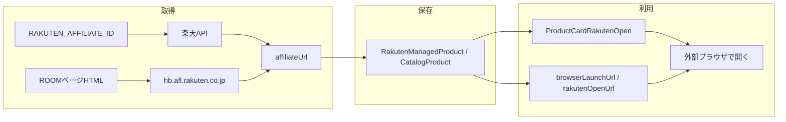

<!-- Generated by SpecStory, Markdown v2.1.0 -->

# 2026-06-27 14:53:16Z

<!-- Cursor IDE Session 1463a5b3-74d5-4eb5-8a24-3220fdd7c514 (2026-06-27 14:53:16Z) -->

_**User**_

このシステムでアフィリエイトURLを使っている箇所を教えてください

---

_**Agent (default)**_

アフィリエイトURLの利用箇所をコードベース全体から検索します。


_**Agent (default)**_

<tool-use data-tool-type="unknown" data-tool-name="ripgrep_raw_search">
<details>
<summary>Tool use: **ripgrep_raw_search**</summary>


Parameters:

```json
{
  "caseInsensitive": true,
  "pattern": "affiliate|アフィリエイト|affiliateUrl|affiliate_url"
}
```
Additional data:

```json
{
  "isPruned": true,
  "outputMode": "content",
  "pattern": "affiliate|アフィリエイト|affiliateUrl|affiliate_url",
  "topFiles": [
    {
      "matchCount": 2,
      "uri": ".\\recordings\\screenshots_20260627_235256\\terminal_output_20260627_235256.txt"
    },
    {
      "matchCount": 58,
      "uri": ".\\.specstory\\history\\2026-06-27_12-53-10Z-rakuten-room-url-retrieval-process.md"
    },
    {
      "matchCount": 2,
      "uri": ".\\recordings\\screenshots_20260627_214456\\terminal_output_20260627_214456.txt"
    },
    {
      "matchCount": 1,
      "uri": ".\\test\\utils\\home_ux_refinement_test.dart"
    },
    {
      "matchCount": 2,
      "uri": ".\\recordings\\screenshots_20260627_212539\\terminal_output_20260627_212539.txt"
    },
    {
      "matchCount": 1,
      "uri": ".\\lib\\screens\\rakuten_search_screen.dart"
    },
    {
      "matchCount": 1,
      "uri": ".\\.specstory\\history\\2026-06-27_11-53-35Z-roommanager-ux-final-adjustments.md"
    },
    {
      "matchCount": 5,
      "uri": ".\\recordings\\screenshots_20260627_201433\\terminal_output_20260627_201433.txt"
    },
    {
      "matchCount": 23,
      "uri": ".\\recordings\\screenshots_20260627_200421\\terminal_output_20260627_200421.txt"
    },
    {
      "matchCount": 22,
      "uri": ".\\recordings\\screenshots_20260627_003344\\terminal_output_20260627_003344.txt"
    },
    {
      "matchCount": 26,
      "uri": ".\\recordings\\screenshots_20260627_000024\\terminal_output_20260627_000024.txt"
    },
    {
      "matchCount": 1,
      "uri": ".\\test\\state\\today_recommendation_profile_early_stop_test.dart"
    },
    {
      "matchCount": 1,
      "uri": ".\\test\\services\\room_recommendation_profile_test.dart"
    },
    {
      "matchCount": 3,
      "uri": ".\\lib\\state\\today_recommendation_provider.dart"
    },
    {
      "matchCount": 1,
      "uri": ".\\lib\\widgets\\rakuten_search_result_card.dart"
    },
    {
      "matchCount": 5,
      "uri": ".\\recordings\\screenshots_20260626_231847\\terminal_output_20260626_231847.txt"
    },
    {
      "matchCount": 2,
      "uri": ".\\recordings\\screenshots_20260626_225453\\terminal_output_20260626_225453.txt"
    },
    {
      "matchCount": 13,
      "uri": ".\\.specstory\\history\\2026-06-25_16-36-35Z-roommanager-ux-and-bug-fixes.md"
    },
    {
      "matchCount": 1,
      "uri": ".\\test\\services\\dev_automation_runner_test.dart"
    },
    {
      "matchCount": 1,
      "uri": ".\\test\\models\\today_recommendation_section_visibility_test.dart"
    }
  ],
  "totalFiles": 212,
  "totalMatches": 10014
}
```
Status: **completed**


</details>
</tool-use>

<tool-use data-tool-type="unknown" data-tool-name="ripgrep_raw_search"><details>
<summary>Tool use: **ripgrep_raw_search**</summary>

</details></tool-use>

_**Agent (default)**_

<tool-use data-tool-type="unknown" data-tool-name="semantic_search_full">
<details>
<summary>Tool use: **semantic_search_full**</summary>


Parameters:

```json
{
  "explanation": "",
  "query": "Where are affiliate URLs used or generated?",
  "topK": 10
}
```
Result:

```json
{
  "codeResults": [
    {
      "codeBlock": {
        "detailedLines": [
          {
            "lineNumber": 1,
            "text": "import 'package:flutter/foundation.dart';"
          },
          {
            "lineNumber": 2
          },
          {
            "lineNumber": 3,
            "text": "import '../repository/xpath_config_repository.dart';"
          },
          {
            "lineNumber": 4,
            "text": "import 'room_url_extraction_coordinator.dart';"
          },
          {
            "lineNumber": 5
          },
          {
            "lineNumber": 6,
            "text": "/// 設定ファイルの XPath を用いて商品ページから URL を抽出する（WebView 実行は Coordinator 経由）。"
          },
          {
            "lineNumber": 7,
            "text": "class RoomUrlExtractionService {"
          },
          {
            "lineNumber": 8,
            "text": "  RoomUrlExtractionService._();"
          },
          {
            "lineNumber": 9
          },
          {
            "lineNumber": 10,
            "text": "  static const String _defaultSelectorName = 'roomTargetUrl';"
          },
          {
            "lineNumber": 11,
            "text": "  static const String _logTag = '[RoomUrlExtraction]';"
          },
          {
            "lineNumber": 12
          },
          {
            "lineNumber": 13,
            "text": "  /// 楽天アフィリエイト中間ページ（&#96;hb.afl.rakuten.co.jp&#96; の &#96;pc&#96; / &#96;m&#96;）を商品URLへ展開。"
          },
          {
            "lineNumber": 14,
            "text": "  static String _resolveRakutenLandingUrl(String url) {"
          },
          {
            "lineNumber": 15,
            "text": "    final uri = Uri.tryParse(url);"
          },
          {
            "lineNumber": 16,
            "text": "    if (uri == null) return url;"
          },
          {
            "lineNumber": 17,
            "text": "    final host = uri.host.toLowerCase();"
          },
          {
            "lineNumber": 18,
            "text": "    if (!host.contains('hb.afl.rakuten.co.jp')) return url;"
          },
          {
            "lineNumber": 19,
            "text": "    final pc = uri.queryParameters['pc']?.trim();"
          },
          {
            "lineNumber": 20,
            "text": "    if (pc != null \u0026\u0026 pc.isNotEmpty) return pc;"
          },
          {
            "lineNumber": 21,
            "text": "    final m = uri.queryParameters['m']?.trim();"
          },
          {
            "lineNumber": 22,
            "text": "    if (m != null \u0026\u0026 m.isNotEmpty) return m;"
          },
          {
            "lineNumber": 23,
            "text": "    return url;"
          },
          {
            "lineNumber": 24,
            "text": "  }"
          },
          {
            "lineNumber": 25
          },
          {
            "lineNumber": 26,
            "text": "  /// [pageUrl] を読み込み、設定の XPath / CSS で最初の文字列結果を返す。"
          },
          {
            "lineNumber": 27,
            "text": "  static Future\u003cString\u003e extractRoomTargetUrl(String pageUrl) async {"
          },
          {
            "lineNumber": 28,
            "text": "    final trimmed = pageUrl.trim();"
          },
          {
            "lineNumber": 29,
            "text": "    final resolved = _resolveRakutenLandingUrl(trimmed);"
          },
          {
            "lineNumber": 30,
            "text": "    if (resolved != trimmed) {"
          },
          {
            "lineNumber": 31,
            "text": "      debugPrint('$_logTag URL正規化（アフィリエイト中間→商品ページ）: $resolved');"
          },
          {
            "lineNumber": 32,
            "text": "    }"
          },
          {
            "lineNumber": 33
          },
          {
            "lineNumber": 34,
            "text": "    final sel = await XPathConfigRepository.loadSelectorNamed("
          },
          {
            "lineNumber": 35,
            "text": "      "
          }
        ],
        "range": {
          "endPosition": {
            "column": 6,
            "line": 34
          },
          "startPosition": {}
        },
        "relativeWorkspacePath": ".\\room_manager2\\lib\\services\\room_url_extraction_service.dart",
        "signatures": {}
      },
      "score": 0.31075379252433777
    },
    {
      "codeBlock": {
        "detailedLines": [
          {
            "lineNumber": 151,
            "text": "  }) {"
          },
          {
            "lineNumber": 152,
            "text": "    final decoded = _unescapeBasicXmlEntities(body);"
          },
          {
            "lineNumber": 153,
            "text": "    final aflUrlsOrdered = _collectAflUrlsUniqueOrdered(decoded, body);"
          },
          {
            "lineNumber": 154
          },
          {
            "lineNumber": 155,
            "text": "    if (traceRoomSync) {"
          },
          {
            "lineNumber": 156,
            "text": "      roomSyncLog('楽天で見るURL抽出開始（① item.rakuten 直接 → ② afl pc デコード）');"
          },
          {
            "lineNumber": 157,
            "text": "      final decList = RakutenItemUrlParser.findAllMatchesInText(decoded);"
          },
          {
            "lineNumber": 158,
            "text": "      final rawList = RakutenItemUrlParser.findAllMatchesInText(body);"
          },
          {
            "lineNumber": 159,
            "text": "      final merged = \u003cString\u003e[];"
          },
          {
            "lineNumber": 160,
            "text": "      final seenItem = \u003cString\u003e{};"
          },
          {
            "lineNumber": 161,
            "text": "      void addAll(List\u003cRakutenItemUrlParseResult\u003e list) {"
          },
          {
            "lineNumber": 162,
            "text": "        for (final r in list) {"
          },
          {
            "lineNumber": 163,
            "text": "          final u = r.rakutenUrl.trim();"
          },
          {
            "lineNumber": 164,
            "text": "          if (u.isEmpty || seenItem.contains(u)) continue;"
          },
          {
            "lineNumber": 165,
            "text": "          seenItem.add(u);"
          },
          {
            "lineNumber": 166,
            "text": "          merged.add(u);"
          },
          {
            "lineNumber": 167,
            "text": "        }"
          },
          {
            "lineNumber": 168,
            "text": "      }"
          },
          {
            "lineNumber": 169
          },
          {
            "lineNumber": 170,
            "text": "      addAll(decList);"
          },
          {
            "lineNumber": 171,
            "text": "      addAll(rawList);"
          },
          {
            "lineNumber": 172,
            "text": "      roomSyncLog('楽天URL候補数（item.rakuten ユニーク）: ${merged.length}');"
          },
          {
            "lineNumber": 173,
            "text": "      for (var i = 0; i \u003c merged.length; i++) {"
          },
          {
            "lineNumber": 174,
            "text": "        roomSyncLog('楽天URL候補[${i + 1}] (item): ${merged[i]}');"
          },
          {
            "lineNumber": 175,
            "text": "      }"
          },
          {
            "lineNumber": 176,
            "text": "      roomSyncLog('楽天アフィリエイトURL候補数: ${aflUrlsOrdered.length}');"
          },
          {
            "lineNumber": 177,
            "text": "      for (var i = 0; i \u003c aflUrlsOrdered.length; i++) {"
          },
          {
            "lineNumber": 178,
            "text": "        roomSyncLog('楽天URL候補[${i + 1}] (afl): ${aflUrlsOrdered[i]}');"
          },
          {
            "lineNumber": 179,
            "text": "      }"
          },
          {
            "lineNumber": 180,
            "text": "    }"
          },
          {
            "lineNumber": 181
          },
          {
            "lineNumber": 182,
            "text": "    String? roomPageAffiliateUrl;"
          },
          {
            "lineNumber": 183,
            "text": "    RakutenItemUrlParseResult? parsed = RakutenItemUrlParser.findFirstInText("
          },
          {
            "lineNumber": 184,
            "text": "      decoded,"
          },
          {
            "lineNumber": 185,
            "text": "    );"
          },
          {
            "lineNumber": 186,
            "text": "    parsed ??= RakutenItemUrlParser.findFirstInText(body);"
          },
          {
            "lineNumber": 187,
            "text": "    if (parsed == null) {"
          },
          {
            "lineNumber": 188,
            "text": "      final pair = _tryParseItemFromFirstAflPc(aflUrlsOrdered, traceRoomSync);"
          },
          {
            "lineNumber": 189,
            "text": "      if (pair != null) {"
          },
          {
            "lineNumber": 190,
            "text": "        parsed = pair.item;"
          },
          {
            "lineNumber": 191,
            "text": "        final raw = pair.aflSourceUrl.trim();"
          },
          {
            "lineNumber": 192,
            "text": "        roomPageAffiliateUrl = raw.isEmpty ? null : raw;"
          },
          {
            "lineNumber": 193,
            "text": "      }"
          },
          {
            "lineNumber": 194,
            "text": "    } else if (aflUrlsOrdered.isNotEmpty) {"
          },
          {
            "lineNumber": 195,
            "text": "      final raw = aflUrlsOrdered.first.trim();"
          },
          {
            "lineNumber": 196,
            "text": "      roomPageAffiliateUrl = raw.isEmpty ? null : raw;"
          },
          {
            "lineNumber": 197,
            "text": "    }"
          },
          {
            "lineNumber": 198
          },
          {
            "lineNumber": 199,
            "text": "    if (parsed == null) {"
          },
          {
            "lineNumber": 200,
            "text": "      if (traceRoomSync) {"
          },
          {
            "lineNumber": 201,
            "text": "        "
          }
        ],
        "range": {
          "endPosition": {
            "column": 8,
            "line": 200
          },
          "startPosition": {
            "line": 150
          }
        },
        "relativeWorkspacePath": ".\\room_manager2\\lib\\services\\room_url_resolver.dart",
        "signatures": {}
      },
      "score": 0.30224716663360596
    },
    {
      "codeBlock": {
        "detailedLines": [
          {
            "lineNumber": 51,
            "text": "  /// ROOM 商品ページ URL の alias（クエリ除去・ホスト小文字）。"
          },
          {
            "lineNumber": 52,
            "text": "  static String roomPageKey(String rawRoomUrl) {"
          },
          {
            "lineNumber": 53,
            "text": "    return RoomRakutenUrlNormalize.normalizeRoomProductPageKey(rawRoomUrl);"
          },
          {
            "lineNumber": 54,
            "text": "  }"
          },
          {
            "lineNumber": 55
          },
          {
            "lineNumber": 56,
            "text": "  /// canonicalId の決定。"
          },
          {
            "lineNumber": 57,
            "text": "  ///"
          },
          {
            "lineNumber": 58,
            "text": "  /// 1. 有効な productId / itemCode"
          },
          {
            "lineNumber": 59,
            "text": "  /// 2. normalizedItemUrl から &#96;url:\u003curl\u003e&#96;"
          },
          {
            "lineNumber": 60,
            "text": "  /// 3. 決定不可なら null"
          },
          {
            "lineNumber": 61,
            "text": "  static String? resolveCanonicalId({"
          },
          {
            "lineNumber": 62,
            "text": "    String? productId,"
          },
          {
            "lineNumber": 63,
            "text": "    String? itemCode,"
          },
          {
            "lineNumber": 64,
            "text": "    String? itemUrl,"
          },
          {
            "lineNumber": 65,
            "text": "    String? normalizedItemUrl,"
          },
          {
            "lineNumber": 66,
            "text": "  }) {"
          },
          {
            "lineNumber": 67,
            "text": "    final id = normalizeProductId(productId) ?? normalizeItemCode(itemCode);"
          },
          {
            "lineNumber": 68,
            "text": "    if (id != null) return id;"
          },
          {
            "lineNumber": 69
          },
          {
            "lineNumber": 70,
            "text": "    final normUrl = (normalizedItemUrl ?? '').trim().isNotEmpty"
          },
          {
            "lineNumber": 71,
            "text": "        ? normalizedItemUrl!.trim()"
          },
          {
            "lineNumber": 72,
            "text": "        : normalizeItemUrl(itemUrl ?? '');"
          },
          {
            "lineNumber": 73,
            "text": "    if (normUrl.isNotEmpty) return 'url:$normUrl';"
          },
          {
            "lineNumber": 74,
            "text": "    return null;"
          },
          {
            "lineNumber": 75,
            "text": "  }"
          },
          {
            "lineNumber": 76
          },
          {
            "lineNumber": 77,
            "text": "  /// productId / URL 由来の alias が [canonicalId] と矛盾しないか。"
          },
          {
            "lineNumber": 78,
            "text": "  static bool aliasConsistentWithCanonicalId({"
          },
          {
            "lineNumber": 79,
            "text": "    required String alias,"
          },
          {
            "lineNumber": 80,
            "text": "    required String canonicalId,"
          },
          {
            "lineNumber": 81,
            "text": "    String? productId,"
          },
          {
            "lineNumber": 82,
            "text": "    String? itemCode,"
          },
          {
            "lineNumber": 83,
            "text": "  }) {"
          },
          {
            "lineNumber": 84,
            "text": "    final cid = canonicalId.trim();"
          },
          {
            "lineNumber": 85,
            "text": "    final a = alias.trim();"
          },
          {
            "lineNumber": 86,
            "text": "    if (a.isEmpty) return false;"
          },
          {
            "lineNumber": 87,
            "text": "    if (cid.isNotEmpty \u0026\u0026 a == cid) return true;"
          },
          {
            "lineNumber": 88,
            "text": "    final pid = normalizeProductId(productId) ?? normalizeItemCode(itemCode);"
          },
          {
            "lineNumber": 89,
            "text": "    if (pid != null \u0026\u0026 a == pid) return true;"
          },
          {
            "lineNumber": 90,
            "text": "    if (cid.isEmpty \u0026\u0026 pid == null) return true;"
          },
          {
            "lineNumber": 91,
            "text": "    return false;"
          },
          {
            "lineNumber": 92,
            "text": "  }"
          },
          {
            "lineNumber": 93
          },
          {
            "lineNumber": 94,
            "text": "  /// 楽天アフィリエイト等のリダイレクト URL（商品固有性を保証できない）。"
          },
          {
            "lineNumber": 95,
            "text": "  static bool isAffiliateRedirectUrl(String url) {"
          },
          {
            "lineNumber": 96,
            "text": "    final u = Uri.tryParse(url.trim());"
          },
          {
            "lineNumber": 97,
            "text": "    if (u == null || !u.hasAuthority) return false;"
          },
          {
            "lineNumber": 98,
            "text": "    final host = u.host.toLowerCase();"
          },
          {
            "lineNumber": 99,
            "text": "    if (host == 'hb.afl.rakuten.co.jp') return true;"
          },
          {
            "lineNumber": 100,
            "text": "    if (host == 'afl.rakuten.co.jp') return true;"
          },
          {
            "lineNumber": 101,
            "text": "    if (host == 'r10.to') return true;"
          },
          {
            "lineNumber": 102,
            "text": "    return false;"
          },
          {
            "lineNumber": 103,
            "text": "  }"
          },
          {
            "lineNumber": 104
          },
          {
            "lineNumber": 105,
            "text": "  /// 商品同一性の根拠に使える商品ページ URL か。"
          }
        ],
        "range": {
          "endPosition": {
            "line": 105
          },
          "startPosition": {
            "line": 49
          }
        },
        "relativeWorkspacePath": ".\\room_manager2\\lib\\utils\\catalog_product_keys.dart",
        "signatures": {}
      },
      "score": 0.3001461923122406
    },
    {
      "codeBlock": {
        "detailedLines": [
          {
            "lineNumber": 1,
            "text": "import 'package:flutter/foundation.dart';"
          },
          {
            "lineNumber": 2,
            "text": "import 'package:flutter/material.dart';"
          },
          {
            "lineNumber": 3
          },
          {
            "lineNumber": 4,
            "text": "import '../config/debug_log_flags.dart';"
          },
          {
            "lineNumber": 5,
            "text": "import '../services/app_action_service.dart';"
          },
          {
            "lineNumber": 6
          },
          {
            "lineNumber": 7,
            "text": "/// 商品カードから楽天（アフィリエイト優先）を開く共通処理。"
          },
          {
            "lineNumber": 8,
            "text": "abstract final class ProductCardRakutenOpen {"
          },
          {
            "lineNumber": 9,
            "text": "  static void auditCard({"
          },
          {
            "lineNumber": 10,
            "text": "    required String screen,"
          },
          {
            "lineNumber": 11,
            "text": "    required String cardType,"
          },
          {
            "lineNumber": 12,
            "text": "  }) {"
          },
          {
            "lineNumber": 13,
            "text": "    if (!kDebugMode || !DebugLogFlags.kVerboseItemLogsEnabled) return;"
          },
          {
            "lineNumber": 14,
            "text": "    debugPrint("
          },
          {
            "lineNumber": 15,
            "text": "      '[PRODUCT_CARD_TAP_TARGET_AUDIT] screen=$screen cardType=$cardType '"
          },
          {
            "lineNumber": 16,
            "text": "      'imageTapOpensRakuten=true titleTapOpensRakuten=true usesAffiliateUrl=true '"
          },
          {
            "lineNumber": 17,
            "text": "      'fallback=itemUrl|none',"
          },
          {
            "lineNumber": 18,
            "text": "    );"
          },
          {
            "lineNumber": 19,
            "text": "  }"
          },
          {
            "lineNumber": 20
          },
          {
            "lineNumber": 21,
            "text": "  static Future\u003cvoid\u003e open({"
          },
          {
            "lineNumber": 22,
            "text": "    required BuildContext context,"
          },
          {
            "lineNumber": 23,
            "text": "    required String? affiliateUrl,"
          },
          {
            "lineNumber": 24,
            "text": "    required String? itemUrl,"
          },
          {
            "lineNumber": 25,
            "text": "    required String screen,"
          },
          {
            "lineNumber": 26,
            "text": "    required String productId,"
          },
          {
            "lineNumber": 27,
            "text": "    required String source,"
          },
          {
            "lineNumber": 28,
            "text": "  }) async {"
          },
          {
            "lineNumber": 29,
            "text": "    final aff = affiliateUrl?.trim() ?? '';"
          },
          {
            "lineNumber": 30,
            "text": "    final item = itemUrl?.trim() ?? '';"
          },
          {
            "lineNumber": 31,
            "text": "    final url = aff.isNotEmpty ? aff : item;"
          },
          {
            "lineNumber": 32,
            "text": "    final hasAffiliate = aff.isNotEmpty;"
          },
          {
            "lineNumber": 33,
            "text": "    final hasItem = item.isNotEmpty;"
          },
          {
            "lineNumber": 34,
            "text": "    if (kDebugMode) {"
          },
          {
            "lineNumber": 35,
            "text": "      debugPrint("
          },
          {
            "lineNumber": 36,
            "text": "        '[PRODUCT_OPEN_RAKUTEN] source=$source screen=$screen '"
          },
          {
            "lineNumber": 37,
            "text": "        'productId=$productId hasAffiliateUrl=$hasAffiliate '"
          },
          {
            "lineNumber": 38,
            "text": "        'hasItemUrl=$hasItem opened=${url.isNotEmpty}',"
          },
          {
            "lineNumber": 39,
            "text": "      );"
          },
          {
            "lineNumber": 40,
            "text": "    }"
          },
          {
            "lineNumber": 41,
            "text": "    if (url.isEmpty) {"
          },
          {
            "lineNumber": 42,
            "text": "      if (!context.mounted) return;"
          },
          {
            "lineNumber": 43,
            "text": "      ScaffoldMessenger.of(context).showSnackBar("
          },
          {
            "lineNumber": 44,
            "text": "        const SnackBar(content: Text('楽天の商品ページURLが見つかりませんでした')),"
          },
          {
            "lineNumber": 45,
            "text": "      );"
          },
          {
            "lineNumber": 46,
            "text": "      return;"
          },
          {
            "lineNumber": 47,
            "text": "    }"
          },
          {
            "lineNumber": 48,
            "text": "    await AppActionService.openUrl(context, url: url);"
          },
          {
            "lineNumber": 49,
            "text": "  }"
          },
          {
            "lineNumber": 50,
            "text": "}"
          }
        ],
        "range": {
          "endPosition": {
            "line": 50
          },
          "startPosition": {}
        },
        "relativeWorkspacePath": ".\\room_manager2\\lib\\utils\\product_card_rakuten_open.dart",
        "signatures": {}
      },
      "score": 0.28881025314331055
    },
    {
      "codeBlock": {
        "detailedLines": [
          {
            "lineNumber": 1,
            "text": "/// 楽天APIのレスポンスをアプリ側で扱いやすくした商品モデル。"
          },
          {
            "lineNumber": 2,
            "text": "class RakutenSearchItem {"
          },
          {
            "lineNumber": 3,
            "text": "  const RakutenSearchItem({"
          },
          {
            "lineNumber": 4,
            "text": "    required this.productId,"
          },
          {
            "lineNumber": 5,
            "text": "    required this.itemName,"
          },
          {
            "lineNumber": 6,
            "text": "    required this.itemPrice,"
          },
          {
            "lineNumber": 7,
            "text": "    required this.itemUrl,"
          },
          {
            "lineNumber": 8,
            "text": "    required this.affiliateUrl,"
          },
          {
            "lineNumber": 9,
            "text": "    required this.imageUrl,"
          },
          {
            "lineNumber": 10,
            "text": "    required this.shopName,"
          },
          {
            "lineNumber": 11,
            "text": "    this.reviewCount = 0,"
          },
          {
            "lineNumber": 12,
            "text": "    this.reviewAverage = 0,"
          },
          {
            "lineNumber": 13,
            "text": "    this.shopCode = '',"
          },
          {
            "lineNumber": 14,
            "text": "    this.shopUrl = '',"
          },
          {
            "lineNumber": 15,
            "text": "    this.genreId = '',"
          },
          {
            "lineNumber": 16,
            "text": "    this.genreName = '',"
          },
          {
            "lineNumber": 17,
            "text": "  });"
          },
          {
            "lineNumber": 18
          },
          {
            "lineNumber": 19,
            "text": "  final String productId;"
          },
          {
            "lineNumber": 20,
            "text": "  final String itemName;"
          },
          {
            "lineNumber": 21,
            "text": "  final int itemPrice;"
          },
          {
            "lineNumber": 22
          },
          {
            "lineNumber": 23,
            "text": "  /// 通常の商品ページURL（常に保持）。"
          },
          {
            "lineNumber": 24,
            "text": "  final String itemUrl;"
          },
          {
            "lineNumber": 25
          },
          {
            "lineNumber": 26,
            "text": "  /// リクエストに &#96;affiliateId&#96; があるときAPIが返すアフィリエイト用URL。無い場合は空。"
          },
          {
            "lineNumber": 27,
            "text": "  final String affiliateUrl;"
          },
          {
            "lineNumber": 28
          },
          {
            "lineNumber": 29,
            "text": "  final String imageUrl;"
          },
          {
            "lineNumber": 30,
            "text": "  final String shopName;"
          },
          {
            "lineNumber": 31,
            "text": "  final int reviewCount;"
          },
          {
            "lineNumber": 32,
            "text": "  final double reviewAverage;"
          },
          {
            "lineNumber": 33
          },
          {
            "lineNumber": 34,
            "text": "  /// 店舗コード（楽天API &#96;shopCode&#96;）。"
          },
          {
            "lineNumber": 35,
            "text": "  final String shopCode;"
          },
          {
            "lineNumber": 36
          },
          {
            "lineNumber": 37,
            "text": "  /// 店舗URL（楽天API &#96;shopUrl&#96;）。"
          },
          {
            "lineNumber": 38,
            "text": "  final String shopUrl;"
          },
          {
            "lineNumber": 39
          },
          {
            "lineNumber": 40,
            "text": "  /// ジャンルID（楽天API &#96;genreId&#96;。数値でも文字列として保持）。"
          },
          {
            "lineNumber": 41,
            "text": "  final String genreId;"
          },
          {
            "lineNumber": 42
          },
          {
            "lineNumber": 43,
            "text": "  /// 楽天APIが返すジャンル名（あれば）。無い場合は空文字。"
          },
          {
            "lineNumber": 44,
            "text": "  final String genreName;"
          },
          {
            "lineNumber": 45
          },
          {
            "lineNumber": 46,
            "text": "  /// 「楽天で見る」で開くURL（[affiliateUrl] を優先し、無ければ通常の [itemUrl]）。"
          },
          {
            "lineNumber": 47,
            "text": "  String get browserLaunchUrl =\u003e"
          },
          {
            "lineNumber": 48,
            "text": "      affiliateUrl.trim().isNotEmpty ? affiliateUrl.trim() : itemUrl;"
          },
          {
            "lineNumber": 49
          },
          {
            "lineNumber": 50,
            "text": "  /// API が &#96;affiliateUrl&#96; を返したか（リクエストの affiliateId が有効なときに付く）。"
          },
          {
            "lineNumber": 51,
            "text": "  bool get hasAffiliateUrlInResponse =\u003e affiliateUrl.trim().isNotEmpty;"
          },
          {
            "lineNumber": 52,
            "text": "}"
          }
        ],
        "range": {
          "endPosition": {
            "line": 52
          },
          "startPosition": {}
        },
        "relativeWorkspacePath": ".\\room_manager2\\lib\\models\\rakuten_search_item.dart",
        "signatures": {}
      },
      "score": 0.2763153314590454
    },
    {
      "codeBlock": {
        "detailedLines": [
          {
            "lineNumber": 1,
            "text": "import '../services/rakuten_item_url_parser.dart';"
          },
          {
            "lineNumber": 2,
            "text": "import 'catalog_product_keys.dart';"
          },
          {
            "lineNumber": 3
          },
          {
            "lineNumber": 4,
            "text": "/// ROOM 商品ページURLの照合用キー（ホスト小文字・末尾スラッシュ除去・クエリ除去）。"
          },
          {
            "lineNumber": 5,
            "text": "abstract final class RoomRakutenUrlNormalize {"
          },
          {
            "lineNumber": 6,
            "text": "  const RoomRakutenUrlNormalize._();"
          },
          {
            "lineNumber": 7
          },
          {
            "lineNumber": 8,
            "text": "  static String normalizeRoomProductPageKey(String raw) {"
          },
          {
            "lineNumber": 9,
            "text": "    final t = raw.trim();"
          },
          {
            "lineNumber": 10,
            "text": "    if (t.isEmpty) return '';"
          },
          {
            "lineNumber": 11,
            "text": "    final u = Uri.tryParse(t);"
          },
          {
            "lineNumber": 12,
            "text": "    if (u == null || !u.hasAuthority) return '';"
          },
          {
            "lineNumber": 13,
            "text": "    var path = u.path;"
          },
          {
            "lineNumber": 14,
            "text": "    if (path.endsWith('/') \u0026\u0026 path.length \u003e 1) {"
          },
          {
            "lineNumber": 15,
            "text": "      path = path.substring(0, path.length - 1);"
          },
          {
            "lineNumber": 16,
            "text": "    }"
          },
          {
            "lineNumber": 17,
            "text": "    return '${u.scheme}://${u.host.toLowerCase()}$path';"
          },
          {
            "lineNumber": 18,
            "text": "  }"
          },
          {
            "lineNumber": 19
          },
          {
            "lineNumber": 20,
            "text": "  static bool isLikelyRoomProductPageUrl(String raw) {"
          },
          {
            "lineNumber": 21,
            "text": "    final u = Uri.tryParse(raw.trim());"
          },
          {
            "lineNumber": 22,
            "text": "    if (u == null || !u.hasScheme) return false;"
          },
          {
            "lineNumber": 23,
            "text": "    final h = u.host.toLowerCase();"
          },
          {
            "lineNumber": 24,
            "text": "    return h == 'room.rakuten.co.jp' || h.endsWith('.room.rakuten.co.jp');"
          },
          {
            "lineNumber": 25,
            "text": "  }"
          },
          {
            "lineNumber": 26
          },
          {
            "lineNumber": 27,
            "text": "  /// 楽天商品ページの安定URL（末尾スラッシュ付き）。"
          },
          {
            "lineNumber": 28,
            "text": "  static String canonicalItemRakutenUrl({"
          },
          {
            "lineNumber": 29,
            "text": "    required String shopCode,"
          },
          {
            "lineNumber": 30,
            "text": "    required String itemPathSegment,"
          },
          {
            "lineNumber": 31,
            "text": "  }) {"
          },
          {
            "lineNumber": 32,
            "text": "    final s = shopCode.trim();"
          },
          {
            "lineNumber": 33,
            "text": "    final i = itemPathSegment.trim();"
          },
          {
            "lineNumber": 34,
            "text": "    return 'https://item.rakuten.co.jp/$s/$i/';"
          },
          {
            "lineNumber": 35,
            "text": "  }"
          },
          {
            "lineNumber": 36
          },
          {
            "lineNumber": 37,
            "text": "  /// &#96;hb.afl.rakuten.co.jp&#96; 等の &#96;pc=&#96; クエリから item.rakuten URL を取り出す。"
          },
          {
            "lineNumber": 38,
            "text": "  static String? decodeAffiliatePcTargetUrl(String raw) {"
          },
          {
            "lineNumber": 39,
            "text": "    final t = raw.trim();"
          },
          {
            "lineNumber": 40,
            "text": "    if (t.isEmpty) return null;"
          },
          {
            "lineNumber": 41,
            "text": "    final u = Uri.tryParse(t);"
          },
          {
            "lineNumber": 42,
            "text": "    if (u == null || !u.hasAuthority) return null;"
          },
          {
            "lineNumber": 43,
            "text": "    if (!CatalogProductKeys.isAffiliateRedirectUrl(t)) return null;"
          },
          {
            "lineNumber": 44,
            "text": "    final pc = u.queryParameters['pc'] ?? u.queryParameters['PC'];"
          },
          {
            "lineNumber": 45,
            "text": "    if (pc == null || pc.trim().isEmpty) return null;"
          },
          {
            "lineNumber": 46,
            "text": "    try {"
          },
          {
            "lineNumber": 47,
            "text": "      return _fullyUrlDecodeChain(pc.trim());"
          },
          {
            "lineNumber": 48,
            "text": "    } catch (_) {"
          },
          {
            "lineNumber": 49,
            "text": "      return null;"
          },
          {
            "lineNumber": 50,
            "text": "    }"
          },
          {
            "lineNumber": 51,
            "text": "  }"
          },
          {
            "lineNumber": 52
          },
          {
            "lineNumber": 53,
            "text": "  /// 入力 URL を &#96;item.rakuten.co.jp/{shop}/{item}/&#96; 形式へ正規化する（affiliate 対応）。"
          }
        ],
        "range": {
          "endPosition": {
            "line": 53
          },
          "startPosition": {}
        },
        "relativeWorkspacePath": ".\\room_manager2\\lib\\utils\\room_rakuten_url_normalize.dart",
        "signatures": {}
      },
      "score": 0.2673260569572449
    },
    {
      "codeBlock": {
        "detailedLines": [
          {
            "lineNumber": 795,
            "text": "    required String? existingAffiliate,"
          },
          {
            "lineNumber": 796,
            "text": "  }) {"
          },
          {
            "lineNumber": 797,
            "text": "    final roomAff = roomPageAffiliateUrl?.trim() ?? '';"
          },
          {
            "lineNumber": 798,
            "text": "    if (roomAff.isNotEmpty) return roomAff;"
          },
          {
            "lineNumber": 799,
            "text": "    final apiAff = api?.affiliateUrl.trim() ?? '';"
          },
          {
            "lineNumber": 800,
            "text": "    if (apiAff.isNotEmpty) return apiAff;"
          },
          {
            "lineNumber": 801,
            "text": "    return existingAffiliate;"
          },
          {
            "lineNumber": 802,
            "text": "  }"
          },
          {
            "lineNumber": 803
          },
          {
            "lineNumber": 804,
            "text": "  /// PC復元URL優先、無ければAPI・既存の通常URL。"
          },
          {
            "lineNumber": 805,
            "text": "  (String itemUrl, String? rakutenUrl) _normalUrlsForRoomPersist({"
          },
          {
            "lineNumber": 806,
            "text": "    required RakutenItemUrlParseResult parsedItem,"
          },
          {
            "lineNumber": 807,
            "text": "    RakutenSearchItem? api,"
          },
          {
            "lineNumber": 808,
            "text": "    required String fallbackItemUrl,"
          },
          {
            "lineNumber": 809,
            "text": "    required String? fallbackRakutenUrl,"
          },
          {
            "lineNumber": 810,
            "text": "  }) {"
          },
          {
            "lineNumber": 811,
            "text": "    final pc = parsedItem.rakutenUrl.trim();"
          },
          {
            "lineNumber": 812,
            "text": "    if (pc.isNotEmpty) return (pc, pc);"
          },
          {
            "lineNumber": 813,
            "text": "    final fromApi = api?.itemUrl.trim() ?? '';"
          },
          {
            "lineNumber": 814,
            "text": "    if (fromApi.isNotEmpty) return (fromApi, fromApi);"
          },
          {
            "lineNumber": 815,
            "text": "    return (fallbackItemUrl, fallbackRakutenUrl);"
          },
          {
            "lineNumber": 816,
            "text": "  }"
          },
          {
            "lineNumber": 817
          },
          {
            "lineNumber": 818,
            "text": "  Future\u003cRoomCollectedPersistOutcome\u003e persistRoomCollectedFromRoomPage({"
          },
          {
            "lineNumber": 819,
            "text": "    required String roomUrlStoredCanonical,"
          },
          {
            "lineNumber": 820,
            "text": "    required String normalizedRoomUrlKey,"
          },
          {
            "lineNumber": 821,
            "text": "    required RakutenItemUrlParseResult parsedItem,"
          },
          {
            "lineNumber": 822,
            "text": "    String? roomPageAffiliateUrl,"
          },
          {
            "lineNumber": 823,
            "text": "    String roomPageTitle = '',"
          },
          {
            "lineNumber": 824,
            "text": "    String roomPageImageUrl = '',"
          },
          {
            "lineNumber": 825,
            "text": "    String collectsImageUrl = '',"
          },
          {
            "lineNumber": 826,
            "text": "    String roomHtmlImageUrl = '',"
          },
          {
            "lineNumber": 827,
            "text": "    RakutenSearchItem? apiEnrichedItem,"
          },
          {
            "lineNumber": 828,
            "text": "    bool traceRoomSync = false,"
          },
          {
            "lineNumber": 829
          },
          {
            "lineNumber": 830,
            "text": "    /// バッチ処理などで [loadAll] を繰り返さないための共有リスト（破壊的に更新される）。"
          },
          {
            "lineNumber": 831,
            "text": "    List\u003cRakutenManagedProduct\u003e? workingMutableList,"
          },
          {
            "lineNumber": 832,
            "text": "    int? roomLikeCount,"
          },
          {
            "lineNumber": 833,
            "text": "    int? roomCommentCount,"
          },
          {
            "lineNumber": 834
          },
          {
            "lineNumber": 835,
            "text": "    /// 一覧HTML／collects 由来の参考価格（円）。ROOM 商品ページ由来の表示価格など。"
          },
          {
            "lineNumber": 836,
            "text": "    int? listingHintPriceYen,"
          },
          {
            "lineNumber": 837
          },
          {
            "lineNumber": 838,
            "text": "    /// true のとき [listingHintPriceYen] を新規行の [itemPrice] に反映しない（反応数のみ更新など）。"
          },
          {
            "lineNumber": 839,
            "text": "    bool suppressListingHintPrice = false,"
          },
          {
            "lineNumber": 840
          },
          {
            "lineNumber": 841,
            "text": "    /// 楽天検索APIが完全には取れなかった（プロキシ400・Items空など）。"
          },
          {
            "lineNumber": 842,
            "text": "    bool rakutenApiPartialData = false,"
          },
          {
            "lineNumber": 843
          },
          {
            "lineNumber": 844,
            "text": "    /// 楽天API失敗後に ROOM 商品ページからメタを補填できた。"
          },
          {
            "lineNumber": 845,
            "text": "    bool roomImportFallbackRecovered = false,"
          }
        ],
        "range": {
          "endPosition": {
            "line": 846
          },
          "startPosition": {
            "line": 794
          }
        },
        "relativeWorkspacePath": ".\\room_manager2\\lib\\repository\\rakuten_managed_product_repository.dart",
        "signatures": {}
      },
      "score": 0.25978219509124756
    },
    {
      "codeBlock": {
        "detailedLines": [
          {
            "lineNumber": 40,
            "text": "  DateTime? now,"
          },
          {
            "lineNumber": 41,
            "text": "  String? roomPageUrl,"
          },
          {
            "lineNumber": 42,
            "text": "}) {"
          },
          {
            "lineNumber": 43,
            "text": "  final t = now ?? DateTime.now();"
          },
          {
            "lineNumber": 44,
            "text": "  final normalizedUrl = CatalogProductKeys.normalizeItemUrl(item.itemUrl);"
          },
          {
            "lineNumber": 45,
            "text": "  final parsed = RakutenItemUrlParser.tryParse(item.itemUrl);"
          },
          {
            "lineNumber": 46,
            "text": "  final canonicalId = CatalogProductKeys.resolveCanonicalId("
          },
          {
            "lineNumber": 47,
            "text": "    productId: item.productId,"
          },
          {
            "lineNumber": 48,
            "text": "    itemUrl: item.itemUrl,"
          },
          {
            "lineNumber": 49,
            "text": "    normalizedItemUrl: normalizedUrl,"
          },
          {
            "lineNumber": 50,
            "text": "  );"
          },
          {
            "lineNumber": 51,
            "text": "  final aliases = CatalogProductKeys.buildAliases("
          },
          {
            "lineNumber": 52,
            "text": "    canonicalId: canonicalId ?? '',"
          },
          {
            "lineNumber": 53,
            "text": "    productId: item.productId,"
          },
          {
            "lineNumber": 54,
            "text": "    itemUrl: item.itemUrl,"
          },
          {
            "lineNumber": 55,
            "text": "    normalizedItemUrl: normalizedUrl,"
          },
          {
            "lineNumber": 56,
            "text": "    shopCode: parsed?.shopCode ?? item.shopCode,"
          },
          {
            "lineNumber": 57,
            "text": "    itemPathSegment: parsed?.itemPathSegment,"
          },
          {
            "lineNumber": 58,
            "text": "    roomPageUrl: roomPageUrl,"
          },
          {
            "lineNumber": 59,
            "text": "  );"
          },
          {
            "lineNumber": 60
          },
          {
            "lineNumber": 61,
            "text": "  final product = CatalogProduct("
          },
          {
            "lineNumber": 62,
            "text": "    canonicalId: canonicalId ?? '',"
          },
          {
            "lineNumber": 63,
            "text": "    productId: item.productId,"
          },
          {
            "lineNumber": 64,
            "text": "    itemCode: item.productId,"
          },
          {
            "lineNumber": 65,
            "text": "    itemUrl: item.itemUrl,"
          },
          {
            "lineNumber": 66,
            "text": "    normalizedItemUrl: normalizedUrl,"
          },
          {
            "lineNumber": 67,
            "text": "    itemName: item.itemName,"
          },
          {
            "lineNumber": 68,
            "text": "    itemPrice: item.itemPrice,"
          },
          {
            "lineNumber": 69,
            "text": "    imageUrl: item.imageUrl,"
          },
          {
            "lineNumber": 70,
            "text": "    shopCode: item.shopCode,"
          },
          {
            "lineNumber": 71,
            "text": "    shopName: item.shopName,"
          },
          {
            "lineNumber": 72,
            "text": "    shopUrl: item.shopUrl,"
          },
          {
            "lineNumber": 73,
            "text": "    genreId: item.genreId,"
          },
          {
            "lineNumber": 74,
            "text": "    genreName: resolveCatalogGenreName("
          },
          {
            "lineNumber": 75,
            "text": "      genreId: item.genreId,"
          },
          {
            "lineNumber": 76,
            "text": "      genreName: item.genreName,"
          },
          {
            "lineNumber": 77,
            "text": "    ),"
          },
          {
            "lineNumber": 78,
            "text": "    reviewAverage: item.reviewAverage,"
          },
          {
            "lineNumber": 79,
            "text": "    reviewCount: item.reviewCount,"
          },
          {
            "lineNumber": 80,
            "text": "    affiliateUrl: item.affiliateUrl,"
          },
          {
            "lineNumber": 81,
            "text": "    itemCaption: '',"
          },
          {
            "lineNumber": 82,
            "text": "    source: source,"
          },
          {
            "lineNumber": 83,
            "text": "    sourceTrust: sourceTrust,"
          },
          {
            "lineNumber": 84,
            "text": "    fetchedAt: t,"
          },
          {
            "lineNumber": 85,
            "text": "    lastValidatedAt: t,"
          },
          {
            "lineNumber": 86,
            "text": "    lastAccessedAt: t,"
          },
          {
            "lineNumber": 87,
            "text": "    qualityStatus: const CatalogProductQualityStatus("
          },
          {
            "lineNumber": 88,
            "text": "      hasImage: false,"
          },
          {
            "lineNumber": 89,
            "text": "      hasPrice: false,"
          },
          {
            "lineNumber": 90,
            "text": "      hasValidUrl: false,"
          },
          {
            "lineNumber": 91,
            "text": "      safe: true,"
          },
          {
            "lineNumber": 92,
            "text": "    ),"
          },
          {
            "lineNumber": 93,
            "text": "    aliases: aliases,"
          },
          {
            "lineNumber": 94,
            "text": "    cacheTtlSeconds: ProductCatalogConfig.defaultProductCacheTtlSeconds,"
          },
          {
            "lineNumber": 95,
            "text": "  );"
          },
          {
            "lineNumber": 96,
            "text": "  return product.withRecomputedQuality();"
          },
          {
            "lineNumber": 97,
            "text": "}"
          },
          {
            "lineNumber": 98
          },
          {
            "lineNumber": 99,
            "text": "/// [RakutenManagedProduct] から [CatalogProduct] を生成。"
          },
          {
            "lineNumber": 100,
            "text": "CatalogProduct catalogProductFromManagedProduct("
          },
          {
            "lineNumber": 101,
            "text": "  RakutenManagedProduct row, {"
          },
          {
            "lineNumber": 102,
            "text": "  CatalogProductSource source = CatalogProductSource.roomImport,"
          }
        ],
        "range": {
          "endPosition": {
            "line": 102
          },
          "startPosition": {
            "line": 39
          }
        },
        "relativeWorkspacePath": ".\\room_manager2\\lib\\utils\\catalog_product_mapper.dart",
        "signatures": {}
      },
      "score": 0.25244709849357605
    },
    {
      "codeBlock": {
        "detailedLines": [
          {
            "lineNumber": 99,
            "text": "          );"
          },
          {
            "lineNumber": 100,
            "text": "        }"
          },
          {
            "lineNumber": 101
          },
          {
            "lineNumber": 102,
            "text": "        return Wrap("
          },
          {
            "lineNumber": 103,
            "text": "          spacing: gap,"
          },
          {
            "lineNumber": 104,
            "text": "          runSpacing: gap,"
          },
          {
            "lineNumber": 105,
            "text": "          children: ["
          },
          {
            "lineNumber": 106,
            "text": "            SizedBox("
          },
          {
            "lineNumber": 107,
            "text": "              width: itemWidth,"
          },
          {
            "lineNumber": 108,
            "text": "              child: AppOutlineButton("
          },
          {
            "lineNumber": 109,
            "text": "                label: '楽天で見る',"
          },
          {
            "lineNumber": 110,
            "text": "                icon: const Icon(Icons.open_in_new, size: 16),"
          },
          {
            "lineNumber": 111,
            "text": "                height: height,"
          },
          {
            "lineNumber": 112,
            "text": "                expand: true,"
          },
          {
            "lineNumber": 113,
            "text": "                onPressed: rakutenUrl.isEmpty"
          },
          {
            "lineNumber": 114,
            "text": "                    ? null"
          },
          {
            "lineNumber": 115,
            "text": "                    : () =\u003e _openRakuten(context),"
          },
          {
            "lineNumber": 116,
            "text": "              ),"
          },
          {
            "lineNumber": 117,
            "text": "            ),"
          },
          {
            "lineNumber": 118,
            "text": "            SizedBox("
          },
          {
            "lineNumber": 119,
            "text": "              width: itemWidth,"
          },
          {
            "lineNumber": 120,
            "text": "              child: AppOutlineButton("
          },
          {
            "lineNumber": 121,
            "text": "                label: 'ROOMで見る',"
          },
          {
            "lineNumber": 122,
            "text": "                icon: const Icon(Icons.open_in_new, size: 16),"
          },
          {
            "lineNumber": 123,
            "text": "                height: height,"
          },
          {
            "lineNumber": 124,
            "text": "                expand: true,"
          },
          {
            "lineNumber": 125,
            "text": "                onPressed: roomUrl.isEmpty"
          },
          {
            "lineNumber": 126,
            "text": "                    ? null"
          },
          {
            "lineNumber": 127,
            "text": "                    : () =\u003e unawaited("
          },
          {
            "lineNumber": 128,
            "text": "                          AppActionService.openUrl(context, url: roomUrl),"
          },
          {
            "lineNumber": 129,
            "text": "                        ),"
          },
          {
            "lineNumber": 130,
            "text": "              ),"
          },
          {
            "lineNumber": 131,
            "text": "            ),"
          },
          {
            "lineNumber": 132,
            "text": "          ],"
          },
          {
            "lineNumber": 133,
            "text": "        );"
          },
          {
            "lineNumber": 134,
            "text": "      },"
          },
          {
            "lineNumber": 135,
            "text": "    );"
          },
          {
            "lineNumber": 136,
            "text": "  }"
          },
          {
            "lineNumber": 137
          },
          {
            "lineNumber": 138,
            "text": "  Future\u003cvoid\u003e _openRakuten(BuildContext context) async {"
          },
          {
            "lineNumber": 139,
            "text": "    if (kDebugMode) {"
          },
          {
            "lineNumber": 140,
            "text": "      debugPrint("
          },
          {
            "lineNumber": 141,
            "text": "        '[PRODUCT_CARD_AFFILIATE_TAP_TARGET] screen=$screen '"
          },
          {
            "lineNumber": 142,
            "text": "        'productId=${product.productId.trim()} target=rakutenButton',"
          },
          {
            "lineNumber": 143,
            "text": "      );"
          },
          {
            "lineNumber": 144,
            "text": "    }"
          },
          {
            "lineNumber": 145,
            "text": "    final err = await context"
          },
          {
            "lineNumber": 146,
            "text": "        .read\u003cRakutenManagedProductProvider\u003e()"
          },
          {
            "lineNumber": 147,
            "text": "        .openRakutenItemPage(context, product.productId);"
          },
          {
            "lineNumber": 148,
            "text": "    if (!context.mounted) return;"
          },
          {
            "lineNumber": 149,
            "text": "    if (err != null) {"
          },
          {
            "lineNumber": 150,
            "text": "      ScaffoldMessenger.of(context).showSnackBar("
          },
          {
            "lineNumber": 151,
            "text": "        SnackBar(content: Text(err)),"
          },
          {
            "lineNumber": 152,
            "text": "      );"
          },
          {
            "lineNumber": 153,
            "text": "    }"
          },
          {
            "lineNumber": 154,
            "text": "  }"
          },
          {
            "lineNumber": 155,
            "text": "}"
          }
        ],
        "range": {
          "endPosition": {
            "line": 155
          },
          "startPosition": {
            "line": 98
          }
        },
        "relativeWorkspacePath": ".\\room_manager2\\lib\\widgets\\product_open_action_buttons.dart",
        "signatures": {}
      },
      "score": 0.24654319882392883
    },
    {
      "codeBlock": {
        "detailedLines": [
          {
            "lineNumber": 1,
            "text": "/// 共通ショップカタログの ID・alias 生成。"
          },
          {
            "lineNumber": 2,
            "text": "abstract final class ShopCatalogKeys {"
          },
          {
            "lineNumber": 3,
            "text": "  static String? normalizeShopCode(String? raw) {"
          },
          {
            "lineNumber": 4,
            "text": "    final t = (raw ?? '').trim();"
          },
          {
            "lineNumber": 5,
            "text": "    if (t.isEmpty || t.length \u003e 64) return null;"
          },
          {
            "lineNumber": 6,
            "text": "    return t;"
          },
          {
            "lineNumber": 7,
            "text": "  }"
          },
          {
            "lineNumber": 8
          },
          {
            "lineNumber": 9,
            "text": "  static String normalizeShopUrl(String raw) {"
          },
          {
            "lineNumber": 10,
            "text": "    final t = raw.trim();"
          },
          {
            "lineNumber": 11,
            "text": "    if (t.isEmpty) return '';"
          },
          {
            "lineNumber": 12,
            "text": "    final u = Uri.tryParse(t);"
          },
          {
            "lineNumber": 13,
            "text": "    if (u == null || !u.hasAuthority) return '';"
          },
          {
            "lineNumber": 14,
            "text": "    var path = u.path;"
          },
          {
            "lineNumber": 15,
            "text": "    if (!path.endsWith('/') \u0026\u0026 path.isNotEmpty) {"
          },
          {
            "lineNumber": 16,
            "text": "      path = '$path/';"
          },
          {
            "lineNumber": 17,
            "text": "    }"
          },
          {
            "lineNumber": 18,
            "text": "    return '${u.scheme}://${u.host.toLowerCase()}$path';"
          },
          {
            "lineNumber": 19,
            "text": "  }"
          },
          {
            "lineNumber": 20
          },
          {
            "lineNumber": 21,
            "text": "  static List\u003cString\u003e buildAliases({"
          },
          {
            "lineNumber": 22,
            "text": "    required String shopCode,"
          },
          {
            "lineNumber": 23,
            "text": "    String? shopUrl,"
          },
          {
            "lineNumber": 24,
            "text": "    List\u003cString\u003e extra = const [],"
          },
          {
            "lineNumber": 25,
            "text": "  }) {"
          },
          {
            "lineNumber": 26,
            "text": "    return mergeAliases(extra, ["
          },
          {
            "lineNumber": 27,
            "text": "      shopCode,"
          },
          {
            "lineNumber": 28,
            "text": "      if (normalizeShopUrl(shopUrl ?? '').isNotEmpty)"
          },
          {
            "lineNumber": 29,
            "text": "        normalizeShopUrl(shopUrl!),"
          },
          {
            "lineNumber": 30,
            "text": "    ]);"
          },
          {
            "lineNumber": 31,
            "text": "  }"
          },
          {
            "lineNumber": 32
          },
          {
            "lineNumber": 33,
            "text": "  static List\u003cString\u003e mergeAliases("
          },
          {
            "lineNumber": 34,
            "text": "    Iterable\u003cString\u003e a,"
          },
          {
            "lineNumber": 35,
            "text": "    Iterable\u003cString\u003e b,"
          },
          {
            "lineNumber": 36,
            "text": "  ) {"
          },
          {
            "lineNumber": 37,
            "text": "    final seen = \u003cString\u003e{};"
          },
          {
            "lineNumber": 38,
            "text": "    final out = \u003cString\u003e[];"
          },
          {
            "lineNumber": 39,
            "text": "    for (final raw in [...a, ...b]) {"
          },
          {
            "lineNumber": 40,
            "text": "      final t = raw.trim();"
          },
          {
            "lineNumber": 41,
            "text": "      if (t.isEmpty || seen.contains(t)) continue;"
          },
          {
            "lineNumber": 42,
            "text": "      seen.add(t);"
          },
          {
            "lineNumber": 43,
            "text": "      out.add(t);"
          },
          {
            "lineNumber": 44,
            "text": "    }"
          },
          {
            "lineNumber": 45,
            "text": "    return out;"
          },
          {
            "lineNumber": 46,
            "text": "  }"
          },
          {
            "lineNumber": 47,
            "text": "}"
          }
        ],
        "range": {
          "endPosition": {
            "line": 47
          },
          "startPosition": {}
        },
        "relativeWorkspacePath": ".\\room_manager2\\lib\\utils\\shop_catalog_keys.dart",
        "signatures": {}
      },
      "score": 0.23326300084590912
    },
    {
      "codeBlock": {
        "detailedLines": [
          {
            "lineNumber": 635,
            "text": "  _tryParseItemFromFirstAflPc(List\u003cString\u003e aflUrls, bool traceRoomSync) {"
          },
          {
            "lineNumber": 636,
            "text": "    for (final raw in aflUrls) {"
          },
          {
            "lineNumber": 637,
            "text": "      final aflUrl = raw.trim();"
          },
          {
            "lineNumber": 638,
            "text": "      if (aflUrl.isEmpty) continue;"
          },
          {
            "lineNumber": 639
          },
          {
            "lineNumber": 640,
            "text": "      if (traceRoomSync) {"
          },
          {
            "lineNumber": 641,
            "text": "        roomSyncLog('aflURL: $aflUrl');"
          },
          {
            "lineNumber": 642,
            "text": "      }"
          },
          {
            "lineNumber": 643
          },
          {
            "lineNumber": 644,
            "text": "      final uri = Uri.tryParse(aflUrl);"
          },
          {
            "lineNumber": 645,
            "text": "      if (uri == null) {"
          },
          {
            "lineNumber": 646,
            "text": "        if (traceRoomSync) {"
          },
          {
            "lineNumber": 647,
            "text": "          roomSyncWarn('aflURL の Uri 解析に失敗');"
          },
          {
            "lineNumber": 648,
            "text": "        }"
          },
          {
            "lineNumber": 649,
            "text": "        continue;"
          },
          {
            "lineNumber": 650,
            "text": "      }"
          },
          {
            "lineNumber": 651
          },
          {
            "lineNumber": 652,
            "text": "      final pc = uri.queryParameters['pc'];"
          },
          {
            "lineNumber": 653,
            "text": "      if (pc == null || pc.trim().isEmpty) {"
          },
          {
            "lineNumber": 654,
            "text": "        if (traceRoomSync) {"
          },
          {
            "lineNumber": 655,
            "text": "          roomSyncLog('pc param: (なしまたは空)');"
          },
          {
            "lineNumber": 656,
            "text": "        }"
          },
          {
            "lineNumber": 657,
            "text": "        continue;"
          },
          {
            "lineNumber": 658,
            "text": "      }"
          },
          {
            "lineNumber": 659
          },
          {
            "lineNumber": 660,
            "text": "      if (traceRoomSync) {"
          },
          {
            "lineNumber": 661,
            "text": "        roomSyncLog('pc param: $pc');"
          },
          {
            "lineNumber": 662,
            "text": "      }"
          },
          {
            "lineNumber": 663
          },
          {
            "lineNumber": 664,
            "text": "      final String decodedPc;"
          },
          {
            "lineNumber": 665,
            "text": "      try {"
          },
          {
            "lineNumber": 666,
            "text": "        decodedPc = Uri.decodeFull(pc.trim());"
          },
          {
            "lineNumber": 667,
            "text": "      } catch (e, st) {"
          },
          {
            "lineNumber": 668,
            "text": "        if (traceRoomSync) {"
          },
          {
            "lineNumber": 669,
            "text": "          roomSyncError('pc の Uri.decodeFull に失敗', e, st);"
          },
          {
            "lineNumber": 670,
            "text": "        }"
          },
          {
            "lineNumber": 671,
            "text": "        continue;"
          },
          {
            "lineNumber": 672,
            "text": "      }"
          },
          {
            "lineNumber": 673
          },
          {
            "lineNumber": 674,
            "text": "      final decTrim = decodedPc.trim();"
          },
          {
            "lineNumber": 675,
            "text": "      if (decTrim.isEmpty) {"
          },
          {
            "lineNumber": 676,
            "text": "        if (traceRoomSync) {"
          },
          {
            "lineNumber": 677,
            "text": "          roomSyncWarn('decoded URL: (空)');"
          },
          {
            "lineNumber": 678,
            "text": "        }"
          },
          {
            "lineNumber": 679,
            "text": "        continue;"
          },
          {
            "lineNumber": 680,
            "text": "      }"
          },
          {
            "lineNumber": 681
          },
          {
            "lineNumber": 682,
            "text": "      if (traceRoomSync) {"
          },
          {
            "lineNumber": 683,
            "text": "        roomSyncLog('decoded URL: $decTrim');"
          },
          {
            "lineNumber": 684,
            "text": "      }"
          },
          {
            "lineNumber": 685
          },
          {
            "lineNumber": 686,
            "text": "      if (!decTrim.toLowerCase().contains('item.rakuten.co.jp')) {"
          },
          {
            "lineNumber": 687,
            "text": "        if (traceRoomSync) {"
          },
          {
            "lineNumber": 688,
            "text": "          roomSyncWarn('decode後に item.rakuten.co.jp を含みません');"
          },
          {
            "lineNumber": 689,
            "text": "        }"
          },
          {
            "lineNumber": 690,
            "text": "        continue;"
          },
          {
            "lineNumber": 691,
            "text": "      }"
          },
          {
            "lineNumber": 692
          },
          {
            "lineNumber": 693,
            "text": "      final parsed = RakutenItemUrlParser.tryParse(decTrim);"
          },
          {
            "lineNumber": 694,
            "text": "      if (parsed != null) {"
          },
          {
            "lineNumber": 695,
            "text": "        return (item: parsed, aflSourceUrl: aflUrl);"
          },
          {
            "lineNumber": 696,
            "text": "      }"
          },
          {
            "lineNumber": 697
          },
          {
            "lineNumber": 698,
            "text": "      if (traceRoomSync) {"
          },
          {
            "lineNumber": 699,
            "text": "        roomSyncWarn('RakutenItemUrlParser.tryParse が decode URL で失敗');"
          },
          {
            "lineNumber": 700,
            "text": "      }"
          },
          {
            "lineNumber": 701,
            "text": "    }"
          },
          {
            "lineNumber": 702
          },
          {
            "lineNumber": 703,
            "text": "    return null;"
          },
          {
            "lineNumber": 704,
            "text": "  }"
          },
          {
            "lineNumber": 705
          },
          {
            "lineNumber": 706,
            "text": "  /// &#96;\u0026amp;&#96; 等を最低限戻し、href 内の item.rakuten を拾いやすくする。"
          },
          {
            "lineNumber": 707,
            "text": "  static String _unescapeBasicXmlEntities(String s) {"
          },
          {
            "lineNumber": 708,
            "text": "    return s"
          },
          {
            "lineNumber": 709,
            "text": "        .replaceAll('\u0026amp;', '\u0026')"
          },
          {
            "lineNumber": 710,
            "text": "        .replaceAll('\u0026lt;', '\u003c')"
          }
        ],
        "range": {
          "endPosition": {
            "line": 710
          },
          "startPosition": {
            "line": 634
          }
        },
        "relativeWorkspacePath": ".\\room_manager2\\lib\\services\\room_url_resolver.dart",
        "signatures": {}
      },
      "score": 0.22953389585018158
    },
    {
      "codeBlock": {
        "detailedLines": [
          {
            "lineNumber": 48,
            "text": "} catch (_) {"
          },
          {
            "lineNumber": 49,
            "text": "      return null;"
          },
          {
            "lineNumber": 50,
            "text": "    }"
          },
          {
            "lineNumber": 51,
            "text": "  }"
          },
          {
            "lineNumber": 52
          },
          {
            "lineNumber": 53,
            "text": "  /// 入力 URL を &#96;item.rakuten.co.jp/{shop}/{item}/&#96; 形式へ正規化する（affiliate 対応）。"
          },
          {
            "lineNumber": 54,
            "text": "  static String? resolveToCanonicalItemRakutenUrl(String raw) {"
          },
          {
            "lineNumber": 55,
            "text": "    var t = raw.trim();"
          },
          {
            "lineNumber": 56,
            "text": "    if (t.isEmpty) return null;"
          },
          {
            "lineNumber": 57,
            "text": "    final affiliateTarget = decodeAffiliatePcTargetUrl(t);"
          },
          {
            "lineNumber": 58,
            "text": "    if (affiliateTarget != null \u0026\u0026 affiliateTarget.trim().isNotEmpty) {"
          },
          {
            "lineNumber": 59,
            "text": "      t = affiliateTarget.trim();"
          },
          {
            "lineNumber": 60,
            "text": "    }"
          },
          {
            "lineNumber": 61,
            "text": "    final parsed = RakutenItemUrlParser.tryParse(t);"
          },
          {
            "lineNumber": 62,
            "text": "    if (parsed != null) return parsed.rakutenUrl;"
          },
          {
            "lineNumber": 63,
            "text": "    final u = Uri.tryParse(t);"
          },
          {
            "lineNumber": 64,
            "text": "    if (u == null || !u.hasAuthority) return null;"
          },
          {
            "lineNumber": 65,
            "text": "    if (!u.host.toLowerCase().contains('item.rakuten.co.jp')) return null;"
          },
          {
            "lineNumber": 66,
            "text": "    final segs = u.pathSegments.where((s) =\u003e s.isNotEmpty).toList();"
          },
          {
            "lineNumber": 67,
            "text": "    if (segs.length \u003c 2) return null;"
          },
          {
            "lineNumber": 68,
            "text": "    return canonicalItemRakutenUrl("
          },
          {
            "lineNumber": 69,
            "text": "      shopCode: segs[0],"
          },
          {
            "lineNumber": 70,
            "text": "      itemPathSegment: segs[1],"
          },
          {
            "lineNumber": 71,
            "text": "    );"
          },
          {
            "lineNumber": 72,
            "text": "  }"
          },
          {
            "lineNumber": 73
          },
          {
            "lineNumber": 74,
            "text": "  static String _fullyUrlDecodeChain(String raw) {"
          },
          {
            "lineNumber": 75,
            "text": "    var s = raw;"
          },
          {
            "lineNumber": 76,
            "text": "    for (var i = 0; i \u003c 8; i++) {"
          },
          {
            "lineNumber": 77,
            "text": "      String next;"
          },
          {
            "lineNumber": 78,
            "text": "      try {"
          },
          {
            "lineNumber": 79,
            "text": "        next = Uri.decodeFull(s);"
          },
          {
            "lineNumber": 80,
            "text": "      } catch (_) {"
          },
          {
            "lineNumber": 81,
            "text": "        break;"
          },
          {
            "lineNumber": 82,
            "text": "      }"
          },
          {
            "lineNumber": 83,
            "text": "      if (next == s) break;"
          },
          {
            "lineNumber": 84,
            "text": "      s = next;"
          },
          {
            "lineNumber": 85,
            "text": "    }"
          },
          {
            "lineNumber": 86,
            "text": "    return s;"
          },
          {
            "lineNumber": 87,
            "text": "  }"
          },
          {
            "lineNumber": 88,
            "text": "}"
          }
        ],
        "range": {
          "endPosition": {
            "line": 88
          },
          "startPosition": {
            "column": 4,
            "line": 47
          }
        },
        "relativeWorkspacePath": ".\\room_manager2\\lib\\utils\\room_rakuten_url_normalize.dart",
        "signatures": {}
      },
      "score": 0.22949254512786865
    },
    {
      "codeBlock": {
        "detailedLines": [
          {
            "lineNumber": 1,
            "text": "import '../services/rakuten_item_url_parser.dart';"
          },
          {
            "lineNumber": 2,
            "text": "import 'room_rakuten_url_normalize.dart';"
          },
          {
            "lineNumber": 3
          },
          {
            "lineNumber": 4,
            "text": "/// 共通商品カタログの ID・alias 生成。"
          },
          {
            "lineNumber": 5,
            "text": "abstract final class CatalogProductKeys {"
          },
          {
            "lineNumber": 6,
            "text": "  /// productId / itemCode（&#96;shop:item&#96;）の正規化。無効なら null。"
          },
          {
            "lineNumber": 7,
            "text": "  static String? normalizeProductId(String? raw) {"
          },
          {
            "lineNumber": 8,
            "text": "    return normalizeItemCode(raw);"
          },
          {
            "lineNumber": 9,
            "text": "  }"
          },
          {
            "lineNumber": 10
          },
          {
            "lineNumber": 11,
            "text": "  /// itemCode の正規化（[normalizeProductId] と同一）。"
          },
          {
            "lineNumber": 12,
            "text": "  static String? normalizeItemCode(String? raw) {"
          },
          {
            "lineNumber": 13,
            "text": "    final t = (raw ?? '').trim();"
          },
          {
            "lineNumber": 14,
            "text": "    if (t.isEmpty) return null;"
          },
          {
            "lineNumber": 15,
            "text": "    final colon = t.indexOf(':');"
          },
          {
            "lineNumber": 16,
            "text": "    if (colon \u003c= 0 || colon \u003e= t.length - 1) return null;"
          },
          {
            "lineNumber": 17,
            "text": "    final shop = t.substring(0, colon).trim();"
          },
          {
            "lineNumber": 18,
            "text": "    final item = t.substring(colon + 1).trim();"
          },
          {
            "lineNumber": 19,
            "text": "    if (shop.isEmpty || item.isEmpty) return null;"
          },
          {
            "lineNumber": 20,
            "text": "    return '$shop:$item';"
          },
          {
            "lineNumber": 21,
            "text": "  }"
          },
          {
            "lineNumber": 22
          },
          {
            "lineNumber": 23,
            "text": "  /// 商品ページ URL の正規化（item.rakuten.co.jp は parser 優先）。"
          },
          {
            "lineNumber": 24,
            "text": "  static String normalizeItemUrl(String raw) {"
          },
          {
            "lineNumber": 25,
            "text": "    final t = raw.trim();"
          },
          {
            "lineNumber": 26,
            "text": "    if (t.isEmpty) return '';"
          },
          {
            "lineNumber": 27,
            "text": "    final parsed = RakutenItemUrlParser.tryParse(t);"
          },
          {
            "lineNumber": 28,
            "text": "    if (parsed != null) return parsed.rakutenUrl;"
          },
          {
            "lineNumber": 29,
            "text": "    final u = Uri.tryParse(t);"
          },
          {
            "lineNumber": 30,
            "text": "    if (u == null || !u.hasAuthority) return '';"
          },
          {
            "lineNumber": 31,
            "text": "    var path = u.path;"
          },
          {
            "lineNumber": 32,
            "text": "    if (!path.endsWith('/') \u0026\u0026 path.isNotEmpty) {"
          },
          {
            "lineNumber": 33,
            "text": "      path = '$path/';"
          },
          {
            "lineNumber": 34,
            "text": "    }"
          },
          {
            "lineNumber": 35,
            "text": "    return '${u.scheme}://${u.host.toLowerCase()}$path';"
          },
          {
            "lineNumber": 36,
            "text": "  }"
          },
          {
            "lineNumber": 37
          },
          {
            "lineNumber": 38,
            "text": "  /// alias / synthetic key 用の normalized item URL。"
          },
          {
            "lineNumber": 39,
            "text": "  static String normalizedItemUrlKey(String rawUrl) {"
          },
          {
            "lineNumber": 40,
            "text": "    return normalizeItemUrl(rawUrl);"
          },
          {
            "lineNumber": 41,
            "text": "  }"
          },
          {
            "lineNumber": 42
          },
          {
            "lineNumber": 43,
            "text": "  /// &#96;shopCode:itemPathSegment&#96; 形式の alias。"
          },
          {
            "lineNumber": 44,
            "text": "  static String? shopItemAlias(String shopCode, String itemPathSegment) {"
          },
          {
            "lineNumber": 45,
            "text": "    final shop = shopCode.trim();"
          },
          {
            "lineNumber": 46,
            "text": "    final seg = itemPathSegment.trim();"
          },
          {
            "lineNumber": 47,
            "text": "    if (shop.isEmpty || seg.isEmpty) return null;"
          },
          {
            "lineNumber": 48,
            "text": "    return '$shop:$seg';"
          },
          {
            "lineNumber": 49,
            "text": "  }"
          },
          {
            "lineNumber": 50
          },
          {
            "lineNumber": 51,
            "text": "  /// ROOM 商品ページ URL の alias（クエリ除去・ホスト小文字）。"
          }
        ],
        "range": {
          "endPosition": {
            "line": 51
          },
          "startPosition": {}
        },
        "relativeWorkspacePath": ".\\room_manager2\\lib\\utils\\catalog_product_keys.dart",
        "signatures": {}
      },
      "score": 0.22737790644168854
    },
    {
      "codeBlock": {
        "detailedLines": [
          {
            "lineNumber": 51,
            "text": "  required String roomUrlProductCode,"
          },
          {
            "lineNumber": 52,
            "text": "}) {"
          },
          {
            "lineNumber": 53,
            "text": "  final shop = roomShopCode.trim().toLowerCase();"
          },
          {
            "lineNumber": 54,
            "text": "  final slug = roomUrlProductCode.trim().toLowerCase();"
          },
          {
            "lineNumber": 55,
            "text": "  if (shop.isEmpty || slug.isEmpty) return false;"
          },
          {
            "lineNumber": 56,
            "text": "  final u = (url ?? '').trim().toLowerCase();"
          },
          {
            "lineNumber": 57,
            "text": "  if (u.isEmpty) return false;"
          },
          {
            "lineNumber": 58,
            "text": "  return u.contains('/$shop/$slug/') || u.contains('/$shop/$slug?');"
          },
          {
            "lineNumber": 59,
            "text": "}"
          },
          {
            "lineNumber": 60
          },
          {
            "lineNumber": 61,
            "text": "String? _decodeAffiliatePcUrl(String? affiliateUrl) {"
          },
          {
            "lineNumber": 62,
            "text": "  final t = (affiliateUrl ?? '').trim();"
          },
          {
            "lineNumber": 63,
            "text": "  if (t.isEmpty) return null;"
          },
          {
            "lineNumber": 64,
            "text": "  try {"
          },
          {
            "lineNumber": 65,
            "text": "    final u = Uri.parse(t);"
          },
          {
            "lineNumber": 66,
            "text": "    final pc = u.queryParameters['pc'] ?? u.queryParameters['PC'];"
          },
          {
            "lineNumber": 67,
            "text": "    if (pc == null || pc.trim().isEmpty) return null;"
          },
          {
            "lineNumber": 68,
            "text": "    return Uri.decodeComponent(pc.trim());"
          },
          {
            "lineNumber": 69,
            "text": "  } catch (_) {"
          },
          {
            "lineNumber": 70,
            "text": "    return null;"
          },
          {
            "lineNumber": 71,
            "text": "  }"
          },
          {
            "lineNumber": 72,
            "text": "}"
          },
          {
            "lineNumber": 73
          },
          {
            "lineNumber": 74,
            "text": "String? _decodeAffiliateMobileUrl(String? affiliateUrl) {"
          },
          {
            "lineNumber": 75,
            "text": "  final t = (affiliateUrl ?? '').trim();"
          },
          {
            "lineNumber": 76,
            "text": "  if (t.isEmpty) return null;"
          },
          {
            "lineNumber": 77,
            "text": "  try {"
          },
          {
            "lineNumber": 78,
            "text": "    final u = Uri.parse(t);"
          },
          {
            "lineNumber": 79,
            "text": "    final mRaw = u.queryParameters['m'] ?? u.queryParameters['M'];"
          },
          {
            "lineNumber": 80,
            "text": "    if (mRaw == null || mRaw.trim().isEmpty) return null;"
          },
          {
            "lineNumber": 81,
            "text": "    return Uri.decodeComponent(mRaw.trim());"
          },
          {
            "lineNumber": 82,
            "text": "  } catch (_) {"
          },
          {
            "lineNumber": 83,
            "text": "    return null;"
          },
          {
            "lineNumber": 84,
            "text": "  }"
          },
          {
            "lineNumber": 85,
            "text": "}"
          },
          {
            "lineNumber": 86
          },
          {
            "lineNumber": 87,
            "text": "bool _mobileItemLearnedMatchesShop({"
          },
          {
            "lineNumber": 88,
            "text": "  required RakutenSearchItem item,"
          },
          {
            "lineNumber": 89,
            "text": "  required String roomShopCode,"
          },
          {
            "lineNumber": 90,
            "text": "}) {"
          },
          {
            "lineNumber": 91,
            "text": "  final learned = RoomImportLearnedApiCode.tryParseFromSearchItem(item);"
          },
          {
            "lineNumber": 92,
            "text": "  if (learned == null) return false;"
          },
          {
            "lineNumber": 93,
            "text": "  final composite = learned.$1.trim();"
          },
          {
            "lineNumber": 94,
            "text": "  final idx = composite.indexOf(':');"
          },
          {
            "lineNumber": 95,
            "text": "  if (idx \u003c= 0) return false;"
          },
          {
            "lineNumber": 96,
            "text": "  final shop = composite.substring(0, idx).trim();"
          },
          {
            "lineNumber": 97,
            "text": "  return shop.isNotEmpty \u0026\u0026 shop == roomShopCode.trim();"
          },
          {
            "lineNumber": 98,
            "text": "}"
          },
          {
            "lineNumber": 99
          },
          {
            "lineNumber": 100,
            "text": "/// 楽天 Item Search の1件が ROOM 保存商品と同一か評価する。"
          },
          {
            "lineNumber": 101,
            "text": "///"
          },
          {
            "lineNumber": 102,
            "text": "/// 必須: API 候補の [shopCode] が ROOM 側 [roomShopCode] と一致。"
          },
          {
            "lineNumber": 103,
            "text": "/// さらに URL スラッグ一致またはモバイル URL からの itemCode 学習のいずれか。"
          },
          {
            "lineNumber": 104,
            "text": "/// 価格一致のみでは同一商品としない。"
          },
          {
            "lineNumber": 105,
            "text": "RoomImportApiCandidateMatch roomImportEvaluateApiCandidateMatch({"
          },
          {
            "lineNumber": 106,
            "text": "  required RakutenSearchItem item,"
          },
          {
            "lineNumber": 107,
            "text": "  Map\u003cString, dynamic\u003e? rawItemMap,"
          }
        ],
        "range": {
          "endPosition": {
            "line": 107
          },
          "startPosition": {
            "line": 50
          }
        },
        "relativeWorkspacePath": ".\\room_manager2\\lib\\utils\\room_import_product_url_match.dart",
        "signatures": {}
      },
      "score": 0.22716546058654785
    },
    {
      "codeBlock": {
        "detailedLines": [
          {
            "lineNumber": 101,
            "text": "    if (host == 'r10.to') return true;"
          },
          {
            "lineNumber": 102,
            "text": "    return false;"
          },
          {
            "lineNumber": 103,
            "text": "  }"
          },
          {
            "lineNumber": 104
          },
          {
            "lineNumber": 105,
            "text": "  /// 商品同一性の根拠に使える商品ページ URL か。"
          },
          {
            "lineNumber": 106,
            "text": "  static bool isStrongProductIdentityUrl(String url) {"
          },
          {
            "lineNumber": 107,
            "text": "    final t = url.trim();"
          },
          {
            "lineNumber": 108,
            "text": "    if (t.isEmpty) return false;"
          },
          {
            "lineNumber": 109,
            "text": "    if (isAffiliateRedirectUrl(t)) return false;"
          },
          {
            "lineNumber": 110,
            "text": "    if (RakutenItemUrlParser.tryParse(t) != null) return true;"
          },
          {
            "lineNumber": 111,
            "text": "    final u = Uri.tryParse(t);"
          },
          {
            "lineNumber": 112,
            "text": "    if (u == null || !u.hasAuthority) return false;"
          },
          {
            "lineNumber": 113,
            "text": "    return u.host.toLowerCase() == 'item.rakuten.co.jp';"
          },
          {
            "lineNumber": 114,
            "text": "  }"
          },
          {
            "lineNumber": 115
          },
          {
            "lineNumber": 116,
            "text": "  /// URL 一致のみでの商品マージに使えるか。"
          },
          {
            "lineNumber": 117,
            "text": "  static bool canUseUrlForProductIdentity(String url) {"
          },
          {
            "lineNumber": 118,
            "text": "    return isStrongProductIdentityUrl(url);"
          },
          {
            "lineNumber": 119,
            "text": "  }"
          },
          {
            "lineNumber": 120
          },
          {
            "lineNumber": 121,
            "text": "  /// URL は一致するが identity マージを拒否した理由（監査ログ用）。該当なしは null。"
          },
          {
            "lineNumber": 122,
            "text": "  static String? describeUrlIdentityRejectReason({"
          },
          {
            "lineNumber": 123,
            "text": "    required String existingProductId,"
          },
          {
            "lineNumber": 124,
            "text": "    required String incomingProductId,"
          },
          {
            "lineNumber": 125,
            "text": "    required String existingNormalizedItemUrl,"
          },
          {
            "lineNumber": 126,
            "text": "    required String incomingNormalizedItemUrl,"
          },
          {
            "lineNumber": 127,
            "text": "  }) {"
          },
          {
            "lineNumber": 128,
            "text": "    final inUrl = incomingNormalizedItemUrl.trim();"
          },
          {
            "lineNumber": 129,
            "text": "    final exUrl = existingNormalizedItemUrl.trim();"
          },
          {
            "lineNumber": 130,
            "text": "    if (inUrl.isEmpty || exUrl.isEmpty || inUrl != exUrl) return null;"
          },
          {
            "lineNumber": 131
          },
          {
            "lineNumber": 132,
            "text": "    final inPid = normalizeProductId(incomingProductId);"
          },
          {
            "lineNumber": 133,
            "text": "    final exPid = normalizeProductId(existingProductId);"
          },
          {
            "lineNumber": 134,
            "text": "    if (inPid != null \u0026\u0026 exPid != null \u0026\u0026 inPid != exPid) {"
          },
          {
            "lineNumber": 135,
            "text": "      if (isAffiliateRedirectUrl(inUrl)) return 'affiliateRedirectUrl';"
          },
          {
            "lineNumber": 136,
            "text": "      if (!canUseUrlForProductIdentity(inUrl)) return 'weakProductUrl';"
          },
          {
            "lineNumber": 137,
            "text": "      return 'distinctProductId';"
          },
          {
            "lineNumber": 138,
            "text": "    }"
          },
          {
            "lineNumber": 139,
            "text": "    if (!canUseUrlForProductIdentity(inUrl)) {"
          },
          {
            "lineNumber": 140,
            "text": "      return isAffiliateRedirectUrl(inUrl)"
          },
          {
            "lineNumber": 141,
            "text": "          ? 'affiliateRedirectUrl'"
          },
          {
            "lineNumber": 142,
            "text": "          : 'weakProductUrl';"
          },
          {
            "lineNumber": 143,
            "text": "    }"
          },
          {
            "lineNumber": 144,
            "text": "    return null;"
          },
          {
            "lineNumber": 145,
            "text": "  }"
          },
          {
            "lineNumber": 146
          },
          {
            "lineNumber": 147,
            "text": "  /// 別 canonicalId 同士が同一商品としてマージ可能か（URL / productId 一致のみ）。"
          }
        ],
        "range": {
          "endPosition": {
            "line": 147
          },
          "startPosition": {
            "line": 100
          }
        },
        "relativeWorkspacePath": ".\\room_manager2\\lib\\utils\\catalog_product_keys.dart",
        "signatures": {}
      },
      "score": 0.22603589296340942
    },
    {
      "codeBlock": {
        "detailedLines": [
          {
            "lineNumber": 463,
            "text": "        productId: id,"
          },
          {
            "lineNumber": 464,
            "text": "      );"
          },
          {
            "lineNumber": 465,
            "text": "      final mergedAffiliate = RoomImportSafeMerge.mergeString("
          },
          {
            "lineNumber": 466,
            "text": "        field: 'affiliateUrl',"
          },
          {
            "lineNumber": 467,
            "text": "        existing: e.affiliateUrl ?? '',"
          },
          {
            "lineNumber": 468,
            "text": "        incoming: api.affiliateUrl,"
          },
          {
            "lineNumber": 469,
            "text": "        productId: id,"
          },
          {
            "lineNumber": 470,
            "text": "      );"
          },
          {
            "lineNumber": 471,
            "text": "      final mergedShopCode = RoomImportSafeMerge.mergeString("
          },
          {
            "lineNumber": 472,
            "text": "        field: 'shopCode',"
          },
          {
            "lineNumber": 473,
            "text": "        existing: e.shopCode,"
          },
          {
            "lineNumber": 474,
            "text": "        incoming: api.shopCode,"
          },
          {
            "lineNumber": 475,
            "text": "        productId: id,"
          },
          {
            "lineNumber": 476,
            "text": "      );"
          },
          {
            "lineNumber": 477,
            "text": "      return e.copyWith("
          },
          {
            "lineNumber": 478,
            "text": "        itemName: RoomImportSafeMerge.mergeString("
          },
          {
            "lineNumber": 479,
            "text": "          field: 'title',"
          },
          {
            "lineNumber": 480,
            "text": "          existing: e.itemName,"
          },
          {
            "lineNumber": 481,
            "text": "          incoming: api.itemName,"
          },
          {
            "lineNumber": 482,
            "text": "          productId: id,"
          },
          {
            "lineNumber": 483,
            "text": "        ),"
          },
          {
            "lineNumber": 484,
            "text": "        itemPrice: mergedPrice,"
          },
          {
            "lineNumber": 485,
            "text": "        itemUrl: mergedItemUrl,"
          },
          {
            "lineNumber": 486,
            "text": "        rakutenUrl: mergedItemUrl.trim().isNotEmpty ? mergedItemUrl.trim() : e.rakutenUrl,"
          },
          {
            "lineNumber": 487,
            "text": "        affiliateUrl: mergedAffiliate.trim().isNotEmpty ? mergedAffiliate.trim() : e.affiliateUrl,"
          },
          {
            "lineNumber": 488,
            "text": "        imageUrl: mergedImage,"
          },
          {
            "lineNumber": 489,
            "text": "        shopName: mergedShopName,"
          },
          {
            "lineNumber": 490,
            "text": "        shopUrl: RoomImportSafeMerge.mergeString("
          },
          {
            "lineNumber": 491,
            "text": "          field: 'shopUrl',"
          },
          {
            "lineNumber": 492,
            "text": "          existing: e.shopUrl,"
          },
          {
            "lineNumber": 493,
            "text": "          incoming: api.shopUrl,"
          },
          {
            "lineNumber": 494,
            "text": "          productId: id,"
          },
          {
            "lineNumber": 495,
            "text": "        ),"
          },
          {
            "lineNumber": 496,
            "text": "        shopCode: mergedShopCode,"
          },
          {
            "lineNumber": 497,
            "text": "        genreId: mergedGenreId,"
          },
          {
            "lineNumber": 498,
            "text": "        genreName: mergedGenreName,"
          },
          {
            "lineNumber": 499,
            "text": "        resolvedGenreName: resolvedLabel.isNotEmpty"
          },
          {
            "lineNumber": 500,
            "text": "            ? resolvedLabel"
          },
          {
            "lineNumber": 501,
            "text": "            : e.resolvedGenreName,"
          },
          {
            "lineNumber": 502,
            "text": "        reviewAverage: api.reviewAverage \u003e 0 ? api.reviewAverage : e.reviewAverage,"
          },
          {
            "lineNumber": 503,
            "text": "        reviewCount: api.reviewCount \u003e 0 ? api.reviewCount : e.reviewCount,"
          },
          {
            "lineNumber": 504,
            "text": "        updatedAt: now,"
          },
          {
            "lineNumber": 505,
            "text": "        roomApiCompositeItemCode: learnedComp.isNotEmpty"
          },
          {
            "lineNumber": 506,
            "text": "            ? learnedComp"
          },
          {
            "lineNumber": 507,
            "text": "            : e.roomApiCompositeItemCode,"
          },
          {
            "lineNumber": 508,
            "text": "        roomImportMetadataEnriching: false,"
          },
          {
            "lineNumber": 509,
            "text": "        roomImportEnrichFailureReason: '',"
          },
          {
            "lineNumber": 510,
            "text": "        roomImportEnrichFailureCount: 0,"
          },
          {
            "lineNumber": 511,
            "text": "        roomImportEnrichLastMethod: '',"
          },
          {
            "lineNumber": 512,
            "text": "        clearRoomImportEnrichBackoffUntil: true,"
          },
          {
            "lineNumber": 513,
            "text": "        clearRoomImportEnrichShopItemBlockedUntil: true,"
          },
          {
            "lineNumber": 514,
            "text": "        clearRoomImportEnrichTitleKeywordBlockedUntil: true,"
          },
          {
            "lineNumber": 515,
            "text": "        clearRoomImportEnrichProductIdKeywordBlockedUntil: true,"
          },
          {
            "lineNumber": 516,
            "text": "        clearRoomImportEnrichLastAttemptAt: true,"
          },
          {
            "lineNumber": 517,
            "text": "      );"
          },
          {
            "lineNumber": 518,
            "text": "    });"
          }
        ],
        "range": {
          "endPosition": {
            "line": 518
          },
          "startPosition": {
            "line": 462
          }
        },
        "relativeWorkspacePath": ".\\room_manager2\\lib\\repository\\rakuten_managed_product_repository.dart",
        "signatures": {}
      },
      "score": 0.22516214847564697
    },
    {
      "codeBlock": {
        "detailedLines": [
          {
            "lineNumber": 275,
            "text": "  }) {"
          },
          {
            "lineNumber": 276,
            "text": "    String pickTitle(String? a, String? b) {"
          },
          {
            "lineNumber": 277,
            "text": "      final tb = b?.trim() ?? '';"
          },
          {
            "lineNumber": 278,
            "text": "      if (tb.isNotEmpty) return tb;"
          },
          {
            "lineNumber": 279,
            "text": "      return a?.trim() ?? '';"
          },
          {
            "lineNumber": 280,
            "text": "    }"
          },
          {
            "lineNumber": 281
          },
          {
            "lineNumber": 282,
            "text": "    String pickImg(String? listingOrCollects, String? fetchedDetail) {"
          },
          {
            "lineNumber": 283,
            "text": "      final collects = listingOrCollects?.trim() ?? '';"
          },
          {
            "lineNumber": 284,
            "text": "      final detail = fetchedDetail?.trim() ?? '';"
          },
          {
            "lineNumber": 285,
            "text": "      final apiFirst = RoomImportProductImage.pickPersistImageUrl("
          },
          {
            "lineNumber": 286,
            "text": "        productId: 'merge',"
          },
          {
            "lineNumber": 287,
            "text": "        collectsImageUrl: collects,"
          },
          {
            "lineNumber": 288,
            "text": "        roomHtmlImageUrl: detail,"
          },
          {
            "lineNumber": 289,
            "text": "        roomPageImageUrl: detail,"
          },
          {
            "lineNumber": 290,
            "text": "      );"
          },
          {
            "lineNumber": 291,
            "text": "      return apiFirst;"
          },
          {
            "lineNumber": 292,
            "text": "    }"
          },
          {
            "lineNumber": 293
          },
          {
            "lineNumber": 294,
            "text": "    int? pickHint(int? a, int? b) {"
          },
          {
            "lineNumber": 295,
            "text": "      if (b != null \u0026\u0026 b \u003e 0) return b;"
          },
          {
            "lineNumber": 296,
            "text": "      if (a != null \u0026\u0026 a \u003e 0) return a;"
          },
          {
            "lineNumber": 297,
            "text": "      return b ?? a;"
          },
          {
            "lineNumber": 298,
            "text": "    }"
          },
          {
            "lineNumber": 299
          },
          {
            "lineNumber": 300,
            "text": "    String pickStr(String a, String b) {"
          },
          {
            "lineNumber": 301,
            "text": "      final tb = b.trim();"
          },
          {
            "lineNumber": 302,
            "text": "      if (tb.isNotEmpty) return b;"
          },
          {
            "lineNumber": 303,
            "text": "      return a.trim();"
          },
          {
            "lineNumber": 304,
            "text": "    }"
          },
          {
            "lineNumber": 305
          },
          {
            "lineNumber": 306,
            "text": "    String pickComposite(String a, String b) {"
          },
          {
            "lineNumber": 307,
            "text": "      final tb = b.trim();"
          },
          {
            "lineNumber": 308,
            "text": "      if (tb.isNotEmpty \u0026\u0026 rakutenIchibaUrlLooksLikeApiItemCode(tb)) return b;"
          },
          {
            "lineNumber": 309,
            "text": "      return a.trim();"
          },
          {
            "lineNumber": 310,
            "text": "    }"
          },
          {
            "lineNumber": 311
          },
          {
            "lineNumber": 312,
            "text": "    final affFetched = fetchedFullPage.roomPageAffiliateUrl?.trim() ?? '';"
          },
          {
            "lineNumber": 313,
            "text": "    return RoomUrlResolveSuccess("
          },
          {
            "lineNumber": 314,
            "text": "      rakutenItem: listingOrFast.rakutenItem,"
          }
        ],
        "range": {
          "endPosition": {
            "line": 314
          },
          "startPosition": {
            "line": 274
          }
        },
        "relativeWorkspacePath": ".\\room_manager2\\lib\\services\\room_url_resolver.dart",
        "signatures": {}
      },
      "score": 0.22335900366306305
    },
    {
      "codeBlock": {
        "detailedLines": [
          {
            "lineNumber": 1,
            "text": "import 'package:flutter_test/flutter_test.dart';"
          },
          {
            "lineNumber": 2,
            "text": "import 'package:room_manager2/utils/room_rakuten_url_normalize.dart';"
          },
          {
            "lineNumber": 3
          },
          {
            "lineNumber": 4,
            "text": "void main() {"
          },
          {
            "lineNumber": 5,
            "text": "  group('RoomRakutenUrlNormalize.resolveToCanonicalItemRakutenUrl', () {"
          },
          {
            "lineNumber": 6,
            "text": "    test('通常 item.rakuten URL を正規化する', () {"
          },
          {
            "lineNumber": 7,
            "text": "      const url = 'https://item.rakuten.co.jp/soukaidrink/4901085161999?scid=x';"
          },
          {
            "lineNumber": 8,
            "text": "      final norm = RoomRakutenUrlNormalize.resolveToCanonicalItemRakutenUrl(url);"
          },
          {
            "lineNumber": 9,
            "text": "      expect(norm, 'https://item.rakuten.co.jp/soukaidrink/4901085161999/');"
          },
          {
            "lineNumber": 10,
            "text": "    });"
          },
          {
            "lineNumber": 11
          },
          {
            "lineNumber": 12,
            "text": "    test('スラッグ URL を正規化する', () {"
          },
          {
            "lineNumber": 13,
            "text": "      const url = 'https://item.rakuten.co.jp/oiwaizen/sanrio-001-s';"
          },
          {
            "lineNumber": 14,
            "text": "      final norm = RoomRakutenUrlNormalize.resolveToCanonicalItemRakutenUrl(url);"
          },
          {
            "lineNumber": 15,
            "text": "      expect(norm, 'https://item.rakuten.co.jp/oiwaizen/sanrio-001-s/');"
          },
          {
            "lineNumber": 16,
            "text": "    });"
          },
          {
            "lineNumber": 17
          },
          {
            "lineNumber": 18,
            "text": "    test('affiliateUrl の pc= から item URL を復元する', () {"
          },
          {
            "lineNumber": 19,
            "text": "      const itemUrl ="
          },
          {
            "lineNumber": 20,
            "text": "          'https://item.rakuten.co.jp/soukaidrink/4901085161999/?scid=share';"
          },
          {
            "lineNumber": 21,
            "text": "      final affiliate ="
          },
          {
            "lineNumber": 22,
            "text": "          'https://hb.afl.rakuten.co.jp/hgc/test/?pc=${Uri.encodeComponent(itemUrl)}\u0026link_type=pcpath';"
          },
          {
            "lineNumber": 23,
            "text": "      final norm = RoomRakutenUrlNormalize.resolveToCanonicalItemRakutenUrl("
          },
          {
            "lineNumber": 24,
            "text": "        affiliate,"
          },
          {
            "lineNumber": 25,
            "text": "      );"
          },
          {
            "lineNumber": 26,
            "text": "      expect(norm, 'https://item.rakuten.co.jp/soukaidrink/4901085161999/');"
          },
          {
            "lineNumber": 27,
            "text": "    });"
          },
          {
            "lineNumber": 28,
            "text": "  });"
          },
          {
            "lineNumber": 29
          },
          {
            "lineNumber": 30,
            "text": "  group('RoomRakutenUrlNormalize.decodeAffiliatePcTargetUrl', () {"
          },
          {
            "lineNumber": 31,
            "text": "    test('affiliate 以外は null', () {"
          },
          {
            "lineNumber": 32,
            "text": "      expect("
          },
          {
            "lineNumber": 33,
            "text": "        RoomRakutenUrlNormalize.decodeAffiliatePcTargetUrl("
          },
          {
            "lineNumber": 34,
            "text": "          'https://item.rakuten.co.jp/a/b/',"
          },
          {
            "lineNumber": 35,
            "text": "        ),"
          },
          {
            "lineNumber": 36,
            "text": "        isNull,"
          },
          {
            "lineNumber": 37,
            "text": "      );"
          },
          {
            "lineNumber": 38,
            "text": "    });"
          },
          {
            "lineNumber": 39,
            "text": "  });"
          },
          {
            "lineNumber": 40,
            "text": "}"
          }
        ],
        "range": {
          "endPosition": {
            "line": 40
          },
          "startPosition": {}
        },
        "relativeWorkspacePath": ".\\room_manager2\\test\\utils\\room_rakuten_url_normalize_test.dart",
        "signatures": {}
      },
      "score": 0.22231316566467285
    },
    {
      "codeBlock": {
        "detailedLines": [
          {
            "lineNumber": 89,
            "text": "  final String itemUrl;"
          },
          {
            "lineNumber": 90
          },
          {
            "lineNumber": 91,
            "text": "  /// アフィリエイト経由の商品URL（ROOMページの &#96;hb.afl.rakuten.co.jp&#96; やAPIの &#96;affiliateUrl&#96;）。"
          },
          {
            "lineNumber": 92,
            "text": "  final String? affiliateUrl;"
          },
          {
            "lineNumber": 93
          },
          {
            "lineNumber": 94,
            "text": "  /// 通常の商品ページURLの別保存（ROOM取り込み時は [itemUrl] と同じPC復元URLを入れる想定）。"
          },
          {
            "lineNumber": 95,
            "text": "  final String? rakutenUrl;"
          },
          {
            "lineNumber": 96,
            "text": "  final String imageUrl;"
          },
          {
            "lineNumber": 97,
            "text": "  final String shopName;"
          },
          {
            "lineNumber": 98,
            "text": "  final String shopCode;"
          },
          {
            "lineNumber": 99,
            "text": "  final String shopUrl;"
          },
          {
            "lineNumber": 100,
            "text": "  final String genreId;"
          },
          {
            "lineNumber": 101
          },
          {
            "lineNumber": 102,
            "text": "  /// 楽天API由来のジャンル名（保存時にあれば）。旧データは空のことがある。"
          },
          {
            "lineNumber": 103,
            "text": "  final String genreName;"
          },
          {
            "lineNumber": 104
          },
          {
            "lineNumber": 105,
            "text": "  /// コレ候補登録時点で検索一覧と同じルールで解決した日本語名"
          },
          {
            "lineNumber": 106,
            "text": "  /// （同梱JSON・親「その他」遡りを含む）。好みジャンル集計などの参照用。旧データは空。"
          },
          {
            "lineNumber": 107,
            "text": "  final String resolvedGenreName;"
          },
          {
            "lineNumber": 108,
            "text": "  final RakutenManagedProductStatus status;"
          },
          {
            "lineNumber": 109,
            "text": "  final DateTime createdAt;"
          },
          {
            "lineNumber": 110,
            "text": "  final DateTime updatedAt;"
          },
          {
            "lineNumber": 111
          },
          {
            "lineNumber": 112,
            "text": "  /// コレ候補として登録した日時。"
          },
          {
            "lineNumber": 113,
            "text": "  final DateTime addedAt;"
          },
          {
            "lineNumber": 114
          },
          {
            "lineNumber": 115,
            "text": "  /// XPath 等で抽出した URL（未抽出時は空）。"
          },
          {
            "lineNumber": 116,
            "text": "  final String extractedUrl;"
          },
          {
            "lineNumber": 117,
            "text": "  final RakutenUrlExtractionStatus extractionStatus;"
          },
          {
            "lineNumber": 118,
            "text": "  final String extractionErrorMessage;"
          },
          {
            "lineNumber": 119,
            "text": "  final DateTime? extractedAt;"
          },
          {
            "lineNumber": 120
          },
          {
            "lineNumber": 121,
            "text": "  /// 楽天ROOM の **商品ページ** URL（&#96;room.rakuten.co.jp/...&#96;。ROOM同期・「ROOMで見る」用）。"
          },
          {
            "lineNumber": 122,
            "text": "  /// [extractedUrl] は商品ページから XPath 抽出した **コレ導線URL** で別用途。"
          },
          {
            "lineNumber": 123,
            "text": "  final String roomUrl;"
          },
          {
            "lineNumber": 124
          },
          {
            "lineNumber": 125,
            "text": "  /// コレ済に移した日時（候補時は null）。"
          },
          {
            "lineNumber": 126,
            "text": "  final DateTime? doneAt;"
          },
          {
            "lineNumber": 127
          },
          {
            "lineNumber": 128,
            "text": "  /// ユーザー評価「反応よかった」を付けた日時。"
          },
          {
            "lineNumber": 129,
            "text": "  final DateTime? feedbackLikedAt;"
          },
          {
            "lineNumber": 130
          },
          {
            "lineNumber": 131,
            "text": "  /// ユーザー評価「売れた」を付けた日時。"
          },
          {
            "lineNumber": 132,
            "text": "  final DateTime? feedbackSoldAt;"
          },
          {
            "lineNumber": 133
          },
          {
            "lineNumber": 134,
            "text": "  /// ユーザー評価「微妙」を付けた日時。"
          },
          {
            "lineNumber": 135,
            "text": "  final DateTime? feedbackWeakAt;"
          },
          {
            "lineNumber": 136
          },
          {
            "lineNumber": 137,
            "text": "  /// 楽天ROOM の商品ページ URL を同期済みとして確定したか（将来の履歴・再同期の拡張用）。"
          },
          {
            "lineNumber": 138,
            "text": "  final bool isRoomSynced;"
          },
          {
            "lineNumber": 139
          },
          {
            "lineNumber": 140,
            "text": "  /// [isRoomSynced] を立てた日時（未同期は null）。"
          },
          {
            "lineNumber": 141,
            "text": "  final DateTime? roomSyncedAt;"
          },
          {
            "lineNumber": 142
          },
          {
            "lineNumber": 143,
            "text": "  /// コレ済にした経路（投稿上限・分析の投稿カウントは [RakutenCoredActivitySource.appPost] のみ）。"
          }
        ],
        "range": {
          "endPosition": {
            "line": 143
          },
          "startPosition": {
            "line": 88
          }
        },
        "relativeWorkspacePath": ".\\room_manager2\\lib\\models\\rakuten_managed_product.dart",
        "signatures": {}
      },
      "score": 0.22180640697479248
    },
    {
      "codeBlock": {
        "detailedLines": [
          {
            "lineNumber": 1963,
            "text": "  RakutenSearchItem? _mapToModel(Map\u003cString, dynamic\u003e? json) {"
          },
          {
            "lineNumber": 1964,
            "text": "    if (json == null) return null;"
          },
          {
            "lineNumber": 1965
          },
          {
            "lineNumber": 1966,
            "text": "    var productId = _stringField(json['itemCode']).trim();"
          },
          {
            "lineNumber": 1967,
            "text": "    var itemName = _stringField(json['itemName']).trim();"
          },
          {
            "lineNumber": 1968,
            "text": "    var affiliateUrl = _stringField(json['affiliateUrl']).trim();"
          },
          {
            "lineNumber": 1969,
            "text": "    if (affiliateUrl.isEmpty) {"
          },
          {
            "lineNumber": 1970,
            "text": "      affiliateUrl = _stringField(json['affiliateUrlMobile']).trim();"
          },
          {
            "lineNumber": 1971,
            "text": "    }"
          },
          {
            "lineNumber": 1972,
            "text": "    if (affiliateUrl.isEmpty) {"
          },
          {
            "lineNumber": 1973,
            "text": "      affiliateUrl = _stringField(json['affiliateURL']).trim();"
          },
          {
            "lineNumber": 1974,
            "text": "    }"
          },
          {
            "lineNumber": 1975,
            "text": "    var itemUrl = _stringField(json['itemUrl']).trim();"
          },
          {
            "lineNumber": 1976,
            "text": "    if (itemUrl.isEmpty \u0026\u0026 affiliateUrl.isNotEmpty) {"
          },
          {
            "lineNumber": 1977,
            "text": "      itemUrl = affiliateUrl;"
          },
          {
            "lineNumber": 1978,
            "text": "    }"
          },
          {
            "lineNumber": 1979,
            "text": "    if (itemName.isEmpty) {"
          },
          {
            "lineNumber": 1980,
            "text": "      itemName = '（商品名なし）';"
          },
          {
            "lineNumber": 1981,
            "text": "    }"
          },
          {
            "lineNumber": 1982,
            "text": "    if (productId.isEmpty) {"
          },
          {
            "lineNumber": 1983,
            "text": "      if (itemUrl.isNotEmpty) {"
          },
          {
            "lineNumber": 1984,
            "text": "        productId = itemUrl;"
          },
          {
            "lineNumber": 1985,
            "text": "      } else if (itemName.isNotEmpty) {"
          },
          {
            "lineNumber": 1986,
            "text": "        productId = 'noid:${itemName.hashCode}';"
          },
          {
            "lineNumber": 1987,
            "text": "      } else {"
          },
          {
            "lineNumber": 1988,
            "text": "        return null;"
          },
          {
            "lineNumber": 1989,
            "text": "      }"
          },
          {
            "lineNumber": 1990,
            "text": "    }"
          },
          {
            "lineNumber": 1991,
            "text": "    if (itemUrl.isEmpty) {"
          },
          {
            "lineNumber": 1992,
            "text": "      return null;"
          },
          {
            "lineNumber": 1993,
            "text": "    }"
          },
          {
            "lineNumber": 1994
          },
          {
            "lineNumber": 1995,
            "text": "    final itemPrice = _parseIntLoose(json['itemPrice']);"
          },
          {
            "lineNumber": 1996,
            "text": "    var shopName = _stringField(json['shopName']).trim();"
          },
          {
            "lineNumber": 1997,
            "text": "    if (shopName.isEmpty) {"
          },
          {
            "lineNumber": 1998,
            "text": "      shopName = 'ショップ名不明';"
          },
          {
            "lineNumber": 1999,
            "text": "    }"
          },
          {
            "lineNumber": 2000,
            "text": "    final reviewCount = _parseIntLoose(json['reviewCount']);"
          },
          {
            "lineNumber": 2001,
            "text": "    final reviewAverage = _parseDoubleLoose(json['reviewAverage']);"
          },
          {
            "lineNumber": 2002,
            "text": "    final shopCode = _stringField(json['shopCode']).trim();"
          },
          {
            "lineNumber": 2003,
            "text": "    final shopUrl = _stringField(json['shopUrl']).trim();"
          },
          {
            "lineNumber": 2004,
            "text": "    final genreId = _stringField(json['genreId']).trim();"
          },
          {
            "lineNumber": 2005,
            "text": "    var genreName = _stringField(json['genreName']).trim();"
          },
          {
            "lineNumber": 2006,
            "text": "    if (genreName.isEmpty) {"
          },
          {
            "lineNumber": 2007,
            "text": "      genreName = _stringField(json['itemGenreName']).trim();"
          },
          {
            "lineNumber": 2008,
            "text": "    }"
          },
          {
            "lineNumber": 2009,
            "text": "    final imageUrl = _extractImageUrl(json);"
          },
          {
            "lineNumber": 2010
          },
          {
            "lineNumber": 2011,
            "text": "    final item = RakutenSearchItem("
          },
          {
            "lineNumber": 2012,
            "text": "      productId: productId,"
          }
        ],
        "range": {
          "endPosition": {
            "line": 2012
          },
          "startPosition": {
            "line": 1962
          }
        },
        "relativeWorkspacePath": ".\\room_manager2\\lib\\repository\\rakuten_search_repository.dart",
        "signatures": {}
      },
      "score": 0.21841679513454437
    },
    {
      "codeBlock": {
        "detailedLines": [
          {
            "lineNumber": 380,
            "text": "return searchItems().firstWhere((e) =\u003e e.productId == id);"
          },
          {
            "lineNumber": 381,
            "text": "  }"
          },
          {
            "lineNumber": 382
          },
          {
            "lineNumber": 383,
            "text": "  static RakutenSearchItem _searchItem({"
          },
          {
            "lineNumber": 384,
            "text": "    required String id,"
          },
          {
            "lineNumber": 385,
            "text": "    required String name,"
          },
          {
            "lineNumber": 386,
            "text": "    required int price,"
          },
          {
            "lineNumber": 387,
            "text": "    required String shopName,"
          },
          {
            "lineNumber": 388,
            "text": "    required String shopCode,"
          },
          {
            "lineNumber": 389,
            "text": "    required String shopUrl,"
          },
          {
            "lineNumber": 390,
            "text": "    required String genreId,"
          },
          {
            "lineNumber": 391,
            "text": "    required String genreName,"
          },
          {
            "lineNumber": 392,
            "text": "    required int reviewCount,"
          },
          {
            "lineNumber": 393,
            "text": "    required double reviewAverage,"
          },
          {
            "lineNumber": 394,
            "text": "  }) {"
          },
          {
            "lineNumber": 395,
            "text": "    final url = 'https://item.rakuten.co.jp/demo/$id/';"
          },
          {
            "lineNumber": 396,
            "text": "    return RakutenSearchItem("
          },
          {
            "lineNumber": 397,
            "text": "      productId: id,"
          },
          {
            "lineNumber": 398,
            "text": "      itemName: name,"
          },
          {
            "lineNumber": 399,
            "text": "      itemPrice: price,"
          },
          {
            "lineNumber": 400,
            "text": "      itemUrl: url,"
          },
          {
            "lineNumber": 401,
            "text": "      affiliateUrl: '$url?scid=demo',"
          },
          {
            "lineNumber": 402,
            "text": "      imageUrl: 'https://picsum.photos/seed/$id/400/400',"
          },
          {
            "lineNumber": 403,
            "text": "      shopName: shopName,"
          },
          {
            "lineNumber": 404,
            "text": "      reviewCount: reviewCount,"
          },
          {
            "lineNumber": 405,
            "text": "      reviewAverage: reviewAverage,"
          },
          {
            "lineNumber": 406,
            "text": "      shopCode: shopCode,"
          },
          {
            "lineNumber": 407,
            "text": "      shopUrl: shopUrl,"
          },
          {
            "lineNumber": 408,
            "text": "      genreId: genreId,"
          },
          {
            "lineNumber": 409,
            "text": "      genreName: genreName,"
          },
          {
            "lineNumber": 410,
            "text": "    );"
          },
          {
            "lineNumber": 411,
            "text": "  }"
          },
          {
            "lineNumber": 412,
            "text": "}"
          }
        ],
        "range": {
          "endPosition": {
            "line": 412
          },
          "startPosition": {
            "column": 4,
            "line": 379
          }
        },
        "relativeWorkspacePath": ".\\room_manager2\\lib\\data\\demo_mode_data.dart",
        "signatures": {}
      },
      "score": 0.21647745370864868
    },
    {
      "codeBlock": {
        "detailedLines": [
          {
            "lineNumber": 100,
            "text": "    });"
          },
          {
            "lineNumber": 101
          },
          {
            "lineNumber": 102,
            "text": "    test('source=search / sourceTrust=high になる', () {"
          },
          {
            "lineNumber": 103,
            "text": "      final product = catalogProductFromSearchItem(_searchItem());"
          },
          {
            "lineNumber": 104,
            "text": "      expect(product.source, CatalogProductSource.search);"
          },
          {
            "lineNumber": 105,
            "text": "      expect(product.sourceTrust, CatalogProductSourceTrust.high);"
          },
          {
            "lineNumber": 106,
            "text": "    });"
          },
          {
            "lineNumber": 107
          },
          {
            "lineNumber": 108,
            "text": "    test('affiliate URL は normalizedItemUrl に残るが identity URL ではない', () {"
          },
          {
            "lineNumber": 109,
            "text": "      const aff ="
          },
          {
            "lineNumber": 110,
            "text": "          'https://hb.afl.rakuten.co.jp/hgc/g00rfqqh.362kta6e.g00rfqqh.362ku4a9/';"
          },
          {
            "lineNumber": 111,
            "text": "      final product = catalogProductFromSearchItem("
          },
          {
            "lineNumber": 112,
            "text": "        RakutenSearchItem("
          },
          {
            "lineNumber": 113,
            "text": "          productId: 'takeya-tea:10000383',"
          },
          {
            "lineNumber": 114,
            "text": "          itemName: '水筒',"
          },
          {
            "lineNumber": 115,
            "text": "          itemPrice: 2000,"
          },
          {
            "lineNumber": 116,
            "text": "          itemUrl: aff,"
          },
          {
            "lineNumber": 117,
            "text": "          affiliateUrl: aff,"
          },
          {
            "lineNumber": 118,
            "text": "          imageUrl:"
          },
          {
            "lineNumber": 119,
            "text": "              'https://thumbnail.image.rakuten.co.jp/@0_mall/takeya-tea/cabinet/b.jpg',"
          },
          {
            "lineNumber": 120,
            "text": "          shopName: 'TAKEYA',"
          },
          {
            "lineNumber": 121,
            "text": "          shopCode: 'takeya-tea',"
          },
          {
            "lineNumber": 122,
            "text": "        ),"
          },
          {
            "lineNumber": 123,
            "text": "      );"
          },
          {
            "lineNumber": 124,
            "text": "      expect(product.normalizedItemUrl, contains('hb.afl.rakuten.co.jp'));"
          },
          {
            "lineNumber": 125,
            "text": "      expect(CatalogProductKeys.canUseUrlForProductIdentity(product.normalizedItemUrl),"
          },
          {
            "lineNumber": 126,
            "text": "          isFalse);"
          },
          {
            "lineNumber": 127,
            "text": "      expect(product.aliases, contains(aff));"
          },
          {
            "lineNumber": 128,
            "text": "    });"
          },
          {
            "lineNumber": 129
          },
          {
            "lineNumber": 130,
            "text": "    test('alias が生成される', () {"
          },
          {
            "lineNumber": 131,
            "text": "      final product = catalogProductFromSearchItem(_searchItem());"
          },
          {
            "lineNumber": 132,
            "text": "      expect(product.aliases, contains('shop:item001'));"
          },
          {
            "lineNumber": 133,
            "text": "      expect("
          },
          {
            "lineNumber": 134,
            "text": "        product.aliases,"
          },
          {
            "lineNumber": 135,
            "text": "        contains("
          },
          {
            "lineNumber": 136,
            "text": "          CatalogProductKeys.normalizeItemUrl("
          },
          {
            "lineNumber": 137,
            "text": "            'https://item.rakuten.co.jp/shop/item001/',"
          },
          {
            "lineNumber": 138,
            "text": "          ),"
          },
          {
            "lineNumber": 139,
            "text": "        ),"
          },
          {
            "lineNumber": 140,
            "text": "      );"
          },
          {
            "lineNumber": 141,
            "text": "    });"
          },
          {
            "lineNumber": 142
          },
          {
            "lineNumber": 143,
            "text": "    test('安全 NG は qualityStatus.safe=false になる', () {"
          },
          {
            "lineNumber": 144,
            "text": "      final product = catalogProductFromSearchItem("
          },
          {
            "lineNumber": 145,
            "text": "        _searchItem(itemName: '大人のおもちゃ 初心者向け'),"
          },
          {
            "lineNumber": 146,
            "text": "      );"
          },
          {
            "lineNumber": 147,
            "text": "      expect(product.qualityStatus.safe, isFalse);"
          },
          {
            "lineNumber": 148,
            "text": "    });"
          },
          {
            "lineNumber": 149
          },
          {
            "lineNumber": 150,
            "text": "    test('画像なし・価格なしは保存可能で qualityStatus に反映される', () {"
          },
          {
            "lineNumber": 151,
            "text": "      "
          }
        ],
        "range": {
          "endPosition": {
            "column": 6,
            "line": 150
          },
          "startPosition": {
            "line": 99
          }
        },
        "relativeWorkspacePath": ".\\room_manager2\\test\\utils\\catalog_product_mapper_test.dart",
        "signatures": {}
      },
      "score": 0.21631836891174316
    },
    {
      "codeBlock": {
        "detailedLines": [
          {
            "lineNumber": 587,
            "text": "  ) {"
          },
          {
            "lineNumber": 588,
            "text": "    if (v is String) {"
          },
          {
            "lineNumber": 589,
            "text": "      final s = v;"
          },
          {
            "lineNumber": 590,
            "text": "      if (s.contains('item.rakuten.co.jp')) {"
          },
          {
            "lineNumber": 591,
            "text": "        final p ="
          },
          {
            "lineNumber": 592,
            "text": "            RakutenItemUrlParser.findFirstInText(s) ?? RakutenItemUrlParser.tryParse(s);"
          },
          {
            "lineNumber": 593,
            "text": "        if (p != null) onItem(p);"
          },
          {
            "lineNumber": 594,
            "text": "      }"
          },
          {
            "lineNumber": 595,
            "text": "      if (s.contains('hb.afl.rakuten')) {"
          },
          {
            "lineNumber": 596,
            "text": "        for (final m in _aflUrlPattern.allMatches(s)) {"
          },
          {
            "lineNumber": 597,
            "text": "          final u = m.group(0)?.trim();"
          },
          {
            "lineNumber": 598,
            "text": "          if (u != null \u0026\u0026 u.isNotEmpty) aflAcc.add(u);"
          },
          {
            "lineNumber": 599,
            "text": "        }"
          },
          {
            "lineNumber": 600,
            "text": "      }"
          },
          {
            "lineNumber": 601,
            "text": "    } else if (v is Map) {"
          },
          {
            "lineNumber": 602,
            "text": "      v.forEach((dynamic k, dynamic val) {"
          },
          {
            "lineNumber": 603,
            "text": "        _scanJsonForRakutenInCollects(val, aflAcc, onItem);"
          },
          {
            "lineNumber": 604,
            "text": "      });"
          },
          {
            "lineNumber": 605,
            "text": "    } else if (v is List) {"
          },
          {
            "lineNumber": 606,
            "text": "      for (final e in v) {"
          },
          {
            "lineNumber": 607,
            "text": "        _scanJsonForRakutenInCollects(e, aflAcc, onItem);"
          },
          {
            "lineNumber": 608,
            "text": "      }"
          },
          {
            "lineNumber": 609,
            "text": "    }"
          },
          {
            "lineNumber": 610,
            "text": "  }"
          },
          {
            "lineNumber": 611
          },
          {
            "lineNumber": 612,
            "text": "  /// &#96;decodedHtml&#96; → &#96;rawHtml&#96; の順で走査し、重複を除いた afl URL 一覧（先着順）。"
          },
          {
            "lineNumber": 613,
            "text": "  static List\u003cString\u003e _collectAflUrlsUniqueOrdered("
          },
          {
            "lineNumber": 614,
            "text": "    String decodedHtml,"
          },
          {
            "lineNumber": 615,
            "text": "    String rawHtml,"
          },
          {
            "lineNumber": 616,
            "text": "  ) {"
          },
          {
            "lineNumber": 617,
            "text": "    final seen = \u003cString\u003e{};"
          },
          {
            "lineNumber": 618,
            "text": "    final out = \u003cString\u003e[];"
          },
          {
            "lineNumber": 619,
            "text": "    void scan(String s) {"
          },
          {
            "lineNumber": 620,
            "text": "      for (final m in _aflUrlPattern.allMatches(s)) {"
          },
          {
            "lineNumber": 621,
            "text": "        final u = m.group(0)?.trim();"
          },
          {
            "lineNumber": 622,
            "text": "        if (u == null || u.isEmpty || seen.contains(u)) continue;"
          },
          {
            "lineNumber": 623,
            "text": "        seen.add(u);"
          },
          {
            "lineNumber": 624,
            "text": "        out.add(u);"
          },
          {
            "lineNumber": 625,
            "text": "      }"
          },
          {
            "lineNumber": 626,
            "text": "    }"
          },
          {
            "lineNumber": 627
          },
          {
            "lineNumber": 628,
            "text": "    scan(decodedHtml);"
          },
          {
            "lineNumber": 629,
            "text": "    scan(rawHtml);"
          },
          {
            "lineNumber": 630,
            "text": "    return out;"
          },
          {
            "lineNumber": 631,
            "text": "  }"
          },
          {
            "lineNumber": 632
          },
          {
            "lineNumber": 633,
            "text": "  /// 最初に [RakutenItemUrlParser.tryParse] 成功した afl の &#96;pc&#96; デコード結果と、その元 afl URL を返す。"
          },
          {
            "lineNumber": 634,
            "text": "  static ({RakutenItemUrlParseResult item, String aflSourceUrl})?"
          },
          {
            "lineNumber": 635,
            "text": "  _tryParseItemFromFirstAflPc(List\u003cString\u003e aflUrls, bool traceRoomSync) {"
          },
          {
            "lineNumber": 636,
            "text": "    for (final raw in aflUrls) {"
          },
          {
            "lineNumber": 637,
            "text": "      final aflUrl = raw.trim();"
          }
        ],
        "range": {
          "endPosition": {
            "line": 637
          },
          "startPosition": {
            "line": 586
          }
        },
        "relativeWorkspacePath": ".\\room_manager2\\lib\\services\\room_url_resolver.dart",
        "signatures": {}
      },
      "score": 0.21351134777069092
    },
    {
      "codeBlock": {
        "detailedLines": [
          {
            "lineNumber": 23,
            "text": "class RoomUrlResolver {"
          },
          {
            "lineNumber": 24,
            "text": "  RoomUrlResolver({"
          },
          {
            "lineNumber": 25,
            "text": "    http.Client? httpClient,"
          },
          {
            "lineNumber": 26,
            "text": "    Duration timeout = const Duration(seconds: 18),"
          },
          {
            "lineNumber": 27,
            "text": "  }) : _client = httpClient ?? http.Client(),"
          },
          {
            "lineNumber": 28,
            "text": "       _timeout = timeout;"
          },
          {
            "lineNumber": 29
          },
          {
            "lineNumber": 30,
            "text": "  final http.Client _client;"
          },
          {
            "lineNumber": 31,
            "text": "  final Duration _timeout;"
          },
          {
            "lineNumber": 32
          },
          {
            "lineNumber": 33,
            "text": "  static final RegExp _aflUrlPattern = RegExp("
          },
          {
            "lineNumber": 34,
            "text": "    r'https?://hb\\.afl\\.rakuten\\.co\\.jp/[^\\s\"\u003c\u003e]+',"
          },
          {
            "lineNumber": 35,
            "text": "    caseSensitive: false,"
          },
          {
            "lineNumber": 36,
            "text": "  );"
          },
          {
            "lineNumber": 37
          },
          {
            "lineNumber": 38,
            "text": "  /// HTTP のみ。将来的に &#96;useWebViewFallback: true&#96; で Coordinator に委譲可能な拡張点。"
          },
          {
            "lineNumber": 39,
            "text": "  ///"
          },
          {
            "lineNumber": 40,
            "text": "  /// [traceRoomSync] が true のとき、[ROOM_SYNC] プレフィックス付きで詳細ログを出す（kDebugMode のみ）。"
          },
          {
            "lineNumber": 41,
            "text": "  Future\u003cRoomUrlResolveOutcome\u003e resolveRakutenItemUrlFromRoomPage("
          },
          {
            "lineNumber": 42,
            "text": "    String roomPageUrl, {"
          },
          {
            "lineNumber": 43,
            "text": "    bool useWebViewFallback = false,"
          },
          {
            "lineNumber": 44,
            "text": "    bool traceRoomSync = false,"
          },
          {
            "lineNumber": 45,
            "text": "  }) async {"
          },
          {
            "lineNumber": 46,
            "text": "    final trimmed = roomPageUrl.trim();"
          },
          {
            "lineNumber": 47,
            "text": "    if (trimmed.isEmpty) {"
          },
          {
            "lineNumber": 48,
            "text": "      if (traceRoomSync) {"
          },
          {
            "lineNumber": 49,
            "text": "        roomSyncWarn('ROOM商品ページURLが空（invalidInput）');"
          },
          {
            "lineNumber": 50,
            "text": "      }"
          },
          {
            "lineNumber": 51,
            "text": "      return const RoomUrlResolveFailure("
          },
          {
            "lineNumber": 52,
            "text": "        RoomUrlResolveFailureKind.invalidInput,"
          },
          {
            "lineNumber": 53,
            "text": "      );"
          },
          {
            "lineNumber": 54,
            "text": "    }"
          },
          {
            "lineNumber": 55,
            "text": "    if (!RoomRakutenUrlNormalize.isLikelyRoomProductPageUrl(trimmed)) {"
          },
          {
            "lineNumber": 56,
            "text": "      if (traceRoomSync) {"
          },
          {
            "lineNumber": 57,
            "text": "        roomSyncWarn('ROOM商品ページURLとして不正（notRoomUrl）: $trimmed');"
          },
          {
            "lineNumber": 58,
            "text": "      }"
          },
          {
            "lineNumber": 59,
            "text": "      return const RoomUrlResolveFailure(RoomUrlResolveFailureKind.notRoomUrl);"
          },
          {
            "lineNumber": 60,
            "text": "    }"
          },
          {
            "lineNumber": 61,
            "text": "    if (useWebViewFallback) {"
          },
          {
            "lineNumber": 62,
            "text": "      if (kDebugMode) {"
          },
          {
            "lineNumber": 63,
            "text": "        debugPrint("
          },
          {
            "lineNumber": 64,
            "text": "          '[RoomUrlResolver] WebView フォールバックは未実装です（ATS/非同期WebView制約のため HTTP を使用）。',"
          },
          {
            "lineNumber": 65,
            "text": "        );"
          },
          {
            "lineNumber": 66,
            "text": "      }"
          },
          {
            "lineNumber": 67,
            "text": "    }"
          },
          {
            "lineNumber": 68
          },
          {
            "lineNumber": 69,
            "text": "    late http.Response res;"
          },
          {
            "lineNumber": 70,
            "text": "    final pageFetchSw = Stopwatch()..start();"
          },
          {
            "lineNumber": 71,
            "text": "    try {"
          },
          {
            "lineNumber": 72,
            "text": "      if (traceRoomSync) {"
          },
          {
            "lineNumber": 73,
            "text": "        "
          }
        ],
        "range": {
          "endPosition": {
            "column": 8,
            "line": 72
          },
          "startPosition": {
            "line": 22
          }
        },
        "relativeWorkspacePath": ".\\room_manager2\\lib\\services\\room_url_resolver.dart",
        "signatures": {}
      },
      "score": 0.21146629750728607
    },
    {
      "codeBlock": {
        "detailedLines": [
          {
            "lineNumber": 31,
            "text": "    if (fromQueryM != null) return fromQueryM;"
          },
          {
            "lineNumber": 32
          },
          {
            "lineNumber": 33,
            "text": "    return null;"
          },
          {
            "lineNumber": 34,
            "text": "  }"
          },
          {
            "lineNumber": 35
          },
          {
            "lineNumber": 36,
            "text": "  static (String, String)? _tryMobilePathComposite(String raw) {"
          },
          {
            "lineNumber": 37,
            "text": "    final t = raw.trim();"
          },
          {
            "lineNumber": 38,
            "text": "    if (t.isEmpty) return null;"
          },
          {
            "lineNumber": 39,
            "text": "    try {"
          },
          {
            "lineNumber": 40,
            "text": "      final u = Uri.parse(t);"
          },
          {
            "lineNumber": 41,
            "text": "      final host = u.host.toLowerCase();"
          },
          {
            "lineNumber": 42,
            "text": "      if (!host.contains('m.rakuten.co.jp')) return null;"
          },
          {
            "lineNumber": 43,
            "text": "      final segs = u.pathSegments.where((s) =\u003e s.isNotEmpty).toList();"
          },
          {
            "lineNumber": 44,
            "text": "      if (segs.length \u003c 3) return null;"
          },
          {
            "lineNumber": 45,
            "text": "      final shop = segs[0].trim();"
          },
          {
            "lineNumber": 46,
            "text": "      if (shop.isEmpty) return null;"
          },
          {
            "lineNumber": 47,
            "text": "      var i = 1;"
          },
          {
            "lineNumber": 48,
            "text": "      if (segs[i].toLowerCase() == 'i') i++;"
          },
          {
            "lineNumber": 49,
            "text": "      if (i \u003e= segs.length) return null;"
          },
          {
            "lineNumber": 50,
            "text": "      final item = segs[i].trim();"
          },
          {
            "lineNumber": 51,
            "text": "      if (item.isEmpty || !RegExp(r'^[0-9]+$').hasMatch(item)) return null;"
          },
          {
            "lineNumber": 52,
            "text": "      final c = '$shop:$item';"
          },
          {
            "lineNumber": 53,
            "text": "      if (!rakutenIchibaUrlLooksLikeApiItemCode(c)) return null;"
          },
          {
            "lineNumber": 54,
            "text": "      return (c, 'affiliateMobileUrl');"
          },
          {
            "lineNumber": 55,
            "text": "    } catch (_) {"
          },
          {
            "lineNumber": 56,
            "text": "      return null;"
          },
          {
            "lineNumber": 57,
            "text": "    }"
          },
          {
            "lineNumber": 58,
            "text": "  }"
          },
          {
            "lineNumber": 59
          },
          {
            "lineNumber": 60,
            "text": "  static (String, String)? _tryCompositeFromAffiliateMParam(String raw) {"
          },
          {
            "lineNumber": 61,
            "text": "    final t = raw.trim();"
          },
          {
            "lineNumber": 62,
            "text": "    if (t.isEmpty) return null;"
          },
          {
            "lineNumber": 63,
            "text": "    try {"
          },
          {
            "lineNumber": 64,
            "text": "      final u = Uri.parse(t);"
          },
          {
            "lineNumber": 65,
            "text": "      final mRaw = u.queryParameters['m'] ?? u.queryParameters['M'];"
          },
          {
            "lineNumber": 66,
            "text": "      if (mRaw == null || mRaw.trim().isEmpty) return null;"
          },
          {
            "lineNumber": 67,
            "text": "      final decoded = Uri.decodeComponent(mRaw.trim());"
          },
          {
            "lineNumber": 68,
            "text": "      final inner = _tryMobilePathComposite(decoded);"
          },
          {
            "lineNumber": 69,
            "text": "      if (inner != null) {"
          },
          {
            "lineNumber": 70,
            "text": "        return (inner.$1, 'affiliateUrlMParam');"
          },
          {
            "lineNumber": 71,
            "text": "      }"
          },
          {
            "lineNumber": 72,
            "text": "      final hints = parseRakutenIchibaUrlHints(decoded);"
          },
          {
            "lineNumber": 73,
            "text": "      final ic = hints.itemCode?.trim() ?? '';"
          },
          {
            "lineNumber": 74,
            "text": "      if (ic.isNotEmpty \u0026\u0026 rakutenIchibaUrlLooksLikeApiItemCode(ic)) {"
          },
          {
            "lineNumber": 75,
            "text": "        return (ic, 'affiliateUrlMParam');"
          },
          {
            "lineNumber": 76,
            "text": "      }"
          },
          {
            "lineNumber": 77,
            "text": "    } catch (_) {}"
          },
          {
            "lineNumber": 78,
            "text": "    return null;"
          },
          {
            "lineNumber": 79,
            "text": "  }"
          },
          {
            "lineNumber": 80,
            "text": "}"
          }
        ],
        "range": {
          "endPosition": {
            "line": 80
          },
          "startPosition": {
            "line": 30
          }
        },
        "relativeWorkspacePath": ".\\room_manager2\\lib\\utils\\room_import_learned_api_code.dart",
        "signatures": {}
      },
      "score": 0.20955559611320496
    }
  ]
}
```
Status: **completed**


</details>
</tool-use>

<tool-use data-tool-type="unknown" data-tool-name="semantic_search_full"><details>
<summary>Tool use: **semantic_search_full**</summary>

</details></tool-use>

_**Agent (default)**_

主要なソースファイルをさらに絞り込んで調査します。


_**Agent (default)**_

<tool-use data-tool-type="unknown" data-tool-name="ripgrep_raw_search">
<details>
<summary>Tool use: **ripgrep_raw_search**</summary>


Parameters:

```json
{
  "caseInsensitive": false,
  "glob": "*.dart",
  "outputMode": "content",
  "path": "c:\\dev\\app_project\\room_manager2\\lib",
  "pattern": "affiliateUrl|affiliateId|browserLaunchUrl|RAKUTEN_AFFILIATE|hb\\.afl\\.rakuten|ProductCardRakutenOpen|roomPageAffiliateUrl"
}
```
Additional data:

```json
{
  "isPruned": true,
  "outputMode": "content",
  "path": "c:\\dev\\app_project\\room_manager2\\lib",
  "pattern": "affiliateUrl|affiliateId|browserLaunchUrl|RAKUTEN_AFFILIATE|hb\\.afl\\.rakuten|ProductCardRakutenOpen|roomPageAffiliateUrl",
  "topFiles": [
    {
      "matchCount": 1,
      "uri": "lib\\state\\rakuten_managed_product_provider.dart"
    },
    {
      "matchCount": 1,
      "uri": "lib\\screens\\rakuten_search_screen.dart"
    },
    {
      "matchCount": 3,
      "uri": "lib\\state\\today_recommendation_provider.dart"
    },
    {
      "matchCount": 3,
      "uri": "lib\\widgets\\rakuten_search_result_card.dart"
    },
    {
      "matchCount": 5,
      "uri": "lib\\screens\\today_recommendations_screen.dart"
    },
    {
      "matchCount": 2,
      "uri": "lib\\models\\today_recommendation.dart"
    },
    {
      "matchCount": 1,
      "uri": "lib\\screens\\easy_initial_setup_screen.dart"
    },
    {
      "matchCount": 1,
      "uri": "lib\\screens\\products_placeholder_screen.dart"
    },
    {
      "matchCount": 3,
      "uri": "lib\\widgets\\rakuten_managed_product_card.dart"
    },
    {
      "matchCount": 1,
      "uri": "lib\\screens\\add_candidate_from_url_screen.dart"
    },
    {
      "matchCount": 4,
      "uri": "lib\\services\\room_import_metadata_enrichment.dart"
    },
    {
      "matchCount": 11,
      "uri": "lib\\repository\\rakuten_search_repository.dart"
    },
    {
      "matchCount": 1,
      "uri": "lib\\utils\\room_rakuten_url_normalize.dart"
    },
    {
      "matchCount": 3,
      "uri": "lib\\services\\rakuten_api_service.dart"
    },
    {
      "matchCount": 1,
      "uri": "lib\\services\\shop_discovery_pool_supplement.dart"
    },
    {
      "matchCount": 15,
      "uri": "lib\\services\\room_url_resolver.dart"
    },
    {
      "matchCount": 28,
      "uri": "lib\\repository\\rakuten_managed_product_repository.dart"
    },
    {
      "matchCount": 3,
      "uri": "lib\\utils\\product_card_rakuten_open.dart"
    },
    {
      "matchCount": 3,
      "uri": "lib\\utils\\product_catalog_audit.dart"
    },
    {
      "matchCount": 1,
      "uri": "lib\\utils\\catalog_product_keys.dart"
    }
  ],
  "totalFiles": 42,
  "totalMatches": 188
}
```
Status: **completed**


</details>
</tool-use>

<tool-use data-tool-type="unknown" data-tool-name="ripgrep_raw_search"><details>
<summary>Tool use: **ripgrep_raw_search**</summary>

</details></tool-use>

_**Agent (default)**_

<tool-use data-tool-type="unknown" data-tool-name="ripgrep_raw_search">
<details>
<summary>Tool use: **ripgrep_raw_search**</summary>


Parameters:

```json
{
  "caseInsensitive": false,
  "glob": "*.{js,ts,env*}",
  "outputMode": "content",
  "path": "c:\\dev\\app_project\\stepbyte-api-server",
  "pattern": "affiliate|RAKUTEN_AFFILIATE"
}
```
Additional data:

```json
{
  "isPruned": true,
  "outputMode": "content",
  "path": "c:\\dev\\app_project\\stepbyte-api-server",
  "pattern": "affiliate|RAKUTEN_AFFILIATE",
  "topFiles": [
    {
      "matchCount": 1,
      "uri": "tests/stepPostPromptBuilder.test.js"
    },
    {
      "matchCount": 1,
      "uri": "scripts/stepPostLlmQualityCheck.js"
    },
    {
      "matchCount": 3,
      "uri": "tests/aiGateway.test.js"
    },
    {
      "matchCount": 1,
      "uri": "services/llm/stepPostPromptBuilder.js"
    },
    {
      "matchCount": 3,
      "uri": "server.js"
    },
    {
      "matchCount": 1,
      "uri": ".env.example"
    },
    {
      "matchCount": 3,
      "uri": "tests/stepPostJsonValidator.test.js"
    },
    {
      "matchCount": 1,
      "uri": "services/aiTasks/stepPostDefaults.js"
    }
  ],
  "totalFiles": 8,
  "totalMatches": 14
}
```
Status: **completed**


</details>
</tool-use>

<tool-use data-tool-type="unknown" data-tool-name="ripgrep_raw_search"><details>
<summary>Tool use: **ripgrep_raw_search**</summary>

</details></tool-use>

_**Agent (default)**_

<tool-use data-tool-type="unknown" data-tool-name="ripgrep_raw_search">
<details>
<summary>Tool use: **ripgrep_raw_search**</summary>


Parameters:

```json
{
  "caseInsensitive": false,
  "glob": "*.dart",
  "outputMode": "content",
  "path": "c:\\dev\\app_project\\room_manager2\\lib",
  "pattern": "ProductCardRakutenOpen|browserLaunchUrl|rakutenOpenUrl|openUrl.*affiliate"
}
```
Additional data:

```json
{
  "isPruned": true,
  "outputMode": "content",
  "path": "c:\\dev\\app_project\\room_manager2\\lib",
  "pattern": "ProductCardRakutenOpen|browserLaunchUrl|rakutenOpenUrl|openUrl.*affiliate",
  "topFiles": [
    {
      "matchCount": 3,
      "uri": "lib/models/rakuten_managed_product.dart"
    },
    {
      "matchCount": 1,
      "uri": "lib/utils/product_card_rakuten_open.dart"
    },
    {
      "matchCount": 1,
      "uri": "lib/services/shop_discovery_aggregator.dart"
    },
    {
      "matchCount": 1,
      "uri": "lib/models/rakuten_search_item.dart"
    },
    {
      "matchCount": 3,
      "uri": "lib/screens/today_recommendations_screen.dart"
    },
    {
      "matchCount": 3,
      "uri": "lib/state/rakuten_managed_product_provider.dart"
    },
    {
      "matchCount": 1,
      "uri": "lib/widgets/product_open_action_buttons.dart"
    },
    {
      "matchCount": 2,
      "uri": "lib/widgets/rakuten_managed_product_card.dart"
    },
    {
      "matchCount": 2,
      "uri": "lib/widgets/rakuten_search_result_card.dart"
    },
    {
      "matchCount": 3,
      "uri": "lib/widgets/activity/activity_analytics_tab.dart"
    }
  ],
  "totalFiles": 10,
  "totalMatches": 20
}
```
Status: **completed**


</details>
</tool-use>

<tool-use data-tool-type="unknown" data-tool-name="ripgrep_raw_search"><details>
<summary>Tool use: **ripgrep_raw_search**</summary>

</details></tool-use>

_**Agent (default)**_

<tool-use data-tool-type="read" data-tool-name="read_file_v2">
<details><summary>Tool use: **read_file_v2** • Read file: c:\dev\app_project\room_manager2\lib\models\rakuten_managed_product.dart</summary>

</details>
</tool-use>

<tool-use data-tool-type="read" data-tool-name="read_file_v2"><details>
<summary>Tool use: **read_file_v2**</summary>

</details></tool-use>

_**Agent (default)**_

<tool-use data-tool-type="read" data-tool-name="read_file_v2">
<details><summary>Tool use: **read_file_v2** • Read file: c:\dev\app_project\room_manager2\lib\widgets\product_open_action_buttons.dart</summary>

</details>
</tool-use>

<tool-use data-tool-type="read" data-tool-name="read_file_v2"><details>
<summary>Tool use: **read_file_v2**</summary>

</details></tool-use>

_**Agent (default)**_

<tool-use data-tool-type="unknown" data-tool-name="ripgrep_raw_search">
<details>
<summary>Tool use: **ripgrep_raw_search**</summary>


Parameters:

```json
{
  "caseInsensitive": false,
  "glob": "*.dart",
  "path": "c:\\dev\\app_project\\room_manager2\\lib",
  "pattern": "resolveRakutenOpenUrl|ProductUrlResolver"
}
```
Additional data:

```json
{
  "isPruned": true,
  "outputMode": "content",
  "path": "c:\\dev\\app_project\\room_manager2\\lib",
  "pattern": "resolveRakutenOpenUrl|ProductUrlResolver",
  "topFiles": [
    {
      "matchCount": 3,
      "uri": "lib\\models\\rakuten_managed_product.dart"
    }
  ],
  "totalFiles": 1,
  "totalMatches": 3
}
```
Status: **completed**


</details>
</tool-use>

<tool-use data-tool-type="unknown" data-tool-name="ripgrep_raw_search"><details>
<summary>Tool use: **ripgrep_raw_search**</summary>

</details></tool-use>

_**Agent (default)**_

Offset 255 is beyond file length (212 lines)

<tool-use data-tool-type="read" data-tool-name="read_file_v2"><details>
<summary>Tool use: **read_file_v2**</summary>

</details></tool-use>

_**Agent (default)**_

<tool-use data-tool-type="read" data-tool-name="read_file_v2">
<details><summary>Tool use: **read_file_v2** • Read file: c:\dev\app_project\room_manager2\lib\models\rakuten_managed_product.dart</summary>

</details>
</tool-use>

<tool-use data-tool-type="read" data-tool-name="read_file_v2"><details>
<summary>Tool use: **read_file_v2**</summary>

</details></tool-use>

_**Agent (default)**_

<tool-use data-tool-type="read" data-tool-name="read_file_v2">
<details><summary>Tool use: **read_file_v2** • Read file: c:\dev\app_project\stepbyte-api-server\server.js</summary>

</details>
</tool-use>

<tool-use data-tool-type="read" data-tool-name="read_file_v2"><details>
<summary>Tool use: **read_file_v2**</summary>

</details></tool-use>

_**Agent (default)**_

<tool-use data-tool-type="read" data-tool-name="read_file_v2">
<details><summary>Tool use: **read_file_v2** • Read file: c:\dev\app_project\room_manager2\lib\services\rakuten_api_service.dart</summary>

</details>
</tool-use>

<tool-use data-tool-type="read" data-tool-name="read_file_v2"><details>
<summary>Tool use: **read_file_v2**</summary>

</details></tool-use>

_**Agent (default)**_

<think><details><summary>Thought Process</summary>
2つのリポジトリにわたるシステム全体を把握し、アフィリエイトURLの使用箇所を日本語で整理して回答する準備が整った。</details></think>

_**Agent (default)**_

<tool-use data-tool-type="unknown" data-tool-name="ripgrep_raw_search">
<details>
<summary>Tool use: **ripgrep_raw_search**</summary>


Parameters:

```json
{
  "caseInsensitive": false,
  "glob": "*.dart",
  "path": "c:\\dev\\app_project\\room_manager2\\lib\\screens",
  "pattern": "affiliateUrl|ProductCardRakutenOpen|browserLaunchUrl|rakutenOpenUrl"
}
```
Additional data:

```json
{
  "isPruned": true,
  "outputMode": "content",
  "path": "c:\\dev\\app_project\\room_manager2\\lib\\screens",
  "pattern": "affiliateUrl|ProductCardRakutenOpen|browserLaunchUrl|rakutenOpenUrl",
  "topFiles": [
    {
      "matchCount": 1,
      "uri": "lib/screens/products_placeholder_screen.dart"
    },
    {
      "matchCount": 1,
      "uri": "lib/screens/easy_initial_setup_screen.dart"
    },
    {
      "matchCount": 5,
      "uri": "lib/screens/today_recommendations_screen.dart"
    },
    {
      "matchCount": 1,
      "uri": "lib/screens/add_candidate_from_url_screen.dart"
    },
    {
      "matchCount": 1,
      "uri": "lib/screens/rakuten_search_screen.dart"
    }
  ],
  "totalFiles": 5,
  "totalMatches": 9
}
```
Status: **completed**


</details>
</tool-use>

<tool-use data-tool-type="unknown" data-tool-name="ripgrep_raw_search"><details>
<summary>Tool use: **ripgrep_raw_search**</summary>

</details></tool-use>

_**Agent (default)**_

アフィリエイトURLは主に **room_manager2（Flutterアプリ）** で使われています。**stepbyte-api-server** では楽天APIリクエストへの `affiliateId` 付与のみです。

---

## 全体像



**優先順位（共通）**: `affiliateUrl` → `itemUrl` → `rakutenUrl`（空なら次へ‚‚へ）

---

## 1. 設定・API取得（アフィリエイトURLの生成元）

| 箇所 | 役割 |
|------|------|
| `lib/config/rakuten_api_config.dart` | ビルド時 `--dart-define=RAKUTEN_AFFILIATE_ID` を読み込み |
| `lib/services/rakuten_api_service.dart` | 楽天APIリクエストに `affiliateId` を付与（プロキシ未使用時） |
| `lib/repository/rakuten_search_repository.dart` | APIレスポンスの `affiliateUrl` / `affiliateUrlMobile` / `affiliateURL` をパース |
| `stepbyte-api-server/server.js` | 環境変数 `RAKUTEN_AFFILIATE_ID` を楽天APIプロキシに付与 |

`affiliateId` が有効なとき、楽天APIが各商品の `affiliateUrl` を返します。

---

## 2. データモデル（保持・解決）

| ファイル | 内容 |
|----------|------|
| `lib/models/rakuten_search_item.dart` | `affiliateUrl` フィールド、`browserLaunchUrl` getter |
| `lib/models/rakuten_managed_product.dart` | `affiliateUrl` 保存、`ProductUrlResolver.resolveRakutenOpenUrl()` で開くURLを決定 |
| `lib/models/catalog_product.dart` | カタログ商品の `affiliateUrl` |
| `lib/models/today_recommendation.dart` | 今日のおすすめの JSON シリアライズ |

```815:823:c:\dev\app_project\room_manager2\lib\models\rakuten_managed_product.dart
  static String resolveRakutenOpenUrl(RakutenManagedProduct product) {
    final a = product.affiliateUrl?.trim() ?? '';
    if (a.isNotEmpty) return a;
    final i = product.itemUrl.trim();
    if (i.isNotEmpty) return i;
    final r = product.rakutenUrl?.trim() ?? '';
    if (r.isNotEmpty) return r;
    return '';
  }
```

---

## 3. ROOMページからの取得

| ファイル | 内容 |
|----------|------|
| `lib/services/room_url_resolver.dart` | ROOM HTML から `hb.afl.rakuten.co.jp` リンクを抽出 → `roomPageAffiliateUrl` |
| `lib/services/room_url_extraction_service.dart` | アフィリエイト中間URL（`pc` / `m` クエリ）を実商品URLへ展開 |
| `lib/repository/rakuten_managed_product_repository.dart` | ROOM由来とAPI由来の `affiliateUrl` をマージして永続化 |
| `lib/services/room_sync_service.dart` | ROOM同期時に `roomPageAffiliateUrl` を商品に反映 |

---

## 4. ユーザー操作（実際にURLを開く箇所）

**共通ヘルパー** `lib/utils/product_card_rakuten_open.dart`:

```29:31:c:\dev\app_project\room_manager2\lib\utils\product_card_rakuten_open.dart
    final aff = affiliateUrl?.trim() ?? '';
    final item = itemUrl?.trim() ?? '';
    final url = aff.isNotEmpty ? aff : item;
```

| UI | 呼び出し元 |
|----|-----------|
| 楽天検索結果カード | `lib/widgets/rakuten_search_result_card.dart` |
| 管理商品カード | `lib/widgets/rakuten_managed_product_card.dart` |
| 今日のおすすめ | `lib/screens/today_recommendations_screen.dart` |
| 「楽天で見る」ボタン | `lib/widgets/product_open_action_buttons.dart` → `RakutenManagedProductProvider.openRakutenItemPage()` |
| アクティビティ分析 | `lib/widgets/activity/activity_analytics_tab.dart`（`rakutenOpenUrl`） |

---

## 5. その他の利用（マッチング・正規化・候補登録）

| ファイル | 内容 |
|----------|------|
| `lib/utils/room_import_product_url_match.dart` | 商品マッチング時に `affiliateUrl` の `pc` / `m` をデコード |
| `lib/utils/catalog_product_keys.dart` | `hb.afl.rakuten.co.jp` 等をアフィリエイトリダイレクトURLとして判定 |
| `lib/utils/room_rakuten_url_normalize.dart` | アフィリエイトURLから item.rakuten URL を抽出 |
| `lib/state/rakuten_managed_product_provider.dart` | 候補登録時のURL抽出に `browserLaunchUrl`（アフィリエイト優先）を使用 |
| `lib/services/room_import_metadata_enrichment.dart` | ROOM取り込み時のAPI照合で `affiliateUrl` を利用 |
| `lib/services/shop_discovery_aggregator.dart` | 店舗発見で `browserLaunchUrl` を `itemUrl` として渡す |

---

## 6. stepbyte-api-server について

- **`server.js`**: 楽天商品検索プロキシに `RAKUTEN_AFFILIATE_ID` を付与するのみ
- **`affiliate_recommend`**: 投稿ジャンル名であり、URLとは無関係

---

## まとめ

アフィリエイトURLの流れは次の3段階です。

1. **取得**: 楽天API（`affiliateId` 付き）または ROOMページの `hb.afl.rakuten.co.jp` リンク
2. **保存**: `RakutenManagedProduct.affiliateUrl` 等にマージ
3. **利用**: 商品カードタップ・「楽天で見る」ボタンなどで **アフィリエイトURLを優先**して外部ブラウザで開く（空なら `itemUrl` にフォールバック）

特定の画面や処理（例: ROOM同期、候補登録）について詳しく知りたい場合は、その箇所を指定してください。

---

_**User**_

検索機能と、おすすめコレでそれぞれどうなっているか教えてください。

---

_**Agent (default)**_

<think><details><summary>Thought Process</summary>
検索機能とおすすめコレの各機能におけるアフィリエイトURLの扱いについて、ユーザーに説明する準備をしている。</details></think>

_**Agent (default)**_

検索機能とおすすめコレそれぞれで、アフィリエイトURLの取得・保存・表示の流れを追います。


_**Agent (default)**_

<tool-use data-tool-type="unknown" data-tool-name="ripgrep_raw_search">
<details>
<summary>Tool use: **ripgrep_raw_search**</summary>


Parameters:

```json
{
  "caseInsensitive": false,
  "glob": "*.dart",
  "path": "c:\\dev\\app_project\\room_manager2\\lib",
  "pattern": "affiliateUrl|browserLaunchUrl|ProductCardRakutenOpen"
}
```
Additional data:

```json
{
  "isPruned": true,
  "outputMode": "content",
  "path": "c:\\dev\\app_project\\room_manager2\\lib",
  "pattern": "affiliateUrl|browserLaunchUrl|ProductCardRakutenOpen",
  "topFiles": [
    {
      "matchCount": 6,
      "uri": "lib/utils/room_import_learned_api_code.dart"
    },
    {
      "matchCount": 1,
      "uri": "lib/screens/add_candidate_from_url_screen.dart"
    },
    {
      "matchCount": 1,
      "uri": "lib/screens/easy_initial_setup_screen.dart"
    },
    {
      "matchCount": 13,
      "uri": "lib/models/rakuten_managed_product.dart"
    },
    {
      "matchCount": 9,
      "uri": "lib/models/catalog_product.dart"
    },
    {
      "matchCount": 3,
      "uri": "lib/state/today_recommendation_provider.dart"
    },
    {
      "matchCount": 5,
      "uri": "lib/screens/today_recommendations_screen.dart"
    },
    {
      "matchCount": 1,
      "uri": "lib/utils/room_unconfirmed_display_copy.dart"
    },
    {
      "matchCount": 1,
      "uri": "lib/utils/search_result_quality_filter.dart"
    },
    {
      "matchCount": 3,
      "uri": "lib/widgets/rakuten_managed_product_card.dart"
    },
    {
      "matchCount": 1,
      "uri": "lib/services/room_sync_service.dart"
    },
    {
      "matchCount": 1,
      "uri": "lib/screens/rakuten_search_screen.dart"
    },
    {
      "matchCount": 3,
      "uri": "lib/utils/product_catalog_audit.dart"
    },
    {
      "matchCount": 1,
      "uri": "lib/utils/room_import_pending_user_copy.dart"
    },
    {
      "matchCount": 3,
      "uri": "lib/utils/catalog_product_mapper.dart"
    },
    {
      "matchCount": 4,
      "uri": "lib/utils/product_safety_filter.dart"
    },
    {
      "matchCount": 1,
      "uri": "lib/state/rakuten_managed_product_provider.dart"
    },
    {
      "matchCount": 1,
      "uri": "lib/services/product_catalog_shop_aggregator.dart"
    },
    {
      "matchCount": 1,
      "uri": "lib/utils/today_recommendation_catalog.dart"
    },
    {
      "matchCount": 3,
      "uri": "lib/widgets/rakuten_search_result_card.dart"
    }
  ],
  "totalFiles": 34,
  "totalMatches": 147
}
```
Status: **completed**


</details>
</tool-use>

<tool-use data-tool-type="unknown" data-tool-name="ripgrep_raw_search"><details>
<summary>Tool use: **ripgrep_raw_search**</summary>

</details></tool-use>

_**Agent (default)**_

<tool-use data-tool-type="unknown" data-tool-name="semantic_search_full">
<details>
<summary>Tool use: **semantic_search_full**</summary>


Parameters:

```json
{
  "explanation": "",
  "includePattern": "c:\\dev\\app_project\\room_manager2\\lib",
  "query": "How does today recommendation collection use affiliate URL when opening Rakuten?",
  "topK": 10
}
```
Status: **completed**


</details>
</tool-use>

<tool-use data-tool-type="unknown" data-tool-name="semantic_search_full"><details>
<summary>Tool use: **semantic_search_full**</summary>

</details></tool-use>

_**Agent (default)**_

<tool-use data-tool-type="unknown" data-tool-name="semantic_search_full">
<details>
<summary>Tool use: **semantic_search_full**</summary>


Parameters:

```json
{
  "explanation": "",
  "includePattern": "c:\\dev\\app_project\\room_manager2\\lib",
  "query": "How does Rakuten search use affiliate URL when displaying results and opening products?",
  "topK": 10
}
```
Status: **completed**


</details>
</tool-use>

<tool-use data-tool-type="unknown" data-tool-name="semantic_search_full"><details>
<summary>Tool use: **semantic_search_full**</summary>

</details></tool-use>

_**Agent (default)**_

<tool-use data-tool-type="read" data-tool-name="read_file_v2">
<details><summary>Tool use: **read_file_v2** • Read file: c:\dev\app_project\room_manager2\lib\state\rakuten_search_provider.dart</summary>

</details>
</tool-use>

<tool-use data-tool-type="read" data-tool-name="read_file_v2"><details>
<summary>Tool use: **read_file_v2**</summary>

</details></tool-use>

_**Agent (default)**_

<tool-use data-tool-type="read" data-tool-name="read_file_v2">
<details><summary>Tool use: **read_file_v2** • Read file: c:\dev\app_project\room_manager2\lib\state\rakuten_search_provider.dart</summary>

</details>
</tool-use>

<tool-use data-tool-type="read" data-tool-name="read_file_v2"><details>
<summary>Tool use: **read_file_v2**</summary>

</details></tool-use>

_**Agent (default)**_

<tool-use data-tool-type="read" data-tool-name="read_file_v2">
<details><summary>Tool use: **read_file_v2** • Read file: c:\dev\app_project\room_manager2\lib\widgets\rakuten_search_result_card.dart</summary>

</details>
</tool-use>

<tool-use data-tool-type="read" data-tool-name="read_file_v2"><details>
<summary>Tool use: **read_file_v2**</summary>

</details></tool-use>

_**Agent (default)**_

<tool-use data-tool-type="read" data-tool-name="read_file_v2">
<details><summary>Tool use: **read_file_v2** • Read file: c:\dev\app_project\room_manager2\lib\screens\today_recommendations_screen.dart</summary>

</details>
</tool-use>

<tool-use data-tool-type="read" data-tool-name="read_file_v2"><details>
<summary>Tool use: **read_file_v2**</summary>

</details></tool-use>

_**Agent (default)**_

<tool-use data-tool-type="read" data-tool-name="read_file_v2">
<details><summary>Tool use: **read_file_v2** • Read file: c:\dev\app_project\room_manager2\lib\screens\today_recommendations_screen.dart</summary>

</details>
</tool-use>

<tool-use data-tool-type="read" data-tool-name="read_file_v2"><details>
<summary>Tool use: **read_file_v2**</summary>

</details></tool-use>

_**Agent (default)**_

<tool-use data-tool-type="read" data-tool-name="read_file_v2">
<details><summary>Tool use: **read_file_v2** • Read file: c:\dev\app_project\room_manager2\lib\screens\today_recommendations_screen.dart</summary>

</details>
</tool-use>

<tool-use data-tool-type="read" data-tool-name="read_file_v2"><details>
<summary>Tool use: **read_file_v2**</summary>

</details></tool-use>
