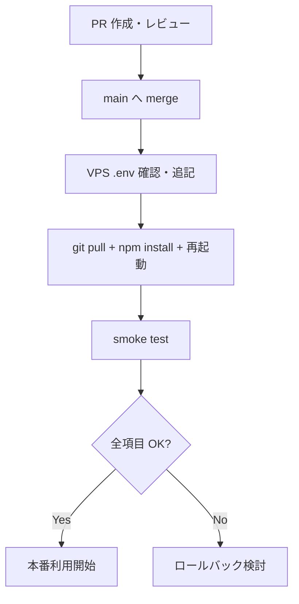

<!-- Generated by SpecStory, Markdown v2.1.0 -->

# 2026-07-02 14:26:43Z

<!-- Cursor IDE Session 16129b2d-cad9-4814-9ff6-59aff3853a91 (2026-07-02 14:26:43Z) -->

_**User**_

stepbyte-api-server の AI Gateway 本番化ブランチを push 済みです。

# 現状

- ブランチ: 2026-06-29-w1b6
- リモート: origin/2026-06-29-w1b6
- 最新コミット: 2191777
- main への merge: 未実施
- VPS 反映: 未実施

# 依頼

VPS 反映前に、PR作成・merge・VPS反映の安全な手順を整理してください。

確認してほしいこと:

1. このブランチを main に merge してよい状態か
2. GitHub PRで確認すべき差分
3. VPSが main を pull する運用で問題ないか
4. VPS反映前に .env に追加・確認すべき値
   - HOST=127.0.0.1
   - PORT=3000
   - AI_GENERATION_ENABLED=true
   - OPENAI_API_KEY
   - ROOM_MANAGEMENT_AI_GATEWAY_KEY
   - AI_RATE_LIMIT_PER_IP_PER_DAY
   - AI_RATE_LIMIT_GLOBAL_PER_DAY
5. VPS反映コマンド
6. 反映後の確認コマンド
7. 既存の楽天APIプロキシ・StepPost・AI Gateway の smoke test 項目

まだ main merge / VPS反映は実行しないでください。
手順だけ整理してください。

---

_**Agent (default)**_

<think><details><summary>Thought Process</summary>
stepbyte-api-server の AI Gateway 本番ブランチを main へ merge し、VPS に反映する安全な手順を整理する。まずブランチの状態と差分を確認する。</details></think>

_**Agent (default)**_

ブランチの状態とデプロイ手順を確認するため、リポジトリを調査します。


_**Agent (default)**_

<tool-use data-tool-type="shell" data-tool-name="run_terminal_command_v2">
<details><summary>Tool use: **run_terminal_command_v2** • Run command: cd "c:\dev\app_project\stepbyte-api-server" && git status && git branch -a && git log --oneline -10</summary>

```bash
cd "c:\dev\app_project\stepbyte-api-server" && git status && git branch -a && git log --oneline -10
```

```
On branch 2026-06-29-w1b6
Your branch is up to date with 'origin/2026-06-29-w1b6'.

nothing to commit, working tree clean
* 2026-06-29-w1b6
  main
  plan-defaults
  rakuten-api-params
  remotes/origin/2026-06-29-w1b6
  remotes/origin/HEAD -&gt; origin/main
  remotes/origin/main
  remotes/origin/rakuten-api-params
2191777 Refactor server configuration to use dynamic host and port settings. Update &#96;.env.example&#96; to include HOST variable for binding address. Enhance server startup logging to display both host and port.
9bbc669 Configure proxy-aware AI gateway rate limiting
7e1c874 Implement AI generation status handling and rate limiting for room post comments. Update &#96;buildRoomPostComment&#96; to return a structured error response when AI generation is disabled. Enhance OpenAI client with request timeout handling. Introduce rate limit checks in the AI route, returning appropriate status codes for rate limit exceeded and AI generation disabled scenarios. Extend tests to validate new error handling and rate limiting functionality.
10fa18e Enhance room post comment generation by integrating comment angle and variation seed handling. Update prompt instructions to clarify the use of raw titles and the prohibition of generic hashtags. Introduce new validation for comment angles and variation seeds in generation options. Extend tests to validate the updated prompt generation and ensure robust handling of user style and comment structure.
901fb72 Refactor room post comment generation logic to prioritize product-specific hashtags and improve validation. Update prompt instructions to emphasize natural language use and avoid generic tags. Introduce new functions for handling display titles and title keywords, enhancing the overall comment structure. Extend tests to validate the updated prompt generation and hashtag handling.
53a5460 Refactor room post comment prompt builder to enhance user style instructions and validation. Update tone, length, emoji, hashtag, and focus point labels to instructions for clearer guidance. Introduce example text handling in user style validation, ensuring proper string format and length constraints. Extend tests to validate new instruction formats and example text scenarios.
b95dd4f Enhance LLM integration for room post comments by adding JSON parsing and validation functions. Introduce &#96;parseJsonFromLlmText&#96; and &#96;validateRoomPostCommentLlmOutput&#96; to ensure proper structure and content of LLM responses. Update &#96;buildRoomPostComment&#96; to conditionally generate comments using LLM or mock data based on configuration. Extend tests to cover new validation scenarios and ensure robust error handling for LLM outputs.
6386885 Implement room management AI task handling for room_post_comment. Introduce task handler logic and update runRoomTask function to support dynamic task execution. Add tests for room_post_comment to validate successful responses, error handling, and authentication scenarios.
07f645d Refactor catchCopy handling in post plan normalization. Introduce functions to determine when to replace catchCopy based on tone and item benefit. Update tests to validate new catchCopy resolution logic and ensure proper fallback behavior.
59044b2 Implement role normalization and validation enhancements in step post processing. Introduce functions for normalizing slide roles and ensuring slot values are initialized. Update validation logic to include new error codes for missing slot values and improve error reporting. Extend tests to cover new validation scenarios and ensure proper handling of generated post plans.

```
</details>
</tool-use>

<tool-use data-tool-type="shell" data-tool-name="run_terminal_command_v2"><details>
<summary>Tool use: **run_terminal_command_v2**</summary>

</details></tool-use>

_**Agent (default)**_

<tool-use data-tool-type="search" data-tool-name="glob_file_search">
<details>
<summary>Tool use: **glob_file_search** • Searched codebase "" • **52** results in **1** directory</summary>

Directory: **c:\dev\app_project\stepbyte-api-server** (52 files)

| File |
|------|
| `../.env.example` |
| `../tests\roomPostCommentRequestValidator.test.js` |
| `../services/llm/llmClient.js` |
| `../services/llm/aiGenerationMeta.js` |
| `../services/llm/openAiClient.js` |
| `../services\aiTasks\roomPostCommentDefaults.js` |
| `../routes/ai.js` |
| `../services/llm/stepPostPromptBuilder.js` |
| `../tests/checkStepPostLlmQuality.test.js` |
| `../scripts/vps-update.sh` |
| `../package.json` |
| `../scripts/stepPostLlmQualityCheck.js` |
| `../services\llm\roomPostCommentCommentAngle.js` |
| `../services\llm\roomPostCommentPromptBuilder.js` |
| `../tests\roomPostCommentLlmGenerator.test.js` |
| `../services\llm\roomPostCommentOutputFormatter.js` |
| `../middleware\aiRateLimit.js` |
| `../services\llm\roomPostCommentLlmGenerator.js` |
| `../services\aiTasks\roomPostCommentTask.js` |
| `../middleware/requestId.js` |
| `../services/llm/stepPostJsonValidator.js` |
| `../services\llm\roomPostCommentJsonValidator.js` |
| `../tests/stepPostJsonValidator.test.js` |
| `../middleware/aiAuth.js` |
| `../services/llm/stepPostPlanNormalizer.js` |
| `../services/aiGatewayService.js` |
| `../services\llm\roomPostCommentConstants.js` |
| `../tests\roomPostCommentOutputFormatter.test.js` |
| `../schemas/aiResponseSchema.js` |
| `../services/aiTasks/stepPostDefaults.js` |
| `../tests/stepPostPromptBuilder.test.js` |
| `../tests\aiRateLimit.test.js` |
| `../tests\roomPostCommentPromptBuilder.test.js` |
| `../services\aiTasks\roomTasks.js` |
| `../config\serverListen.js` |
| `../tests\serverListen.test.js` |
| `../services\llm\openAiClient.js` |
| `../tests\aiGateway.test.js` |
| `../routes\ai.js` |
| `../.gitignore` |
| `../schemas/aiRequestSchema.js` |
| `../tests/aiGateway.test.js` |
| `../scripts/check-step-post-llm-quality.js` |
| `../services/llm/llmConfig.js` |
| `../services\llm\roomPostCommentRequestValidator.js` |
| `../services/aiTasks/stepPostTasks.js` |
| `../services/llm/stepPostLlmGenerator.js` |
| `../tests\roomPostCommentJsonValidator.test.js` |
| `../tests\openAiClient.test.js` |
| `../server.js` |
| `../services/aiTasks/roomTasks.js` |
| `../package-lock.json` |

</details>
</tool-use>

<tool-use data-tool-type="search" data-tool-name="glob_file_search"><details>
<summary>Tool use: **glob_file_search**</summary>

</details></tool-use>

_**Agent (default)**_

<tool-use data-tool-type="unknown" data-tool-name="ripgrep_raw_search">
<details>
<summary>Tool use: **ripgrep_raw_search**</summary>


Parameters:

```json
{
  "caseInsensitive": true,
  "path": "c:\\dev\\app_project\\stepbyte-api-server",
  "pattern": "AI_GATEWAY|AI_GENERATION|ROOM_MANAGEMENT|RATE_LIMIT|deploy|VPS|pm2|systemd"
}
```
Additional data:

```json
{
  "isPruned": true,
  "outputMode": "content",
  "path": "c:\\dev\\app_project\\stepbyte-api-server",
  "pattern": "AI_GATEWAY|AI_GENERATION|ROOM_MANAGEMENT|RATE_LIMIT|deploy|VPS|pm2|systemd",
  "topFiles": [
    {
      "matchCount": 1,
      "uri": "services\\aiTasks\\roomPostCommentTask.js"
    },
    {
      "matchCount": 3,
      "uri": "scripts/check-step-post-llm-quality.js"
    },
    {
      "matchCount": 1,
      "uri": "tests/stepPostPromptBuilder.test.js"
    },
    {
      "matchCount": 1,
      "uri": "services\\aiTasks\\roomTasks.js"
    },
    {
      "matchCount": 2,
      "uri": "middleware/aiAuth.js"
    },
    {
      "matchCount": 62,
      "uri": "tests/aiGateway.test.js"
    },
    {
      "matchCount": 1,
      "uri": "services/aiTasks/roomTasks.js"
    },
    {
      "matchCount": 1,
      "uri": "services/aiTasks/stepPostTasks.js"
    },
    {
      "matchCount": 2,
      "uri": "routes\\ai.js"
    },
    {
      "matchCount": 19,
      "uri": "tests\\aiRateLimit.test.js"
    },
    {
      "matchCount": 1,
      "uri": "services/llm/llmConfig.js"
    },
    {
      "matchCount": 5,
      "uri": ".env.example"
    },
    {
      "matchCount": 2,
      "uri": "services/aiGatewayService.js"
    },
    {
      "matchCount": 8,
      "uri": "scripts/vps-update.sh"
    },
    {
      "matchCount": 4,
      "uri": "middleware\\aiRateLimit.js"
    },
    {
      "matchCount": 62,
      "uri": "tests\\aiGateway.test.js"
    }
  ],
  "totalFiles": 16,
  "totalMatches": 175
}
```
Status: **completed**


</details>
</tool-use>

<tool-use data-tool-type="unknown" data-tool-name="ripgrep_raw_search"><details>
<summary>Tool use: **ripgrep_raw_search**</summary>

</details></tool-use>

_**Agent (default)**_

<tool-use data-tool-type="shell" data-tool-name="run_terminal_command_v2">
<details><summary>Tool use: **run_terminal_command_v2** • Run command: cd "c:\dev\app_project\stepbyte-api-server" && git log main..HEAD --oneline && echo "---" && git diff main...HEAD --stat</summary>

```bash
cd "c:\dev\app_project\stepbyte-api-server" && git log main..HEAD --oneline && echo "---" && git diff main...HEAD --stat
```

```
2191777 Refactor server configuration to use dynamic host and port settings. Update &#96;.env.example&#96; to include HOST variable for binding address. Enhance server startup logging to display both host and port.
9bbc669 Configure proxy-aware AI gateway rate limiting
7e1c874 Implement AI generation status handling and rate limiting for room post comments. Update &#96;buildRoomPostComment&#96; to return a structured error response when AI generation is disabled. Enhance OpenAI client with request timeout handling. Introduce rate limit checks in the AI route, returning appropriate status codes for rate limit exceeded and AI generation disabled scenarios. Extend tests to validate new error handling and rate limiting functionality.
10fa18e Enhance room post comment generation by integrating comment angle and variation seed handling. Update prompt instructions to clarify the use of raw titles and the prohibition of generic hashtags. Introduce new validation for comment angles and variation seeds in generation options. Extend tests to validate the updated prompt generation and ensure robust handling of user style and comment structure.
901fb72 Refactor room post comment generation logic to prioritize product-specific hashtags and improve validation. Update prompt instructions to emphasize natural language use and avoid generic tags. Introduce new functions for handling display titles and title keywords, enhancing the overall comment structure. Extend tests to validate the updated prompt generation and hashtag handling.
53a5460 Refactor room post comment prompt builder to enhance user style instructions and validation. Update tone, length, emoji, hashtag, and focus point labels to instructions for clearer guidance. Introduce example text handling in user style validation, ensuring proper string format and length constraints. Extend tests to validate new instruction formats and example text scenarios.
b95dd4f Enhance LLM integration for room post comments by adding JSON parsing and validation functions. Introduce &#96;parseJsonFromLlmText&#96; and &#96;validateRoomPostCommentLlmOutput&#96; to ensure proper structure and content of LLM responses. Update &#96;buildRoomPostComment&#96; to conditionally generate comments using LLM or mock data based on configuration. Extend tests to cover new validation scenarios and ensure robust error handling for LLM outputs.
---
 .env.example                                    |  10 +-
 config/serverListen.js                          |  33 +++
 middleware/aiRateLimit.js                       |  94 +++++++
 routes/ai.js                                    |  84 +++++-
 server.js                                       |  10 +-
 services/aiTasks/roomPostCommentDefaults.js     | 178 ++++++------
 services/aiTasks/roomPostCommentTask.js         |  49 ++--
 services/aiTasks/roomTasks.js                   |   2 +-
 services/llm/openAiClient.js                    |  55 ++--
 services/llm/roomPostCommentCommentAngle.js     |  89 ++++++
 services/llm/roomPostCommentConstants.js        | 115 ++++++++
 services/llm/roomPostCommentJsonValidator.js    | 106 ++++++-
 services/llm/roomPostCommentLlmGenerator.js     | 138 ++++++++++
 services/llm/roomPostCommentOutputFormatter.js  | 171 +++++++++++-
 services/llm/roomPostCommentPromptBuilder.js    | 314 +++++++++++++++++++++
 services/llm/roomPostCommentRequestValidator.js |  77 +++++-
 tests/aiGateway.test.js                         | 350 +++++++++++++++++++++++-
 tests/aiRateLimit.test.js                       |  88 ++++++
 tests/openAiClient.test.js                      |  43 +++
 tests/roomPostCommentJsonValidator.test.js      |  96 ++++++-
 tests/roomPostCommentLlmGenerator.test.js       | 224 +++++++++++++++
 tests/roomPostCommentOutputFormatter.test.js    |  95 ++++++-
 tests/roomPostCommentPromptBuilder.test.js      | 172 ++++++++++++
 tests/roomPostCommentRequestValidator.test.js   |  62 +++++
 tests/serverListen.test.js                      |  37 +++
 25 files changed, 2530 insertions(+), 162 deletions(-)

```
</details>
</tool-use>

<tool-use data-tool-type="shell" data-tool-name="run_terminal_command_v2"><details>
<summary>Tool use: **run_terminal_command_v2**</summary>

</details></tool-use>

_**Agent (default)**_

<tool-use data-tool-type="read" data-tool-name="read_file_v2">
<details><summary>Tool use: **read_file_v2** • Read file: c:\dev\app_project\stepbyte-api-server\.env.example</summary>

</details>
</tool-use>

<tool-use data-tool-type="read" data-tool-name="read_file_v2"><details>
<summary>Tool use: **read_file_v2**</summary>

</details></tool-use>

_**Agent (default)**_

<tool-use data-tool-type="read" data-tool-name="read_file_v2">
<details><summary>Tool use: **read_file_v2** • Read file: c:\dev\app_project\stepbyte-api-server\scripts\vps-update.sh</summary>

</details>
</tool-use>

<tool-use data-tool-type="read" data-tool-name="read_file_v2"><details>
<summary>Tool use: **read_file_v2**</summary>

</details></tool-use>

_**Agent (default)**_

<tool-use data-tool-type="read" data-tool-name="read_file_v2">
<details><summary>Tool use: **read_file_v2** • Read file: c:\dev\app_project\stepbyte-api-server\server.js</summary>

</details>
</tool-use>

<tool-use data-tool-type="read" data-tool-name="read_file_v2"><details>
<summary>Tool use: **read_file_v2**</summary>

</details></tool-use>

_**Agent (default)**_

<tool-use data-tool-type="read" data-tool-name="read_file_v2">
<details><summary>Tool use: **read_file_v2** • Read file: c:\dev\app_project\stepbyte-api-server\package.json</summary>

</details>
</tool-use>

<tool-use data-tool-type="read" data-tool-name="read_file_v2"><details>
<summary>Tool use: **read_file_v2**</summary>

</details></tool-use>

_**Agent (default)**_

<tool-use data-tool-type="shell" data-tool-name="run_terminal_command_v2">
<details><summary>Tool use: **run_terminal_command_v2** • Run command: cd "c:\dev\app_project\stepbyte-api-server" && npm test 2>&1</summary>

```bash
cd "c:\dev\app_project\stepbyte-api-server" && npm test 2>&1
```

```

&gt; stepbyte-api-server@1.0.0 test
&gt; node --test tests/**/*.test.js

TAP version 13
# ◇ injected env (4) from .env // tip: ⌘ multiple files { path: ['.env.local', '.env'] }
# [step-post-llm] usage: {"promptTokens":625,"completionTokens":327,"totalTokens":952}
# [step-post-llm] normalized: true
# [ai-gateway] {"requestId":"fa654677-4971-4f8d-b855-a26b57093d8d","appId":"step_post","taskId":"instagram_carousel_plan_generate","promptVersion":"v1","success":true,"errorCode":null,"durationMs":4731,"generationMode":"llm","model":"gpt-4o-mini","provider":"openai","promptTokens":625,"completionTokens":327,"totalTokens":952}
# Subtest: POST /ai/generate (本番 nginx 経路)
    # Subtest: 正常リクエストで success true を返す
    ok 1 - 正常リクエストで success true を返す
      ---
      duration_ms: 4797.8528
      type: 'test'
      ...
    1..1
ok 1 - POST /ai/generate (本番 nginx 経路)
  ---
  duration_ms: 4799.4473
  type: 'suite'
  ...
# [ai-gateway] {"requestId":"edcbf787-ebf1-4792-b418-f6edb6183698","appId":"step_post","taskId":"instagram_carousel_plan_generate","promptVersion":"v1","success":true,"errorCode":null,"durationMs":1,"generationMode":"mock"}
# Subtest: POST /api/ai/generate (互換経路)
    # Subtest: 正常リクエストで success true を返す
    ok 1 - 正常リクエストで success true を返す
      ---
      duration_ms: 9.9848
      type: 'test'
      ...
# [ai-gateway] {"requestId":"f3a4925a-e650-44ff-817c-fbfccf8c77b1","appId":"step_post","taskId":"instagram_carousel_plan_generate","promptVersion":"v1","success":true,"errorCode":null,"durationMs":0,"generationMode":"mock"}
    # Subtest: step_post / instagram_carousel_plan_generate で StepPost 用 JSON を返す
    ok 2 - step_post / instagram_carousel_plan_generate で StepPost 用 JSON を返す
      ---
      duration_ms: 9.953
      type: 'test'
      ...
# [ai-gateway] {"requestId":"ea7d28dc-04d2-41ea-8576-79f50399d1d8","appId":"step_post","taskId":"instagram_carousel_plan_generate","promptVersion":"v1","success":true,"errorCode":null,"durationMs":0,"generationMode":"mock"}
    # Subtest: data.slides[].slideRole が cover / item_detail / cta を含む
    ok 3 - data.slides[].slideRole が cover / item_detail / cta を含む
      ---
      duration_ms: 6.4854
      type: 'test'
      ...
# [ai-gateway] {"requestId":"42a609cc-7eb4-4558-b9d7-5912cd5e1172","appId":"step_post","taskId":"instagram_carousel_plan_generate","promptVersion":"v1","success":true,"errorCode":null,"durationMs":0,"generationMode":"mock"}
    # Subtest: payload.items の内容が item_detail に反映される
    ok 4 - payload.items の内容が item_detail に反映される
      ---
      duration_ms: 8.7572
      type: 'test'
      ...
# [ai-gateway] {"requestId":"2ba754bf-6227-4cbb-8e77-338d3142114d","appId":"step_post","taskId":"instagram_carousel_plan_generate","promptVersion":"v1","success":true,"errorCode":null,"durationMs":0,"generationMode":"mock"}
    # Subtest: payload.theme / targetUser / tone が cover と caption に反映される
    ok 5 - payload.theme / targetUser / tone が cover と caption に反映される
      ---
      duration_ms: 5.8298
      type: 'test'
      ...
# [ai-gateway] {"requestId":"d5063fb4-3b5f-4f39-ba0e-16af4d4a4fbd","appId":"step_post","taskId":"instagram_carousel_plan_generate","promptVersion":"v1","success":true,"errorCode":null,"durationMs":0,"generationMode":"mock"}
    # Subtest: payload.items[0].benefit / searchKeyword が item_detail と cta に反映される
    ok 6 - payload.items[0].benefit / searchKeyword が item_detail と cta に反映される
      ---
      duration_ms: 9.9425
      type: 'test'
      ...
# [ai-gateway] {"requestId":"c7a9187b-dd8f-4834-b1ee-57e2448dce93","appId":"step_post","taskId":"instagram_carousel_plan_generate","promptVersion":"v1","success":true,"errorCode":null,"durationMs":0,"generationMode":"mock"}
    # Subtest: payload.ctaPattern が data.ctaPattern に反映される
    ok 7 - payload.ctaPattern が data.ctaPattern に反映される
      ---
      duration_ms: 5.9926
      type: 'test'
      ...
# [ai-gateway] {"requestId":"d68ff695-7b5b-4704-9608-b19aa1e0370b","appId":"step_post","taskId":"instagram_carousel_plan_generate","promptVersion":"v1","success":true,"errorCode":null,"durationMs":1,"generationMode":"mock"}
    # Subtest: payload が空でも success true でデフォルト値レスポンスが返る
    ok 8 - payload が空でも success true でデフォルト値レスポンスが返る
      ---
      duration_ms: 11.3557
      type: 'test'
      ...
# [ai-gateway] {"requestId":"7c9df63f-1e7c-4b17-b0d6-873f63a7eb60","appId":null,"taskId":"instagram_carousel_plan_generate","promptVersion":"v1","success":false,"errorCode":"MISSING_APP_ID","durationMs":0}
    # Subtest: appId 未指定でエラーになる
    ok 9 - appId 未指定でエラーになる
      ---
      duration_ms: 6.1381
      type: 'test'
      ...
# [ai-gateway] {"requestId":"a71bb1b1-146e-40d5-bfde-134639c869b0","appId":"step_post","taskId":null,"promptVersion":"v1","success":false,"errorCode":"MISSING_TASK_ID","durationMs":0}
    # Subtest: taskId 未指定でエラーになる
    ok 10 - taskId 未指定でエラーになる
      ---
      duration_ms: 7.1947
      type: 'test'
      ...
# [ai-gateway] {"requestId":"a477cdc0-7723-4c79-8198-0c2d791fe8bd","appId":"step_post","taskId":"unknown_task","promptVersion":"v1","success":false,"errorCode":"UNSUPPORTED_TASK","durationMs":0}
    # Subtest: 未対応 taskId で success false になる
    ok 11 - 未対応 taskId で success false になる
      ---
      duration_ms: 6.2251
      type: 'test'
      ...
# [ai-gateway] {"requestId":"fddf6182-f667-40f8-8321-c6596e6b0359","appId":"unknown_app","taskId":"instagram_carousel_plan_generate","promptVersion":"v1","success":false,"errorCode":"UNSUPPORTED_APP","durationMs":0}
    # Subtest: 未対応 appId で success false になる
    ok 12 - 未対応 appId で success false になる
      ---
      duration_ms: 6.5996
      type: 'test'
      ...
    # Subtest: JSON 不正で落ちない
    ok 13 - JSON 不正で落ちない
      ---
      duration_ms: 6.936
      type: 'test'
      ...
# [ai-gateway] {"requestId":"a70a094f-ac09-4035-8534-fe922903c49c","appId":"step_post","taskId":"instagram_carousel_plan_generate","promptVersion":"v1","success":true,"errorCode":null,"durationMs":1,"generationMode":"mock"}
    # Subtest: promptVersion 未指定時は v1 になる
    ok 14 - promptVersion 未指定時は v1 になる
      ---
      duration_ms: 6.9601
      type: 'test'
      ...
# [ai-gateway] {"requestId":"57a0e995-0b41-4609-bd71-5bc76005022b","appId":"step_post","taskId":"instagram_carousel_plan_generate","promptVersion":"v1","success":true,"errorCode":null,"durationMs":0,"generationMode":"mock"}
    # Subtest: 正しい x-stepbyte-app-key がある場合 success true を返す
    ok 15 - 正しい x-stepbyte-app-key がある場合 success true を返す
      ---
      duration_ms: 8.2174
      type: 'test'
      ...
# [ai-gateway] {"requestId":"12ad836e-a4ee-46d2-a42e-9173ee25a9d9","appId":"step_post","taskId":"instagram_carousel_plan_generate","promptVersion":"v1","success":false,"errorCode":"UNAUTHORIZED","durationMs":0}
    # Subtest: x-stepbyte-app-key がない場合 401 / UNAUTHORIZED を返す
    ok 16 - x-stepbyte-app-key がない場合 401 / UNAUTHORIZED を返す
      ---
      duration_ms: 6.0141
      type: 'test'
      ...
# [ai-gateway] {"requestId":"ca2cc20e-1874-4f58-927d-5e2baef96a4b","appId":"step_post","taskId":"instagram_carousel_plan_generate","promptVersion":"v1","success":false,"errorCode":"UNAUTHORIZED","durationMs":1}
    # Subtest: x-stepbyte-app-key が不一致の場合 401 / UNAUTHORIZED を返す
    ok 17 - x-stepbyte-app-key が不一致の場合 401 / UNAUTHORIZED を返す
      ---
      duration_ms: 8.0196
      type: 'test'
      ...
    # Subtest: 認証失敗ログに API キー値が含まれない
    ok 18 - 認証失敗ログに API キー値が含まれない
      ---
      duration_ms: 7.6581
      type: 'test'
      ...
    1..18
ok 2 - POST /api/ai/generate (互換経路)
  ---
  duration_ms: 140.0527
  type: 'suite'
  ...
# Subtest: 既存 API 互換
    # Subtest: GET / は従来どおり動作する
    ok 1 - GET / は従来どおり動作する
      ---
      duration_ms: 8.0164
      type: 'test'
      ...
    # Subtest: GET /rakuten は keyword 未指定で 400 を返す
    ok 2 - GET /rakuten は keyword 未指定で 400 を返す
      ---
      duration_ms: 6.8697
      type: 'test'
      ...
    1..2
ok 3 - 既存 API 互換
  ---
  duration_ms: 15.2033
  type: 'suite'
  ...
# [ai-gateway] {"requestId":"473c707b-d632-47dc-bc9d-0919e0db6a2c","appId":"step_post","taskId":"instagram_carousel_plan_generate","promptVersion":"v1","success":true,"errorCode":null,"durationMs":1,"generationMode":"mock"}
# Subtest: StepPost LLM 切替
    # Subtest: AI_GENERATION_ENABLED=false の場合、従来モックが返る
    ok 1 - AI_GENERATION_ENABLED=false の場合、従来モックが返る
      ---
      duration_ms: 10.3438
      type: 'test'
      ...
# [ai-gateway] {"requestId":"c07867b6-5163-4405-95ca-6f8492e33dc9","appId":"step_post","taskId":"instagram_carousel_plan_generate","promptVersion":"v1","success":true,"errorCode":null,"durationMs":0,"generationMode":"mock"}
    # Subtest: AI_GENERATION_ENABLED 未設定の場合、従来モックが返る
    ok 2 - AI_GENERATION_ENABLED 未設定の場合、従来モックが返る
      ---
      duration_ms: 6.8135
      type: 'test'
      ...
# [step-post-llm] validationErrorCode: missing_slides
# [step-post-llm] normalized: true
# [step-post-llm] usage: {"promptTokens":500,"completionTokens":120,"totalTokens":620}
# [ai-gateway] {"requestId":"33720e3a-f77c-4ac8-ae7a-b9a336d54932","appId":"step_post","taskId":"instagram_carousel_plan_generate","promptVersion":"v1","success":true,"errorCode":null,"durationMs":1,"generationMode":"mock_fallback","model":"gpt-4o-mini","provider":"openai","promptTokens":500,"completionTokens":120,"totalTokens":620,"fallbackReason":"validation_failed"}
    # Subtest: LLM レスポンス不正時に fallback mock が返る
    ok 3 - LLM レスポンス不正時に fallback mock が返る
      ---
      duration_ms: 13.9028
      type: 'test'
      ...
# [step-post-llm] validationErrorCode: invalid_hashtag_count
# [step-post-llm] normalized: false
# [step-post-llm] usage: {"promptTokens":800,"completionTokens":280,"totalTokens":1080}
# [ai-gateway] {"requestId":"82bc3543-ad1e-47d8-a846-2d2a16f117b7","appId":"step_post","taskId":"instagram_carousel_plan_generate","promptVersion":"v1","success":true,"errorCode":null,"durationMs":0,"generationMode":"mock_fallback","model":"gpt-4o-mini","provider":"openai","promptTokens":800,"completionTokens":280,"totalTokens":1080,"fallbackReason":"validation_failed"}
    # Subtest: validation_failed fallback 時に meta.validationErrorCode が入る
    ok 4 - validation_failed fallback 時に meta.validationErrorCode が入る
      ---
      duration_ms: 6.4232
      type: 'test'
      ...
    # Subtest: validation_failed 時のログに validationErrorCode のみ出し、APIキーとLLM全文を出さない
    ok 5 - validation_failed 時のログに validationErrorCode のみ出し、APIキーとLLM全文を出さない
      ---
      duration_ms: 10.6149
      type: 'test'
      ...
    # Subtest: AI_DEBUG_LLM_VALIDATION=true のとき構造サマリのみログ出力する
    ok 6 - AI_DEBUG_LLM_VALIDATION=true のとき構造サマリのみログ出力する
      ---
      duration_ms: 17.3147
      type: 'test'
      ...
# [step-post-llm] fallback reason: llm_request_failed
# [ai-gateway] {"requestId":"1dfb4e0d-b882-4df4-8118-8a9dd56fa1ec","appId":"step_post","taskId":"instagram_carousel_plan_generate","promptVersion":"v1","success":true,"errorCode":null,"durationMs":1,"generationMode":"mock_fallback","model":"gpt-4o-mini","provider":"openai","fallbackReason":"llm_request_failed"}
    # Subtest: LLM 通信エラー時に fallback mock が返る
    ok 7 - LLM 通信エラー時に fallback mock が返る
      ---
      duration_ms: 8.0824
      type: 'test'
      ...
# [step-post-llm] usage: {"promptTokens":800,"completionTokens":300,"totalTokens":1100}
# [ai-gateway] {"requestId":"294b882e-e429-4112-8eeb-2d72838c8507","appId":"step_post","taskId":"instagram_carousel_plan_generate","promptVersion":"v1","success":true,"errorCode":null,"durationMs":0,"generationMode":"llm","model":"gpt-4o-mini","provider":"openai","promptTokens":800,"completionTokens":300,"totalTokens":1100}
    # Subtest: LLM 成功時は generationMode llm の meta を返す
    ok 8 - LLM 成功時は generationMode llm の meta を返す
      ---
      duration_ms: 7.5586
      type: 'test'
      ...
# [step-post-llm] usage: {"promptTokens":700,"completionTokens":250,"totalTokens":950}
# [step-post-llm] normalized: true
# [ai-gateway] {"requestId":"0100d223-3c05-44a7-b3f3-d319dd16f966","appId":"step_post","taskId":"instagram_carousel_plan_generate","promptVersion":"v1","success":true,"errorCode":null,"durationMs":1,"generationMode":"llm","model":"gpt-4o-mini","provider":"openai","promptTokens":700,"completionTokens":250,"totalTokens":950}
    # Subtest: root 項目欠落 LLM 出力は normalize 後 llm として採用される
    ok 9 - root 項目欠落 LLM 出力は normalize 後 llm として採用される
      ---
      duration_ms: 6.5506
      type: 'test'
      ...
# [step-post-llm] normalized: true
# [ai-gateway] {"requestId":"97031391-33f8-4fb7-af00-ed1a18c57c59","appId":"step_post","taskId":"instagram_carousel_plan_generate","promptVersion":"v1","success":true,"errorCode":null,"durationMs":1,"generationMode":"llm","model":"gpt-4o-mini","provider":"openai"}
    # Subtest: 空 ctaText は normalize で補完され llm として採用される
    ok 10 - 空 ctaText は normalize で補完され llm として採用される
      ---
      duration_ms: 13.9239
      type: 'test'
      ...
# [ai-gateway] {"requestId":"36596a5e-933c-439b-bfd3-23c4e6a30596","appId":"step_post","taskId":"instagram_carousel_plan_generate","promptVersion":"v1","success":true,"errorCode":null,"durationMs":0,"generationMode":"llm","model":"gpt-4o-mini","provider":"openai"}
    # Subtest: usage がない場合でも meta.usage を省略して成功する
    ok 11 - usage がない場合でも meta.usage を省略して成功する
      ---
      duration_ms: 9.4456
      type: 'test'
      ...
    1..11
ok 4 - StepPost LLM 切替
  ---
  duration_ms: 112.8944
  type: 'suite'
  ...
# [ai-gateway] {"requestId":"0697768d-bc08-44a2-8ac9-012477ab2d0c","appId":"room_management","taskId":"room_post_comment","promptVersion":"v1","success":true,"errorCode":null,"durationMs":28,"generationMode":"llm","model":"gpt-4o-mini","promptTokens":100,"completionTokens":50,"totalTokens":150}
# Subtest: room_management / room_post_comment
    # Subtest: 正常系で 200 を返し data.body / hashtags / full_text を含む
    ok 1 - 正常系で 200 を返し data.body / hashtags / full_text を含む
      ---
      duration_ms: 34.1225
      type: 'test'
      ...
# [ai-gateway] {"requestId":"06e80a1b-8c88-4a83-8b0b-7e71698d4c12","appId":"room_management","taskId":"room_post_comment","promptVersion":"v1","success":true,"errorCode":null,"durationMs":1,"generationMode":"llm","model":"gpt-4o-mini","promptTokens":100,"completionTokens":50,"totalTokens":150}
    # Subtest: profile_context なしでも 200
    ok 2 - profile_context なしでも 200
      ---
      duration_ms: 5.6535
      type: 'test'
      ...
# [ai-gateway] {"requestId":"2ba6decb-df34-4b1f-9777-862349235d44","appId":"room_management","taskId":"room_post_comment","promptVersion":"v1","success":false,"errorCode":"MISSING_PRODUCT_TITLE","durationMs":1}
    # Subtest: title 欠損で 400 MISSING_PRODUCT_TITLE
    ok 3 - title 欠損で 400 MISSING_PRODUCT_TITLE
      ---
      duration_ms: 8.3139
      type: 'test'
      ...
# [ai-gateway] {"requestId":"1605c15b-b479-493c-a6d3-17295850566b","appId":"room_management","taskId":"room_post_comment","promptVersion":"v1","success":false,"errorCode":"UNAUTHORIZED","durationMs":0}
    # Subtest: 認証なしで 401
    ok 4 - 認証なしで 401
      ---
      duration_ms: 4.5436
      type: 'test'
      ...
# [ai-gateway] {"requestId":"4cc8acc2-64f8-4db8-ac4d-53db428fdd5b","appId":"room_management","taskId":"unknown_room_task","promptVersion":"v1","success":false,"errorCode":"UNSUPPORTED_TASK","durationMs":0}
    # Subtest: 未対応 taskId で 400 UNSUPPORTED_TASK
    ok 5 - 未対応 taskId で 400 UNSUPPORTED_TASK
      ---
      duration_ms: 5.9298
      type: 'test'
      ...
# [ai-gateway] {"requestId":"dc201f0a-3dbc-4e24-a813-9b28a0fbdcf2","appId":"room_management","taskId":"room_post_comment","promptVersion":"v2","success":false,"errorCode":"UNSUPPORTED_PROMPT_VERSION","durationMs":0}
    # Subtest: promptVersion が v2 なら 400 UNSUPPORTED_PROMPT_VERSION
    ok 6 - promptVersion が v2 なら 400 UNSUPPORTED_PROMPT_VERSION
      ---
      duration_ms: 8.6223
      type: 'test'
      ...
    1..6
ok 5 - room_management / room_post_comment
  ---
  duration_ms: 67.6689
  type: 'suite'
  ...
# [ai-gateway] {"requestId":"a6bb35dc-e9f2-4844-b69f-dd686c3bd7aa","appId":"room_management","taskId":"room_post_comment","promptVersion":"v1","success":false,"errorCode":"AI_GENERATION_DISABLED","durationMs":0}
# Subtest: RoomPostComment LLM 切替
    # Subtest: AI_GENERATION_ENABLED=false では 503 AI_GENERATION_DISABLED
    ok 1 - AI_GENERATION_ENABLED=false では 503 AI_GENERATION_DISABLED
      ---
      duration_ms: 6.1952
      type: 'test'
      ...
# [ai-gateway] {"requestId":"7ddbe6b8-e1e6-43c6-8cb0-b832861fe206","appId":"room_management","taskId":"room_post_comment","promptVersion":"v1","success":true,"errorCode":null,"durationMs":0,"generationMode":"llm","model":"gpt-4o-mini","promptTokens":200,"completionTokens":80,"totalTokens":280}
    # Subtest: AI_GENERATION_ENABLED=true で OpenAI 成功時 llm
    ok 2 - AI_GENERATION_ENABLED=true で OpenAI 成功時 llm
      ---
      duration_ms: 8.1292
      type: 'test'
      ...
# [ai-gateway] {"requestId":"d6ebba02-3e52-4c2f-b819-481b5bb3e9ff","appId":"room_management","taskId":"room_post_comment","promptVersion":"v1","success":false,"errorCode":"INVALID_LLM_JSON","durationMs":1}
    # Subtest: OpenAI 不正 JSON 時 400 INVALID_LLM_JSON
    ok 3 - OpenAI 不正 JSON 時 400 INVALID_LLM_JSON
      ---
      duration_ms: 5.1803
      type: 'test'
      ...
# [ai-gateway] {"requestId":"320982b1-3096-4d5d-ba05-33f374e2d2de","appId":"room_management","taskId":"room_post_comment","promptVersion":"v1","success":false,"errorCode":"LLM_REQUEST_FAILED","durationMs":0}
    # Subtest: OpenAI エラー時 400 LLM_REQUEST_FAILED
    ok 4 - OpenAI エラー時 400 LLM_REQUEST_FAILED
      ---
      duration_ms: 5.6302
      type: 'test'
      ...
# [ai-gateway] {"requestId":"06e0bf33-af65-436d-aa7d-087b5137a88b","appId":"room_management","taskId":"room_post_comment","promptVersion":"v1","success":false,"errorCode":"LLM_NOT_CONFIGURED","durationMs":1}
    # Subtest: API キー未設定時 400 LLM_NOT_CONFIGURED
    ok 5 - API キー未設定時 400 LLM_NOT_CONFIGURED
      ---
      duration_ms: 6.9387
      type: 'test'
      ...
    1..5
ok 6 - RoomPostComment LLM 切替
  ---
  duration_ms: 32.5975
  type: 'suite'
  ...
# [ai-gateway] {"requestId":"32bbb6f2-4170-4371-8886-57801f85bfaf","appId":"room_management","taskId":"room_post_comment","promptVersion":"v1","success":false,"errorCode":"AI_GENERATION_DISABLED","durationMs":0}
# [ai-gateway] {"requestId":"29305186-2d74-4a47-b687-76d116de5ebc","appId":"room_management","taskId":"room_post_comment","promptVersion":"v1","success":false,"errorCode":"AI_GENERATION_DISABLED","durationMs":0}
# [ai-gateway] {"requestId":"aec22fec-3d15-40ea-ae01-dac071b26c5c","appId":"room_management","taskId":"room_post_comment","promptVersion":"v1","success":false,"errorCode":"RATE_LIMIT_EXCEEDED","scope":"ip","durationMs":0}
# Subtest: AI rate limit
    # Subtest: returns 429 RATE_LIMIT_EXCEEDED when per-IP limit is exceeded
    ok 1 - returns 429 RATE_LIMIT_EXCEEDED when per-IP limit is exceeded
      ---
      duration_ms: 17.772
      type: 'test'
      ...
# [ai-gateway] {"requestId":"99b902fd-c6a0-472f-9ba8-a4326c9c2640","appId":"room_management","taskId":"room_post_comment","promptVersion":"v1","success":false,"errorCode":"UNAUTHORIZED","durationMs":0}
# [ai-gateway] {"requestId":"cda8b421-cd97-42ea-b949-1d392b39f131","appId":"room_management","taskId":"room_post_comment","promptVersion":"v1","success":false,"errorCode":"UNAUTHORIZED","durationMs":0}
# [ai-gateway] {"requestId":"3f2c45af-3af6-4fcc-9067-2f9ecd5bfcb1","appId":"room_management","taskId":"room_post_comment","promptVersion":"v1","success":false,"errorCode":"UNAUTHORIZED","durationMs":0}
# [ai-gateway] {"requestId":"e73b0f21-5d13-430b-9422-75318ec9f7d0","appId":"room_management","taskId":"room_post_comment","promptVersion":"v1","success":false,"errorCode":"AI_GENERATION_DISABLED","durationMs":0}
    # Subtest: does not count failed auth requests toward rate limit
    ok 2 - does not count failed auth requests toward rate limit
      ---
      duration_ms: 31.2674
      type: 'test'
      ...
# [ai-gateway] {"requestId":"42636620-3186-4f91-9d6d-0d7968ec4197","appId":"room_management","taskId":"room_post_comment","promptVersion":"v1","success":false,"errorCode":"AI_GENERATION_DISABLED","durationMs":0}
# [ai-gateway] {"requestId":"3dc59d28-60d6-4fdb-a6c3-de9edfb57781","appId":"room_management","taskId":"room_post_comment","promptVersion":"v1","success":false,"errorCode":"AI_GENERATION_DISABLED","durationMs":0}
# [ai-gateway] {"requestId":"a3f7d1c2-15ce-4b4e-8933-a090f545290b","appId":"room_management","taskId":"room_post_comment","promptVersion":"v1","success":false,"errorCode":"RATE_LIMIT_EXCEEDED","scope":"ip","durationMs":0}
    # Subtest: counts different X-Forwarded-For values as separate IPs
    ok 3 - counts different X-Forwarded-For values as separate IPs
      ---
      duration_ms: 21.8047
      type: 'test'
      ...
# [ai-gateway] {"requestId":"f759f849-7ef1-45ca-ad44-bc78bbdf52da","appId":"room_management","taskId":"room_post_comment","promptVersion":"v1","success":false,"errorCode":"AI_GENERATION_DISABLED","durationMs":0}
# [ai-gateway] {"requestId":"083b9278-b9d4-4630-8146-88b516f3a16b","appId":"room_management","taskId":"room_post_comment","promptVersion":"v1","success":false,"errorCode":"AI_GENERATION_DISABLED","durationMs":0}
# [ai-gateway] {"requestId":"7a6fb3fc-6134-4193-9889-de1d34016f0f","appId":"room_management","taskId":"room_post_comment","promptVersion":"v1","success":false,"errorCode":"RATE_LIMIT_EXCEEDED","scope":"ip","durationMs":1}
    # Subtest: counts same X-Forwarded-For as the same IP
    ok 4 - counts same X-Forwarded-For as the same IP
      ---
      duration_ms: 26.5005
      type: 'test'
      ...
    1..4
ok 7 - AI rate limit
  ---
  duration_ms: 97.7557
  type: 'suite'
  ...
# Subtest: aiRateLimit
    # Subtest: allows requests under default limits
    ok 1 - allows requests under default limits
      ---
      duration_ms: 7.85
      type: 'test'
      ...
    # Subtest: blocks when per-IP daily limit is exceeded
    ok 2 - blocks when per-IP daily limit is exceeded
      ---
      duration_ms: 0.8722
      type: 'test'
      ...
    # Subtest: blocks when global daily limit is exceeded
    ok 3 - blocks when global daily limit is exceeded
      ---
      duration_ms: 2.4712
      type: 'test'
      ...
    # Subtest: tracks different IPs separately
    ok 4 - tracks different IPs separately
      ---
      duration_ms: 1.1569
      type: 'test'
      ...
    # Subtest: buildRateLimitFailureBody returns RATE_LIMIT_EXCEEDED
    ok 5 - buildRateLimitFailureBody returns RATE_LIMIT_EXCEEDED
      ---
      duration_ms: 1.2767
      type: 'test'
      ...
    # Subtest: parseLimitEnv falls back to default for invalid values
    ok 6 - parseLimitEnv falls back to default for invalid values
      ---
      duration_ms: 0.3415
      type: 'test'
      ...
    1..6
ok 8 - aiRateLimit
  ---
  duration_ms: 16.6228
  type: 'suite'
  ...
# ◇ injected env (5) from .env // tip: ⌁ auth for agents [www.vestauth.com]
# Subtest: stepPostLlmQualityCheck
    # Subtest: 正常ケースで quality check が OK を返す
    ok 1 - 正常ケースで quality check が OK を返す
      ---
      duration_ms: 2.3466
      type: 'test'
      ...
    # Subtest: caption が空なら NG になる
    ok 2 - caption が空なら NG になる
      ---
      duration_ms: 0.4824
      type: 'test'
      ...
    # Subtest: hashtags が2件なら NG になる
    ok 3 - hashtags が2件なら NG になる
      ---
      duration_ms: 0.4491
      type: 'test'
      ...
    # Subtest: itemName 不一致なら NG になる
    ok 4 - itemName 不一致なら NG になる
      ---
      duration_ms: 0.4
      type: 'test'
      ...
    # Subtest: usage がある場合は formatCaseReport に token 数を表示する
    ok 5 - usage がある場合は formatCaseReport に token 数を表示する
      ---
      duration_ms: 1.0782
      type: 'test'
      ...
    # Subtest: usage がない場合は formatCaseReport に n/a を表示する
    ok 6 - usage がない場合は formatCaseReport に n/a を表示する
      ---
      duration_ms: 0.8908
      type: 'test'
      ...
    # Subtest: formatUsageLine は usage なしでも n/a を返す
    ok 7 - formatUsageLine は usage なしでも n/a を返す
      ---
      duration_ms: 0.3554
      type: 'test'
      ...
    # Subtest: fallback true の場合に警告表示できる
    ok 8 - fallback true の場合に警告表示できる
      ---
      duration_ms: 1.0842
      type: 'test'
      ...
    # Subtest: normalized true の場合は formatCaseReport に表示する
    ok 9 - normalized true の場合は formatCaseReport に表示する
      ---
      duration_ms: 0.8697
      type: 'test'
      ...
    1..9
ok 9 - stepPostLlmQualityCheck
  ---
  duration_ms: 15.9166
  type: 'suite'
  ...
# Subtest: check-step-post-llm-quality script
    # Subtest: スクリプトが構文エラーなく読み込める
    ok 1 - スクリプトが構文エラーなく読み込める
      ---
      duration_ms: 39.2384
      type: 'test'
      ...
    1..1
ok 10 - check-step-post-llm-quality script
  ---
  duration_ms: 39.5927
  type: 'suite'
  ...
# Subtest: openAiClient timeout
    # Subtest: aborts fetch after default 25 second timeout
    ok 1 - aborts fetch after default 25 second timeout
      ---
      duration_ms: 57.2085
      type: 'test'
      ...
    1..1
ok 11 - openAiClient timeout
  ---
  duration_ms: 66.1365
  type: 'suite'
  ...
# Subtest: roomPostCommentJsonValidator / sanitizeBannedExpressions
    # Subtest: 禁止表現を除去または置換する
    ok 1 - 禁止表現を除去または置換する
      ---
      duration_ms: 2.1706
      type: 'test'
      ...
    # Subtest: レビュー件数・評価点表現を sanitize する
    ok 2 - レビュー件数・評価点表現を sanitize する
      ---
      duration_ms: 0.5949
      type: 'test'
      ...
    # Subtest: 具体価格表現を sanitize する
    ok 3 - 具体価格表現を sanitize する
      ---
      duration_ms: 0.46
      type: 'test'
      ...
    # Subtest: 販促文言を sanitize する
    ok 4 - 販促文言を sanitize する
      ---
      duration_ms: 0.2383
      type: 'test'
      ...
    # Subtest: 問題ない文は変更しない
    ok 5 - 問題ない文は変更しない
      ---
      duration_ms: 0.2296
      type: 'test'
      ...
    1..5
ok 12 - roomPostCommentJsonValidator / sanitizeBannedExpressions
  ---
  duration_ms: 6.9165
  type: 'suite'
  ...
# Subtest: roomPostCommentJsonValidator / sanitizeExperienceClaims
    # Subtest: 実体験表現を除去する
    ok 1 - 実体験表現を除去する
      ---
      duration_ms: 0.2175
      type: 'test'
      ...
    1..1
ok 13 - roomPostCommentJsonValidator / sanitizeExperienceClaims
  ---
  duration_ms: 0.3643
  type: 'suite'
  ...
# Subtest: roomPostCommentJsonValidator / parseJsonFromLlmText
    # Subtest: JSON オブジェクトをパースする
    ok 1 - JSON オブジェクトをパースする
      ---
      duration_ms: 1.1963
      type: 'test'
      ...
    # Subtest: フェンス付き JSON をパースする
    ok 2 - フェンス付き JSON をパースする
      ---
      duration_ms: 0.5825
      type: 'test'
      ...
    1..2
ok 14 - roomPostCommentJsonValidator / parseJsonFromLlmText
  ---
  duration_ms: 2.2798
  type: 'suite'
  ...
# Subtest: roomPostCommentJsonValidator / validateRoomPostCommentLlmOutput
    # Subtest: body / hashtags 正常系
    ok 1 - body / hashtags 正常系
      ---
      duration_ms: 3.8846
      type: 'test'
      ...
    # Subtest: hashtags 欠損は空配列
    ok 2 - hashtags 欠損は空配列
      ---
      duration_ms: 2.6722
      type: 'test'
      ...
    # Subtest: body 欠損は MISSING_BODY
    ok 3 - body 欠損は MISSING_BODY
      ---
      duration_ms: 0.2472
      type: 'test'
      ...
    # Subtest: 禁止表現 sanitize
    ok 4 - 禁止表現 sanitize
      ---
      duration_ms: 0.2025
      type: 'test'
      ...
    1..4
ok 15 - roomPostCommentJsonValidator / validateRoomPostCommentLlmOutput
  ---
  duration_ms: 7.3559
  type: 'suite'
  ...
# Subtest: roomPostCommentLlmGenerator
    # Subtest: OpenAI 成功 JSON → ok true + generationMode llm
    ok 1 - OpenAI 成功 JSON → ok true + generationMode llm
      ---
      duration_ms: 46.9454
      type: 'test'
      ...
    # Subtest: LLMが \#楽天ROOM を返しても最終出力で除去される
    ok 2 - LLMが \#楽天ROOM を返しても最終出力で除去される
      ---
      duration_ms: 2.7768
      type: 'test'
      ...
    # Subtest: LLMがレビュー件数を本文に含めた場合 sanitize される
    ok 3 - LLMがレビュー件数を本文に含めた場合 sanitize される
      ---
      duration_ms: 1.2479
      type: 'test'
      ...
    # Subtest: comment_angle 指定時に userPrompt に反映される
    ok 4 - comment_angle 指定時に userPrompt に反映される
      ---
      duration_ms: 1.8838
      type: 'test'
      ...
    # Subtest: variation_seed 指定時に comment_angle が安定する
    ok 5 - variation_seed 指定時に comment_angle が安定する
      ---
      duration_ms: 2.7032
      type: 'test'
      ...
    # Subtest: OpenAI 不正 JSON → INVALID_LLM_JSON
    ok 6 - OpenAI 不正 JSON → INVALID_LLM_JSON
      ---
      duration_ms: 2.9833
      type: 'test'
      ...
    # Subtest: body 欠損 → MISSING_BODY
    ok 7 - body 欠損 → MISSING_BODY
      ---
      duration_ms: 1.6978
      type: 'test'
      ...
    # Subtest: OpenAI エラー → LLM_REQUEST_FAILED
    ok 8 - OpenAI エラー → LLM_REQUEST_FAILED
      ---
      duration_ms: 1.2298
      type: 'test'
      ...
    # Subtest: API キー未設定 → LLM_NOT_CONFIGURED
    ok 9 - API キー未設定 → LLM_NOT_CONFIGURED
      ---
      duration_ms: 0.8564
      type: 'test'
      ...
    # Subtest: max_output_tokens が OpenAI client に渡る
    ok 10 - max_output_tokens が OpenAI client に渡る
      ---
      duration_ms: 1.2053
      type: 'test'
      ...
    1..10
ok 16 - roomPostCommentLlmGenerator
  ---
  duration_ms: 66.0215
  type: 'suite'
  ...
# Subtest: roomPostCommentOutputFormatter
    # Subtest: body + hashtags から full_text を組み立てる
    ok 1 - body + hashtags から full_text を組み立てる
      ---
      duration_ms: 6.1911
      type: 'test'
      ...
    # Subtest: \#楽天ROOM を hashtags から除去する
    ok 2 - \#楽天ROOM を hashtags から除去する
      ---
      duration_ms: 2.3808
      type: 'test'
      ...
    # Subtest: \#楽天room / \#RakutenRoom 表記ゆれも除去する
    ok 3 - \#楽天room / \#RakutenRoom 表記ゆれも除去する
      ---
      duration_ms: 0.3128
      type: 'test'
      ...
    # Subtest: 汎用タグ過多の場合、具体タグを優先し汎用タグを削減する
    ok 4 - 汎用タグ過多の場合、具体タグを優先し汎用タグを削減する
      ---
      duration_ms: 0.9499
      type: 'test'
      ...
    # Subtest: hashtags に \# がなければ付与
    ok 5 - hashtags に \# がなければ付与
      ---
      duration_ms: 0.2973
      type: 'test'
      ...
    # Subtest: hashtags が max_hashtags を超えたら trim
    ok 6 - hashtags が max_hashtags を超えたら trim
      ---
      duration_ms: 0.5656
      type: 'test'
      ...
    # Subtest: body が max_body_chars を超えたら truncated
    ok 7 - body が max_body_chars を超えたら truncated
      ---
      duration_ms: 0.4839
      type: 'test'
      ...
    # Subtest: full_text が max_total_chars を超えたら truncated
    ok 8 - full_text が max_total_chars を超えたら truncated
      ---
      duration_ms: 0.5829
      type: 'test'
      ...
    # Subtest: hashtags が空なら full_text は body のみ
    ok 9 - hashtags が空なら full_text は body のみ
      ---
      duration_ms: 0.4773
      type: 'test'
      ...
    1..9
ok 17 - roomPostCommentOutputFormatter
  ---
  duration_ms: 15.5214
  type: 'suite'
  ...
# Subtest: removeBannedHashtags
    # Subtest: 楽天ROOM 系タグを除去する
    ok 1 - 楽天ROOM 系タグを除去する
      ---
      duration_ms: 0.3131
      type: 'test'
      ...
    1..1
ok 18 - removeBannedHashtags
  ---
  duration_ms: 0.6205
  type: 'suite'
  ...
# Subtest: rebalanceGenericHashtags
    # Subtest: 汎用タグは最大1個まで
    ok 1 - 汎用タグは最大1個まで
      ---
      duration_ms: 0.3947
      type: 'test'
      ...
    1..1
ok 19 - rebalanceGenericHashtags
  ---
  duration_ms: 0.5081
  type: 'suite'
  ...
# Subtest: roomPostCommentPromptBuilder
    # Subtest: systemPrompt に JSON 出力指示が含まれる
    ok 1 - systemPrompt に JSON 出力指示が含まれる
      ---
      duration_ms: 53.1351
      type: 'test'
      ...
    # Subtest: systemPrompt に raw_title 非使用・ショップ名・販促文言禁止が含まれる
    ok 2 - systemPrompt に raw_title 非使用・ショップ名・販促文言禁止が含まれる
      ---
      duration_ms: 0.7421
      type: 'test'
      ...
    # Subtest: systemPrompt に価格・レビュー件数・評価点を原則使わない指示が含まれる
    ok 3 - systemPrompt に価格・レビュー件数・評価点を原則使わない指示が含まれる
      ---
      duration_ms: 0.64
      type: 'test'
      ...
    # Subtest: systemPrompt に使い方・場面・悩みへの変換指示が含まれる
    ok 4 - systemPrompt に使い方・場面・悩みへの変換指示が含まれる
      ---
      duration_ms: 0.3467
      type: 'test'
      ...
    # Subtest: systemPrompt に \#楽天ROOM 禁止指示が含まれる
    ok 5 - systemPrompt に \#楽天ROOM 禁止指示が含まれる
      ---
      duration_ms: 0.4926
      type: 'test'
      ...
    # Subtest: systemPrompt に投稿構成の多様化指示が含まれる
    ok 6 - systemPrompt に投稿構成の多様化指示が含まれる
      ---
      duration_ms: 3.2744
      type: 'test'
      ...
    # Subtest: systemPrompt に実体験捏造禁止が含まれる
    ok 7 - systemPrompt に実体験捏造禁止が含まれる
      ---
      duration_ms: 0.6421
      type: 'test'
      ...
    # Subtest: userPrompt に comment_angle が含まれる
    ok 8 - userPrompt に comment_angle が含まれる
      ---
      duration_ms: 2.0547
      type: 'test'
      ...
    # Subtest: variation_seed 未指定でも comment_angle が決まる
    ok 9 - variation_seed 未指定でも comment_angle が決まる
      ---
      duration_ms: 0.6409
      type: 'test'
      ...
    # Subtest: userPrompt に product / user_style / generation_options が含まれる
    ok 10 - userPrompt に product / user_style / generation_options が含まれる
      ---
      duration_ms: 0.9501
      type: 'test'
      ...
    # Subtest: hashtag instruction が商品固有タグ優先になっている
    ok 11 - hashtag instruction が商品固有タグ優先になっている
      ---
      duration_ms: 0.4591
      type: 'test'
      ...
    # Subtest: cost_performance の指示に \#コスパ 毎回出さないが含まれる
    ok 12 - cost_performance の指示に \#コスパ 毎回出さないが含まれる
      ---
      duration_ms: 0.3794
      type: 'test'
      ...
    # Subtest: profile_context なしでも生成できる
    ok 13 - profile_context なしでも生成できる
      ---
      duration_ms: 0.1932
      type: 'test'
      ...
    # Subtest: profile_context ありなら反映される
    ok 14 - profile_context ありなら反映される
      ---
      duration_ms: 0.3834
      type: 'test'
      ...
    # Subtest: example_text ありなら文例ブロックを含める
    ok 15 - example_text ありなら文例ブロックを含める
      ---
      duration_ms: 0.366
      type: 'test'
      ...
    1..15
ok 20 - roomPostCommentPromptBuilder
  ---
  duration_ms: 69.3922
  type: 'suite'
  ...
# Subtest: roomPostCommentRequestValidator
    # Subtest: 正常な payload は OK
    ok 1 - 正常な payload は OK
      ---
      duration_ms: 3.3469
      type: 'test'
      ...
    # Subtest: product.title 欠損で MISSING_PRODUCT_TITLE
    ok 2 - product.title 欠損で MISSING_PRODUCT_TITLE
      ---
      duration_ms: 0.2666
      type: 'test'
      ...
    # Subtest: price 非数値で INVALID_PRODUCT_PRICE
    ok 3 - price 非数値で INVALID_PRODUCT_PRICE
      ---
      duration_ms: 1.379
      type: 'test'
      ...
    # Subtest: tone 不正で INVALID_USER_STYLE
    ok 4 - tone 不正で INVALID_USER_STYLE
      ---
      duration_ms: 0.4464
      type: 'test'
      ...
    # Subtest: focus_points 不正で INVALID_USER_STYLE
    ok 5 - focus_points 不正で INVALID_USER_STYLE
      ---
      duration_ms: 0.5449
      type: 'test'
      ...
    # Subtest: generation_options 欠損で MISSING_GENERATION_OPTIONS
    ok 6 - generation_options 欠損で MISSING_GENERATION_OPTIONS
      ---
      duration_ms: 0.4264
      type: 'test'
      ...
    # Subtest: profile_context なしでも OK
    ok 7 - profile_context なしでも OK
      ---
      duration_ms: 0.2789
      type: 'test'
      ...
    # Subtest: example_text ありでも OK
    ok 8 - example_text ありでも OK
      ---
      duration_ms: 0.4056
      type: 'test'
      ...
    # Subtest: example_text が長すぎると INVALID_USER_STYLE
    ok 9 - example_text が長すぎると INVALID_USER_STYLE
      ---
      duration_ms: 0.4951
      type: 'test'
      ...
    # Subtest: comment_angle が許容値なら OK
    ok 10 - comment_angle が許容値なら OK
      ---
      duration_ms: 5.5482
      type: 'test'
      ...
    # Subtest: 不正な comment_angle は INVALID_GENERATION_OPTIONS
    ok 11 - 不正な comment_angle は INVALID_GENERATION_OPTIONS
      ---
      duration_ms: 0.2703
      type: 'test'
      ...
    # Subtest: 不正な variation_seed は INVALID_GENERATION_OPTIONS
    ok 12 - 不正な variation_seed は INVALID_GENERATION_OPTIONS
      ---
      duration_ms: 0.1604
      type: 'test'
      ...
    1..12
ok 21 - roomPostCommentRequestValidator
  ---
  duration_ms: 15.9564
  type: 'suite'
  ...
# Subtest: serverListen config
    # Subtest: defaults to localhost-only bind
    ok 1 - defaults to localhost-only bind
      ---
      duration_ms: 3.2016
      type: 'test'
      ...
    # Subtest: uses HOST and PORT when set
    ok 2 - uses HOST and PORT when set
      ---
      duration_ms: 0.2558
      type: 'test'
      ...
    # Subtest: trims HOST and PORT values
    ok 3 - trims HOST and PORT values
      ---
      duration_ms: 0.2833
      type: 'test'
      ...
    # Subtest: falls back when HOST or PORT are blank
    ok 4 - falls back when HOST or PORT are blank
      ---
      duration_ms: 1.0658
      type: 'test'
      ...
    1..4
ok 22 - serverListen config
  ---
  duration_ms: 8.7313
  type: 'suite'
  ...
# Subtest: stepPostJsonValidator
    # Subtest: 有効な GeneratedPostPlan JSON を通す
    ok 1 - 有効な GeneratedPostPlan JSON を通す
      ---
      duration_ms: 2.303
      type: 'test'
      ...
    # Subtest: 不正 JSON を弾く
    ok 2 - 不正 JSON を弾く
      ---
      duration_ms: 0.7163
      type: 'test'
      ...
    # Subtest: slides がない場合 validationErrorCode が missing_slides になる
    ok 3 - slides がない場合 validationErrorCode が missing_slides になる
      ---
      duration_ms: 0.4313
      type: 'test'
      ...
    # Subtest: cover がない場合 missing_cover_slide になる
    ok 4 - cover がない場合 missing_cover_slide になる
      ---
      duration_ms: 0.565
      type: 'test'
      ...
    # Subtest: item_detail がない場合 missing_item_detail_slide になる
    ok 5 - item_detail がない場合 missing_item_detail_slide になる
      ---
      duration_ms: 0.4288
      type: 'test'
      ...
    # Subtest: cta がない場合 missing_cta_slide になる
    ok 6 - cta がない場合 missing_cta_slide になる
      ---
      duration_ms: 0.3826
      type: 'test'
      ...
    # Subtest: cover mainTitle がない場合 missing_cover_main_title になる
    ok 7 - cover mainTitle がない場合 missing_cover_main_title になる
      ---
      duration_ms: 1.5478
      type: 'test'
      ...
    # Subtest: itemName がない場合 missing_item_name になる
    ok 8 - itemName がない場合 missing_item_name になる
      ---
      duration_ms: 0.5957
      type: 'test'
      ...
    # Subtest: ctaText がない場合 missing_cta_text になる
    ok 9 - ctaText がない場合 missing_cta_text になる
      ---
      duration_ms: 0.7855
      type: 'test'
      ...
    # Subtest: hashtags 件数不正で invalid_hashtag_count になる
    ok 10 - hashtags 件数不正で invalid_hashtag_count になる
      ---
      duration_ms: 0.8401
      type: 'test'
      ...
    # Subtest: root が object でない場合 invalid_root_shape になる
    ok 11 - root が object でない場合 invalid_root_shape になる
      ---
      duration_ms: 0.2365
      type: 'test'
      ...
    # Subtest: 必須 slideRole が欠ける JSON を弾く
    ok 12 - 必須 slideRole が欠ける JSON を弾く
      ---
      duration_ms: 0.2843
      type: 'test'
      ...
    # Subtest: Markdown フェンス付き JSON を parse できる
    ok 13 - Markdown フェンス付き JSON を parse できる
      ---
      duration_ms: 1.8395
      type: 'test'
      ...
    # Subtest: 構造サマリに本文全文を含めない
    ok 14 - 構造サマリに本文全文を含めない
      ---
      duration_ms: 2.0776
      type: 'test'
      ...
    # Subtest: validationErrorCode 一覧が定義されている
    ok 15 - validationErrorCode 一覧が定義されている
      ---
      duration_ms: 0.413
      type: 'test'
      ...
    # Subtest: mapReasonToValidationErrorCode が root 項目を分類する
    ok 16 - mapReasonToValidationErrorCode が root 項目を分類する
      ---
      duration_ms: 0.4826
      type: 'test'
      ...
    # Subtest: cover slotValues 欠落時は missing_cover_slot_values になる
    ok 17 - cover slotValues 欠落時は missing_cover_slot_values になる
      ---
      duration_ms: 0.2804
      type: 'test'
      ...
    # Subtest: subTitle 欠落時は missing_cover_sub_title になる
    ok 18 - subTitle 欠落時は missing_cover_sub_title になる
      ---
      duration_ms: 0.2063
      type: 'test'
      ...
    1..18
ok 23 - stepPostJsonValidator
  ---
  duration_ms: 17.212
  type: 'suite'
  ...
# Subtest: normalizeGeneratedPostPlanFromPayload
    # Subtest: templateId が欠けた LLM JSON を payload から補完できる
    ok 1 - templateId が欠けた LLM JSON を payload から補完できる
      ---
      duration_ms: 0.941
      type: 'test'
      ...
    # Subtest: genre が欠けた LLM JSON を payload から補完できる
    ok 2 - genre が欠けた LLM JSON を payload から補完できる
      ---
      duration_ms: 0.3052
      type: 'test'
      ...
    # Subtest: ctaPattern が欠けた LLM JSON を payload から補完できる
    ok 3 - ctaPattern が欠けた LLM JSON を payload から補完できる
      ---
      duration_ms: 0.2017
      type: 'test'
      ...
    # Subtest: item_detail の商品情報が payload で上書きされる
    ok 4 - item_detail の商品情報が payload で上書きされる
      ---
      duration_ms: 0.2881
      type: 'test'
      ...
    # Subtest: cta.searchKeyword が payload で補完される
    ok 5 - cta.searchKeyword が payload で補完される
      ---
      duration_ms: 0.3652
      type: 'test'
      ...
    # Subtest: ctaText が空ならデフォルト補完される
    ok 6 - ctaText が空ならデフォルト補完される
      ---
      duration_ms: 0.2649
      type: 'test'
      ...
    # Subtest: normalize 後に validator を通過できる
    ok 7 - normalize 後に validator を通過できる
      ---
      duration_ms: 0.2397
      type: 'test'
      ...
    # Subtest: LLM 生成文（caption / cover）は正規化後も保持される
    ok 8 - LLM 生成文（caption / cover）は正規化後も保持される
      ---
      duration_ms: 0.2042
      type: 'test'
      ...
    # Subtest: 本当に不正な JSON は normalize 後も validator で弾かれる
    ok 9 - 本当に不正な JSON は normalize 後も validator で弾かれる
      ---
      duration_ms: 0.1651
      type: 'test'
      ...
    # Subtest: slotValues がない cover を normalize で {} 初期化できる
    ok 10 - slotValues がない cover を normalize で {} 初期化できる
      ---
      duration_ms: 0.3056
      type: 'test'
      ...
    # Subtest: slotValues がない item_detail を normalize で補完できる
    ok 11 - slotValues がない item_detail を normalize で補完できる
      ---
      duration_ms: 0.3105
      type: 'test'
      ...
    # Subtest: slotValues がない cta を normalize で補完できる
    ok 12 - slotValues がない cta を normalize で補完できる
      ---
      duration_ms: 0.2463
      type: 'test'
      ...
    # Subtest: cover mainTitle / subTitle / catchCopy 欠落を payload から補完できる
    ok 13 - cover mainTitle / subTitle / catchCopy 欠落を payload から補完できる
      ---
      duration_ms: 0.2506
      type: 'test'
      ...
    # Subtest: catchCopy が payload.tone と同じ場合は benefit で上書きする
    ok 14 - catchCopy が payload.tone と同じ場合は benefit で上書きする
      ---
      duration_ms: 0.2679
      type: 'test'
      ...
    # Subtest: benefit が空の場合のみ catchCopy を tone に fallback する
    ok 15 - benefit が空の場合のみ catchCopy を tone に fallback する
      ---
      duration_ms: 0.2524
      type: 'test'
      ...
    # Subtest: LLM が自然な catchCopy を返した場合は維持する
    ok 16 - LLM が自然な catchCopy を返した場合は維持する
      ---
      duration_ms: 1.4523
      type: 'test'
      ...
    # Subtest: role フィールドでも slide を探索できる
    ok 17 - role フィールドでも slide を探索できる
      ---
      duration_ms: 0.3939
      type: 'test'
      ...
    1..17
ok 24 - normalizeGeneratedPostPlanFromPayload
  ---
  duration_ms: 7.138
  type: 'suite'
  ...
# Subtest: stepPostPromptBuilder
    # Subtest: payload から必要情報を組み立てる
    ok 1 - payload から必要情報を組み立てる
      ---
      duration_ms: 1.6532
      type: 'test'
      ...
    # Subtest: system / user プロンプトに payload 情報が含まれる
    ok 2 - system / user プロンプトに payload 情報が含まれる
      ---
      duration_ms: 0.5885
      type: 'test'
      ...
    1..2
ok 25 - stepPostPromptBuilder
  ---
  duration_ms: 4.4966
  type: 'suite'
  ...
1..25
# tests 165
# suites 25
# pass 165
# fail 0
# cancelled 0
# skipped 0
# todo 0
# duration_ms 6413.6881

```
</details>
</tool-use>

<tool-use data-tool-type="shell" data-tool-name="run_terminal_command_v2"><details>
<summary>Tool use: **run_terminal_command_v2**</summary>

</details></tool-use>

_**Agent (default)**_

<tool-use data-tool-type="shell" data-tool-name="run_terminal_command_v2">
<details><summary>Tool use: **run_terminal_command_v2** • Run command: cd "c:\dev\app_project\stepbyte-api-server" && gh pr list --head 2026-06-29-w1b6 2>&1; gh run list --branch 2026-06-29-w1b6 --limit 5 2>&1</summary>

```bash
cd "c:\dev\app_project\stepbyte-api-server" && gh pr list --head 2026-06-29-w1b6 2>&1; gh run list --branch 2026-06-29-w1b6 --limit 5 2>&1
```

```
gh: C:\Users\muram\AppData\Local\Temp\ps-script-304444f7-fd6e-4785-96a8-4aea28ca5e75.ps1:145
Line |
 145 |  cd "c:\dev\app_project\stepbyte-api-server" &amp;&amp; gh pr list --head 2026 �c
     |                                                 ~~
     | The term 'gh' is not recognized as a name of a cmdlet, function, script file, or executable program. Check the
     | spelling of the name, or if a path was included, verify that the path is correct and try again.
gh: C:\Users\muram\AppData\Local\Temp\ps-script-304444f7-fd6e-4785-96a8-4aea28ca5e75.ps1:145
Line |
 145 |  �c yte-api-server" &amp;&amp; gh pr list --head 2026-06-29-w1b6 2&gt;&amp;1; gh run lis �c
     |                                                               ~~
     | The term 'gh' is not recognized as a name of a cmdlet, function, script file, or executable program. Check the
     | spelling of the name, or if a path was included, verify that the path is correct and try again.

```
</details>
</tool-use>

<tool-use data-tool-type="shell" data-tool-name="run_terminal_command_v2"><details>
<summary>Tool use: **run_terminal_command_v2**</summary>

</details></tool-use>

_**Agent (default)**_

<tool-use data-tool-type="read" data-tool-name="read_file_v2">
<details><summary>Tool use: **read_file_v2** • Read file: c:\dev\app_project\stepbyte-api-server\routes\ai.js</summary>

</details>
</tool-use>

<tool-use data-tool-type="read" data-tool-name="read_file_v2"><details>
<summary>Tool use: **read_file_v2**</summary>

</details></tool-use>

_**Agent (default)**_

<tool-use data-tool-type="read" data-tool-name="read_file_v2">
<details><summary>Tool use: **read_file_v2** • Read file: c:\dev\app_project\stepbyte-api-server\config\serverListen.js</summary>

</details>
</tool-use>

<tool-use data-tool-type="read" data-tool-name="read_file_v2"><details>
<summary>Tool use: **read_file_v2**</summary>

</details></tool-use>

_**Agent (default)**_

<tool-use data-tool-type="read" data-tool-name="read_file_v2">
<details><summary>Tool use: **read_file_v2** • Read file: c:\dev\app_project\stepbyte-api-server\middleware\aiAuth.js</summary>

</details>
</tool-use>

<tool-use data-tool-type="read" data-tool-name="read_file_v2"><details>
<summary>Tool use: **read_file_v2**</summary>

</details></tool-use>

_**Agent (default)**_

<tool-use data-tool-type="read" data-tool-name="read_file_v2">
<details><summary>Tool use: **read_file_v2** • Read file: C:\Users\muram\.cursor\projects\c-dev-app-project-room-manager2\agent-tools\20d9af4b-b9c1-4b0d-b432-f0b13464f819.txt</summary>

</details>
</tool-use>

<tool-use data-tool-type="read" data-tool-name="read_file_v2"><details>
<summary>Tool use: **read_file_v2**</summary>

</details></tool-use>

_**Agent (default)**_

<tool-use data-tool-type="shell" data-tool-name="run_terminal_command_v2">
<details><summary>Tool use: **run_terminal_command_v2** • Run command: cd "c:\dev\app_project\stepbyte-api-server" && git log main --oneline -5 && echo "---" && git merge-base main HEAD && git diff main...HEAD -- server.js routes/ai.js middleware/aiRateLimit.js</summary>

```bash
cd "c:\dev\app_project\stepbyte-api-server" && git log main --oneline -5 && echo "---" && git merge-base main HEAD && git diff main...HEAD -- server.js routes/ai.js middleware/aiRateLimit.js
```

```
6386885 Implement room management AI task handling for room_post_comment. Introduce task handler logic and update runRoomTask function to support dynamic task execution. Add tests for room_post_comment to validate successful responses, error handling, and authentication scenarios.
07f645d Refactor catchCopy handling in post plan normalization. Introduce functions to determine when to replace catchCopy based on tone and item benefit. Update tests to validate new catchCopy resolution logic and ensure proper fallback behavior.
59044b2 Implement role normalization and validation enhancements in step post processing. Introduce functions for normalizing slide roles and ensuring slot values are initialized. Update validation logic to include new error codes for missing slot values and improve error reporting. Extend tests to cover new validation scenarios and ensure proper handling of generated post plans.
caddecd Enhance step post JSON validation by adding new error codes for missing and invalid fields, including template ID, genre, and CTA pattern. Update validation logic to handle these cases and improve error reporting. Extend tests to cover new validation scenarios and ensure proper handling of generated post plans.
32e3a34 Update step post prompt builder to enhance caption guidelines and add question requirements. Introduce usage tracking in quality checks with new formatting functions. Extend tests to validate usage reporting and ensure proper handling of missing usage data.
---
6386885e7e190fc6f35e65bd9dae35d202cad127
diff --git a/middleware/aiRateLimit.js b/middleware/aiRateLimit.js
new file mode 100644
index 0000000..43220ec
--- /dev/null
+++ b/middleware/aiRateLimit.js
@@ -0,0 +1,94 @@
+const { buildFailureResponse } = require('../schemas/aiResponseSchema');
+
+const DEFAULT_IP_LIMIT = 50;
+const DEFAULT_GLOBAL_LIMIT = 500;
+
+/** テスト用: カウンターをリセットする */
+function resetAiRateLimitCounters() {
+  ipCounts.clear();
+  globalCounts.clear();
+}
+
+function parseLimitEnv(name, defaultValue) {
+  const raw = process.env[name];
+  const n = Number(raw);
+  return Number.isFinite(n) &amp;&amp; n &gt; 0 ? Math.trunc(n) : defaultValue;
+}
+
+function todayKey() {
+  return new Date().toISOString().slice(0, 10);
+}
+
+const ipCounts = new Map();
+const globalCounts = new Map();
+
+function resolveClientIp(req) {
+  return req.ip || req.socket?.remoteAddress || 'unknown';
+}
+
+function checkAiRateLimit(req) {
+  const date = todayKey();
+  const ip = resolveClientIp(req);
+  const ipLimit = parseLimitEnv('AI_RATE_LIMIT_PER_IP_PER_DAY', DEFAULT_IP_LIMIT);
+  const globalLimit = parseLimitEnv(
+    'AI_RATE_LIMIT_GLOBAL_PER_DAY',
+    DEFAULT_GLOBAL_LIMIT,
+  );
+
+  const ipKey = &#96;${date}:${ip}&#96;;
+  const ipCount = ipCounts.get(ipKey) ?? 0;
+  const globalCount = globalCounts.get(date) ?? 0;
+
+  if (globalCount &gt;= globalLimit) {
+    return { ok: false, scope: 'global' };
+  }
+  if (ipCount &gt;= ipLimit) {
+    return { ok: false, scope: 'ip' };
+  }
+
+  ipCounts.set(ipKey, ipCount + 1);
+  globalCounts.set(date, globalCount + 1);
+  return { ok: true };
+}
+
+function buildRateLimitFailureBody({ appId, taskId, promptVersion }) {
+  return buildFailureResponse({
+    appId,
+    taskId,
+    promptVersion,
+    code: 'RATE_LIMIT_EXCEEDED',
+    message: 'Daily AI generation rate limit exceeded.',
+  });
+}
+
+function logAiRateLimitExceeded({
+  requestId,
+  appId,
+  taskId,
+  promptVersion,
+  scope,
+  durationMs,
+}) {
+  console.log(
+    '[ai-gateway]',
+    JSON.stringify({
+      requestId,
+      appId: appId ?? null,
+      taskId: taskId ?? null,
+      promptVersion: promptVersion ?? null,
+      success: false,
+      errorCode: 'RATE_LIMIT_EXCEEDED',
+      scope: scope ?? null,
+      durationMs,
+    }),
+  );
+}
+
+module.exports = {
+  checkAiRateLimit,
+  buildRateLimitFailureBody,
+  logAiRateLimitExceeded,
+  resetAiRateLimitCounters,
+  parseLimitEnv,
+  todayKey,
+};
diff --git a/routes/ai.js b/routes/ai.js
index 4201805..63e63ec 100644
--- a/routes/ai.js
+++ b/routes/ai.js
@@ -9,9 +9,25 @@ const {
   verifyAiGatewayAuth,
   logAiGatewayAuthFailure,
 } = require('../middleware/aiAuth');
+const {
+  checkAiRateLimit,
+  buildRateLimitFailureBody,
+  logAiRateLimitExceeded,
+} = require('../middleware/aiRateLimit');
 
 const router = express.Router();
 
+function resolveFailureStatus(code) {
+  switch (code) {
+    case 'RATE_LIMIT_EXCEEDED':
+      return 429;
+    case 'AI_GENERATION_DISABLED':
+      return 503;
+    default:
+      return 400;
+  }
+}
+
 function logAiGatewayEvent({
   requestId,
   appId,
@@ -20,19 +36,45 @@ function logAiGatewayEvent({
   success,
   errorCode,
   durationMs,
+  meta,
 }) {
-  console.log(
-    '[ai-gateway]',
-    JSON.stringify({
-      requestId,
-      appId: appId ?? null,
-      taskId: taskId ?? null,
-      promptVersion: promptVersion ?? null,
-      success,
-      errorCode: errorCode ?? null,
-      durationMs,
-    }),
-  );
+  const logPayload = {
+    requestId,
+    appId: appId ?? null,
+    taskId: taskId ?? null,
+    promptVersion: promptVersion ?? null,
+    success,
+    errorCode: errorCode ?? null,
+    durationMs,
+  };
+
+  if (meta &amp;&amp; typeof meta === 'object') {
+    if (meta.generationMode) {
+      logPayload.generationMode = meta.generationMode;
+    }
+    if (meta.model) {
+      logPayload.model = meta.model;
+    }
+    if (meta.provider) {
+      logPayload.provider = meta.provider;
+    }
+    if (meta.usage &amp;&amp; typeof meta.usage === 'object') {
+      if (typeof meta.usage.promptTokens === 'number') {
+        logPayload.promptTokens = meta.usage.promptTokens;
+      }
+      if (typeof meta.usage.completionTokens === 'number') {
+        logPayload.completionTokens = meta.usage.completionTokens;
+      }
+      if (typeof meta.usage.totalTokens === 'number') {
+        logPayload.totalTokens = meta.usage.totalTokens;
+      }
+    }
+    if (meta.fallbackReason) {
+      logPayload.fallbackReason = meta.fallbackReason;
+    }
+  }
+
+  console.log('[ai-gateway]', JSON.stringify(logPayload));
 }
 
 router.post('/generate', async (req, res) =&gt; {
@@ -72,6 +114,20 @@ router.post('/generate', async (req, res) =&gt; {
     return res.status(401).json(auth.body);
   }
 
+  const rateLimit = checkAiRateLimit(req);
+  if (!rateLimit.ok) {
+    const body = buildRateLimitFailureBody({ appId, taskId, promptVersion });
+    logAiRateLimitExceeded({
+      requestId,
+      appId,
+      taskId,
+      promptVersion,
+      scope: rateLimit.scope,
+      durationMs: Date.now() - startedAt,
+    });
+    return res.status(429).json(body);
+  }
+
   try {
     const result = await executeAiTask({
       appId,
@@ -96,8 +152,9 @@ router.post('/generate', async (req, res) =&gt; {
         success: false,
         errorCode: result.code,
         durationMs: Date.now() - startedAt,
+        meta: result.meta,
       });
-      return res.status(400).json(body);
+      return res.status(resolveFailureStatus(result.code)).json(body);
     }
 
     const body = buildSuccessResponse({
@@ -115,6 +172,7 @@ router.post('/generate', async (req, res) =&gt; {
       success: true,
       errorCode: null,
       durationMs: Date.now() - startedAt,
+      meta: result.meta,
     });
     return res.status(200).json(body);
   } catch (error) {
diff --git a/server.js b/server.js
index ff0e869..dadbc73 100644
--- a/server.js
+++ b/server.js
@@ -4,9 +4,12 @@ const express = require('express');
 const axios = require('axios');
 const aiRoutes = require('./routes/ai');
 const { requestIdMiddleware } = require('./middleware/requestId');
+const { getServerListenConfig } = require('./config/serverListen');
 
 const app = express();
-const PORT = process.env.PORT || 3000;
+
+// nginx 1段プロキシ配下で X-Forwarded-For からクライアント IP を解決する。
+app.set('trust proxy', 1);
 
 app.use(requestIdMiddleware);
 app.use(express.json({
@@ -203,8 +206,9 @@ app.use('/ai', aiRoutes);
 app.use('/api/ai', aiRoutes);
 
 if (require.main === module) {
-  app.listen(PORT, () =&gt; {
-    console.log(&#96;server running on ${PORT}&#96;);
+  const { host, port } = getServerListenConfig();
+  app.listen(port, host, () =&gt; {
+    console.log(&#96;server running on ${host}:${port}&#96;);
   });
 }
 

```
</details>
</tool-use>

<tool-use data-tool-type="shell" data-tool-name="run_terminal_command_v2"><details>
<summary>Tool use: **run_terminal_command_v2**</summary>

</details></tool-use>

_**Agent (default)**_

<tool-use data-tool-type="search" data-tool-name="glob_file_search">
<details>
<summary>Tool use: **glob_file_search** • Searched codebase "" • **0** results in **1** directory</summary>

Directory: **c:\dev\app_project\stepbyte-api-server** (0 files)

</details>
</tool-use>

<tool-use data-tool-type="search" data-tool-name="glob_file_search"><details>
<summary>Tool use: **glob_file_search**</summary>

</details></tool-use>

_**Agent (default)**_

<tool-use data-tool-type="unknown" data-tool-name="ripgrep_raw_search">
<details>
<summary>Tool use: **ripgrep_raw_search**</summary>


Parameters:

```json
{
  "caseInsensitive": false,
  "glob": "*.{md,sh,conf,env*}",
  "path": "c:\\dev\\app_project",
  "pattern": "api\\.stepbytestudio|stepbyte-api|vps|nginx"
}
```
Additional data:

```json
{
  "isPruned": true,
  "outputMode": "content",
  "path": "c:\\dev\\app_project",
  "pattern": "api\\.stepbytestudio|stepbyte-api|vps|nginx",
  "topFiles": [
    {
      "matchCount": 15,
      "uri": "..\\room_manager2\\.specstory\\history\\2026-07-02_14-26-43Z-ai-gateway-deployment-procedure.md"
    },
    {
      "matchCount": 6,
      "uri": "..\\room_manager2\\.specstory\\history\\2026-07-02_14-23-47Z-push-confirmation-steps.md"
    },
    {
      "matchCount": 75,
      "uri": "..\\room_manager2\\.specstory\\history\\2026-07-02_14-05-41Z-room-manager-ai-commit-review.md"
    },
    {
      "matchCount": 11,
      "uri": "..\\room_manager2\\.specstory\\history\\2026-07-02_13-58-05Z-roommanager-ai-mvp-review.md"
    },
    {
      "matchCount": 16,
      "uri": "..\\room_manager2\\.specstory\\history\\2026-07-02_13-48-49Z-stepbyte-studio-site-implementation.md"
    },
    {
      "matchCount": 14,
      "uri": "..\\room_manager2\\.specstory\\history\\2026-07-01_15-05-12Z-roommanager-ai-mvp-updates.md"
    },
    {
      "matchCount": 9,
      "uri": "..\\room_manager2\\.specstory\\history\\2026-07-01_02-50-49Z-roommanager-ai-post-review.md"
    },
    {
      "matchCount": 5,
      "uri": "..\\room_manager2\\.specstory\\history\\2026-07-01_01-51-20Z-ai-post-generation-mvp.md"
    },
    {
      "matchCount": 16,
      "uri": "..\\room_manager2\\.specstory\\history\\2026-07-01_01-43-49Z-ai-integration-for-production.md"
    },
    {
      "matchCount": 27,
      "uri": "..\\room_manager2\\.specstory\\history\\2026-06-30_19-41-42Z-room-post-comment-generation.md"
    },
    {
      "matchCount": 12,
      "uri": "..\\room_manager2\\.specstory\\history\\2026-06-30_19-23-52Z-楽天room投稿文改善.md"
    },
    {
      "matchCount": 2,
      "uri": "..\\room_manager2\\.specstory\\history\\2026-06-30_17-33-38Z-投稿スタイル設定改善.md"
    },
    {
      "matchCount": 9,
      "uri": "..\\room_manager2\\.specstory\\history\\2026-06-30_17-10-02Z-post-generation-flow-analysis.md"
    },
    {
      "matchCount": 1,
      "uri": "..\\room_manager2\\.specstory\\history\\2026-06-30_16-19-25Z-ai-generated-content-settings.md"
    },
    {
      "matchCount": 7,
      "uri": "..\\room_manager2\\.specstory\\history\\2026-06-30_14-51-54Z-openai-integration-for-room-management.md"
    },
    {
      "matchCount": 7,
      "uri": "..\\room_manager2\\.specstory\\history\\2026-06-29_13-52-49Z-remote-post-comment-generation-service.md"
    },
    {
      "matchCount": 10,
      "uri": "..\\room_manager2\\.specstory\\history\\2026-06-29_11-52-52Z-post-comment-request-builder-implementation.md"
    },
    {
      "matchCount": 9,
      "uri": "..\\room_manager2\\.specstory\\history\\2026-06-29_10-43-35Z-post-style-settings-implementation.md"
    },
    {
      "matchCount": 2,
      "uri": "..\\room_manager2\\.specstory\\history\\2026-06-29_07-14-42Z-ai-post-generation-design.md"
    },
    {
      "matchCount": 8,
      "uri": "..\\PROJECT_INVENTORY.md"
    }
  ],
  "totalFiles": 24,
  "totalMatches": 9310
}
```
Status: **completed**


</details>
</tool-use>

<tool-use data-tool-type="unknown" data-tool-name="ripgrep_raw_search"><details>
<summary>Tool use: **ripgrep_raw_search**</summary>

</details></tool-use>

_**Agent (default)**_

<tool-use data-tool-type="read" data-tool-name="read_file_v2">
<details><summary>Tool use: **read_file_v2** • Read file: c:\dev\app_project\stepbyte-api-server\services\aiTasks\roomPostCommentTask.js</summary>

</details>
</tool-use>

<tool-use data-tool-type="read" data-tool-name="read_file_v2"><details>
<summary>Tool use: **read_file_v2**</summary>

</details></tool-use>

_**Agent (default)**_

<tool-use data-tool-type="read" data-tool-name="read_file_v2">
<details><summary>Tool use: **read_file_v2** • Read file: c:\dev\app_project\stepbyte-api-server\tests\aiGateway.test.js</summary>

</details>
</tool-use>

<tool-use data-tool-type="read" data-tool-name="read_file_v2"><details>
<summary>Tool use: **read_file_v2**</summary>

</details></tool-use>

_**Agent (default)**_

<tool-use data-tool-type="unknown" data-tool-name="ripgrep_raw_search">
<details>
<summary>Tool use: **ripgrep_raw_search**</summary>


Parameters:

```json
{
  "caseInsensitive": false,
  "glob": "*.{dart,env*,md,ps1}",
  "path": "c:\\dev\\app_project\\room_manager2",
  "pattern": "api\\.stepbytestudio|AI_GATEWAY|/rakuten|/ai/generate"
}
```
Additional data:

```json
{
  "isPruned": true,
  "outputMode": "content",
  "path": "c:\\dev\\app_project\\room_manager2",
  "pattern": "api\\.stepbytestudio|AI_GATEWAY|/rakuten|/ai/generate",
  "topFiles": [
    {
      "matchCount": 100,
      "uri": ".specstory/history/2026-05-05_13-32-39Z-room-synchronization-performance-issues.md"
    },
    {
      "matchCount": 36,
      "uri": ".specstory/history/2026-05-08_13-42-57Z-アプリの入力例の名称変更.md"
    },
    {
      "matchCount": 4,
      "uri": "tool/phase4_p2_device_verify.dart"
    },
    {
      "matchCount": 43,
      "uri": ".specstory/history/2026-05-29_19-29-49Z-商品検索結果の並び順改善.md"
    },
    {
      "matchCount": 1,
      "uri": ".specstory/history/2026-05-08_13-49-14Z-flutter-adaptive-icon-implementation.md"
    },
    {
      "matchCount": 17,
      "uri": ".specstory/history/2026-05-31_07-22-17Z-楽天api呼び出しの最適化とキャッシュ設計.md"
    },
    {
      "matchCount": 100,
      "uri": ".specstory/history/2026-04-03_06-09-16Z-product-card-date-display-enhancement.md"
    },
    {
      "matchCount": 52,
      "uri": ".specstory/history/2026-04-02_11-17-21Z-roomコレ-screen-bug-fixes.md"
    },
    {
      "matchCount": 100,
      "uri": ".specstory/history/2026-04-05_12-09-54Z-楽天検索画面のソート機能追加.md"
    },
    {
      "matchCount": 31,
      "uri": ".specstory/history/2026-05-08_05-25-29Z-投稿スタイルの名称変更とui改善.md"
    },
    {
      "matchCount": 32,
      "uri": ".specstory/history/2026-04-01_06-51-29Z-ホーム画面の情報設計見直し.md"
    },
    {
      "matchCount": 47,
      "uri": ".specstory/history/2026-05-07_01-20-30Z-初期登録と設定画面の改善提案.md"
    },
    {
      "matchCount": 60,
      "uri": ".specstory/history/2026-05-19_15-04-14Z-楽天room管理アプリの追加修正.md"
    },
    {
      "matchCount": 12,
      "uri": ".specstory/history/2026-05-23_13-04-45Z-flutter-app-logging-optimization.md"
    },
    {
      "matchCount": 2,
      "uri": ".specstory/history/2026-05-23_15-30-51Z-ホーム画面のux確認.md"
    },
    {
      "matchCount": 7,
      "uri": ".specstory/history/2026-05-23_15-00-01Z-roomコレ画面のux確認.md"
    },
    {
      "matchCount": 22,
      "uri": ".specstory/history/2026-05-29_18-38-11Z-flutter-app-code-audit-for-room-manager.md"
    },
    {
      "matchCount": 39,
      "uri": ".specstory/history/2026-05-22_15-49-18Z-flutter-app-search-screen-improvements.md"
    },
    {
      "matchCount": 100,
      "uri": ".specstory/history/2026-05-07_02-00-20Z-初期登録と設定画面の改善提案.md"
    },
    {
      "matchCount": 15,
      "uri": ".specstory/history/2026-05-06_14-59-07Z-楽天room管理アプリの安定化フェーズ.md"
    }
  ],
  "totalFiles": 45,
  "totalMatches": 2001
}
```
Status: **completed**


</details>
</tool-use>

<tool-use data-tool-type="unknown" data-tool-name="ripgrep_raw_search"><details>
<summary>Tool use: **ripgrep_raw_search**</summary>

</details></tool-use>

_**Agent (default)**_

<tool-use data-tool-type="shell" data-tool-name="run_terminal_command_v2">
<details><summary>Tool use: **run_terminal_command_v2** • Run command: cd "c:\dev\app_project\stepbyte-api-server" && git show main:.env.example 2>&1</summary>

```bash
cd "c:\dev\app_project\stepbyte-api-server" && git show main:.env.example 2>&1
```

```
PORT=3000

RAKUTEN_APPLICATION_ID=
RAKUTEN_ACCESS_KEY=
RAKUTEN_AFFILIATE_ID=

# AI Gateway app-specific API keys (sent via x-stepbyte-app-key header)
STEP_POST_AI_GATEWAY_KEY=
# ROOM_MANAGEMENT_AI_GATEWAY_KEY=

# External LLM (StepPost AI Gateway)
AI_PROVIDER=openai
AI_GENERATION_ENABLED=false
OPENAI_API_KEY=
OPENAI_MODEL=
# true のときのみ LLM 検証失敗時に構造サマリをログ出力（本文全文は出さない）
AI_DEBUG_LLM_VALIDATION=false
```
</details>
</tool-use>

<tool-use data-tool-type="shell" data-tool-name="run_terminal_command_v2"><details>
<summary>Tool use: **run_terminal_command_v2**</summary>

</details></tool-use>

_**Agent (default)**_

<think><details><summary>Thought Process</summary>
ブランチは main から 7 コミット進んでいる。最新コミットは 2191777 である。</details></think>

_**Agent (default)**_

<tool-use data-tool-type="shell" data-tool-name="run_terminal_command_v2">
<details><summary>Tool use: **run_terminal_command_v2** • Run command: cd "c:\dev\app_project\stepbyte-api-server" && git show main:services/aiTasks/roomPostCommentTask.js 2>&1 | head -80</summary>

```bash
cd "c:\dev\app_project\stepbyte-api-server" && git show main:services/aiTasks/roomPostCommentTask.js 2>&1 | head -80
```

```
head: C:\Users\muram\AppData\Local\Temp\ps-script-b1cebb7f-fe28-48f8-aaf6-8073858938a2.ps1:145
Line |
 145 |  �c git show main:services/aiTasks/roomPostCommentTask.js 2&gt;&amp;1 | head -80
     |                                                                 ~~~~
     | The term 'head' is not recognized as a name of a cmdlet, function, script file, or executable program. Check the
     | spelling of the name, or if a path was included, verify that the path is correct and try again.

```
</details>
</tool-use>

<tool-use data-tool-type="shell" data-tool-name="run_terminal_command_v2"><details>
<summary>Tool use: **run_terminal_command_v2**</summary>

</details></tool-use>

_**Agent (default)**_

<tool-use data-tool-type="unknown" data-tool-name="ripgrep_raw_search">
<details>
<summary>Tool use: **ripgrep_raw_search**</summary>


Parameters:

```json
{
  "caseInsensitive": false,
  "path": "c:\\dev\\app_project\\room_manager2\\lib",
  "pattern": "stepbytestudio|AI_GATEWAY|api\\.step"
}
```
Additional data:

```json
{
  "isPruned": true,
  "outputMode": "content",
  "path": "c:\\dev\\app_project\\room_manager2\\lib",
  "pattern": "stepbytestudio|AI_GATEWAY|api\\.step",
  "topFiles": [
    {
      "matchCount": 8,
      "uri": "lib\\config\\ai_gateway_config.dart"
    },
    {
      "matchCount": 1,
      "uri": "lib/config/rakuten_api_config.dart"
    }
  ],
  "totalFiles": 2,
  "totalMatches": 9
}
```
Status: **completed**


</details>
</tool-use>

<tool-use data-tool-type="unknown" data-tool-name="ripgrep_raw_search"><details>
<summary>Tool use: **ripgrep_raw_search**</summary>

</details></tool-use>

_**Agent (default)**_

<tool-use data-tool-type="read" data-tool-name="read_file_v2">
<details><summary>Tool use: **read_file_v2** • Read file: c:\dev\app_project\stepbyte-api-server\middleware\aiRateLimit.js</summary>

</details>
</tool-use>

<tool-use data-tool-type="read" data-tool-name="read_file_v2"><details>
<summary>Tool use: **read_file_v2**</summary>

</details></tool-use>

_**Agent (default)**_

<tool-use data-tool-type="shell" data-tool-name="run_terminal_command_v2">
<details><summary>Tool use: **run_terminal_command_v2** • Run command: cd "c:\dev\app_project\stepbyte-api-server" && git show main:services/aiTasks/roomPostCommentTask.js</summary>

```bash
cd "c:\dev\app_project\stepbyte-api-server" && git show main:services/aiTasks/roomPostCommentTask.js
```

```
const { validateRoomPostCommentPayload } = require('../llm/roomPostCommentRequestValidator');
const { sanitizeBannedExpressions } = require('../llm/roomPostCommentJsonValidator');
const { formatRoomPostCommentOutput } = require('../llm/roomPostCommentOutputFormatter');
const { buildRoomPostCommentMock } = require('./roomPostCommentDefaults');

const SUPPORTED_PROMPT_VERSION = 'v1';

function buildRoomPostComment(payload = {}, options = {}) {
  const promptVersion = options.promptVersion ?? 'v1';
  if (promptVersion !== SUPPORTED_PROMPT_VERSION) {
    return {
      ok: false,
      code: 'UNSUPPORTED_PROMPT_VERSION',
      message: &#96;Unsupported promptVersion: ${promptVersion}&#96;,
    };
  }

  const validation = validateRoomPostCommentPayload(payload);
  if (!validation.ok) {
    return validation;
  }

  const normalizedPayload = validation.value;
  const mock = buildRoomPostCommentMock(normalizedPayload);

  const sanitizeResult = sanitizeBannedExpressions(mock.body);
  const formatted = formatRoomPostCommentOutput({
    body: sanitizeResult.text,
    hashtags: mock.hashtags,
    generationOptions: normalizedPayload.generation_options,
  });

  if (!formatted.body || formatted.body.trim().length === 0) {
    return {
      ok: false,
      code: 'MISSING_BODY',
      message: 'Generated body is empty.',
    };
  }

  return {
    ok: true,
    data: {
      body: formatted.body,
      hashtags: formatted.hashtags,
      full_text: formatted.full_text,
    },
    meta: {
      ...formatted.meta,
      sanitized: sanitizeResult.sanitized,
      generationMode: 'mock',
    },
  };
}

module.exports = {
  SUPPORTED_PROMPT_VERSION,
  buildRoomPostComment,
};

```
</details>
</tool-use>

<tool-use data-tool-type="shell" data-tool-name="run_terminal_command_v2"><details>
<summary>Tool use: **run_terminal_command_v2**</summary>

</details></tool-use>

_**Agent (default)**_

<tool-use data-tool-type="read" data-tool-name="read_file_v2">
<details><summary>Tool use: **read_file_v2** • Read file: c:\dev\app_project\room_manager2\lib\config\ai_gateway_config.dart</summary>

</details>
</tool-use>

<tool-use data-tool-type="read" data-tool-name="read_file_v2"><details>
<summary>Tool use: **read_file_v2**</summary>

</details></tool-use>

_**Agent (default)**_

<tool-use data-tool-type="read" data-tool-name="read_file_v2">
<details><summary>Tool use: **read_file_v2** • Read file: c:\dev\app_project\stepbyte-api-server\services\aiTasks\stepPostTasks.js</summary>

</details>
</tool-use>

<tool-use data-tool-type="read" data-tool-name="read_file_v2"><details>
<summary>Tool use: **read_file_v2**</summary>

</details></tool-use>

_**Agent (default)**_

<think><details><summary>Thought Process</summary>
room_management の主要な破壊的変更点を確認している。</details></think>

_**Agent (default)**_

<tool-use data-tool-type="unknown" data-tool-name="ripgrep_raw_search">
<details>
<summary>Tool use: **ripgrep_raw_search**</summary>


Parameters:

```json
{
  "caseInsensitive": false,
  "glob": "*.{md,sh,conf,json}",
  "path": "c:\\dev\\app_project",
  "pattern": "stepbyte-api-server|pm2|/var/www|/home/"
}
```
Additional data:

```json
{
  "isPruned": true,
  "outputMode": "content",
  "path": "c:\\dev\\app_project",
  "pattern": "stepbyte-api-server|pm2|/var/www|/home/",
  "topFiles": [
    {
      "matchCount": 40,
      "uri": ".specstory\\history\\2026-07-02_14-05-41Z-room-manager-ai-commit-review.md"
    },
    {
      "matchCount": 4,
      "uri": "package.json"
    },
    {
      "matchCount": 7,
      "uri": "scripts/vps-update.sh"
    },
    {
      "matchCount": 2,
      "uri": "package-lock.json"
    }
  ],
  "totalFiles": 4,
  "totalMatches": 271
}
```
Status: **completed**


</details>
</tool-use>

<tool-use data-tool-type="unknown" data-tool-name="ripgrep_raw_search"><details>
<summary>Tool use: **ripgrep_raw_search**</summary>

</details></tool-use>

_**Agent (default)**_

<tool-use data-tool-type="read" data-tool-name="read_file_v2">
<details><summary>Tool use: **read_file_v2** • Read file: c:\dev\app_project\stepbyte-api-server\tests\aiGateway.test.js</summary>

</details>
</tool-use>

<tool-use data-tool-type="read" data-tool-name="read_file_v2"><details>
<summary>Tool use: **read_file_v2**</summary>

</details></tool-use>

_**Agent (default)**_

<tool-use data-tool-type="read" data-tool-name="read_file_v2">
<details><summary>Tool use: **read_file_v2** • Read file: c:\dev\app_project\stepbyte-api-server\tests\aiGateway.test.js</summary>

</details>
</tool-use>

<tool-use data-tool-type="read" data-tool-name="read_file_v2"><details>
<summary>Tool use: **read_file_v2**</summary>

</details></tool-use>

_**Agent (default)**_

<think><details><summary>Thought Process</summary>
main から HEAD までのコミット数が 7 件であることを確認した。ユーザーが報告した件数と一致している。

main は 6386885 で、ブランチは 7 件のコミットで先頭にあることを確認した。

マージの準備として、165 件のテストがすべて通過し、作業ツリーはクリーンでリモートにプッシュ済みである。ただしリポジトリ内に CI がないため、手動での検証が必要だ。

変更点は以下の通りである。

- room_post_comment が AI_GENERATION_ENABLED=false 時にモックを返さなくなった
- AI ルートに全件レートリミットが適用された
- HOST のデフォルト値が 127.0.0.1 に変更された（セキュリティ改善）

VPS 用 .env の事前確認項目を整理し始めた。

VPS の .env に追加・確認すべき値を整理した。

既存の値は PORT=3000、RAKUTEN_*、STEP_POST_AI_GATEWAY_KEY、OPENAI_API_KEY などである。

新規追加・確認すべき値は以下の通りである。

- HOST=127.0.0.1
- ROOM_MANAGEMENT_AI_GATEWAY_KEY（room_manager2 の AI_GATEWAY_APP_KEY と一致させる）
- AI_RATE_LIMIT_PER_IP_PER_DAY
- AI_RATE_LIMIT_GLOBAL_PER_DAY
- AI_GENERATION_ENABLED=true

room_manager2 の本番環境では AI_GATEWAY_APP_KEY が dart-define として設定されている。サーバー側の ROOM_MANAGEMENT_AI_GATEWAY_KEY はこの値と一致させる必要がある。

smoke test 用の curl コマンドも整備する予定である。

本番 URL と VPS ローカル環境の smoke test エンドポイントを整理した。

本番 URL は https://api.stepbytestudio.com/api/ を経由する。nginx が /api プレフィックスを削除するため、/rakuten と /ai/generate に直接アクセスする。

VPS ローカルでは http://127.0.0.1:3000/ と http://127.0.0.1:3000/rakuten?keyword=... を curl で検証する。

デプロイ手順は PR 作成・レビュー、main への merge、VPS 接続の順とする。</details></think>

_**Agent (default)**_

# stepbyte-api-server AI Gateway 本番反映手順

**対象ブランチ**: `2026-06-29-w1b6`（`2191777`）  
**状態**: push 済み・作業ツリー clean・ローカルテスト **165/165 pass**  
**未実施**: PR / main merge / VPS 反映（依頼どおりここでは実行しません）

---

## 全体フロー



---

## 1. main に merge してよい状態か

### 結論: **条件付きで merge 可**

| 観点 | 判定 | 備考 |
|------|------|------|
| テスト | ✅ | `npm test` 165件すべて pass |
| 作業ツリー | ✅ | clean、リモート同期済み |
| CI | ⚠️ | GitHub Actions なし。PR レビュー + 手動 smoke test が必須 |
| 後方互換 | ⚠️ | 楽天プロキシ・StepPost は概ね維持。**room_post_comment の挙動が変わる** |
| セキュリティ | ✅ | `HOST=127.0.0.1` デフォルト、`trust proxy` でレート制限 IP 解決 |

### main からの差分（7コミット）

```
2191777 HOST/PORT 動的バインド
9bbc669 proxy-aware レート制限
7e1c874 room_post_comment LLM + レート制限 + 503 ハンドリング
10fa18e comment angle / variation seed
901fb72 ハッシュタグ・バリデーション強化
53a5460 プロンプトビルダー改善
b95dd4f room_post_comment LLM 統合
```

**25ファイル、+2530 / -162 行**

### merge 前に理解しておくべき挙動変更

1. **`room_post_comment`（room_management）**
   - **main**: `AI_GENERATION_ENABLED` に関係なくモック 200 を返す
   - **ブランチ**: `AI_GENERATION_ENABLED=false` → **503 `AI_GENERATION_DISABLED`**
   - 本番で LLM を使うなら **VPS `.env` で `AI_GENERATION_ENABLED=true` が必須**

2. **AI Gateway 全体にレート制限追加**
   - StepPost / Room 両方に適用（IP 別 + グローバル、UTC 日次、メモリ内カウンタ）
   - 超過時 **429 `RATE_LIMIT_EXCEEDED`**

3. **待受アドレス**
   - デフォルト `127.0.0.1:3000`（nginx 経由運用向け）
   - `app.set('trust proxy', 1)` 追加（nginx 1段プロキシ前提）

4. **StepPost（`step_post`）**
   - `AI_GENERATION_ENABLED=false` 時は従来どおりモック 200（後方互換）

---

## 2. GitHub PR で確認すべき差分

PR 作成 URL:  
https://github.com/umhisa0301/stepbyte-api-server/pull/new/2026-06-29-w1b6

### PR タイトル案

```
feat: Room Management AI Gateway 本番化（LLM・レート制限・HOST バインド）
```

### 重点レビュー項目

| カテゴリ | ファイル | 確認ポイント |
|----------|----------|--------------|
| インフラ | `server.js`, `config/serverListen.js` | `HOST` バインド、`trust proxy` |
| レート制限 | `middleware/aiRateLimit.js`, `routes/ai.js` | 429/503 ステータス、認証後に制限 |
| Room LLM | `services/llm/roomPostComment*.js`, `roomPostCommentTask.js` | 503 時のエラー形式、プロンプト品質 |
| 認証 | `middleware/aiAuth.js` | `ROOM_MANAGEMENT_AI_GATEWAY_KEY` 検証 |
| 設定 | `.env.example` | 新規 env 変数のドキュメント |
| テスト | `tests/aiGateway.test.js` 他 | 503/429/LLM 成功パス |

### PR 本文チェックリスト案

```markdown
## Summary
- room_management / room_post_comment の LLM 本番生成
- AI Gateway 日次レート制限（IP / グローバル）
- HOST=127.0.0.1 バインドと trust proxy

## Breaking changes
- room_post_comment: AI_GENERATION_ENABLED=false → 503（従来はモック 200）

## Test plan
- [ ] npm test（165件）
- [ ] VPS smoke test（楽天 / StepPost / Room AI）
```

---

## 3. VPS が main を pull する運用で問題ないか

### 結論: **問題なし（merge 後に実施すること）**

`scripts/vps-update.sh` は既に main 固定です:

```12:14:c:\dev\app_project\stepbyte-api-server\scripts\vps-update.sh
if [ -d .git ]; then
  git pull --ff-only origin main
fi
```

| 条件 | 理由 |
|------|------|
| merge 完了後に pull | `--ff-only` のため fast-forward できないと失敗する |
| ブランチ直 pull は不可 | VPS は main 運用のままが正しい |
| `.env` は git 管理外 | pull では上書きされない。手動で追記が必要 |

**注意**: merge 前に VPS で `vps-update.sh` を実行しても、main に未反映のため今回の変更は入りません。

---

## 4. VPS 反映前に `.env` で追加・確認すべき値

### 必須（今回追加分・変更分）

| 変数 | 推奨値 | 説明 |
|------|--------|------|
| `HOST` | `127.0.0.1` | localhost のみ待受（nginx 経由公開） |
| `PORT` | `3000` | 既存値の確認 |
| `AI_GENERATION_ENABLED` | `true` | Room LLM 有効化。**false だと room_post_comment は 503** |
| `OPENAI_API_KEY` | （本番キー） | OpenAI API キー |
| `ROOM_MANAGEMENT_AI_GATEWAY_KEY` | （強いランダム文字列） | room_manager2 の `AI_GATEWAY_APP_KEY` と**完全一致** |
| `AI_RATE_LIMIT_PER_IP_PER_DAY` | `50`（調整可） | IP 別日次上限 |
| `AI_RATE_LIMIT_GLOBAL_PER_DAY` | `500`（調整可） | 全体日次上限 |

### 既存維持（変更しない・欠けていないか確認）

| 変数 | 用途 |
|------|------|
| `RAKUTEN_APPLICATION_ID` | 楽天プロキシ |
| `RAKUTEN_ACCESS_KEY` | 楽天プロキシ |
| `RAKUTEN_AFFILIATE_ID` | 楽天プロキシ（任意） |
| `STEP_POST_AI_GATEWAY_KEY` | StepPost 認証 |
| `AI_PROVIDER` | `openai` |
| `OPENAI_MODEL` | 例: `gpt-4o-mini`（未設定時はコード側デフォルト） |

### 任意

| 変数 | 用途 |
|------|------|
| `AI_DEBUG_LLM_VALIDATION` | `true` で検証失敗時の構造ログ（本文は出さない） |

### `.env` 編集例（VPS 上）

```bash
# 追記・更新（値は実際のものに置き換え）
HOST=127.0.0.1
PORT=3000
AI_GENERATION_ENABLED=true
OPENAI_API_KEY=sk-...
ROOM_MANAGEMENT_AI_GATEWAY_KEY=<room_manager2 と同じキー>
AI_RATE_LIMIT_PER_IP_PER_DAY=50
AI_RATE_LIMIT_GLOBAL_PER_DAY=500
```

### キー整合性チェック

- **サーバー**: `ROOM_MANAGEMENT_AI_GATEWAY_KEY`
- **Flutter 本番ビルド**: `--dart-define=AI_GATEWAY_APP_KEY=...`（`lib/config/ai_gateway_config.dart`）
- 不一致 → **401 `UNAUTHORIZED`**

---

## 5. VPS 反映コマンド

### 前提

- main への merge 完了
- VPS に SSH 済み
- アプリディレクトリは環境に合わせて置き換え（例: `/home/ubuntu/stepbyte-api-server`）

### 手順

```bash
# 1. SSH
ssh <user>@<vps-host>

# 2. アプリディレクトリへ
cd /path/to/stepbyte-api-server

# 3. .env を編集（上記セクション4）
nano .env   # または vim .env

# 4. 反映（pull + install + 再起動）
bash scripts/vps-update.sh
```

### 手動実行する場合

```bash
cd /path/to/stepbyte-api-server
git fetch origin
git pull --ff-only origin main
npm install --omit=dev
pm2 restart stepbyte-api-server   # または systemctl restart stepbyte-api-server
```

---

## 6. 反映後の確認コマンド

### プロセス・ログ

```bash
# pm2 の場合
pm2 status
pm2 logs stepbyte-api-server --lines 50

# 起動ログに以下が出ること
# server running on 127.0.0.1:3000

# systemd の場合
sudo systemctl status stepbyte-api-server
sudo journalctl -u stepbyte-api-server -n 50 --no-pager
```

### ローカル（VPS 内から）

```bash
# ヘルスチェック
curl -s http://127.0.0.1:3000/
# 期待: API server running

# ポート待受確認
ss -tlnp | grep 3000
# 期待: 127.0.0.1:3000（0.0.0.0 ではない）
```

### 外部（nginx 経由）

```bash
curl -s https://api.stepbytestudio.com/api/
# 期待: API server running
```

---

## 7. smoke test 項目

本番 URL ベース: `https://api.stepbytestudio.com/api`  
VPS 内ローカル: `http://127.0.0.1:3000`

環境変数をシェルに設定してから実行:

```bash
export API_BASE="https://api.stepbytestudio.com/api"   # または http://127.0.0.1:3000
export STEP_KEY="<STEP_POST_AI_GATEWAY_KEY>"
export ROOM_KEY="<ROOM_MANAGEMENT_AI_GATEWAY_KEY>"
```

### A. 楽天 API プロキシ

```bash
curl -s "${API_BASE}/rakuten?keyword=イヤホン&page=1&hits=3" | head -c 500
```

| 確認 | 期待 |
|------|------|
| HTTP ステータス | 200 |
| レスポンス | `Items` 配列を含む JSON |
| エラー時 | `rakuten_proxy_failed` でないこと |

### B. StepPost AI Gateway

```bash
curl -s -w "\nHTTP:%{http_code}\n" -X POST "${API_BASE}/ai/generate" \
  -H "Content-Type: application/json" \
  -H "x-stepbyte-app-key: ${STEP_KEY}" \
  -d '{
    "appId": "step_post",
    "taskId": "instagram_carousel_plan_generate",
    "promptVersion": "v1",
    "payload": {
      "templateId": "T1_recommend_classic",
      "genre": "affiliate_recommend",
      "theme": "買ってよかった便利グッズ",
      "targetUser": "忙しいママ",
      "ctaPattern": "room_search",
      "items": [{"name": "水切りマット", "description": "キッチン用", "searchKeyword": "水切りマット"}]
    }
  }'
```

| 確認 | 期待 |
|------|------|
| HTTP | 200 |
| `success` | `true` |
| `data.slides` | 配列が存在 |
| `AI_GENERATION_ENABLED=false` 時 | モックでも 200（後方互換） |

### C. Room Management AI Gateway（room_post_comment）

```bash
curl -s -w "\nHTTP:%{http_code}\n" -X POST "${API_BASE}/ai/generate" \
  -H "Content-Type: application/json" \
  -H "x-stepbyte-app-key: ${ROOM_KEY}" \
  -d '{
    "appId": "room_management",
    "taskId": "room_post_comment",
    "promptVersion": "v1",
    "payload": {
      "product": {
        "title": "テスト商品",
        "price": 1980,
        "review_average": 4.5,
        "review_count": 120,
        "genre": "キッチン用品",
        "shop_name": "テストショップ"
      },
      "user_style": {
        "tone": "friendly_polite",
        "length": "standard",
        "target_length_chars": 120,
        "emoji_level": "low",
        "hashtag_level": "standard",
        "hashtag_count": 5,
        "focus_points": ["cost_performance"],
        "avoid_overstatement": true
      },
      "generation_options": {
        "min_body_chars": 100,
        "max_body_chars": 140,
        "max_hashtags": 5
      }
    }
  }'
```

| 確認 | 期待 |
|------|------|
| HTTP | 200 |
| `success` | `true` |
| `data.body` / `hashtags` / `full_text` | 非空 |
| `meta.generationMode` | `llm` |
| `#楽天ROOM` 等 | 含まれない |
| キー不一致時 | 401 `UNAUTHORIZED` |
| `AI_GENERATION_ENABLED=false` 時 | 503 `AI_GENERATION_DISABLED` |

### D. 認証・レート制限（任意）

```bash
# 認証失敗
curl -s -w "\nHTTP:%{http_code}\n" -X POST "${API_BASE}/ai/generate" \
  -H "Content-Type: application/json" \
  -H "x-stepbyte-app-key: wrong-key" \
  -d '{"appId":"room_management","taskId":"room_post_comment","promptVersion":"v1","payload":{}}'
# 期待: HTTP 401
```

レート制限は本番で連続リクエストしないこと（テストはローカル or 一時的に上限を上げて実施）。

### E. ログ確認

```bash
pm2 logs stepbyte-api-server --lines 100 | grep -E '\[ai-gateway\]|\[rakuten-proxy\]'
```

| ログ | 意味 |
|------|------|
| `[ai-gateway] {"success":true,...,"generationMode":"llm"}` | Room LLM 成功 |
| `[rakuten-proxy] client GET /rakuten?...` | 楽天プロキシ動作 |

---

## 推奨実行順序（まとめ）

1. **PR 作成** → 差分レビュー（特に 503 挙動・レート制限・HOST）
2. **main merge**（Squash でも可。履歴は PR で追えるように）
3. **VPS `.env` 編集**（`AI_GENERATION_ENABLED=true` と `ROOM_MANAGEMENT_AI_GATEWAY_KEY` を最優先）
4. **`bash scripts/vps-update.sh`**
5. **smoke test A → B → C**（楽天 → StepPost → Room）
6. **room_manager2 本番ビルド**の `AI_GATEWAY_APP_KEY` がサーバーと一致していることを確認

---

## ロールバック方針（参考）

問題発生時:

```bash
cd /path/to/stepbyte-api-server
git log --oneline -5          # merge 前のコミットを確認
git checkout <merge前のmain SHA>
npm install --omit=dev
pm2 restart stepbyte-api-server
```

または `.env` で `AI_GENERATION_ENABLED=false` に戻すと Room は 503 になるが、楽天・StepPost モックは継続利用可能。

---

merge / VPS 反映の実行が必要になったら、その旨を指示してください。

---

_**User**_

VPS反映とROOM AI Gateway疎通確認まで完了。

- main最新をVPSへpull済み
- npm install --omit=dev 済み
- pm2 restart --update-env 済み
- Express待受は 127.0.0.1:3000 に変更済み
- ROOM AI Gateway:
  - HTTP 200
  - success: true
  - generationMode: llm
  - model: gpt-4o-mini
  - usage取得あり
  - 投稿文・ハッシュタグ生成OK
- ai-gatewayログにプロンプト本文・ユーザー入力本文・APIキーは出ていない
- wrong keyでは UNAUTHORIZED になることも確認

---

_**Agent (default)**_

<think><details><summary>Thought Process</summary>
VPSへのデプロイとROOM AI Gatewayの疎通確認が完了した。</details></think>

_**Agent (default)**_

本番反映と ROOM AI Gateway の疎通確認、問題なく完了しています。

## 確認できたこと

| 項目 | 状態 |
|------|------|
| デプロイ | main pull → `npm install --omit=dev` → `pm2 restart --update-env` |
| 待受 | `127.0.0.1:3000`（nginx 経由のみ外部公開） |
| ROOM AI Gateway | HTTP 200 / `success: true` / `generationMode: llm` |
| LLM | `gpt-4o-mini`、usage 取得あり |
| 出力品質 | 投稿文・ハッシュタグ生成 OK |
| セキュリティ | ログにプロンプト・ユーザー入力・APIキーなし |
| 認証 | wrong key → `UNAUTHORIZED` |

本番で重要なポイントはすべてクリアしています。特に以下は意図どおりです。

- **`AI_GENERATION_ENABLED=true`** が効いており、main 時代のモック 200 ではなく LLM 本番経路になっている
- **`ROOM_MANAGEMENT_AI_GATEWAY_KEY`** とクライアント側キーが一致している
- **ログに機密情報が出ていない**（運用上の安心材料）

## 現時点の本番状態

ROOM Management の AI 投稿文生成は **本番利用可能** です。  
room_manager2 から `https://api.stepbytestudio.com/api` 経由で `USE_REMOTE_POST_COMMENT_GENERATION=true` + 正しい `AI_GATEWAY_APP_KEY` を使えば、今回確認した経路と同じです。

## 任意の残確認（未実施なら）

今回の報告は ROOM AI に絞られているので、時間があれば以下も軽く見ておくと安心です。

1. **楽天プロキシ** — `GET /api/rakuten?keyword=...` が 200 で `Items` を返すか
2. **StepPost AI Gateway** — `AI_GENERATION_ENABLED` の設定どおり（モック or LLM）で 200 になるか
3. **レート制限** — 本番上限（50/500）で運用上十分か（急な 429 が出ないか）

これらは ROOM 本番化のブロッカーではありません。

次に room_manager2 側の本番ビルド設定確認や、StepPost / 楽天の smoke test 手順の整理が必要なら指示ください。
