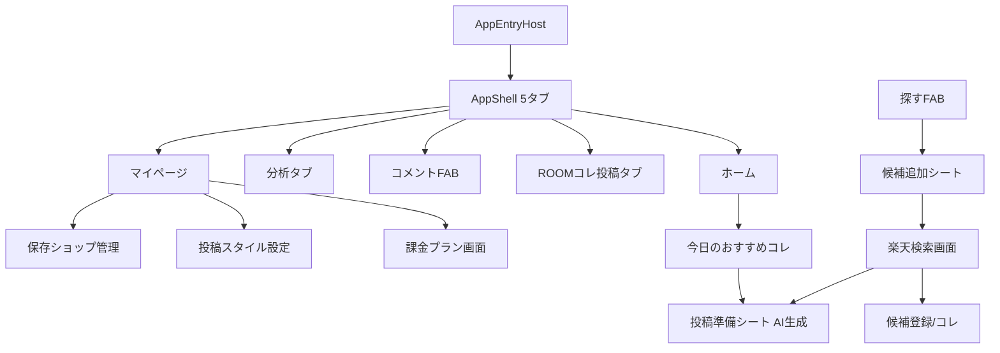

<!-- Generated by SpecStory, Markdown v2.1.0 -->

# 2026-07-07 14:41:51Z

<!-- Cursor IDE Session 5a34d1d1-3731-4fa3-81f5-cd3004fe19da (2026-07-07 14:41:51Z) -->

_**User**_

ROOMManagerにFirebase Analytics / Crashlyticsを導入したいです。
まだ実装はしないで、まず既存構成を調査してください。

確認してほしいこと:
1. main.dart の起動処理
2. AppEntryHost や初期設定分岐の構成
3. Provider / Repository / Service の構成
4. 既存のエラーハンドリング有無
5. 既存のログ出力・デバッグモード有無
6. 課金処理、AI投稿文生成、投稿スタイル設定、検索、保存、おすすめコレの主要導線
7. Firebase導入時に触るべきファイル
8. Analyticsイベントをどこで発火させるのが自然か
9. Crashlytics初期化をどこに入れるのが安全か
10. 実装前に注意すべきリスク

出力してほしいこと:
- 既存構成の調査結果
- Firebase導入方針
- 変更予定ファイル一覧
- 主要イベント計測ポイント一覧
- 実装ステップ案
- まだ実装しないこと

---

_**Agent (default)**_

<think><details><summary>Thought Process</summary>
ROOMManagerの既存構成を調査し、Firebase AnalyticsとCrashlyticsの導入方針を決定する。</details></think>

_**Agent (default)**_

Firebase Analytics / Crashlytics 導入前の調査として、まず起動処理・初期設定・Provider/Repository 構成と主要導線をコードベースから洗い出します。


_**Agent (default)**_

<tool-use data-tool-type="search" data-tool-name="glob_file_search">
<details>
<summary>Tool use: **glob_file_search** • Searched codebase "" • **1** result in **1** directory</summary>

Directory: **c:\dev\app_project\room_manager2** (1 file)

| File |
|------|
| `../lib/main.dart` |

</details>
</tool-use>

<tool-use data-tool-type="search" data-tool-name="glob_file_search"><details>
<summary>Tool use: **glob_file_search**</summary>

</details></tool-use>

_**Agent (default)**_

<tool-use data-tool-type="unknown" data-tool-name="ripgrep_raw_search">
<details>
<summary>Tool use: **ripgrep_raw_search**</summary>


Parameters:

```json
{
  "caseInsensitive": false,
  "outputMode": "files_with_matches",
  "path": "c:\\dev\\app_project\\room_manager2",
  "pattern": "AppEntryHost"
}
```
Additional data:

```json
{
  "isPruned": true,
  "outputMode": "files_with_matches",
  "path": "c:\\dev\\app_project\\room_manager2",
  "pattern": "AppEntryHost",
  "topFiles": [
    {
      "matchCount": 1,
      "uri": ".specstory/history/2026-05-05_13-32-39Z-room-synchronization-performance-issues.md"
    },
    {
      "matchCount": 1,
      "uri": ".specstory/history/2026-06-24_14-04-38Z-initial-experience-redesign-for-roommanager.md"
    },
    {
      "matchCount": 1,
      "uri": ".specstory/history/2026-06-07_13-43-10Z-room取り込みe2eフルパス確認.md"
    },
    {
      "matchCount": 1,
      "uri": ".specstory/history/2026-06-28_14-29-11Z-ui-text-and-size-adjustments.md"
    },
    {
      "matchCount": 1,
      "uri": "test/widgets/app_entry_host_test.dart"
    },
    {
      "matchCount": 1,
      "uri": ".specstory/history/2026-05-07_01-20-30Z-初期登録と設定画面の改善提案.md"
    },
    {
      "matchCount": 1,
      "uri": ".specstory/history/2026-06-25_14-33-37Z-room-type-diagnosis-and-recommendation-quality-check.md"
    },
    {
      "matchCount": 1,
      "uri": ".specstory/history/2026-06-27_11-53-35Z-roommanager-ux-final-adjustments.md"
    },
    {
      "matchCount": 1,
      "uri": ".specstory/history/2026-06-24_14-31-22Z-profile-settings-adjustment.md"
    },
    {
      "matchCount": 1,
      "uri": ".specstory/history/2026-06-20_10-28-30Z-ホーム画面の実装と機能整理.md"
    },
    {
      "matchCount": 1,
      "uri": ".specstory/history/2026-06-07_13-32-05Z-room-import-e2e-test-implementation.md"
    },
    {
      "matchCount": 1,
      "uri": ".specstory/history/2026-06-24_14-14-45Z-profile-setup-flow-changes.md"
    },
    {
      "matchCount": 1,
      "uri": ".specstory/history/2026-06-20_10-26-35Z-room-manager-home-screen-redesign.md"
    },
    {
      "matchCount": 1,
      "uri": ".specstory/history/2026-06-06_14-48-26Z-url-search-and-room-import-stability-investigation.md"
    },
    {
      "matchCount": 1,
      "uri": "lib/main.dart"
    },
    {
      "matchCount": 1,
      "uri": ".specstory/history/2026-06-25_16-36-35Z-roommanager-ux-and-bug-fixes.md"
    },
    {
      "matchCount": 1,
      "uri": ".specstory/history/2026-05-07_02-00-20Z-初期登録と設定画面の改善提案.md"
    },
    {
      "matchCount": 1,
      "uri": ".specstory/history/2026-06-27_15-00-09Z-initial-launch-comment-message.md"
    },
    {
      "matchCount": 1,
      "uri": ".specstory/history/2026-06-28_15-45-00Z-おすすめコレカードui修正.md"
    },
    {
      "matchCount": 1,
      "uri": ".specstory/history/2026-05-06_14-27-02Z-楽天room管理アプリの不具合修正.md"
    }
  ],
  "totalFiles": 27,
  "totalMatches": 27
}
```
Status: **completed**


</details>
</tool-use>

<tool-use data-tool-type="unknown" data-tool-name="ripgrep_raw_search"><details>
<summary>Tool use: **ripgrep_raw_search**</summary>

</details></tool-use>

_**Agent (default)**_

<tool-use data-tool-type="unknown" data-tool-name="ripgrep_raw_search">
<details>
<summary>Tool use: **ripgrep_raw_search**</summary>


Parameters:

```json
{
  "caseInsensitive": true,
  "outputMode": "content",
  "path": "c:\\dev\\app_project\\room_manager2",
  "pattern": "firebase|Firebase|crashlytics|Crashlytics|analytics"
}
```
Additional data:

```json
{
  "isPruned": true,
  "outputMode": "content",
  "path": "c:\\dev\\app_project\\room_manager2",
  "pattern": "firebase|Firebase|crashlytics|Crashlytics|analytics",
  "topFiles": [
    {
      "matchCount": 100,
      "uri": ".specstory/history/2026-05-31_16-56-10Z-shopcatalog-and-shoppool-implementation-details.md"
    },
    {
      "matchCount": 1,
      "uri": ".specstory/history/2026-06-30_17-33-38Z-投稿スタイル設定改善.md"
    },
    {
      "matchCount": 10,
      "uri": ".specstory/history/2026-06-28_15-45-00Z-おすすめコレカードui修正.md"
    },
    {
      "matchCount": 1,
      "uri": ".specstory/history/2026-06-07_12-30-10Z-external-ui-operation-test-investigation.md"
    },
    {
      "matchCount": 1,
      "uri": "lib/main.dart"
    },
    {
      "matchCount": 3,
      "uri": ".specstory/history/2026-06-07_11-32-44Z-developer-automation-mode-entry-screen-implementation.md"
    },
    {
      "matchCount": 1,
      "uri": ".specstory/history/2026-06-24_14-04-38Z-initial-experience-redesign-for-roommanager.md"
    },
    {
      "matchCount": 1,
      "uri": ".specstory/history/2026-06-29_11-00-58Z-post-style-settings-ui-implementation.md"
    },
    {
      "matchCount": 13,
      "uri": ".specstory/history/2026-06-08_00-56-37Z-release-build-automation-mode-investigation.md"
    },
    {
      "matchCount": 16,
      "uri": ".specstory/history/2026-06-05_01-50-30Z-phase-3-l-shoppool補助枠の表示条件.md"
    },
    {
      "matchCount": 2,
      "uri": ".specstory/history/2026-06-07_14-06-32Z-flutter-integration-test-for-recommendation-generation.md"
    },
    {
      "matchCount": 11,
      "uri": ".specstory/history/2026-06-15_14-55-45Z-manual-regeneration-limit-implementation.md"
    },
    {
      "matchCount": 48,
      "uri": ".specstory/history/2026-06-20_19-44-44Z-ui統一に関する分析画面の修正.md"
    },
    {
      "matchCount": 12,
      "uri": ".specstory/history/2026-06-13_13-26-21Z-admob-sdk-integration-for-banner-ads.md"
    },
    {
      "matchCount": 2,
      "uri": ".specstory/history/2026-06-16_14-03-42Z-google-play-billing-integration-for-in_app_purchase.md"
    },
    {
      "matchCount": 14,
      "uri": ".specstory/history/2026-06-17_04-48-31Z-pleas.md"
    },
    {
      "matchCount": 1,
      "uri": "docs/monetization_billing_plan.md"
    },
    {
      "matchCount": 13,
      "uri": ".specstory/history/2026-06-16_03-58-21Z-room-data-update-free-plan-limits.md"
    },
    {
      "matchCount": 8,
      "uri": ".specstory/history/2026-07-01_01-43-49Z-ai-integration-for-production.md"
    },
    {
      "matchCount": 1,
      "uri": ".specstory/history/2026-06-30_14-51-54Z-openai-integration-for-room-management.md"
    }
  ],
  "totalFiles": 152,
  "totalMatches": 2000
}
```
Status: **completed**


</details>
</tool-use>

<tool-use data-tool-type="unknown" data-tool-name="ripgrep_raw_search"><details>
<summary>Tool use: **ripgrep_raw_search**</summary>

</details></tool-use>

_**Agent (default)**_

<tool-use data-tool-type="search" data-tool-name="glob_file_search">
<details>
<summary>Tool use: **glob_file_search** • Searched codebase "" • **14** results in **1** directory</summary>

Directory: **c:\dev\app_project\room_manager2** (14 files)

| File |
|------|
| `../lib/state/product_list_provider.dart` |
| `../test/state/rakuten_search_provider_catalog_test.dart` |
| `../lib/state/activity_log_provider.dart` |
| `../lib/state/rakuten_search_provider.dart` |
| `../lib/state/room_activity_event_provider.dart` |
| `../lib/state/room_recommendation_profile_provider.dart` |
| `../lib/state/saved_shop_provider.dart` |
| `../lib/state/today_recommendation_provider.dart` |
| `../lib/state/post_style_settings_provider.dart` |
| `../test/state/rakuten_search_provider_test.dart` |
| `../lib/state/comment_template_provider.dart` |
| `../lib/state/user_profile_provider.dart` |
| `../lib/state/rakuten_managed_product_provider.dart` |
| `../test/state/post_style_settings_provider_test.dart` |

</details>
</tool-use>

<tool-use data-tool-type="search" data-tool-name="glob_file_search"><details>
<summary>Tool use: **glob_file_search**</summary>

</details></tool-use>

_**Agent (default)**_

<tool-use data-tool-type="search" data-tool-name="glob_file_search">
<details>
<summary>Tool use: **glob_file_search** • Searched codebase "" • **27** results in **1** directory</summary>

Directory: **c:\dev\app_project\room_manager2** (27 files)

| File |
|------|
| `../test/repository/post_style_settings_repository_test.dart` |
| `../lib/repository/genre_master_repository.dart` |
| `../lib/repository/rakuten_genre_master_repository.dart` |
| `../lib/repository/shop_catalog_repository.dart` |
| `../test/repository/operation_tutorial_repository_test.dart` |
| `../lib/repository/post_style_settings_repository.dart` |
| `../test/repository/product_catalog_repository_test.dart` |
| `../lib/repository/pending_collect_notice_repository.dart` |
| `../lib/repository/rakuten_search_repository.dart` |
| `../lib/repository/done_tab_notice_repository.dart` |
| `../lib/repository/rakuten_managed_product_repository.dart` |
| `../test/repository/shop_catalog_repository_test.dart` |
| `../lib/repository/legal_consent_repository.dart` |
| `../lib/repository/product_catalog_repository.dart` |
| `../lib/repository/room_activity_event_repository.dart` |
| `../lib/repository/room_colle_ui_state_repository.dart` |
| `../lib/repository/saved_shop_repository.dart` |
| `../lib/repository/xpath_config_repository.dart` |
| `../lib/repository/easy_initial_setup_repository.dart` |
| `../lib/repository/comment_template_repository.dart` |
| `../lib/repository/activity_log_repository.dart` |
| `../lib/repository/room_recommendation_profile_repository.dart` |
| `../lib/repository/room_sync_cursor_repository.dart` |
| `../lib/repository/today_recommendation_repository.dart` |
| `../lib/repository/operation_tutorial_repository.dart` |
| `../lib/repository/user_profile_repository.dart` |
| `../lib/repository/product_repository.dart` |

</details>
</tool-use>

<tool-use data-tool-type="search" data-tool-name="glob_file_search"><details>
<summary>Tool use: **glob_file_search**</summary>

</details></tool-use>

_**Agent (default)**_

<tool-use data-tool-type="search" data-tool-name="glob_file_search">
<details>
<summary>Tool use: **glob_file_search** • Searched codebase "" • **27** results in **1** directory</summary>

Directory: **c:\dev\app_project\room_manager2** (27 files)

| File |
|------|
| `../lib/services/room_url_extraction_service.dart` |
| `../lib/services/post_comment_generation_service.dart` |
| `../lib/services/post_comment_generation_service_factory.dart` |
| `../lib/services/genre_master_service.dart` |
| `../lib/services/rakuten_item_page_url_item_code_service.dart` |
| `../lib/services/room_sync_service.dart` |
| `../lib/services/billing_purchase_service.dart` |
| `../test/services/billing_product_service_test.dart` |
| `../test/services/rakuten_api_service_test.dart` |
| `../lib/services/remote_post_comment_generation_service.dart` |
| `../test/services/rakuten_item_page_url_item_code_service_test.dart` |
| `../test/services/room_profile_url_validation_service_test.dart` |
| `../test/services/rakuten_genre_master_service_test.dart` |
| `../lib/services/product_search_service.dart` |
| `../lib/services/rakuten_genre_master_service.dart` |
| `../lib/services/recommendation_scoring_service.dart` |
| `../lib/services/app_action_service.dart` |
| `../lib/services/room_diagnosis_service.dart` |
| `../test/services/billing_purchase_service_test.dart` |
| `../lib/services/room_collected_register_service.dart` |
| `../lib/services/rakuten_genre_api_service.dart` |
| `../test/services/post_comment_generation_service_factory_test.dart` |
| `../lib/services/rakuten_api_service.dart` |
| `../test/services/post_comment_generation_service_test.dart` |
| `../lib/services/room_profile_url_validation_service.dart` |
| `../lib/services/billing_product_service.dart` |
| `../test/services/remote_post_comment_generation_service_test.dart` |

</details>
</tool-use>

<tool-use data-tool-type="search" data-tool-name="glob_file_search"><details>
<summary>Tool use: **glob_file_search**</summary>

</details></tool-use>

_**Agent (default)**_

<tool-use data-tool-type="read" data-tool-name="read_file_v2">
<details><summary>Tool use: **read_file_v2** • Read file: c:\dev\app_project\room_manager2\lib\main.dart</summary>

</details>
</tool-use>

<tool-use data-tool-type="read" data-tool-name="read_file_v2"><details>
<summary>Tool use: **read_file_v2**</summary>

</details></tool-use>

_**Agent (default)**_

<tool-use data-tool-type="read" data-tool-name="read_file_v2">
<details><summary>Tool use: **read_file_v2** • Read file: c:\dev\app_project\room_manager2\lib\widgets\app_entry_host.dart</summary>

</details>
</tool-use>

<tool-use data-tool-type="read" data-tool-name="read_file_v2"><details>
<summary>Tool use: **read_file_v2**</summary>

</details></tool-use>

_**Agent (default)**_

<tool-use data-tool-type="read" data-tool-name="read_file_v2">
<details><summary>Tool use: **read_file_v2** • Read file: c:\dev\app_project\room_manager2\pubspec.yaml</summary>

</details>
</tool-use>

<tool-use data-tool-type="read" data-tool-name="read_file_v2"><details>
<summary>Tool use: **read_file_v2**</summary>

</details></tool-use>

_**Agent (default)**_

<tool-use data-tool-type="unknown" data-tool-name="ripgrep_raw_search">
<details>
<summary>Tool use: **ripgrep_raw_search**</summary>


Parameters:

```json
{
  "caseInsensitive": false,
  "outputMode": "content",
  "path": "c:\\dev\\app_project\\room_manager2\\lib",
  "pattern": "FlutterError|runZonedGuarded|PlatformDispatcher|ErrorWidget|catchError|debugPrint|kDebugMode|kReleaseMode|logger|Logger"
}
```
Additional data:

```json
{
  "isPruned": true,
  "outputMode": "content",
  "path": "c:\\dev\\app_project\\room_manager2\\lib",
  "pattern": "FlutterError|runZonedGuarded|PlatformDispatcher|ErrorWidget|catchError|debugPrint|kDebugMode|kReleaseMode|logger|Logger",
  "topFiles": [
    {
      "matchCount": 30,
      "uri": "lib/services/rakuten_api_service.dart"
    },
    {
      "matchCount": 4,
      "uri": "lib/main.dart"
    },
    {
      "matchCount": 6,
      "uri": "lib/screens/home_placeholder_screen.dart"
    },
    {
      "matchCount": 2,
      "uri": "lib/utils/product_image_resolve.dart"
    },
    {
      "matchCount": 2,
      "uri": "lib/utils/rakuten_product_rating_display.dart"
    },
    {
      "matchCount": 1,
      "uri": "lib/widgets/shop_discovery_card.dart"
    },
    {
      "matchCount": 6,
      "uri": "lib/widgets/monetization/admob_banner_ad_slot.dart"
    },
    {
      "matchCount": 6,
      "uri": "lib/screens/mypage_placeholder_screen.dart"
    },
    {
      "matchCount": 11,
      "uri": "lib/services/admob_initializer.dart"
    },
    {
      "matchCount": 2,
      "uri": "lib/utils/shop_display_resolve.dart"
    },
    {
      "matchCount": 1,
      "uri": "lib/utils/room_reaction_status_display.dart"
    },
    {
      "matchCount": 9,
      "uri": "lib/repository/rakuten_search_repository.dart"
    }
  ],
  "totalFiles": 12,
  "totalMatches": 774
}
```
Status: **completed**


</details>
</tool-use>

<tool-use data-tool-type="unknown" data-tool-name="ripgrep_raw_search"><details>
<summary>Tool use: **ripgrep_raw_search**</summary>

</details></tool-use>

_**Agent (default)**_

<tool-use data-tool-type="search" data-tool-name="glob_file_search">
<details>
<summary>Tool use: **glob_file_search** • Searched codebase "" • **351** results in **1** directory</summary>

Directory: **c:\dev\app_project\room_manager2** (351 files)

| File |
|------|
| `../lib/screens/rakuten_search_screen.dart` |
| `../lib/models/today_recommendation.dart` |
| `../lib/widgets/monetization/monetization_ad_content_resolver.dart` |
| `../lib/config/monetization_plan_config.dart` |
| `../lib/utils/dev_automation_log_buffer.dart` |
| `../lib/utils/today_recommendation_exposure_policy.dart` |
| `../lib/models/post_comment_generation_result.dart` |
| `../lib/repository/today_recommendation_repository.dart` |
| `../lib/data/interest_category_definitions.dart` |
| `../lib/repository/post_style_settings_repository.dart` |
| `../lib/theme/comment_screen_tokens.dart` |
| `../lib/state/activity_log_provider.dart` |
| `../lib/utils/catalog_product_quality.dart` |
| `../lib/utils/room_reaction_status_display.dart` |
| `../lib/services/room_reaction_sync_history_store.dart` |
| `../lib/utils/room_import_pending_user_copy.dart` |
| `../lib/widgets/genre_drilldown_picker_sheet.dart` |
| `../lib/widgets/monetization/monetization_ad_placement.dart` |
| `../lib/utils/room_colle_candidate_stale.dart` |
| `../lib/models/product_status.dart` |
| `../lib/models/rakuten_managed_product.dart` |
| `../lib/utils/room_next_action_advisor.dart` |
| `../lib/services/subscription_entitlement_store.dart` |
| `../lib/utils/analytics_unknown_label.dart` |
| `../lib/models/rakuten_search_item.dart` |
| `../lib/widgets/add_candidate_entry_sheet.dart` |
| `../lib/widgets/room_import_enrichment_pending_hint.dart` |
| `../lib/widgets/room_sync_reaction_button.dart` |
| `../lib/widgets/shop_discovery_card.dart` |
| `../lib/theme/today_recommendations_screen_tokens.dart` |
| `../lib/config/profile_tutorial_actions.dart` |
| `../lib/services/room_diagnosis_service.dart` |
| `../lib/services/room_import_collects_policy.dart` |
| `../lib/widgets/rakuten_search_detail_condition_entry_chrome.dart` |
| `../lib/widgets/rakuten_search_feedback.dart` |
| `../lib/models/room_activity_event.dart` |
| `../lib/services/billing_product_service.dart` |
| `../lib/navigation/app_shell_controller.dart` |
| `../lib/utils/home_in_app_notice.dart` |
| `../lib/utils/room_rat_redirect_parse.dart` |
| `../lib/config/room_import_debug_ui_config.dart` |
| `../lib/services/dev_automation_visible_run.dart` |
| `../lib/screens/easy_initial_setup_screen.dart` |
| `../lib/utils/room_catalog_enrichment.dart` |
| `../lib/screens/comment_template_edit_screen.dart` |
| `../lib/screens/monetization_plan_screen.dart` |
| `../lib/utils/product_display_title.dart` |
| `../lib/utils/shop_display_resolve.dart` |
| `../lib/widgets/app_screen_status.dart` |
| `../lib/widgets/tutorial/tutorial_spotlight_layer.dart` |
| `../lib/repository/comment_template_repository.dart` |
| `../lib/models/operation_tutorial_flow.dart` |
| `../lib/utils/room_sync_log.dart` |
| `../lib/services/genre_master_service.dart` |
| `../lib/repository/activity_log_repository.dart` |
| `../lib/widgets/tutorial/tutorial_overlay_host.dart` |
| `../lib/models/product_search_hit.dart` |
| `../lib/utils/genre_tree_builder.dart` |
| `../lib/services/rakuten_item_url_parser.dart` |
| `../lib/config/shop_catalog_config.dart` |
| `../lib/widgets/rakuten_search_result_card.dart` |
| `../lib/utils/rakuten_search_filter_summary.dart` |
| `../lib/utils/room_reaction_sync_user_message.dart` |
| `../lib/utils/genre_display_helper.dart` |
| `../lib/services/post_comment_generation_count_store.dart` |
| `../lib/utils/room_import_product_url_match.dart` |
| `../lib/repository/rakuten_search_repository.dart` |
| `../lib/services/rakuten_room_home_stats.dart` |
| `../lib/utils/search_result_envelope.dart` |
| `../lib/services/admob_initializer.dart` |
| `../lib/services/room_sync_service.dart` |
| `../lib/utils/room_reaction_analytics.dart` |
| `../lib/models/room_colle_advanced_query.dart` |
| `../lib/services/room_url_resolver.dart` |
| `../lib/services/batch_candidate_add_availability.dart` |
| `../lib/utils/search_tab_ui_audit_log.dart` |
| `../lib/utils/today_recommendation_ui_tags.dart` |
| `../lib/widgets/empty_state_view.dart` |
| `../lib/widgets/room_post_prepare_sheet.dart` |
| `../lib/screens/saved_shops_screen.dart` |
| `../lib/widgets/search_group_screen_shell.dart` |
| `../lib/screens/closed_test_demo_screen.dart` |
| `../lib/widgets/product_form_content.dart` |
| `../lib/services/recommendation_generation_limit.dart` |
| `../lib/main.dart` |
| `../lib/widgets/tutorial/tutorial_target_keys.dart` |
| `../lib/services/room_url_extraction_service.dart` |
| `../lib/state/comment_template_provider.dart` |
| `../lib/utils/rakuten_product_url_support.dart` |
| `../lib/config/dev_automation_config.dart` |
| `../lib/models/room_collected_persist_kind.dart` |
| `../lib/widgets/room_colle_product_list_card_layout.dart` |
| `../lib/config/billing_product_config.dart` |
| `../lib/widgets/favorite_genre_picker_sheet.dart` |
| `../lib/models/shop_discovery_summary.dart` |
| `../lib/repository/room_activity_event_repository.dart` |
| `../lib/services/recommendation_query_builder.dart` |
| `../lib/services/rakuten_genre_api_service.dart` |
| `../lib/services/comment_prompt_builder.dart` |
| `../lib/theme/room_colle_list_accent.dart` |
| `../lib/utils/favorite_genre_pref.dart` |
| `../lib/models/room_reaction_sync_history_entry.dart` |
| `../lib/repository/xpath_config_repository.dart` |
| `../lib/services/post_comment_generation_exception.dart` |
| `../lib/state/post_style_settings_provider.dart` |
| `../lib/repository/product_repository.dart` |
| `../lib/services/post_comment_generation_user_message.dart` |
| `../lib/utils/product_price_display.dart` |
| `../lib/utils/room_import_safe_merge.dart` |
| `../lib/state/saved_shop_provider.dart` |
| `../lib/screens/room_type_diagnosis_screen.dart` |
| `../lib/utils/rakuten_search_session_cache.dart` |
| `../lib/models/saved_shop.dart` |
| `../lib/state/bulk_operation_state_controller.dart` |
| `../lib/theme/app_dimensions.dart` |
| `../lib/state/today_recommendation_provider.dart` |
| `../lib/data/priority_rule_definitions.dart` |
| `../lib/state/user_profile_provider.dart` |
| `../lib/data/dummy_products.dart` |
| `../lib/services/recommendation_scoring_service.dart` |
| `../lib/services/post_comment_generation_result_store.dart` |
| `../lib/utils/today_recommendation_policy.dart` |
| `../lib/screens/dev_automation_screen.dart` |
| `../lib/services/room_import_limit_policy.dart` |
| `../lib/utils/shop_catalog_keys.dart` |
| `../lib/models/operation_tutorial_target_action_id.dart` |
| `../lib/services/rakuten_search_condition_availability.dart` |
| `../lib/services/rakuten_genre_master_service.dart` |
| `../lib/repository/rakuten_genre_master_repository.dart` |
| `../lib/services/room_url_extraction_coordinator.dart` |
| `../lib/config/monetization_config.dart` |
| `../lib/screens/activity_placeholder_screen.dart` |
| `../lib/utils/room_unconfirmed_display_copy.dart` |
| `../lib/utils/analytics_shop_search_launcher.dart` |
| `../lib/utils/genre_pref_log.dart` |
| `../lib/utils/today_recommendation_genre_distribution.dart` |
| `../lib/config/room_import_enrichment_verify_config.dart` |
| `../lib/utils/favorite_genre_selection_policy.dart` |
| `../lib/utils/product_card_rakuten_open.dart` |
| `../lib/models/genre_master.dart` |
| `../lib/repository/room_sync_cursor_repository.dart` |
| `../lib/config/product_catalog_config.dart` |
| `../lib/repository/room_colle_ui_state_repository.dart` |
| `../lib/services/stub_post_comment_builder.dart` |
| `../lib/utils/room_sync_button_visibility.dart` |
| `../lib/models/room_recommendation_profile.dart` |
| `../lib/services/post_comment_api_response_parser.dart` |
| `../lib/widgets/common_draggable_edge_fab.dart` |
| `../lib/widgets/operation_confirm_dialog.dart` |
| `../lib/widgets/search_bulk_selection_header.dart` |
| `../lib/screens/shop_discovery_detail_screen.dart` |
| `../lib/services/post_comment_generation_limit.dart` |
| `../lib/widgets/activity/activity_analytics_tab.dart` |
| `../lib/services/home_in_app_notice_dismiss_store.dart` |
| `../lib/state/room_recommendation_profile_provider.dart` |
| `../lib/utils/profile_recommendation_integration.dart` |
| `../lib/repository/user_profile_repository.dart` |
| `../lib/widgets/app_button.dart` |
| `../lib/screens/products_placeholder_screen.dart` |
| `../lib/models/room_colle_list_filters.dart` |
| `../lib/widgets/app_card.dart` |
| `../lib/data/rakuten_genre_master_local_data.dart` |
| `../lib/utils/genre_display_resolve.dart` |
| `../lib/utils/rakuten_product_genre_display.dart` |
| `../lib/repository/pending_collect_notice_repository.dart` |
| `../lib/models/user_profile.dart` |
| `../lib/widgets/home_primary_action_button.dart` |
| `../lib/widgets/product_card.dart` |
| `../lib/services/shop_discovery_pool_comparator.dart` |
| `../lib/repository/rakuten_managed_product_repository.dart` |
| `../lib/services/subscription_status.dart` |
| `../lib/utils/room_colle_card_time_format.dart` |
| `../lib/utils/room_sync_card_copy.dart` |
| `../lib/services/post_comment_generation_service.dart` |
| `../lib/utils/catalog_product_mapper.dart` |
| `../lib/utils/catalog_product_keys.dart` |
| `../lib/services/rakuten_api_service.dart` |
| `../lib/constants/shop_pool_fallback_keyword_synonyms.dart` |
| `../lib/services/product_catalog_shop_aggregator.dart` |
| `../lib/utils/shop_catalog_mapper.dart` |
| `../lib/widgets/monetization/admob_banner_ad_slot.dart` |
| `../lib/services/post_style_settings_resolver.dart` |
| `../lib/models/shop_pool_candidate.dart` |
| `../lib/theme/app_theme.dart` |
| `../lib/models/product_item.dart` |
| `../lib/services/dev_automation_runner.dart` |
| `../lib/widgets/monetization/ad_placeholder_slot.dart` |
| `../lib/utils/search_result_quality_filter.dart` |
| `../lib/services/rakuten_item_page_url_item_code_service.dart` |
| `../lib/theme/legal_consent_screen_tokens.dart` |
| `../lib/services/post_style_preview_generation_count_store.dart` |
| `../lib/data/room_type_definitions.dart` |
| `../lib/navigation/app_route_observer.dart` |
| `../lib/services/recommendation_reason_builder.dart` |
| `../lib/utils/display_text_utils.dart` |
| `../lib/services/room_collected_register_service.dart` |
| `../lib/utils/genre_display_order.dart` |
| `../lib/models/catalog_product.dart` |
| `../lib/utils/home_post_milestone.dart` |
| `../lib/utils/recommendation_diversity_utils.dart` |
| `../lib/widgets/home_auto_reaction_sync_coordinator.dart` |
| `../lib/widgets/rakuten_managed_product_card.dart` |
| `../lib/utils/recommend_cooldown_policy.dart` |
| `../lib/widgets/room_post_import_flow.dart` |
| `../lib/widgets/tutorial/tutorial_tooltip_card.dart` |
| `../lib/services/app_action_service.dart` |
| `../lib/repository/product_catalog_repository.dart` |
| `../lib/services/recommendation_generation_count_store.dart` |
| `../lib/models/room_reaction_sync_top_product.dart` |
| `../lib/screens/comments_placeholder_screen.dart` |
| `../lib/screens/home_placeholder_screen.dart` |
| `../lib/services/room_kpi_calculator.dart` |
| `../lib/utils/product_image_resolve.dart` |
| `../lib/config/rakuten_api_config.dart` |
| `../lib/models/room_collected_persist_outcome.dart` |
| `../lib/widgets/activity/activity_navigation_helpers.dart` |
| `../lib/state/operation_tutorial_controller.dart` |
| `../lib/navigation/rakuten_search_navigator.dart` |
| `../lib/models/room_import_cursor_state.dart` |
| `../lib/services/room_import_metadata_enrichment.dart` |
| `../lib/services/shop_discovery_pool_supplement.dart` |
| `../lib/app_messenger.dart` |
| `../lib/config/ai_gateway_config.dart` |
| `../lib/services/shop_discovery_pool_fallback.dart` |
| `../lib/widgets/room_type_diagnosis_widgets.dart` |
| `../lib/screens/legal_consent_screen.dart` |
| `../lib/utils/product_catalog_upsert_timing.dart` |
| `../lib/models/rakuten_genre_master_entry.dart` |
| `../lib/models/saved_post_comment_generation_result.dart` |
| `../lib/services/shop_discovery_pool_quality_report.dart` |
| `../lib/utils/room_import_product_identity.dart` |
| `../lib/screens/mypage_placeholder_screen.dart` |
| `../lib/utils/user_profile_preferred_genre_words.dart` |
| `../lib/validation/rakuten_keyword_detail_conditions_validation.dart` |
| `../lib/services/post_comment_generation_service_factory.dart` |
| `../lib/screens/product_detail_screen.dart` |
| `../lib/services/room_import_enrichment_cooldown_store.dart` |
| `../lib/widgets/app_tab.dart` |
| `../lib/services/shop_pool_scoring.dart` |
| `../lib/widgets/home_in_app_notice_card.dart` |
| `../lib/widgets/monetization/monetization_ad_slot.dart` |
| `../lib/services/shop_pool_keyword_relevance.dart` |
| `../lib/services/shop_discovery_pool_api_compare.dart` |
| `../lib/services/room_room_page_reaction_parse.dart` |
| `../lib/utils/rakuten_ichiba_url_parse.dart` |
| `../lib/widgets/activity/activity_achievement_tab.dart` |
| `../lib/repository/easy_initial_setup_repository.dart` |
| `../lib/repository/shop_catalog_repository.dart` |
| `../lib/models/operation_tutorial_id.dart` |
| `../lib/repository/genre_master_repository.dart` |
| `../lib/repository/operation_tutorial_repository.dart` |
| `../lib/screens/post_style_settings_screen.dart` |
| `../lib/utils/room_import_product_image.dart` |
| `../lib/services/product_search_service.dart` |
| `../lib/utils/today_recommendation_visible_selection.dart` |
| `../lib/widgets/saved_shop_compact_selector.dart` |
| `../lib/utils/home_auto_reaction_sync.dart` |
| `../lib/widgets/app_entry_host.dart` |
| `../lib/models/comment_template.dart` |
| `../lib/services/billing_purchase_service.dart` |
| `../lib/screens/add_candidate_from_url_screen.dart` |
| `../lib/theme/rakuten_search_screen_tokens.dart` |
| `../lib/utils/product_safety_filter.dart` |
| `../lib/repository/done_tab_notice_repository.dart` |
| `../lib/state/room_activity_event_provider.dart` |
| `../lib/services/post_style_preview_generation_limit.dart` |
| `../lib/services/room_profile_url_validation_service.dart` |
| `../lib/data/comment_tone_definitions.dart` |
| `../lib/utils/room_rakuten_url_normalize.dart` |
| `../lib/services/room_user_posted_listing_fetcher.dart` |
| `../lib/models/operation_tutorial_step.dart` |
| `../lib/config/demo_mode.dart` |
| `../lib/utils/shop_pool_fallback_audit.dart` |
| `../lib/widgets/search_mode_segment_bar.dart` |
| `../lib/services/room_collect_post_limit.dart` |
| `../lib/widgets/rakuten_search_condition_fields.dart` |
| `../lib/models/activity_log.dart` |
| `../lib/utils/today_recommendation_catalog.dart` |
| `../lib/widgets/pending_collect_resume_notice_host.dart` |
| `../lib/widgets/tutorial/tutorial_target_locator.dart` |
| `../lib/repository/room_recommendation_profile_repository.dart` |
| `../lib/utils/monetization_plan_display.dart` |
| `../lib/screens/collected_placeholder_screen.dart` |
| `../lib/services/remote_post_comment_generation_service.dart` |
| `../lib/utils/today_recommendation_genre_page_store.dart` |
| `../lib/widgets/shop_discovery_pool_supplement_cards.dart` |
| `../lib/widgets/room_post_prepare_product_summary.dart` |
| `../lib/repository/saved_shop_repository.dart` |
| `../lib/services/post_comment_length_validator.dart` |
| `../lib/data/demo_mode_data.dart` |
| `../lib/config/debug_log_flags.dart` |
| `../lib/screens/product_add_screen.dart` |
| `../lib/widgets/room_sync_last_reaction_summary.dart` |
| `../lib/services/room_import_collects_resume_store.dart` |
| `../lib/constants/legal_urls.dart` |
| `../lib/state/rakuten_managed_product_provider.dart` |
| `../lib/widgets/mypage/mypage_widgets.dart` |
| `../lib/services/post_comment_request_builder.dart` |
| `../lib/widgets/post_style_picker_sheet.dart` |
| `../lib/widgets/activity/activity_screen_layout.dart` |
| `../lib/services/shop_discovery_aggregator.dart` |
| `../lib/utils/api_request_coordinator.dart` |
| `../lib/utils/room_import_learned_api_code.dart` |
| `../lib/theme/app_colors.dart` |
| `../lib/models/room_reaction_sync_batch_result.dart` |
| `../lib/models/shop_catalog_entry.dart` |
| `../lib/models/room_sync_result.dart` |
| `../lib/models/xpath_selector_config.dart` |
| `../lib/models/post_comment_profile_context.dart` |
| `../lib/state/product_list_provider.dart` |
| `../lib/utils/shop_pool_audit.dart` |
| `../lib/widgets/activity/activity_segmented_tab_bar.dart` |
| `../lib/config/shop_discovery_pool_fallback_config.dart` |
| `../lib/models/product.dart` |
| `../lib/screens/product_edit_screen.dart` |
| `../lib/utils/app_input_limits.dart` |
| `../lib/utils/today_recommendation_work_progress.dart` |
| `../lib/widgets/product_open_action_buttons.dart` |
| `../lib/theme/mypage_screen_tokens.dart` |
| `../lib/config/admob_config.dart` |
| `../lib/config/profile_tutorial_flow.dart` |
| `../lib/screens/today_recommendations_screen.dart` |
| `../lib/utils/onboarding_ui_log.dart` |
| `../lib/utils/managed_product_diag_log.dart` |
| `../lib/utils/product_catalog_audit.dart` |
| `../lib/models/post_style_settings.dart` |
| `../lib/theme/app_text_styles.dart` |
| `../lib/state/room_import_controller.dart` |
| `../lib/models/rakuten_product_search_condition.dart` |
| `../lib/utils/app_debug_log.dart` |
| `../lib/utils/shop_search_fetch_log.dart` |
| `../lib/config/post_style_preview_sample_product.dart` |
| `../lib/utils/user_profile_genre_migration.dart` |
| `../lib/repository/legal_consent_repository.dart` |
| `../lib/config/profile_tutorial_targets.dart` |
| `../lib/app_shell.dart` |
| `../lib/theme/activity_screen_tokens.dart` |
| `../lib/utils/rakuten_product_rating_display.dart` |
| `../lib/widgets/activity/room_next_actions_card.dart` |
| `../lib/widgets/app_loading.dart` |
| `../lib/widgets/home_goal_milestone_progress.dart` |
| `../lib/widgets/room_url_extraction_host.dart` |
| `../lib/utils/room_import_enrich_keyword_normalize.dart` |
| `../lib/widgets/app_text_field.dart` |
| `../lib/services/room_import_limit.dart` |
| `../lib/state/rakuten_search_provider.dart` |
| `../lib/widgets/collect_post_success_overlay.dart` |
| `../lib/theme/home_screen_colors.dart` |
| `../lib/services/shop_discovery_pool_supplement_ui_bridge.dart` |
| `../lib/utils/rakuten_keyword_search_sort.dart` |
| `../lib/screens/room_type_diagnosis_result_screen.dart` |

</details>
</tool-use>

<tool-use data-tool-type="search" data-tool-name="glob_file_search"><details>
<summary>Tool use: **glob_file_search**</summary>

</details></tool-use>

_**Agent (default)**_

<tool-use data-tool-type="read" data-tool-name="read_file_v2">
<details><summary>Tool use: **read_file_v2** • Read file: c:\dev\app_project\room_manager2\lib\app_shell.dart</summary>

</details>
</tool-use>

<tool-use data-tool-type="read" data-tool-name="read_file_v2"><details>
<summary>Tool use: **read_file_v2**</summary>

</details></tool-use>

_**Agent (default)**_

<tool-use data-tool-type="read" data-tool-name="read_file_v2">
<details><summary>Tool use: **read_file_v2** • Read file: c:\dev\app_project\room_manager2\lib\navigation\app_route_observer.dart</summary>

</details>
</tool-use>

<tool-use data-tool-type="read" data-tool-name="read_file_v2"><details>
<summary>Tool use: **read_file_v2**</summary>

</details></tool-use>

_**Agent (default)**_

<tool-use data-tool-type="read" data-tool-name="read_file_v2">
<details><summary>Tool use: **read_file_v2** • Read file: c:\dev\app_project\room_manager2\lib\config\debug_log_flags.dart</summary>

</details>
</tool-use>

<tool-use data-tool-type="read" data-tool-name="read_file_v2"><details>
<summary>Tool use: **read_file_v2**</summary>

</details></tool-use>

_**Agent (default)**_

<tool-use data-tool-type="read" data-tool-name="read_file_v2">
<details><summary>Tool use: **read_file_v2** • Read file: c:\dev\app_project\room_manager2\lib\services\billing_purchase_service.dart</summary>

</details>
</tool-use>

<tool-use data-tool-type="read" data-tool-name="read_file_v2"><details>
<summary>Tool use: **read_file_v2**</summary>

</details></tool-use>

_**Agent (default)**_

<tool-use data-tool-type="read" data-tool-name="read_file_v2">
<details><summary>Tool use: **read_file_v2** • Read file: c:\dev\app_project\room_manager2\lib\services\post_comment_generation_service.dart</summary>

</details>
</tool-use>

<tool-use data-tool-type="read" data-tool-name="read_file_v2"><details>
<summary>Tool use: **read_file_v2**</summary>

</details></tool-use>

_**Agent (default)**_

<tool-use data-tool-type="unknown" data-tool-name="ripgrep_raw_search">
<details>
<summary>Tool use: **ripgrep_raw_search**</summary>


Parameters:

```json
{
  "caseInsensitive": false,
  "path": "c:\\dev\\app_project\\room_manager2\\lib",
  "pattern": "runZonedGuarded|FlutterError\\.onError|PlatformDispatcher\\.instance\\.onError"
}
```
Additional data:

```json
{
  "isPruned": true,
  "outputMode": "content",
  "path": "c:\\dev\\app_project\\room_manager2\\lib",
  "pattern": "runZonedGuarded|FlutterError\\.onError|PlatformDispatcher\\.instance\\.onError",
  "topFiles": [],
  "totalFiles": 0,
  "totalMatches": 0
}
```
Status: **completed**


</details>
</tool-use>

<tool-use data-tool-type="unknown" data-tool-name="ripgrep_raw_search"><details>
<summary>Tool use: **ripgrep_raw_search**</summary>

</details></tool-use>

_**Agent (default)**_

<tool-use data-tool-type="read" data-tool-name="read_file_v2">
<details><summary>Tool use: **read_file_v2** • Read file: c:\dev\app_project\room_manager2\lib\services\admob_initializer.dart</summary>

</details>
</tool-use>

<tool-use data-tool-type="read" data-tool-name="read_file_v2"><details>
<summary>Tool use: **read_file_v2**</summary>

</details></tool-use>

_**Agent (default)**_

<tool-use data-tool-type="read" data-tool-name="read_file_v2">
<details><summary>Tool use: **read_file_v2** • Read file: c:\dev\app_project\room_manager2\lib\services\app_action_service.dart</summary>

</details>
</tool-use>

<tool-use data-tool-type="read" data-tool-name="read_file_v2"><details>
<summary>Tool use: **read_file_v2**</summary>

</details></tool-use>

_**Agent (default)**_

<tool-use data-tool-type="read" data-tool-name="read_file_v2">
<details><summary>Tool use: **read_file_v2** • Read file: c:\dev\app_project\room_manager2\lib\services\post_comment_generation_service_factory.dart</summary>

</details>
</tool-use>

<tool-use data-tool-type="read" data-tool-name="read_file_v2"><details>
<summary>Tool use: **read_file_v2**</summary>

</details></tool-use>

_**Agent (default)**_

<tool-use data-tool-type="search" data-tool-name="glob_file_search">
<details>
<summary>Tool use: **glob_file_search** • Searched codebase "" • **30** results in **1** directory</summary>

Directory: **c:\dev\app_project\room_manager2** (30 files)

| File |
|------|
| `../android/app/src/main/res/drawable/launch_background.xml` |
| `../android/app/src/profile/AndroidManifest.xml` |
| `../android/gradle.properties` |
| `../android/app/build.gradle.kts` |
| `../android/app/src/main/res/mipmap-hdpi/ic_launcher.png` |
| `../android/app/src/main/res/mipmap-anydpi-v26/ic_launcher.xml` |
| `../android/app/src/main/kotlin/com/stepbytestudio/room_manager2/MainActivity.kt` |
| `../android/app/src/main/res/drawable-v21/launch_background.xml` |
| `../android/.kotlin/sessions/kotlin-compiler-4281514115868755939.salive` |
| `../android/app/src/main/res/drawable-hdpi/ic_launcher_foreground.png` |
| `../android/app/src/main/res/mipmap-xxhdpi/ic_launcher.png` |
| `../android/app/src/main/res/drawable-xhdpi/ic_launcher_foreground.png` |
| `../android/app/src/main/res/drawable-mdpi/ic_launcher_foreground.png` |
| `../android/app/src/main/res/mipmap-xhdpi/ic_launcher.png` |
| `../android/app/src/main/res/values/styles.xml` |
| `../android/app/src/main/res/values/strings.xml` |
| `../android/app/src/release/res/values/strings.xml` |
| `../android/gradle/wrapper/gradle-wrapper.properties` |
| `../android/app/proguard-rules.pro` |
| `../android/app/src/main/res/drawable-xxxhdpi/ic_launcher_foreground.png` |
| `../android/app/src/main/res/values/colors.xml` |
| `../android/app/src/debug/AndroidManifest.xml` |
| `../android/build.gradle.kts` |
| `../android/settings.gradle.kts` |
| `../android/.gitignore` |
| `../android/app/src/main/res/values-night/styles.xml` |
| `../android/app/src/main/AndroidManifest.xml` |
| `../android/app/src/main/res/mipmap-xxxhdpi/ic_launcher.png` |
| `../android/app/src/main/res/drawable-xxhdpi/ic_launcher_foreground.png` |
| `../android/app/src/main/res/mipmap-mdpi/ic_launcher.png` |

</details>
</tool-use>

<tool-use data-tool-type="search" data-tool-name="glob_file_search"><details>
<summary>Tool use: **glob_file_search**</summary>

</details></tool-use>

_**Agent (default)**_

<tool-use data-tool-type="unknown" data-tool-name="ripgrep_raw_search">
<details>
<summary>Tool use: **ripgrep_raw_search**</summary>


Parameters:

```json
{
  "caseInsensitive": false,
  "path": "c:\\dev\\app_project\\room_manager2\\lib",
  "pattern": "logOnboardingUi|searchTabUiAudit|roomSyncLog|audit"
}
```
Additional data:

```json
{
  "isPruned": true,
  "outputMode": "content",
  "path": "c:\\dev\\app_project\\room_manager2\\lib",
  "pattern": "logOnboardingUi|searchTabUiAudit|roomSyncLog|audit",
  "topFiles": [
    {
      "matchCount": 15,
      "uri": "lib/repository/product_catalog_repository.dart"
    },
    {
      "matchCount": 1,
      "uri": "lib/widgets/shop_discovery_card.dart"
    },
    {
      "matchCount": 8,
      "uri": "lib/services/shop_discovery_pool_api_compare.dart"
    },
    {
      "matchCount": 1,
      "uri": "lib/utils/shop_pool_fallback_audit.dart"
    },
    {
      "matchCount": 1,
      "uri": "lib/widgets/search_bulk_selection_header.dart"
    },
    {
      "matchCount": 4,
      "uri": "lib/widgets/search_mode_segment_bar.dart"
    },
    {
      "matchCount": 10,
      "uri": "lib/repository/rakuten_managed_product_repository.dart"
    }
  ],
  "totalFiles": 7,
  "totalMatches": 118
}
```
Status: **completed**


</details>
</tool-use>

<tool-use data-tool-type="unknown" data-tool-name="ripgrep_raw_search"><details>
<summary>Tool use: **ripgrep_raw_search**</summary>

</details></tool-use>

_**Agent (default)**_

<tool-use data-tool-type="unknown" data-tool-name="ripgrep_raw_search">
<details>
<summary>Tool use: **ripgrep_raw_search**</summary>


Parameters:

```json
{
  "caseInsensitive": false,
  "outputMode": "files_with_matches",
  "path": "c:\\dev\\app_project\\room_manager2\\lib",
  "pattern": "PostStyleSettings|post_style_settings"
}
```
Additional data:

```json
{
  "isPruned": true,
  "outputMode": "files_with_matches",
  "path": "c:\\dev\\app_project\\room_manager2\\lib",
  "pattern": "PostStyleSettings|post_style_settings",
  "topFiles": [
    {
      "matchCount": 1,
      "uri": "lib/services/post_comment_request_builder.dart"
    },
    {
      "matchCount": 1,
      "uri": "lib/state/post_style_settings_provider.dart"
    },
    {
      "matchCount": 1,
      "uri": "lib/screens/post_style_settings_screen.dart"
    },
    {
      "matchCount": 1,
      "uri": "lib/models/post_style_settings.dart"
    },
    {
      "matchCount": 1,
      "uri": "lib/services/post_comment_length_validator.dart"
    },
    {
      "matchCount": 1,
      "uri": "lib/repository/post_style_settings_repository.dart"
    },
    {
      "matchCount": 1,
      "uri": "lib/widgets/room_post_prepare_sheet.dart"
    },
    {
      "matchCount": 1,
      "uri": "lib/services/post_style_settings_resolver.dart"
    },
    {
      "matchCount": 1,
      "uri": "lib/services/post_comment_generation_service.dart"
    },
    {
      "matchCount": 1,
      "uri": "lib/widgets/mypage/mypage_widgets.dart"
    },
    {
      "matchCount": 1,
      "uri": "lib/screens/mypage_placeholder_screen.dart"
    },
    {
      "matchCount": 1,
      "uri": "lib/main.dart"
    },
    {
      "matchCount": 1,
      "uri": "lib/services/stub_post_comment_builder.dart"
    }
  ],
  "totalFiles": 13,
  "totalMatches": 13
}
```
Status: **completed**


</details>
</tool-use>

<tool-use data-tool-type="unknown" data-tool-name="ripgrep_raw_search"><details>
<summary>Tool use: **ripgrep_raw_search**</summary>

</details></tool-use>

_**Agent (default)**_

<tool-use data-tool-type="search" data-tool-name="glob_file_search">
<details>
<summary>Tool use: **glob_file_search** • Searched codebase "" • **42** results in **1** directory</summary>

Directory: **c:\dev\app_project\room_manager2** (42 files)

| File |
|------|
| `../ios/Runner/Assets.xcassets/AppIcon.appiconset/Icon-App-29x29@1x.png` |
| `../ios/RunnerTests/RunnerTests.swift` |
| `../ios/Runner.xcodeproj/project.pbxproj` |
| `../ios/Runner.xcworkspace/xcshareddata/IDEWorkspaceChecks.plist` |
| `../ios/Runner/Assets.xcassets/AppIcon.appiconset/Icon-App-76x76@2x.png` |
| `../ios/Flutter/Debug.xcconfig` |
| `../ios/Runner/Base.lproj/Main.storyboard` |
| `../ios/Runner.xcodeproj/project.xcworkspace/xcshareddata/WorkspaceSettings.xcsettings` |
| `../ios/Runner.xcodeproj/project.xcworkspace/xcshareddata/IDEWorkspaceChecks.plist` |
| `../ios/Runner/Assets.xcassets/AppIcon.appiconset/Icon-App-40x40@3x.png` |
| `../ios/Runner/Assets.xcassets/LaunchImage.imageset/Contents.json` |
| `../ios/Runner.xcworkspace/contents.xcworkspacedata` |
| `../ios/Runner/Assets.xcassets/AppIcon.appiconset/Icon-App-76x76@1x.png` |
| `../ios/Runner/Assets.xcassets/AppIcon.appiconset/Icon-App-57x57@2x.png` |
| `../ios/Flutter/Release.xcconfig` |
| `../ios/Runner/AppDelegate.swift` |
| `../ios/Runner.xcworkspace/xcshareddata/WorkspaceSettings.xcsettings` |
| `../ios/Runner/Assets.xcassets/AppIcon.appiconset/Icon-App-20x20@1x.png` |
| `../ios/Runner/Assets.xcassets/AppIcon.appiconset/Icon-App-29x29@2x.png` |
| `../ios/Runner/Assets.xcassets/AppIcon.appiconset/Icon-App-40x40@2x.png` |
| `../ios/Runner.xcodeproj/project.xcworkspace/contents.xcworkspacedata` |
| `../ios/Runner/Assets.xcassets/AppIcon.appiconset/Icon-App-1024x1024@1x.png` |
| `../ios/Runner/Assets.xcassets/AppIcon.appiconset/Icon-App-50x50@1x.png` |
| `../ios/Runner/Assets.xcassets/AppIcon.appiconset/Icon-App-60x60@2x.png` |
| `../ios/Runner/Assets.xcassets/AppIcon.appiconset/Icon-App-29x29@3x.png` |
| `../ios/Runner/Assets.xcassets/AppIcon.appiconset/Icon-App-50x50@2x.png` |
| `../ios/Runner/Base.lproj/LaunchScreen.storyboard` |
| `../ios/Runner/Assets.xcassets/AppIcon.appiconset/Icon-App-72x72@1x.png` |
| `../ios/Runner/Runner-Bridging-Header.h` |
| `../ios/Runner/Assets.xcassets/AppIcon.appiconset/Icon-App-20x20@3x.png` |
| `../ios/Flutter/AppFrameworkInfo.plist` |
| `../ios/Runner/Info.plist` |
| `../ios/.gitignore` |
| `../ios/Runner/Assets.xcassets/AppIcon.appiconset/Contents.json` |
| `../ios/Runner/Assets.xcassets/AppIcon.appiconset/Icon-App-40x40@1x.png` |
| `../ios/Runner/Assets.xcassets/AppIcon.appiconset/Icon-App-57x57@1x.png` |
| `../ios/Runner/Assets.xcassets/AppIcon.appiconset/Icon-App-60x60@3x.png` |
| `../ios/Runner/Assets.xcassets/AppIcon.appiconset/Icon-App-72x72@2x.png` |
| `../ios/Runner/Assets.xcassets/AppIcon.appiconset/Icon-App-20x20@2x.png` |
| `../ios/Runner/Assets.xcassets/AppIcon.appiconset/Icon-App-83.5x83.5@2x.png` |
| `../ios/Runner.xcodeproj/xcshareddata/xcschemes/Runner.xcscheme` |
| `../ios/Runner/Assets.xcassets/LaunchImage.imageset/README.md` |

</details>
</tool-use>

<tool-use data-tool-type="search" data-tool-name="glob_file_search"><details>
<summary>Tool use: **glob_file_search**</summary>

</details></tool-use>

_**Agent (default)**_

<tool-use data-tool-type="read" data-tool-name="read_file_v2">
<details><summary>Tool use: **read_file_v2** • Read file: c:\dev\app_project\room_manager2\android\app\build.gradle.kts</summary>

</details>
</tool-use>

<tool-use data-tool-type="read" data-tool-name="read_file_v2"><details>
<summary>Tool use: **read_file_v2**</summary>

</details></tool-use>

_**Agent (default)**_

<tool-use data-tool-type="read" data-tool-name="read_file_v2">
<details><summary>Tool use: **read_file_v2** • Read file: c:\dev\app_project\room_manager2\android\app\src\main\AndroidManifest.xml</summary>

</details>
</tool-use>

<tool-use data-tool-type="read" data-tool-name="read_file_v2"><details>
<summary>Tool use: **read_file_v2**</summary>

</details></tool-use>

_**Agent (default)**_

<tool-use data-tool-type="unknown" data-tool-name="ripgrep_raw_search">
<details>
<summary>Tool use: **ripgrep_raw_search**</summary>


Parameters:

```json
{
  "caseInsensitive": false,
  "outputMode": "files_with_matches",
  "path": "c:\\dev\\app_project\\room_manager2\\lib",
  "pattern": "today_recommendation|TodayRecommendation"
}
```
Additional data:

```json
{
  "isPruned": true,
  "outputMode": "files_with_matches",
  "path": "c:\\dev\\app_project\\room_manager2\\lib",
  "pattern": "today_recommendation|TodayRecommendation",
  "topFiles": [
    {
      "matchCount": 1,
      "uri": "lib\\utils\\today_recommendation_work_progress.dart"
    },
    {
      "matchCount": 1,
      "uri": "lib\\screens\\home_placeholder_screen.dart"
    },
    {
      "matchCount": 1,
      "uri": "lib\\services\\post_comment_generation_limit.dart"
    },
    {
      "matchCount": 1,
      "uri": "lib\\screens\\today_recommendations_screen.dart"
    },
    {
      "matchCount": 1,
      "uri": "lib\\services\\dev_automation_runner.dart"
    },
    {
      "matchCount": 1,
      "uri": "lib\\main.dart"
    },
    {
      "matchCount": 1,
      "uri": "lib\\widgets\\rakuten_managed_product_card.dart"
    },
    {
      "matchCount": 1,
      "uri": "lib\\screens\\products_placeholder_screen.dart"
    },
    {
      "matchCount": 1,
      "uri": "lib\\widgets\\activity\\room_next_actions_card.dart"
    },
    {
      "matchCount": 1,
      "uri": "lib\\utils\\today_recommendation_visible_selection.dart"
    },
    {
      "matchCount": 1,
      "uri": "lib\\utils\\today_recommendation_genre_distribution.dart"
    },
    {
      "matchCount": 1,
      "uri": "lib\\state\\today_recommendation_provider.dart"
    },
    {
      "matchCount": 1,
      "uri": "lib\\utils\\profile_recommendation_integration.dart"
    },
    {
      "matchCount": 1,
      "uri": "lib\\utils\\today_recommendation_policy.dart"
    },
    {
      "matchCount": 1,
      "uri": "lib\\utils\\recommendation_diversity_utils.dart"
    },
    {
      "matchCount": 1,
      "uri": "lib\\models\\today_recommendation.dart"
    },
    {
      "matchCount": 1,
      "uri": "lib\\screens\\room_type_diagnosis_screen.dart"
    },
    {
      "matchCount": 1,
      "uri": "lib\\repository\\today_recommendation_repository.dart"
    },
    {
      "matchCount": 1,
      "uri": "lib\\theme\\today_recommendations_screen_tokens.dart"
    },
    {
      "matchCount": 1,
      "uri": "lib\\widgets\\activity\\activity_analytics_tab.dart"
    }
  ],
  "totalFiles": 27,
  "totalMatches": 27
}
```
Status: **completed**


</details>
</tool-use>

<tool-use data-tool-type="unknown" data-tool-name="ripgrep_raw_search"><details>
<summary>Tool use: **ripgrep_raw_search**</summary>

</details></tool-use>

_**Agent (default)**_

<tool-use data-tool-type="unknown" data-tool-name="ripgrep_raw_search">
<details>
<summary>Tool use: **ripgrep_raw_search**</summary>


Parameters:

```json
{
  "caseInsensitive": false,
  "outputMode": "files_with_matches",
  "path": "c:\\dev\\app_project\\room_manager2\\lib",
  "pattern": "room_post_prepare|PostCommentGeneration|generateComment"
}
```
Additional data:

```json
{
  "isPruned": true,
  "outputMode": "files_with_matches",
  "path": "c:\\dev\\app_project\\room_manager2\\lib",
  "pattern": "room_post_prepare|PostCommentGeneration|generateComment",
  "topFiles": [
    {
      "matchCount": 1,
      "uri": "lib/services/post_comment_generation_exception.dart"
    },
    {
      "matchCount": 1,
      "uri": "lib/services/post_comment_generation_limit.dart"
    },
    {
      "matchCount": 1,
      "uri": "lib/services/post_comment_generation_result_store.dart"
    },
    {
      "matchCount": 1,
      "uri": "lib/services/remote_post_comment_generation_service.dart"
    },
    {
      "matchCount": 1,
      "uri": "lib/models/post_comment_generation_result.dart"
    },
    {
      "matchCount": 1,
      "uri": "lib/config/post_style_preview_sample_product.dart"
    },
    {
      "matchCount": 1,
      "uri": "lib/screens/post_style_settings_screen.dart"
    },
    {
      "matchCount": 1,
      "uri": "lib/services/post_comment_generation_user_message.dart"
    },
    {
      "matchCount": 1,
      "uri": "lib/widgets/room_post_prepare_product_summary.dart"
    },
    {
      "matchCount": 1,
      "uri": "lib/models/saved_post_comment_generation_result.dart"
    },
    {
      "matchCount": 1,
      "uri": "lib/services/stub_post_comment_builder.dart"
    },
    {
      "matchCount": 1,
      "uri": "lib/services/post_comment_generation_service.dart"
    },
    {
      "matchCount": 1,
      "uri": "lib/config/ai_gateway_config.dart"
    },
    {
      "matchCount": 1,
      "uri": "lib/services/post_comment_generation_service_factory.dart"
    },
    {
      "matchCount": 1,
      "uri": "lib/services/post_style_preview_generation_limit.dart"
    },
    {
      "matchCount": 1,
      "uri": "lib/services/post_comment_request_builder.dart"
    },
    {
      "matchCount": 1,
      "uri": "lib/services/post_comment_api_response_parser.dart"
    },
    {
      "matchCount": 1,
      "uri": "lib/widgets/room_post_prepare_sheet.dart"
    },
    {
      "matchCount": 1,
      "uri": "lib/services/post_comment_generation_count_store.dart"
    },
    {
      "matchCount": 1,
      "uri": "lib/screens/today_recommendations_screen.dart"
    }
  ],
  "totalFiles": 20,
  "totalMatches": 20
}
```
Status: **completed**


</details>
</tool-use>

<tool-use data-tool-type="unknown" data-tool-name="ripgrep_raw_search"><details>
<summary>Tool use: **ripgrep_raw_search**</summary>

</details></tool-use>

_**Agent (default)**_

<tool-use data-tool-type="read" data-tool-name="read_file_v2">
<details><summary>Tool use: **read_file_v2** • Read file: c:\dev\app_project\room_manager2\lib\config\monetization_config.dart</summary>

</details>
</tool-use>

<tool-use data-tool-type="read" data-tool-name="read_file_v2"><details>
<summary>Tool use: **read_file_v2**</summary>

</details></tool-use>

_**Agent (default)**_

<tool-use data-tool-type="read" data-tool-name="read_file_v2">
<details><summary>Tool use: **read_file_v2** • Read file: c:\dev\app_project\room_manager2\lib\widgets\room_post_prepare_sheet.dart</summary>

</details>
</tool-use>

<tool-use data-tool-type="read" data-tool-name="read_file_v2"><details>
<summary>Tool use: **read_file_v2**</summary>

</details></tool-use>

_**Agent (default)**_

<tool-use data-tool-type="read" data-tool-name="read_file_v2">
<details><summary>Tool use: **read_file_v2** • Read file: c:\dev\app_project\room_manager2\lib\navigation\rakuten_search_navigator.dart</summary>

</details>
</tool-use>

<tool-use data-tool-type="read" data-tool-name="read_file_v2"><details>
<summary>Tool use: **read_file_v2**</summary>

</details></tool-use>

_**Agent (default)**_

<tool-use data-tool-type="read" data-tool-name="read_file_v2">
<details><summary>Tool use: **read_file_v2** • Read file: c:\dev\app_project\room_manager2\lib\utils\onboarding_ui_log.dart</summary>

</details>
</tool-use>

<tool-use data-tool-type="read" data-tool-name="read_file_v2"><details>
<summary>Tool use: **read_file_v2**</summary>

</details></tool-use>

_**Agent (default)**_

<tool-use data-tool-type="read" data-tool-name="read_file_v2">
<details><summary>Tool use: **read_file_v2** • Read file: c:\dev\app_project\room_manager2\lib\screens\monetization_plan_screen.dart</summary>

</details>
</tool-use>

<tool-use data-tool-type="read" data-tool-name="read_file_v2"><details>
<summary>Tool use: **read_file_v2**</summary>

</details></tool-use>

_**Agent (default)**_

<tool-use data-tool-type="read" data-tool-name="read_file_v2">
<details><summary>Tool use: **read_file_v2** • Read file: c:\dev\app_project\room_manager2\lib\state\today_recommendation_provider.dart</summary>

</details>
</tool-use>

<tool-use data-tool-type="read" data-tool-name="read_file_v2"><details>
<summary>Tool use: **read_file_v2**</summary>

</details></tool-use>

_**Agent (default)**_

<tool-use data-tool-type="read" data-tool-name="read_file_v2">
<details><summary>Tool use: **read_file_v2** • Read file: c:\dev\app_project\room_manager2\android\build.gradle.kts</summary>

</details>
</tool-use>

<tool-use data-tool-type="read" data-tool-name="read_file_v2"><details>
<summary>Tool use: **read_file_v2**</summary>

</details></tool-use>

_**Agent (default)**_

<tool-use data-tool-type="read" data-tool-name="read_file_v2">
<details><summary>Tool use: **read_file_v2** • Read file: c:\dev\app_project\room_manager2\lib\config\ai_gateway_config.dart</summary>

</details>
</tool-use>

<tool-use data-tool-type="read" data-tool-name="read_file_v2"><details>
<summary>Tool use: **read_file_v2**</summary>

</details></tool-use>

_**Agent (default)**_

<tool-use data-tool-type="read" data-tool-name="read_file_v2">
<details><summary>Tool use: **read_file_v2** • Read file: c:\dev\app_project\room_manager2\android\app\proguard-rules.pro</summary>

</details>
</tool-use>

<tool-use data-tool-type="read" data-tool-name="read_file_v2"><details>
<summary>Tool use: **read_file_v2**</summary>

</details></tool-use>

_**Agent (default)**_

<tool-use data-tool-type="read" data-tool-name="read_file_v2">
<details><summary>Tool use: **read_file_v2** • Read file: c:\dev\app_project\room_manager2\lib\state\post_style_settings_provider.dart</summary>

</details>
</tool-use>

<tool-use data-tool-type="read" data-tool-name="read_file_v2"><details>
<summary>Tool use: **read_file_v2**</summary>

</details></tool-use>

_**Agent (default)**_

<tool-use data-tool-type="read" data-tool-name="read_file_v2">
<details><summary>Tool use: **read_file_v2** • Read file: c:\dev\app_project\room_manager2\lib\state\rakuten_search_provider.dart</summary>

</details>
</tool-use>

<tool-use data-tool-type="read" data-tool-name="read_file_v2"><details>
<summary>Tool use: **read_file_v2**</summary>

</details></tool-use>

_**Agent (default)**_

<tool-use data-tool-type="read" data-tool-name="read_file_v2">
<details><summary>Tool use: **read_file_v2** • Read file: c:\dev\app_project\room_manager2\lib\state\saved_shop_provider.dart</summary>

</details>
</tool-use>

<tool-use data-tool-type="read" data-tool-name="read_file_v2"><details>
<summary>Tool use: **read_file_v2**</summary>

</details></tool-use>

_**Agent (default)**_

<tool-use data-tool-type="unknown" data-tool-name="ripgrep_raw_search">
<details>
<summary>Tool use: **ripgrep_raw_search**</summary>


Parameters:

```json
{
  "caseInsensitive": false,
  "path": "c:\\dev\\app_project\\room_manager2\\lib",
  "pattern": "showRoomPostPrepareBottomSheet|openRakutenSearchScreen|MonetizationPlanScreen|PostStyleSettingsScreen|TodayRecommendationsScreen|SavedShopsScreen"
}
```
Additional data:

```json
{
  "isPruned": true,
  "outputMode": "content",
  "path": "c:\\dev\\app_project\\room_manager2\\lib",
  "pattern": "showRoomPostPrepareBottomSheet|openRakutenSearchScreen|MonetizationPlanScreen|PostStyleSettingsScreen|TodayRecommendationsScreen|SavedShopsScreen",
  "topFiles": [
    {
      "matchCount": 1,
      "uri": "lib/navigation/rakuten_search_navigator.dart"
    },
    {
      "matchCount": 2,
      "uri": "lib/screens/shop_discovery_detail_screen.dart"
    },
    {
      "matchCount": 5,
      "uri": "lib/app_shell.dart"
    },
    {
      "matchCount": 19,
      "uri": "lib/screens/today_recommendations_screen.dart"
    },
    {
      "matchCount": 2,
      "uri": "lib/utils/analytics_shop_search_launcher.dart"
    },
    {
      "matchCount": 2,
      "uri": "lib/screens/home_placeholder_screen.dart"
    },
    {
      "matchCount": 3,
      "uri": "lib/screens/mypage_placeholder_screen.dart"
    },
    {
      "matchCount": 5,
      "uri": "lib/screens/post_style_settings_screen.dart"
    },
    {
      "matchCount": 1,
      "uri": "lib/widgets/room_post_prepare_sheet.dart"
    }
  ],
  "totalFiles": 9,
  "totalMatches": 69
}
```
Status: **completed**


</details>
</tool-use>

<tool-use data-tool-type="unknown" data-tool-name="ripgrep_raw_search"><details>
<summary>Tool use: **ripgrep_raw_search**</summary>

</details></tool-use>

_**Agent (default)**_

<tool-use data-tool-type="read" data-tool-name="read_file_v2">
<details><summary>Tool use: **read_file_v2** • Read file: c:\dev\app_project\room_manager2\lib\utils\app_debug_log.dart</summary>

</details>
</tool-use>

<tool-use data-tool-type="read" data-tool-name="read_file_v2"><details>
<summary>Tool use: **read_file_v2**</summary>

</details></tool-use>

_**Agent (default)**_

<tool-use data-tool-type="read" data-tool-name="read_file_v2">
<details><summary>Tool use: **read_file_v2** • Read file: c:\dev\app_project\room_manager2\ios\Runner\AppDelegate.swift</summary>

</details>
</tool-use>

<tool-use data-tool-type="read" data-tool-name="read_file_v2"><details>
<summary>Tool use: **read_file_v2**</summary>

</details></tool-use>

_**Agent (default)**_

<tool-use data-tool-type="read" data-tool-name="read_file_v2">
<details><summary>Tool use: **read_file_v2** • Read file: c:\dev\app_project\room_manager2\lib\repository\legal_consent_repository.dart</summary>

</details>
</tool-use>

<tool-use data-tool-type="read" data-tool-name="read_file_v2"><details>
<summary>Tool use: **read_file_v2**</summary>

</details></tool-use>

_**Agent (default)**_

<tool-use data-tool-type="read" data-tool-name="read_file_v2">
<details><summary>Tool use: **read_file_v2** • Read file: c:\dev\app_project\room_manager2\lib\repository\easy_initial_setup_repository.dart</summary>

</details>
</tool-use>

<tool-use data-tool-type="read" data-tool-name="read_file_v2"><details>
<summary>Tool use: **read_file_v2**</summary>

</details></tool-use>

_**Agent (default)**_

<tool-use data-tool-type="unknown" data-tool-name="ripgrep_raw_search">
<details>
<summary>Tool use: **ripgrep_raw_search**</summary>


Parameters:

```json
{
  "caseInsensitive": false,
  "path": "c:\\dev\\app_project\\room_manager2\\lib\\services\\billing_purchase_service.dart",
  "pattern": "purchase|restore|PurchaseAction"
}
```
Additional data:

```json
{
  "isPruned": true,
  "outputMode": "content",
  "path": "c:\\dev\\app_project\\room_manager2\\lib\\services\\billing_purchase_service.dart",
  "pattern": "purchase|restore|PurchaseAction",
  "topFiles": [
    {
      "matchCount": 25,
      "uri": "lib\\services\\billing_purchase_service.dart"
    }
  ],
  "totalFiles": 1,
  "totalMatches": 100
}
```
Status: **completed**


</details>
</tool-use>

<tool-use data-tool-type="unknown" data-tool-name="ripgrep_raw_search"><details>
<summary>Tool use: **ripgrep_raw_search**</summary>

</details></tool-use>

_**Agent (default)**_

<tool-use data-tool-type="unknown" data-tool-name="ripgrep_raw_search">
<details>
<summary>Tool use: **ripgrep_raw_search**</summary>


Parameters:

```json
{
  "caseInsensitive": false,
  "path": "c:\\dev\\app_project\\room_manager2\\lib\\widgets\\room_post_prepare_sheet.dart",
  "pattern": "generate|_aiLoading|copyThenOpenUrl|save"
}
```
Additional data:

```json
{
  "isPruned": true,
  "outputMode": "content",
  "path": "c:\\dev\\app_project\\room_manager2\\lib\\widgets\\room_post_prepare_sheet.dart",
  "pattern": "generate|_aiLoading|copyThenOpenUrl|save",
  "topFiles": [
    {
      "matchCount": 27,
      "uri": "lib\\widgets\\room_post_prepare_sheet.dart"
    }
  ],
  "totalFiles": 1,
  "totalMatches": 27
}
```
Status: **completed**


</details>
</tool-use>

<tool-use data-tool-type="unknown" data-tool-name="ripgrep_raw_search"><details>
<summary>Tool use: **ripgrep_raw_search**</summary>

</details></tool-use>

_**Agent (default)**_

<tool-use data-tool-type="unknown" data-tool-name="ripgrep_raw_search">
<details>
<summary>Tool use: **ripgrep_raw_search**</summary>


Parameters:

```json
{
  "caseInsensitive": false,
  "glob": "**/rakuten_managed_product_provider.dart",
  "path": "c:\\dev\\app_project\\room_manager2\\lib",
  "pattern": "addCandidate|registerProduct|saveProduct|addToRoom|collect"
}
```
Additional data:

```json
{
  "isPruned": true,
  "outputMode": "content",
  "path": "c:\\dev\\app_project\\room_manager2\\lib",
  "pattern": "addCandidate|registerProduct|saveProduct|addToRoom|collect",
  "topFiles": [
    {
      "matchCount": 14,
      "uri": "lib/state/rakuten_managed_product_provider.dart"
    }
  ],
  "totalFiles": 1,
  "totalMatches": 14
}
```
Status: **completed**


</details>
</tool-use>

<tool-use data-tool-type="unknown" data-tool-name="ripgrep_raw_search"><details>
<summary>Tool use: **ripgrep_raw_search**</summary>

</details></tool-use>

_**Agent (default)**_

<tool-use data-tool-type="read" data-tool-name="read_file_v2">
<details><summary>Tool use: **read_file_v2** • Read file: c:\dev\app_project\room_manager2\lib\state\rakuten_managed_product_provider.dart</summary>

</details>
</tool-use>

<tool-use data-tool-type="read" data-tool-name="read_file_v2"><details>
<summary>Tool use: **read_file_v2**</summary>

</details></tool-use>

_**Agent (default)**_

<tool-use data-tool-type="read" data-tool-name="read_file_v2">
<details><summary>Tool use: **read_file_v2** • Read file: c:\dev\app_project\room_manager2\lib\services\remote_post_comment_generation_service.dart</summary>

</details>
</tool-use>

<tool-use data-tool-type="read" data-tool-name="read_file_v2"><details>
<summary>Tool use: **read_file_v2**</summary>

</details></tool-use>

_**Agent (default)**_

<tool-use data-tool-type="read" data-tool-name="read_file_v2">
<details><summary>Tool use: **read_file_v2** • Read file: c:\dev\app_project\room_manager2\test\widgets\app_entry_host_test.dart</summary>

</details>
</tool-use>

<tool-use data-tool-type="read" data-tool-name="read_file_v2"><details>
<summary>Tool use: **read_file_v2**</summary>

</details></tool-use>

_**Agent (default)**_

<tool-use data-tool-type="unknown" data-tool-name="ripgrep_raw_search">
<details>
<summary>Tool use: **ripgrep_raw_search**</summary>


Parameters:

```json
{
  "caseInsensitive": false,
  "path": "c:\\dev\\app_project\\room_manager2",
  "pattern": "google-services|GoogleService-Info"
}
```
Additional data:

```json
{
  "isPruned": true,
  "outputMode": "content",
  "path": "c:\\dev\\app_project\\room_manager2",
  "pattern": "google-services|GoogleService-Info",
  "topFiles": [],
  "totalFiles": 0,
  "totalMatches": 0
}
```
Status: **completed**


</details>
</tool-use>

<tool-use data-tool-type="unknown" data-tool-name="ripgrep_raw_search"><details>
<summary>Tool use: **ripgrep_raw_search**</summary>

</details></tool-use>

_**Agent (default)**_

<tool-use data-tool-type="read" data-tool-name="read_file_v2">
<details><summary>Tool use: **read_file_v2** • Read file: c:\dev\app_project\room_manager2\lib\app_shell.dart</summary>

</details>
</tool-use>

<tool-use data-tool-type="read" data-tool-name="read_file_v2"><details>
<summary>Tool use: **read_file_v2**</summary>

</details></tool-use>

_**Agent (default)**_

<tool-use data-tool-type="unknown" data-tool-name="ripgrep_raw_search">
<details>
<summary>Tool use: **ripgrep_raw_search**</summary>


Parameters:

```json
{
  "caseInsensitive": false,
  "path": "c:\\dev\\app_project\\room_manager2\\lib\\screens\\home_placeholder_screen.dart",
  "pattern": "TodayRecommendations|おすすめ|recommend"
}
```
Additional data:

```json
{
  "isPruned": true,
  "outputMode": "content",
  "path": "c:\\dev\\app_project\\room_manager2\\lib\\screens\\home_placeholder_screen.dart",
  "pattern": "TodayRecommendations|おすすめ|recommend",
  "topFiles": [
    {
      "matchCount": 25,
      "uri": "lib\\screens\\home_placeholder_screen.dart"
    }
  ],
  "totalFiles": 1,
  "totalMatches": 53
}
```
Status: **completed**


</details>
</tool-use>

<tool-use data-tool-type="unknown" data-tool-name="ripgrep_raw_search"><details>
<summary>Tool use: **ripgrep_raw_search**</summary>

</details></tool-use>

_**Agent (default)**_

<tool-use data-tool-type="unknown" data-tool-name="ripgrep_raw_search">
<details>
<summary>Tool use: **ripgrep_raw_search**</summary>


Parameters:

```json
{
  "caseInsensitive": false,
  "path": "c:\\dev\\app_project\\room_manager2\\lib\\screens\\rakuten_search_screen.dart",
  "pattern": "addCandidate|保存|showRoomPostPrepare|collect"
}
```
Additional data:

```json
{
  "isPruned": true,
  "outputMode": "content",
  "path": "c:\\dev\\app_project\\room_manager2\\lib\\screens\\rakuten_search_screen.dart",
  "pattern": "addCandidate|保存|showRoomPostPrepare|collect",
  "topFiles": [
    {
      "matchCount": 25,
      "uri": "lib\\screens\\rakuten_search_screen.dart"
    }
  ],
  "totalFiles": 1,
  "totalMatches": 40
}
```
Status: **completed**


</details>
</tool-use>

<tool-use data-tool-type="unknown" data-tool-name="ripgrep_raw_search"><details>
<summary>Tool use: **ripgrep_raw_search**</summary>

</details></tool-use>

_**Agent (default)**_

<tool-use data-tool-type="read" data-tool-name="read_file_v2">
<details><summary>Tool use: **read_file_v2** • Read file: c:\dev\app_project\room_manager2\lib\screens\legal_consent_screen.dart</summary>

</details>
</tool-use>

<tool-use data-tool-type="read" data-tool-name="read_file_v2"><details>
<summary>Tool use: **read_file_v2**</summary>

</details></tool-use>

_**Agent (default)**_

<tool-use data-tool-type="unknown" data-tool-name="ripgrep_raw_search">
<details>
<summary>Tool use: **ripgrep_raw_search**</summary>


Parameters:

```json
{
  "caseInsensitive": false,
  "path": "c:\\dev\\app_project\\room_manager2\\lib\\services\\billing_purchase_service.dart",
  "pattern": "Future\u003cPurchaseActionResult\u003e|purchaseBasic|restorePurchases"
}
```
Additional data:

```json
{
  "isPruned": true,
  "outputMode": "content",
  "path": "c:\\dev\\app_project\\room_manager2\\lib\\services\\billing_purchase_service.dart",
  "pattern": "Future\u003cPurchaseActionResult\u003e|purchaseBasic|restorePurchases",
  "topFiles": [
    {
      "matchCount": 5,
      "uri": "lib\\services\\billing_purchase_service.dart"
    }
  ],
  "totalFiles": 1,
  "totalMatches": 5
}
```
Status: **completed**


</details>
</tool-use>

<tool-use data-tool-type="unknown" data-tool-name="ripgrep_raw_search"><details>
<summary>Tool use: **ripgrep_raw_search**</summary>

</details></tool-use>

_**Agent (default)**_

<tool-use data-tool-type="read" data-tool-name="read_file_v2">
<details><summary>Tool use: **read_file_v2** • Read file: c:\dev\app_project\room_manager2\lib\config\dev_automation_config.dart</summary>

</details>
</tool-use>

<tool-use data-tool-type="read" data-tool-name="read_file_v2"><details>
<summary>Tool use: **read_file_v2**</summary>

</details></tool-use>

_**Agent (default)**_

<tool-use data-tool-type="read" data-tool-name="read_file_v2">
<details><summary>Tool use: **read_file_v2** • Read file: c:\dev\app_project\room_manager2\lib\utils\room_reaction_analytics.dart</summary>

</details>
</tool-use>

<tool-use data-tool-type="read" data-tool-name="read_file_v2"><details>
<summary>Tool use: **read_file_v2**</summary>

</details></tool-use>

_**Agent (default)**_

<think><details><summary>Thought Process</summary>
ROOMManagerの既存構成を調査し、全体像が把握できた。

main.dartの起動順序を特定した。バインディング初期化後、SharedPreferencesとリポジトリを読み込み、ジャンルキャッシュをブートストラップする。次にAdMobと課金サービスを初期化し、最後にMultiProviderでアプリを起動する。

AppEntryHostでは法的同意チェックを経て、同意画面またはアプリシェルへ遷移する。オンボーディングUIのログはdebugPrintのみで出力されている。

アーキテクチャはProviderパターン（ChangeNotifierProvider）を使用している。

Repository層はSharedPreferences中心で、Service層はAPIや課金、AI生成などを担っている。Firebaseは未導入である。

エラーハンドリングはグローバルなFlutterError.onErrorやrunZonedGuardedがない。ローカルtry/catchとdebugPrintで対応しており、AdMob初期化部分のtry/catchパターンを参考にする。

ログ出力はkDebugModeやDebugLogFlags、app_debug_log.dartユーティリティでデバッグ専用になっている。本番環境へのテレメトリは存在しない。

主要導線はBillingPurchaseServiceとMonetizationPlanScreenで、課金処理の起点となる。

AI投稿はRoomPostPrepareSheetからPostCommentGenerationServiceFactoryを経由する。スタイル設定はPostStyleSettingsProviderとmypageの画面で、検索はRakutenSearchProviderとopenRakutenSearchScreenで、保存店舗はSavedShopProviderで、今日のオススメはTodayRecommendationProviderとhomeエントリーで動作する。

Firebase導入に触るファイルはpubspec.yaml、main.dart、新規services（firebase_initializer.dart、analytics_service.dart）、android/build.gradle.ktsのgoogle-servicesプラグイン追加である。</details></think>

_**Agent (default)**_

調査結果をまとめます。Firebase は未導入で、実装は行っていません。

---

## 既存構成の調査結果

### 1. `main.dart` の起動処理

起動順序は次のとおりです。

```72:149:lib/main.dart
void main() async {
  WidgetsFlutterBinding.ensureInitialized();
  if (kDebugMode) {
    debugPrint(
      '[DEBUG_LOG_VOLUME] searchAudit=${DebugLogFlags.kSearchAuditLogsEnabled} '
      // ...
    );
    debugPrint(MonetizationFlags.debugLogLine);
    debugPrint(
      monetizationPlanDebugLogLine(resolvePlanLimitsForCurrentUser()),
    );
  }
  roomImportEnrichModeLog(RoomImportEnrichmentVerifyConfig.enabled);
  final prefs = await SharedPreferences.getInstance();
  // Repository 群の生成
  await _bootstrapRakutenGenreNameCache(genreMasterRepository);
  await GenreMasterService.instance.load();
  await AdMobInitializer.initializeIfNeeded();

  final subscriptionEntitlementStore = SubscriptionEntitlementStore(prefs);
    // ...
  final billingPurchaseService = BillingPurchaseService(
    entitlementStore: subscriptionEntitlementStore,
  );
  await billingPurchaseService.initialize();

  runApp(MyApp(/* Repository / Service を注入 */));
}
```

要点:

| 段階 | 内容 |
|------|------|
| 同期初期化 | `WidgetsFlutterBinding.ensureInitialized()` |
| デバッグログ | `kDebugMode` 時のみフラグ・課金状態を `debugPrint` |
| 永続化 | `SharedPreferences` + 各 Repository 生成 |
| マスタ | ジャンルキャッシュ bootstrap → `GenreMasterService.load()` |
| 広告 | `AdMobInitializer.initializeIfNeeded()`（フラグ制御・失敗しても起動継続） |
| 課金 | `BillingPurchaseService.initialize()`（`purchaseStream` 購読） |
| UI | `MultiProvider` + `MaterialApp(home: AppEntryHost())` |

`MyApp` は **Provider ツリー構築専用**で、画面ロジックは持ちません。

---

### 2. `AppEntryHost` と初期設定分岐

```63:106:lib/widgets/app_entry_host.dart
  @override
  Widget build(BuildContext context) {
    final legal = context.watch<LegalConsentRepository>();
    final setup = context.watch<EasyInitialSetupRepository>();
    // profile / savedShop を watch してオンボーディング状態を判定

    if (!legal.isAccepted) {
      _logOnboarding(/* route: 'legal' */);
      return const LegalConsentScreen();
    }
    _logOnboarding(/* route: 'home' */);
    return const AppShell();
  }
```

分岐構造:

```
AppEntryHost
├── 規約未同意 → LegalConsentScreen
└── 規約同意済み → AppShell
    └── マイページ等で EasyInitialSetup / プロフィール不足を個別に誘導
```

- `EasyInitialSetupRepository` は **AppEntryHost では画面切替に使わず**、ホーム/マイページ側でセットアップカード表示に利用
- オンボーディング状態は `logOnboardingUi()` → `debugPrint` のみ（本番テレメトリなし）

---

### 3. Provider / Repository / Service の構成

**パターン**: `Screen/Widget` → `Provider (ChangeNotifier)` → `Repository (SharedPreferences)` / `Service (API・外部SDK)`

| 層 | 役割 | 代表例 |
|----|------|--------|
| **Provider** | UI 状態・ユースケース調整 | `RakutenSearchProvider`, `TodayRecommendationProvider`, `PostStyleSettingsProvider`, `SavedShopProvider`, `BillingPurchaseService`（ChangeNotifier 兼用） |
| **Repository** | ローカル永続化 | `*Repository(prefs)` が大半 |
| **Service** | 外部 API / SDK / 純ロジック | `RakutenApiService`, `BillingPurchaseService`, `PostCommentGenerationService`, `AdMobInitializer` |

`main.dart` で Repository/Service を生成し、`MultiProvider` に注入する **Composition Root** 構成です。

---

### 4. 既存のエラーハンドリング

**グローバルハンドラは未実装**です。

- `FlutterError.onError` なし
- `runZonedGuarded` なし
- `PlatformDispatcher.instance.onError` なし

各所でローカル `try/catch` + `debugPrint` が中心です。参考になる既存パターンは `AdMobInitializer` です。

```45:57:lib/services/admob_initializer.dart
    try {
      await MobileAds.instance.initialize();
      _completed = true;
    } catch (error, stackTrace) {
      _failed = true;
      debugPrint('[ADMOB] initialization failed $error');
      if (kDebugMode) {
        debugPrintStack(stackTrace: stackTrace);
      }
    }
```

→ **初期化失敗でアプリ全体を落とさない**設計が既にあります。

---

### 5. 既存のログ出力・デバッグモード

| 仕組み | 内容 |
|--------|------|
| `kDebugMode` / `kReleaseMode` | ビルド種別による分岐 |
| `DebugLogFlags` | `--dart-define` で監査ログ ON/OFF（`SEARCH_AUDIT_LOGS` 等） |
| `lib/utils/app_debug_log.dart` | `searchAuditLog`, `roomAuditLog`, `analyticsAuditLog` 等 |
| `lib/utils/onboarding_ui_log.dart` | オンボーディング状態の1行ログ |
| `MonetizationFlags` | 課金・広告の compile-time フラグ |
| `AiGatewayConfig` | AI API の `--dart-define` 接続設定 |

注意: `analyticsAuditLog` / `room_reaction_analytics.dart` / `activity_analytics_tab.dart` は **アプリ内分析 UI 用**で、Firebase Analytics とは無関係です。命名の衝突リスクがあります。

---

### 6. 主要導線



| 機能 | 入口 | 中核ファイル |
|------|------|-------------|
| **課金** | マイページ → `MonetizationPlanScreen` | `billing_purchase_service.dart`, `monetization_plan_screen.dart` |
| **AI投稿文生成** | 検索結果/おすすめコレ → `showRoomPostPrepareBottomSheet` | `room_post_prepare_sheet.dart`, `post_comment_generation_service_factory.dart`, `remote_post_comment_generation_service.dart` |
| **投稿スタイル設定** | マイページ → `PostStyleSettingsScreen` | `post_style_settings_provider.dart`, `post_style_settings_repository.dart` |
| **検索** | フッター「探す」→ `openRakutenSearchScreen` | `rakuten_search_screen.dart`, `rakuten_search_provider.dart` |
| **保存ショップ** | 検索画面・ショップ発掘・マイページ | `saved_shop_provider.dart`, `saved_shops_screen.dart` |
| **おすすめコレ** | ホーム → `TodayRecommendationsScreen` | `today_recommendation_provider.dart`, `today_recommendations_screen.dart` |

---

### 7. Firebase 導入時に触るべきファイル（現状）

**Firebase 関連ファイルは未存在**（`google-services.json`, `GoogleService-Info.plist`, `firebase_*` パッケージなし）。

| カテゴリ | ファイル |
|----------|----------|
| **依存関係** | `pubspec.yaml` |
| **Dart 起動** | `lib/main.dart` |
| **新規（推奨）** | `lib/services/firebase_initializer.dart`, `lib/services/analytics_service.dart`（抽象化層） |
| **Android** | `android/build.gradle.kts`, `android/app/build.gradle.kts`, `android/app/proguard-rules.pro`, `android/app/src/main/AndroidManifest.xml`（必要なら）, `google-services.json`（新規・gitignore 検討） |
| **iOS** | `ios/Runner/AppDelegate.swift`, `ios/Runner/Info.plist`, `ios/Podfile`（存在確認要）, `GoogleService-Info.plist`（新規） |
| **テスト** | `test/widgets/app_entry_host_test.dart` ほか（Firebase モック差し替え） |
| **ビルド定義** | 新規 `lib/config/firebase_config.dart`（AdMob/課金と同様の dart-define 制御） |

---

## Firebase 導入方針

### 基本方針

1. **`AdMobInitializer` と同型の `FirebaseInitializer`** を作り、`main()` の `WidgetsFlutterBinding` 直後〜`runApp` 前に配置
2. **Analytics は薄い抽象層**（`AnalyticsService`）を挟み、画面から直接 `FirebaseAnalytics` を呼ばない
3. **Crashlytics は `main()` 最上流**で `runZonedGuarded` + `FlutterError.onError` + `PlatformDispatcher.instance.onError` を設定
4. **compile-time フラグ**で ON/OFF（`DEV_AUTOMATION` / `MonetizationFlags` と同様）
5. **規約同意前はイベント送信しない**（`LegalConsentRepository.isAccepted` をゲートに）

### 初期化順序（案）

```
WidgetsFlutterBinding.ensureInitialized()
  ↓
Firebase.initializeApp()          ← Crashlytics より先
  ↓
Crashlytics ハンドラ登録
  ↓
（既存）GenreMaster / AdMob / Billing
  ↓
runApp()
```

AdMob は Google Mobile Ads SDK で Firebase とは独立ですが、同一 Google エコシステムのため **Firebase 初期化を AdMob より前**に置くのが無難です。

---

## 変更予定ファイル一覧

| 優先度 | ファイル | 変更内容 |
|--------|----------|----------|
| 高 | `pubspec.yaml` | `firebase_core`, `firebase_analytics`, `firebase_crashlytics` 追加 |
| 高 | `lib/main.dart` | 初期化呼び出し、`runZonedGuarded` |
| 高 | `lib/services/firebase_initializer.dart` | 新規 |
| 高 | `lib/services/analytics_service.dart` | 新規（インターフェース + Firebase 実装 + NoOp 実装） |
| 高 | `android/build.gradle.kts` | Google Services プラグイン |
| 高 | `android/app/build.gradle.kts` | プラグイン適用、Crashlytics 設定 |
| 高 | `android/app/proguard-rules.pro` | Firebase/Crashlytics keep ルール |
| 高 | `google-services.json` | Firebase Console から取得（リポジトリ管理方針要決定） |
| 中 | `ios/Runner/AppDelegate.swift` | Firebase 初期化（FlutterFire 推奨手順に従う） |
| 中 | `GoogleService-Info.plist` | iOS 用設定ファイル |
| 中 | `lib/config/firebase_config.dart` | `FIREBASE_ANALYTICS_ENABLED` 等 |
| 中 | 各 Provider/Service/Screen | イベント発火（段階的） |
| 低 | `test/**` | NoOp Analytics / Firebase モック |

---

## 主要イベント計測ポイント一覧

### オンボーディング / ライフサイクル

| イベント名（案） | 発火場所 | パラメータ例 |
|------------------|----------|--------------|
| `legal_consent_accepted` | `LegalConsentRepository.setAccepted()` | — |
| `onboarding_route` | `AppEntryHost` | `route`: legal/home |
| `initial_setup_completed` | `EasyInitialSetupRepository` | — |
| `screen_view` | `AppShellController.selectTab()` or RouteObserver 拡張 | `screen_name` |

### 検索・保存

| イベント名（案） | 発火場所 |
|------------------|----------|
| `search_executed` | `RakutenSearchProvider` 検索成功時 |
| `search_failed` | `RakutenSearchProvider` エラー時 |
| `candidate_added` | `RakutenManagedProductProvider.addCandidate` 成功時 |
| `room_collected` | `collectRoomAndLaunch` 成功時 |
| `saved_shop_added` | `SavedShopProvider.upsertShop`（新規時） |

### AI投稿文・スタイル

| イベント名（案） | 発火場所 |
|------------------|----------|
| `ai_comment_generate_start` | `RoomPostPrepareSheet._generateAiComment` |
| `ai_comment_generate_success` | 同上（成功時） |
| `ai_comment_generate_error` | 同上（`PostCommentGenerationException`） |
| `ai_comment_copied` | コピー操作時 |
| `post_style_saved` | `PostStyleSettingsProvider.saveSettings` |

### おすすめコレ

| イベント名（案） | 発火場所 |
|------------------|----------|
| `recommend_generate_start` | `TodayRecommendationProvider.ensureToday/regenerateToday` |
| `recommend_generate_result` | 生成完了時 | `status`: ready/empty/failed |
| `recommend_item_tap` | `TodayRecommendationsScreen` カードタップ |
| `recommend_post_prepare_open` | 投稿準備シート表示時 |

### 課金

| イベント名（案） | 発火場所 |
|------------------|----------|
| `purchase_started` | `BillingPurchaseService.purchaseBasic` |
| `purchase_success` | `PurchaseActionStatus.success` |
| `purchase_failed` | エラー/キャンセル |
| `purchase_restored` | `restorePurchases` 完了 |

### 自然な発火レイヤー

| レイヤー | 向き |
|----------|------|
| **Repository/Provider** | ビジネスイベント（検索成功、保存、生成完了）← **第一候補** |
| **Screen** | 画面表示・タップ（`screen_view`） |
| **Service** | 外部 API 失敗（Crashlytics `recordError`） |

UI から直接 Firebase を呼ぶより、**Provider/Service 経由**の方がテスト容易性が高いです（既存の `BillingPurchaseService` テスト差し替えパターンと整合）。

---

## Crashlytics 初期化を入れる安全な場所

**推奨: `lib/main.dart` の `main()` 最上流**

```dart
void main() async {
  WidgetsFlutterBinding.ensureInitialized();
  await FirebaseInitializer.initialize(); // Firebase.initializeApp()

  // Crashlytics ハンドラ（initialize 直後）
  FlutterError.onError = FirebaseCrashlytics.instance.recordFlutterFatalError;
  PlatformDispatcher.instance.onError = (error, stack) {
    FirebaseCrashlytics.instance.recordError(error, stack, fatal: true);
    return true;
  };

  runZonedGuarded(() async {
    // 既存の bootstrap（prefs, AdMob, Billing...）
    runApp(...);
  }, (error, stack) {
    FirebaseCrashlytics.instance.recordError(error, stack);
  });
}
```

理由:

- `runApp` より前に置けば起動時例外も捕捉できる
- `AdMobInitializer` と同様、**初期化失敗でもアプリ起動は継続**（try/catch + フラグ）
- `BillingPurchaseService.initialize()` のストリームエラーもゾーン内で捕捉可能

`AppEntryHost` や `MyApp.build` 内は **遅すぎる**（起動前クラッシュを取りこぼす）ため非推奨です。

---

## 実装ステップ案

| Phase | 内容 | 成果物 |
|-------|------|--------|
| **0. 準備** | Firebase プロジェクト作成、Android/iOS アプリ登録、設定ファイル取得 | Console 設定 |
| **1. 基盤** | パッケージ追加、Gradle/Pod 設定、`FirebaseInitializer`、NoOp 実装 | ビルド通過・イベント未送信でも起動 |
| **2. Crashlytics** | `main()` ハンドラ、`recordError` ユーティリティ | クラッシュレポート受信確認 |
| **3. Analytics 基盤** | `AnalyticsService` 抽象化、規約同意ゲート、debug 無効化 | テスト可能な計測層 |
| **4. コアイベント** | オンボーディング、検索、候補登録、AI生成、おすすめコレ | 主要ファネル可視化 |
| **5. 課金イベント** | `BillingPurchaseService` に計測追加 | コンバージョン追跡 |
| **6. 検証** | debug/release、ProGuard ビルド、テスト修正 | Play 申請前確認 |

---

## 実装前に注意すべきリスク

| リスク | 詳細 | 対策 |
|--------|------|------|
| **命名衝突** | `analyticsAuditLog`, `room_reaction_analytics`, `activity_analytics_tab` が既存 | 新規は `FirebaseAnalyticsService` / `AppTelemetry` 等で明確に分離 |
| **プライバシー・規約** | `LegalConsentScreen` は「端末内管理」を明記。Analytics 追加は規約更新が必要な可能性 | 同意後のみ送信、個人情報（ROOM URL、商品名全文、API キー）をパラメータに載せない |
| **debug 汚染** | 開発者の操作が本番プロジェクトに混入 | debug は別 Firebase プロジェクト or `kDebugMode` で無効化 |
| **R8/ProGuard** | release で `isMinifyEnabled = true` | `proguard-rules.pro` に Firebase keep ルール追加 |
| **テスト破壊** | `app_entry_host_test.dart` 等は `main()` 経由しないが、Provider 注入時に Firebase 参照すると失敗 | NoOp 実装 + テスト用 DI |
| **dart-define ビルド多様性** | `MONETIZATION_ENABLED`, `DEV_AUTOMATION_ENABLED` 等で挙動が変わる | Analytics も compile-time フラグで統一管理 |
| **設定ファイル管理** | `google-services.json` にプロジェクト ID が含まれる | git 管理方針（CI シークレット vs コミット）を先に決定 |
| **iOS 未検証の可能性** | Android 中心のビルド履歴（`.aab`） | iOS Pod 設定・実機確認を Phase 1 に含める |
| **AI 生成データ** | `RemotePostCommentGenerationService` は商品名・URL を API 送信 | Analytics に同データを載せない（エラーコードのみ） |
| **AdMob 共存** | 両方 Google SDK | 初期化順序を文書化、競合時は FlutterFire 公式手順に従う |
| **自動テストノイズ** | `DEV_AUTOMATION` release ビルドが存在 | 自動化ビルドでは Analytics 無効化を検討 |

---

## まだ実装しないこと

ご依頼どおり、以下は **今回行っていません**。

- `pubspec.yaml` への Firebase パッケージ追加
- `google-services.json` / `GoogleService-Info.plist` の配置
- Gradle / Pod / `AppDelegate` の変更
- `main.dart` への初期化コード追加
- Analytics イベントの実装
- Crashlytics ハンドラの実装
- 規約文面の更新

---

次のステップとして進めるなら、Phase 0（Firebase Console 設定）と Phase 1（基盤のみ・イベントなし）から着手するのが安全です。Firebase プロジェクトは既にお持ちですか？ また Android のみ先に進めるか、iOS 同時かも教えてください。
